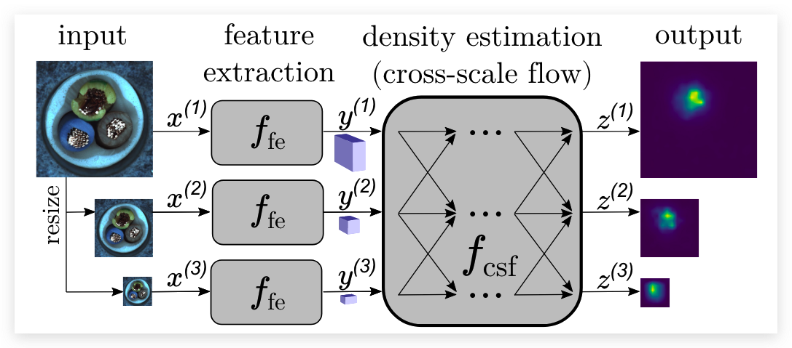
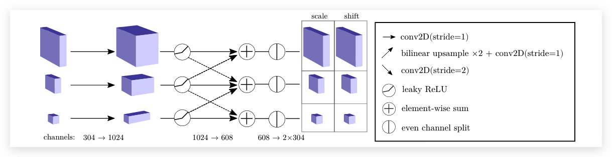

# CS-Flow: 基于Cross-Scale-Flows的图像缺陷检测

:::
论文：Fully Convolutional Cross-Scale-Flows for Image-based Defect Detection（WACV2022）

论文地址：https://arxiv.org/abs/2110.02855
:::

## 论文简介

CF-Flow也是一篇将 `Normalizing Flow` 用在异常检测领域的文章。它主要设计了一种可以有效利用多尺度特征的 Normalizing Flow 来进行异常检测。Normalizing Flow 会将输入尽可能的转化为一个全0的图像，但是由于训练的过程中只用了正常的图片，所以对于异常的图片，网络输出的潜空间中异常区域就会得分很高。

## 关键技术

整个模型的主要流程如上图所示：

  

首先输入的图片 $x$ 会被输入到预训练的特征提取网络当中。在提取特征的时候会从不同分辨率的图像提取多尺度的特征。与DifferNet相比，CS-Flow对每个尺度的特征都进行了特征估计，而不是像DifferNet那样直接将特征concat起来（每个尺度都进行特征估计速度不会慢吗？）。作者认为这样可以尽可能的保留图像的细粒度和上下文信息。然后会对得到的密度估计做一个高斯似然估计 $p_Z{\mathcal{z}}$，高斯的分布满足 $\mathcal{N}(0, I)$。 之后会根据一个阈值来判断$x$是否是一个异常图像。

### CS Flow 

CS Flow 扩展了传统的标准化流，用跨尺度的方式来有效的特征检测。CS Flow中的神经网络还是全卷积的结构以此来保留空间结构。与DifferNet相比，CS Flow的另一个优点就是可以实际处理非常高维的输入空间，同时只有很少的训练样本。 CS Flow的结构如下图所示：

  

CS Flow 是一个链式的结构也叫做Coupling Blocks，每一个Coupling Block都会做一个仿射变换。 CS Flow 和 DifferNet 一样也是选取了Real-NVP作为基础的框架。 每一个尺度会由一个隐藏层去增加通道数（感觉就是一个1x1卷积）。 受到HRNet的启发，CS Flow将不同尺度的特征经过双线性插值之后进行聚合。 CS Flow 同样也做了 soft-clamping 来让模型更加的稳定。具体来说的就是会对输出层做一个如下处理：

$$
\sigma_{\alpha}(h)=\frac{2 \alpha}{\pi} \arctan \frac{h}{\alpha}
$$

这将把输出限制在 $(-\alpha,\alpha)$。

### 优化目标

训练过程中，我们希望CS Flow能够最大化特征向量的似然估计。 损失函数是根据 change of variable 的公式写出来的：

$$
p_{Y}(\boldsymbol{y})=p_{Z}(\boldsymbol{z})\left|\operatorname{det} \frac{\partial \boldsymbol{z}}{\partial \boldsymbol{y}}\right|
$$

CS Flow 在优化的时候选择了对上式取一个 log 再进行计算，也就是计算对数似然函数。对数似然函数本质上和上式是等价的，而且当 $p_z$ 是一个高斯分布的时候能够更加方便的进行计算。 损失函数就是一个负对数似然估计函数，如下所示：

$$
\begin{array}{r}
\log p_{Y}(\boldsymbol{y})=\log p_{Z}(\boldsymbol{z})+\log \left|\operatorname{det} \frac{\partial \boldsymbol{z}}{\partial \boldsymbol{y}}\right| \\
\mathcal{L}(\boldsymbol{y})=-\log p_{Y}(\boldsymbol{y})=\frac{\|\boldsymbol{z}\|_{2}^{2}}{2}-\log \left|\operatorname{det} \frac{\partial \boldsymbol{z}}{\partial \boldsymbol{y}}\right|
\end{array}
$$

其中 $\operatorname{det} \frac{\partial \boldsymbol{z}}{\partial \boldsymbol{y}}$ 表示 Jacobian 矩阵的绝对值。

### 定位

DifferNet 只使用 `隐空间` 做图像级别的异常检测。 这是由于DifferNet使用了AlexNet作为中间的结构，全连接的结构会破坏图像之间的位置结构。CS Flow 使用的是全连接网络可以很好的保存下来图像的相对位置信息。 基于这一点`CS Flow`就可以用网络输出的密度估计作为异常估计的定位图。结合CS Flow的流程图我们可以知道最终我们会得到三个不同尺度的密度估计，对低尺度的双线性插值放大后三个图concat起来会得到一个(h x w x 3)的密度估计图。对于每个位置，将3个通道取 $||z^s_{i,j}||^2$ 作为这个点的异常得分（分数越高越有可能是异常）

## 总结

CS Flow这篇文章提出了第一种半监督的方法来有效的进行异常图像的检测和定位。 它的核心思想就是使用多尺度的信息都做 Normalizin flow 然后得到多尺度的密度估计图。由于CS Flow 使用了全卷积的结构，所以得到的密度估计图可以反应原图的位置信息，因此可以使用密度估计图来进行异常定位。但是也因为它的多尺度并行的设计，对计算量的要求肯定会比较大。

