# 动手实现Normalizing Flow

:::tip

参考网址：https://pytorch-lightning.readthedocs.io/en/stable/notebooks/course_UvA-DL/09-normalizing-flows.html

:::

我们将更深入地研究 `Normalizing Flow (NF)` 以及用 Pytorch 来实现它。 当前最流行的 NF 应用是对图像数据集进行建模。在本教程中，我们将回顾 Nf 在图像建模领域的进展，并动手实现 `Normalizing Flow`。注意，NF 通常参数很多，因此计算开销很大。我们将使用相对简单的流模型来节省计算成本，如果你想要增加模型的进度，最简单的方式就是增加`模块`的数量。 该笔记是阿姆斯特丹大学深度学习系列讲座的一部分。

## Setup

本教程基于 Pytorch Lighting 来实现 Normalizing Flow 

```
pip install --quiet "seaborn" "tabulate" "torchvision" "setuptools==59.5.0" "pytorch-lightning>=1.4" "matplotlib" "torchmetrics>=0.7" "torch>=1.8"
```

首先我们先导入需要的库：

```python 
import math
import os
import time
import urllib.request
from urllib.error import HTTPError

import matplotlib
import matplotlib.pyplot as plt
import numpy as np
import pytorch_lightning as pl
import seaborn as sns
import tabulate
import torch
import torch.nn as nn
import torch.nn.functional as F
import torch.optim as optim
import torch.utils.data as data
import torchvision
from IPython.display import HTML, display, set_matplotlib_formats
from matplotlib.colors import to_rgb
from pytorch_lightning.callbacks import LearningRateMonitor, ModelCheckpoint
from torch import Tensor
from torchvision import transforms
from torchvision.datasets import MNIST
from tqdm.notebook import tqdm

%matplotlib inline
set_matplotlib_formats("svg", "pdf")  # For export
matplotlib.rcParams["lines.linewidth"] = 2.0
sns.reset_orig()

# MNIST 数据集的下载路径
DATASET_PATH = os.environ.get("PATH_DATASETS", "data")
# 预训练模型的保存路径
CHECKPOINT_PATH = os.environ.get("PATH_CHECKPOINT", "saved_models/tutorial11")

# 设置随机种子
pl.seed_everything(42)

# 确保所有的操作都在GPU上运行
torch.backends.cudnn.determinstic = True
torch.backends.cudnn.benchmark = False

# 设置使用的设备
device = torch.device("cpu") if not torch.cuda.is_available() else torch.device("cuda:0")
print("Using device", device)
```

下面我们下载一些预训练模型

```python 
# 模型下载url
base_url = "https://raw.githubusercontent.com/phlippe/saved_models/main/tutorial11/"
# 需要下载的文件
pretrained_files = ["MNISTFlow_simple.ckpt", "MNISTFlow_vardeq.ckpt", "MNISTFlow_multiscale.ckpt"]
# 如果路径不存在就创建路径
os.makedirs(CHECKPOINT_PATH, exist_ok=True)

# 检查每个文件是否存在，如果不存在就下载
for file_name in pretrained_files:
    file_path = os.path.join(CHECKPOINT_PATH, file_name)
    if not os.path.isfile(file_path):
        file_url = base_url + file_name
        print("Downloading %s..." % file_url)
		urllib.request.urlretrieve(file_url, file_path)
```

本文中我们使用MNIST数据集来作为训练数据集。MNIST 尽管简单，但对于小型生成模型来说却是一个挑战，因为它需要对图像进行全局理解。 同时，我们可以很容易地判断生成的图像是否来自与数据集相同的分布。

为了更好地处理图像的离散性，我们将它们从0-1的范围转换为0-255的范围作为整数。

```python 
# 将图像从 0-1 转换到 0-255 (integers)
def discretize(sample):
    return (sample * 255).to(torch.int32)


transform = transforms.Compose([transforms.ToTensor(), discretize])

# 加载数据集，并将其分割为训练集和验证集
train_dataset = MNIST(root=DATASET_PATH, train=True, transform=transform, download=True)
pl.seed_everything(42)
train_set, val_set = torch.utils.data.random_split(train_dataset, [50000, 10000])

# 加载测试集
test_set = MNIST(root=DATASET_PATH, train=False, transform=transform, download=True)

train_loader = data.DataLoader(train_set, batch_size=256, shuffle=False, drop_last=False)
val_loader = data.DataLoader(val_set, batch_size=64, shuffle=False, drop_last=False, num_workers=4)
test_loader = data.DataLoader(test_set, batch_size=64, shuffle=False, drop_last=False, num_workers=4)
```

此外，我们将在下面定义一个函数来可视化图像。MNIST 数据集的一些训练示例如下所示。

```python 
def show_imgs(imgs, title=None, row_size=4):
    # 将图像排列为一个网格
    num_imgs = imgs.shape[0] if isinstance(imgs, Tensor) else len(imgs)
    is_int = imgs.dtype == torch.int32 if isinstance(imgs, Tensor) else imgs[0].dtype == torch.int32
    nrow = min(num_imgs, row_size)
    ncol = int(math.ceil(num_imgs / nrow))
    imgs = torchvision.utils.make_grid(imgs, nrow=nrow, pad_value=128 if is_int else 0.5)
    np_imgs = imgs.cpu().numpy()
    # 绘制图像
    plt.figure(figsize=(1.5 * nrow, 1.5 * ncol))
    plt.imshow(np.transpose(np_imgs, (1, 2, 0)), interpolation="nearest")
    plt.axis("off")
    if title is not None:
        plt.title(title)
    plt.show()
    plt.close()

show_imgs([train_set[i][0] for i in range(8)])
```

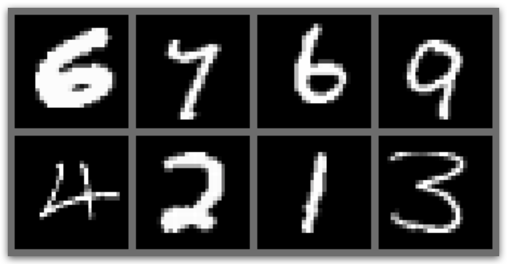  

## Normalizing Flows as generative model

常见的生成模型有 `Energy-based models`, `Variational Autoencoders (VAEs)` 和 `Generative Adversarial Networks (GANs)` 的模型。 然而，他们都没有直接学习真实输入数据的概率密度函数。 VAE 模型学习了概率密度函数的下界，Energy-based 的模型仅仅隐式的学习概率密度。GAN 从另一个方面为我们提供了生成新数据的抽样机制，而没有进行似然估计。Normalizing Flow，直接模拟了真实的数据分布，并为我们提供了一个精确的可能性估计。下面，我们可以直观地比较 VAE、 GAN 和 Flow。

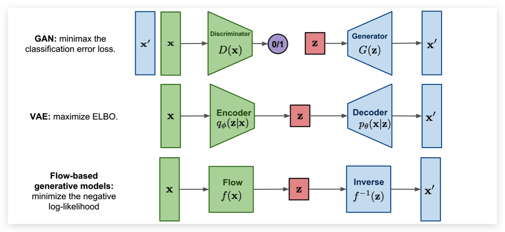  

与 `VAE` 相比，`Normalizing Flow` 主要区别在于使用可逆函数将输入数据映射到隐空间中得到 $z$。 为了实现这样的效果，$z$ 必须和输入数据一样大。这与 VAE 相反，VAE 的 $z$ 通常比原始输入数据的维数低得多。然而，一个可逆映射也意味着对于每个数据点 $x$，我们有一个相应的潜在表示 $z$。$z$ 经过逆变换可以直接无损的得到 $x$。也就是说 $x'$ 和 $x$ 是完全相等的。

说了那么多，Normalizing Flow 是如何去建模一个概率密度和可逆函数呢？ 答案就是利用 change of variables。具体来说的话，先给一个先验概率 $p_z(z)$ (比如：高斯分布) 和一个可逆函数 $f$。 可以如下定义 $p_x(x)$。

$$
\begin{aligned}
\int p_{x}(x) d x &=\int p_{z}(z) d z=1 \quad \text { (by definition of a probability distribution) } \\
\Leftrightarrow p_{x}(x) &=p_{z}(z)\left|\frac{d z}{d x}\right|=p_{z}(f(x))\left|\frac{d f(x)}{d x}\right|
\end{aligned}
$$

因此为了确定 x 的概率，我们只需要确定其在隐空间中的概率并得到 $f$ 的导数。 注意，这是针对单变量分布的，并且 $f$ 需要是可逆的和平滑的。对于多变量情况，导数变成雅可比矩阵，我们需要取行列式。由于我们通常使用对数似然作为目标，我们写下多变量项的对数如下:

$$
\log p_{x}(\mathbf{x})=\log p_{z}(f(\mathbf{x}))+\log \left|\operatorname{det} \frac{d f(\mathbf{x})}{d \mathbf{x}}\right|
$$

虽然我们现在知道了Normalizing Flow 是如何获得其概率的，但是直观地看，我们可能不清楚Normalizing Flow是做什么的。因此，我们应该从先验概率密度 $p_z(z)$ 的反向角度来看待 flow 。如果我们在它上面应用一个可逆函数，我们就有效地“转换”了它的概率密度。 举一个例子: 如果 $f^{-1}(z) = z+1$，我们将密度移动1，同时仍然保持一个有效的概率分布，并且是可逆的。通过缩放时，我们还可以改变概率密度的体积，如下图所示：

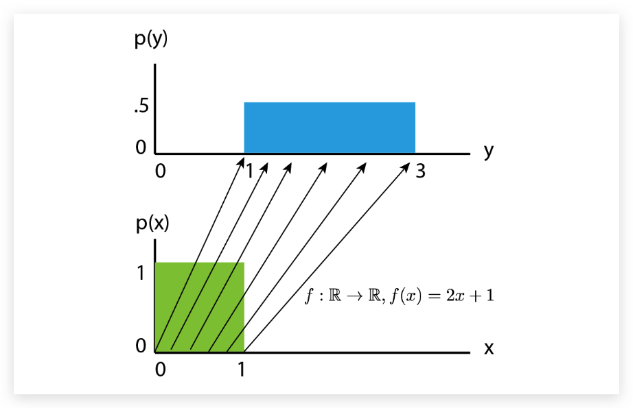  

我们可以看到，$p(y)$ 应该比缩放后的 $p(x)$ 高度低。体积的变化可以表示为 $|\frac{df(x)}{dx}|$， 即使在缩放之后，我们仍然有一个有效的概率分布。我们可以让我们的 $f$ 更加的复杂。然而，$f$ 变得越复杂，就越难找到它的倒数 $f^{-1}$，并计算雅可比的对数行列式 $log|det \frac{df(x)}{dx}|$。一个简单的办法就是一个 $f$ 不行，那么我们就用多个 $f$ 嘛。组合起来的函数仍然是一个可逆的函数。 Normalizing Flow就是通过多个可学习且可逆的方程，让 $p_z(x)$ 慢慢变成一个复杂的分布。 下图可以很好的说明这样一个过程：

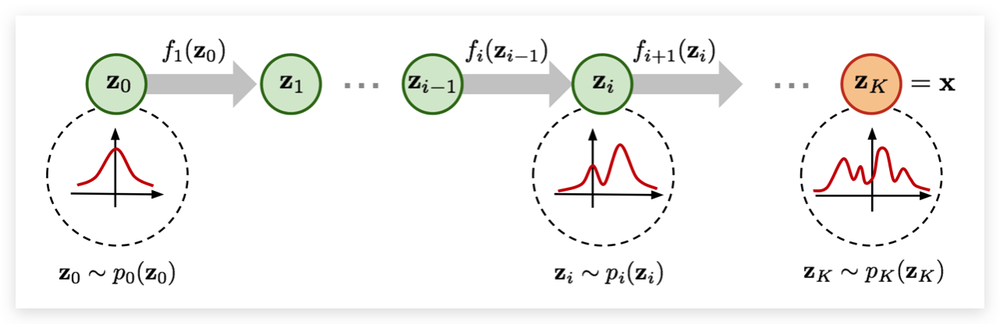  

从前面的正态分布 $z_0$ 开始，我们依次应用可逆函数 $f$，直到 $z_k$ 表示 $x$。注意，在上图中，函数 $f$ 表示上面$f$ 的反函数 （训练和生成是一个反过程）。这只是一种不同的表示法，对实际的 `Flow` 设计没有影响，因为无论如何都需要是可逆的。Flow 模型中还可以使用小的神经网络模型作为参数。然而，我们在这里将重点关注在图像建模中常用的 `Flow-baed` 模型，并将在其余部分中讨论训练 Normalizing Flow 的细节。

为了熟悉 Normalizing Flow 流程，尤其是图像建模的应用，最好在实现的同时讨论流程中的不同因素。 作为一个通用的概念，我们希望构建一个 Normalizing Flow，将输入图像(这里是 MNIST)映射到一个大小相同的潜在空间:

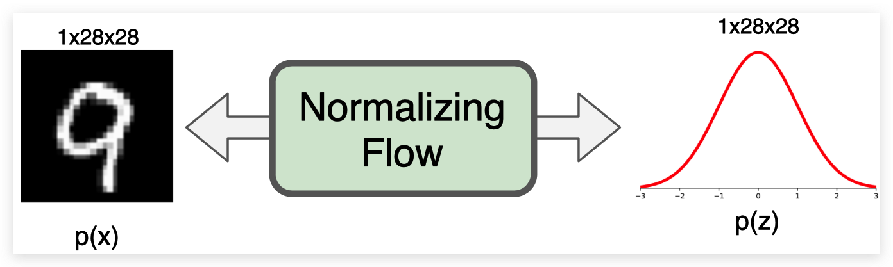  

第一步，我们将在 Pytorch Lighting 中实现 Normalizing Flow 的模板。在训练和验证过程中，归一化流向前方进行密度估计。 为此，我们在输入 $x$ 上应用一系列的流变换，并通过确定给定先验 $z$ 的变换点的概率和变换引起的体积变化来估计输入的概率。 在推理过程中，我们同样可以通过可逆流模型来进行密度估计和采样新的点。因此，我们定义了一个函数 `_get_likelihood` 来进行密度估计，`sample` 来生成新的样本。函数 `training_step`, `validation_step` 和 `test_step` 都使用了 `_get_likelihood`。 生成模型(尤其是 Normalizing Flow)中使用的标准度量是每个维的位(bpd)。Bpd 从信息理论的角度出发，描述了在我们模型分布中编码一个特定示例需要多少 bit。需要越少的 bit 就意味着，样本和我们的分布更加接近。 当我们测试我们的测试数据集的每个维度的比特时，我们可以判断我们的模型是否推广到数据集的新样本，而不是在记忆训练数据集。 为了计算每维得分的比特数，我们可以依赖于负对数似然函数并改变对数基(因为 bit 是二进制的，而 NLL 通常是指数型的) :

$$
\mathrm{bpd}=\mathrm{nll} \cdot \log _{2}(\exp (1)) \cdot\left(\prod d_{i}\right)^{-1}
$$

$d_1, d_2, ... , d_K$ 是输入的维度。对于图片就是宽高和通道数。我们将不同的图像分辨率的对数似然除以这些额外维度，可以得到一个度量。 在原始图像空间中，MNIST 示例的每维得分为8（我们需要8位来编码每个像素，因为有256个可能的值）。

下面是代码实现，我已经给出了尽可能详细的注释了：

```python 
# 基础 Pytorch Lighting 的 LightningModule
class ImageFlow(pl.LightningModule):
    def __init__(self, flows, import_samples=8):
        """
        Args:
            flows: A list of flows (每一个都是 a nn.Module)
            import_samples: 下面解释 （该值可以随时修改）
        """
        super().__init__()
        self.flows = nn.ModuleList(flows)
        self.import_samples = import_samples
        # 创建最终隐空间的先验分布
        self.prior = torch.distributions.normal.Normal(loc=0.0, scale=1.0) # 高斯分布
        # 用于可视化图形的输入例子
        self.example_input_array = train_set[0][0].unsqueeze(dim=0)

    def forward(self, imgs):
        # 该函数只用于图形的可视化
        return self._get_likelihood(imgs)

    def encode(self, imgs):
        # 给定一批图像，返回转换的编码后的 z 和 ldj 经过了一连串的 Flow 的输出
        z, ldj = imgs, torch.zeros(imgs.shape[0], device=self.device)
        for flow in self.flows:
            z, ldj = flow(z, ldj, reverse=False)
        return z, ldj

    def _get_likelihood(self, imgs, return_ll=False):
        """计算图像的似然估计

		如果 return_ll 被设置为 True，这个函数会返回输入的似然估计，输出度量是每个维度的比特 (按比例负对数可能性)
        """
        z, ldj = self.encode(imgs)
		# 计算对数概率
        log_pz = self.prior.log_prob(z).sum(dim=[1, 2, 3])

        log_px = ldj + log_pz
        nll = -log_px
        # 计算每一个维度的bit
        bpd = nll * np.log2(np.exp(1)) / np.prod(imgs.shape[1:])
        return bpd.mean() if not return_ll else log_px

    @torch.no_grad()
    def sample(self, img_shape, z_init=None):
        """从流中采样一批图像。"""
        # 从 prior 中采样 隐空间表示
        if z_init is None:
            z = self.prior.sample(sample_shape=img_shape).to(device)
        else:
            z = z_init.to(device)

        # 将 z 经过反转之后的 Flow 变为 x
        ldj = torch.zeros(img_shape[0], device=device)
        for flow in reversed(self.flows):
            z, ldj = flow(z, ldj, reverse=True)
        return z

    def configure_optimizers(self):
		# 优化器相关函数
        optimizer = optim.Adam(self.parameters(), lr=1e-3)
        scheduler = optim.lr_scheduler.StepLR(optimizer, 1, gamma=0.99)
        return [optimizer], [scheduler]

	# 训练步骤
    def training_step(self, batch, batch_idx):
        # Normalizing flows are trained by maximum likelihood => return bpd
        loss = self._get_likelihood(batch[0])
        self.log("train_bpd", loss)
        return loss

	# 测试步骤
    def validation_step(self, batch, batch_idx):
        loss = self._get_likelihood(batch[0])
        self.log("val_bpd", loss)

    def test_step(self, batch, batch_idx):
        # 在测试过程中进行抽样 
		# estimate likelihood M times for each image
        samples = []
        for _ in range(self.import_samples):
            img_ll = self._get_likelihood(batch[0], return_ll=True)
            samples.append(img_ll)
        img_ll = torch.stack(samples, dim=-1)

        # 为了平均概率，我们需要从 log 空间到 exp，然后再回到 log。
        # Logsumexp 为此提供了一个稳定的实现
        img_ll = torch.logsumexp(img_ll, dim=-1) - np.log(self.import_samples)

        # 计算最终的 bpd
        bpd = -img_ll * np.log2(np.exp(1)) / np.prod(batch[0].shape[1:])
        bpd = bpd.mean()

        self.log("test_bpd", bpd)
```

`test_step` 函数与训练和验证步骤的不同之处在于它利用了重要性抽样。我们将在理解流如何在连续空间中模拟离散图像之后，讨论其背后的动机和细节。

## Dequantization

`Normalizing flows` 依赖于在自然连续空间中定义的 `change of variable`。将 Flow 直接应用于离散数据导致不需要的密度模型，其中任意高的可能性被放置在一些特定的值上。 如下图所示：

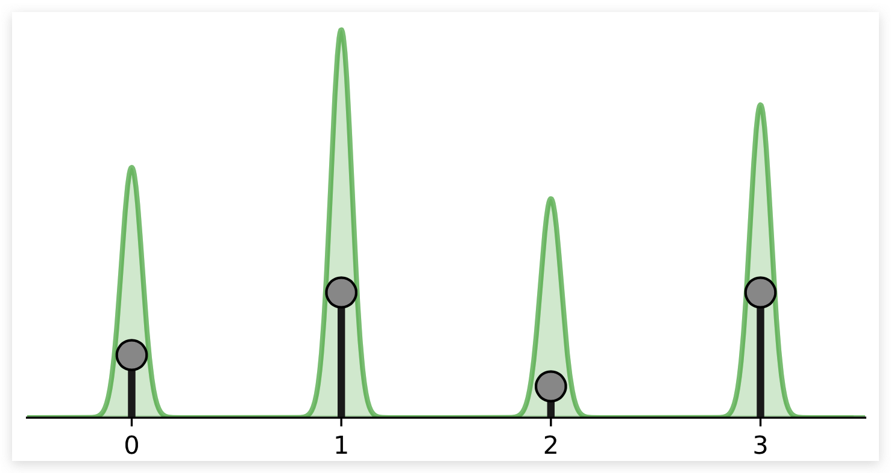  

黑点表示离散点，绿色体积表示连续空间中 Normalizing Flow 所模拟的密度。流动将继续增加 $x$ 的概率密度。记住，在连续空间中，我们有一个约束，概率密度的总体积必须是1 （$\int p(x) d x=1$）。 否则我们就无法对概率分布建模了。然而，离散点 $x=1,2,3$ 代表了连续空间中的三角形峰值。这就是为什么 Flow 可以在这几个点上放置一个无限高的可能性，同时仍然代表连续空间中的一个分布。 尽管如此，学习到的密度并没有告诉我们任何关于离散点之间分布的信息，就像在离散空间中一样，这四个点的可能性必须和为1，而不是无穷大（知道这个并不能知道离散点之间的分布信息）。 

为了防止这种退化的解决方案，一个常见的解决方案是给每个离散值添加少量的噪声，这也被称为去量化。 假设 $x$ 是一个整数， 非量子化表示 $v$ 就可以定义为 $v = x + u$ 其中 $u \in [0,1)^D$。 因此离散值 1 是通过 $[1.0,2.0)$ 中的分布进行建模的。离散值 2 是通过 $[2.0,3.0)$ 中的体积进行建模的。我们的建模目标函数 $p(x)$ 就变成了下面这样：

$$
p(x)=\int p(x+u) d u=\int \frac{q(u \mid x)}{q(u \mid x)} p(x+u) d u=\mathbb{E}_{u \sim q(u \mid x)}\left[\frac{p(x+u)}{q(u \mid x)}\right]
$$

其中 $q(u|x)$ 是噪声分布，现在，我们假设它是统一的，也可以写成 $p(x)=\mathbb{E}_{u \sim U(0,1)^{D}}[p(x+u)]$。

接下来，我们将把去量化作为 `Flow transformation` 来实现。 在添加噪声的离散值之后，我们另外将体积转换为一个类高斯形状。 这是通过一个缩放 $x+u$ (0-1) 实现的，然后应用反sigmoid函数 $\sigma(z)^{-1}=\log z-\log 1-z$ 。如果我们不这样做，我们将面临两个问题:

1. 我们的输入在0到256之间，而先验分布是平均值为0，标准差为1的高斯分布。在初始化流参数之后的第一次迭代中，对于大的值，如256 我们得到的可能性非常低。这会导致训练发生分歧，数值之间的概率相差过大不利于模型的训练。
2. 由于输出分布是高斯分布，有利于流动具有类似形状的输入。这将会降低 flow 所需的建模复杂性。

我们可以用如下的代码实现 Dequantization：

```python 
class Dequantization(nn.Module):
    def __init__(self, alpha=1e-5, quants=256):
        """
        Args:
            alpha:  用于缩放输入的系数
					防止在处理反转sigmoid的时候值非常接近0和1
            quants: 可能离散值的个数 (usually 256 for 8-bit image)
        """
        super().__init__()
        self.alpha = alpha
        self.quants = quants

    def forward(self, z, ldj, reverse=False):
        if not reverse:
            z, ldj = self.dequant(z, ldj)
            z, ldj = self.sigmoid(z, ldj, reverse=True)
        else:
            z, ldj = self.sigmoid(z, ldj, reverse=False)
            z = z * self.quants
            ldj += np.log(self.quants) * np.prod(z.shape[1:])
            z = torch.floor(z).clamp(min=0, max=self.quants - 1).to(torch.int32)
        return z, ldj

    def sigmoid(self, z, ldj, reverse=False):
        # invertible sigmoid transformation
        if not reverse: # 正向sigmoid
            ldj += (-z - 2 * F.softplus(-z)).sum(dim=[1, 2, 3])
            z = torch.sigmoid(z)
        else: # 反向sigmoid
            z = z * (1 - self.alpha) + 0.5 * self.alpha  # Scale to prevent boundaries 0 and 1
            ldj += np.log(1 - self.alpha) * np.prod(z.shape[1:])
            ldj += (-torch.log(z) - torch.log(1 - z)).sum(dim=[1, 2, 3])
            z = torch.log(z) - torch.log(1 - z)
        return z, ldj

    def dequant(self, z, ldj):
        # 将离散值转换为连续体积
        z = z.to(torch.float32)
        z = z + torch.rand_like(z).detach() # 添加随机噪声
        z = z / self.quants 
        ldj -= np.log(self.quants) * np.prod(z.shape[1:])
        return z, ldj
```

一个好的检查 Flow 是否正确实现的方法是验证它是可逆的。因此，我们将去量化随机选择的训练图像，然后再次量化。我们希望我们能得到完全相同的图像:

```python 
# 测试 dequantization 的可逆性
pl.seed_everything(42) # 设置随机种子
orig_img = train_set[0][0].unsqueeze(dim=0)
ldj = torch.zeros(1,)
# 初始化量化模型
dequant_module = Dequantization()
# 正向传输
deq_img, ldj = dequant_module(orig_img, ldj, reverse=False)
# 反向传输
reconst_img, ldj = dequant_module(deq_img, ldj, reverse=True)
# 寻找有没有不一样的地方
d1, d2 = torch.where(orig_img.squeeze() != reconst_img.squeeze())
if len(d1) != 0:
    print("Dequantization was not invertible.")
    for i in range(d1.shape[0]):
        print("Original value:", orig_img[0, 0, d1[i], d2[i]].item())
        print("Reconstructed value:", reconst_img[0, 0, d1[i], d2[i]].item())
else:
    print("Successfully inverted dequantization")

Out:
Dequantization was not invertible.
Original value: 0
Reconstructed value: 1
```
与我们的预期相反，测试失败了。但是，这里没有理由怀疑我们的实现，因为只有一个值不等于原始值。这是由于 Sigmoid 反转的数值不准确造成的。Sigmoid 结构的输入空间在0和1之间，而输出空间在 $-\infty$ 和 $\infty$ 之间。由于我们使用32位来表示数字 ，很小的概率会发生这种不准确的情况，因此不必担心。尽管如此，我们还是需要了解这个事实，并且可以通过使用双张量来改进。最后，我们可以进行去量化，并可视化分布：

```python 


def visualize_dequantization(quants, prior=None):
    """连续空间中离散值去量化值的可视化函数。"""
    # 如果没有给定先验证值就初始化一个均匀分布
    if prior is None:
        prior = np.ones(quants, dtype=np.float32) / quants
    prior = prior / prior.sum() * quants  # 在下面的例子中，我们假设每个值都是均匀分布的

    inp = torch.arange(-4, 4, 0.01).view(-1, 1, 1, 1)  # 我们要考虑的可能的连续值
    ldj = torch.zeros(inp.shape[0])
    dequant_module = Dequantization(quants=quants)
    # 在连续值上反转去量化以找到相应的离散值
    out, ldj = dequant_module.forward(inp, ldj, reverse=True)
    inp, out, prob = inp.squeeze().numpy(), out.squeeze().numpy(), ldj.exp().numpy()
    prob = prob * prior[out]  # 根据先验分类缩小的概率
    # 绘图
    sns.set_style("white")
    _ = plt.figure(figsize=(6, 3))
    x_ticks = []
    for v in np.unique(out):
        indices = np.where(out == v)
        color = to_rgb("C%i" % v)
        plt.fill_between(inp[indices], prob[indices], np.zeros(indices[0].shape[0]), color=color + (0.5,), label=str(v))
        plt.plot([inp[indices[0][0]]] * 2, [0, prob[indices[0][0]]], color=color)
        plt.plot([inp[indices[0][-1]]] * 2, [0, prob[indices[0][-1]]], color=color)
        x_ticks.append(inp[indices[0][0]])
    x_ticks.append(inp.max())
    plt.xticks(x_ticks, ["%.1f" % x for x in x_ticks])
    plt.plot(inp, prob, color=(0.0, 0.0, 0.0))
    # 设置图的一些属性
    plt.ylim(0, prob.max() * 1.1)
    plt.xlim(inp.min(), inp.max())
    plt.xlabel("z")
    plt.ylabel("Probability")
    plt.title("Dequantization distribution for %i discrete values" % quants)
    plt.legend()
    plt.show()
    plt.close()
visualize_dequantization(quants=8)
```

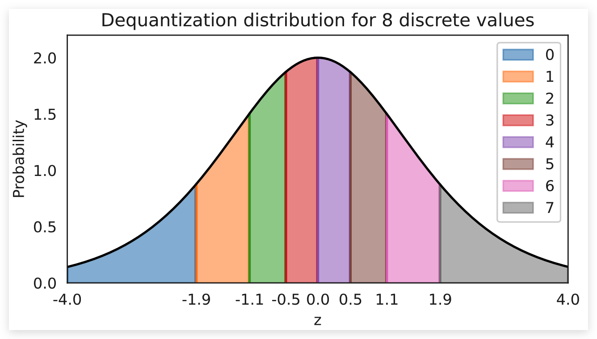  

可视化的分布显示了分配给不同离散值的体积部分（图中不同颜色的部分）。每个离散值的体积具有相同的概率质量。这就是为什么靠近中心的体积(例如3和4)在 z 轴上的面积和其他体积一样大的原因。

连续 Normalizing Flow可以通过如下目标函数建模离散图像：

$$
\log p(x)=\log \mathbb{E}_{u \sim q(u \mid x)}\left[\frac{p(x+u)}{q(u \mid x)}\right] \geq \mathbb{E}_{u}\left[\log \frac{p(x+u)}{q(u \mid x)}\right]
$$

虽然 Normalizing Flow 的可能性是精确的，但我们有一个下限。具体来说，这是 Jensen 不等式的一个例子，因为我们需要将对数移动到期望中，这样我们就可以使用蒙特卡罗估计。一般来说，在变分自动编码器(VAE)中，这个界限比 ELBO 要小得多。实际上，我们可以通过估计期望值来减少我们自己的约束（不是通过一个样本而是通过$M$个样本）。换句话说，我们可以应用重要性抽样，导致以下不等式：

$$
\log p(x)=\log \mathbb{E}_{u \sim q(u \mid x)}\left[\frac{p(x+u)}{q(u \mid x)}\right] \geq \mathbb{E}_{u}\left[\log \frac{1}{M} \sum_{m=1}^{M} \frac{p\left(x+u_{m}\right)}{q\left(u_{m} \mid x\right)}\right] \geq \mathbb{E}_{u}\left[\log \frac{p(x+u)}{q(u \mid x)}\right]
$$

当 $M \rightarrow \infty$，$\frac{1}{M} \sum_{m=1}^{M} \frac{p\left(x+u_{m}\right)}{q\left(u_{m} \mid x\right)}$ 就变成了 $\mathbb{E}_{u \sim q(u \mid x)}\left[\frac{p(x+u)}{q(u \mid x)}\right]$。所以我们使用的样本越多，束缚就越紧。在测试期间，我们可以使用此属性并在 `ImageFlow` 的 `test_step` 实现。 理论上，我们也可以在训练中使用这种更紧密的约束。然而，相关的工作已经表明，考虑到额外的计算成本，这并不一定是一种改进。还有工作表明使用单一估计要更加的有效。

## Variational Dequantization

去量化使用均匀分布的噪声 $u$，这有效地导致图像表示为超立方体(高维立方体)与锐利的边界。然而，对于一个 Flow 来说，建立如此锐利的边界并不容易，因为它要使用平滑的转换将其转换成一个正态分布。

如果我们改变之前可视化的先验分布。假设每个像素上有独立的高斯噪声，这通常是任何真实世界拍摄的照片的情况。因此，Flow 必须像上面那样模拟分布，但单个体积按如下比例缩放:

```python 
visualize_dequantization(quants=8, prior=np.array([0.075, 0.2, 0.4, 0.2, 0.075, 0.025, 0.0125, 0.0125]))
```

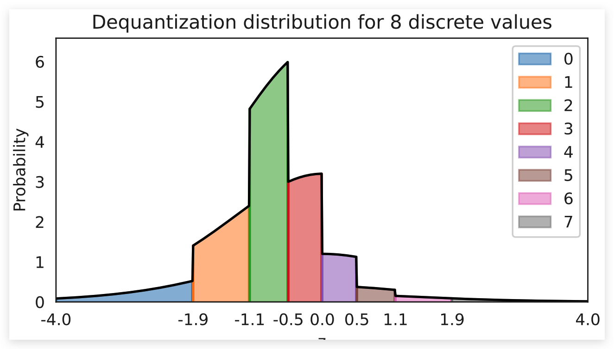  

将这样的概率转换为高斯分布是一项艰巨的任务，尤其是在这样的硬边界下。 因此，去量化已扩展到更复杂的，可学习的分布，超过均匀在变分框架。如果我们记得学习目标: $\log p(x)=\log \mathbb{E}_{u}\left[\frac{p(x+u)}{q(u \mid x)}\right]$, 均匀分布可以用一个可学习分布代替 $q_{\theta}(u \mid x)$。这种方法被称为变分去量化（Variational Dequantization），是Ho等人提出的。那么我们要如何学习这样的一个分布呢？我们可以使用第二个 Normalizing Flow，它可以将 $x$ 作为外部输入，并学习一个灵活的分布 $u$。 为了确保输出在0-1上，我们可以应用sigmoid激活函数作为最终流变换。

继承原有的去量化类，我们可以实现变分去量化如下:

```python 
class VariationalDequantization(Dequantization):
    def __init__(self, var_flows, alpha=1e-5):
        """
        Args:
            var_flows: 用于建模 q(u|x) 的流转换列表 
            alpha: 小常数，详细信息请参见去量化
        """
        super().__init__(alpha=alpha)
        self.flows = nn.ModuleList(var_flows)

    def dequant(self, z, ldj):
        z = z.to(torch.float32)
        img = (z / 255.0) * 2 - 1  # We condition the flows on x, i.e. the original image

        # u的先验和之前一样是均匀分布
        # 大多数流转换都定义在 [-infinity,+infinity], 我们先应用逆 sigmoid
        deq_noise = torch.rand_like(z).detach()
        deq_noise, ldj = self.sigmoid(deq_noise, ldj, reverse=True)
        for flow in self.flows:
            deq_noise, ldj = flow(deq_noise, ldj, reverse=False, orig_img=img)
        deq_noise, ldj = self.sigmoid(deq_noise, ldj, reverse=False)

        # After the flows, apply u as in standard dequantization
        z = (z + deq_noise) / 256.0
        ldj -= np.log(256.0) * np.prod(z.shape[1:])
        return z, ldj
```

变分去量化可以用来代替去量化。我们将在后面的实验中比较去量化和变分去量化。

## Coupling layers

接下来，我们看看可能应用在 `Flow` 模型中的 `Transformation`。最近流行的流层是 RealNVP 中引入的耦合层（Coupling Layer），它与深度神经网络结合得很好。输入 $z$ 被任意的分为两个部分 $z_{1:j}$ 和 $z_{j+1:d}$ 其中第一个在流中保持不变。 最近已经提出了各种变换，但这里我们还是使用最简单和最有效的一种:仿射耦合（affine coupling）。在这个耦合层中，我们应用仿射变换， 通过偏置 $\mu$ 作为对输入进行变换，使用缩放因子 $\sigma$ 对输入进行缩放。 公式化表达如下：

$$
z_{j+1: d}^{\prime}=\mu_{\theta}\left(z_{1: j}\right)+\sigma_{\theta}\left(z_{1: j}\right) \odot z_{j+1: d}
$$

$\mu$ 和 $\sigma$ 是一个共享的神经网络，$\odot$ 表示`element-wise multiplication`。 反转这个网络可以简单地通过减去偏差并除以比例来完成:

$$
z_{j+1: d}=\left(z_{j+1: d}^{\prime}-\mu_{\theta}\left(z_{1: j}\right)\right) / \sigma_{\theta}\left(z_{1: j}\right)
$$

我们还可以将耦合层以计算图的形式可视化，$z_1$ 表示 $z_{1:j}$。$z_2$ 表示 $z_{j+1:d}$：

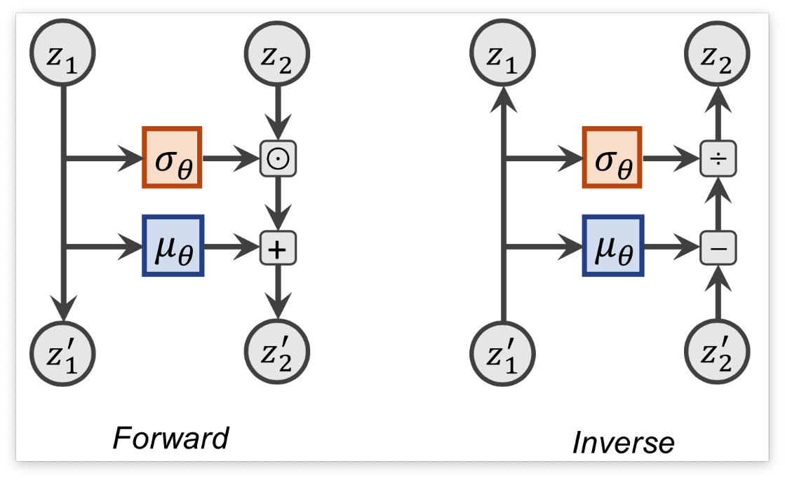  

在我们的实现中，我们还会对 $z_{j+1:d}$ 进行随机遮蔽处理。在反向运行的时候，我们需要对 $z_{1:j}$ 进行mask操作，这样你的变换才是恒等变换。

```python 
class CouplingLayer(nn.Module):
    def __init__(self, network, mask, c_in):
        """Coupling layer inside a normalizing flow.

        Args:
            network: A PyTorch nn.Module constituting the deep neural network for mu and sigma.
                      Output shape should be twice the channel size as the input.
            mask: Binary mask (0 or 1) where 0 denotes that the element should be transformed,
                   while 1 means the latent will be used as input to the NN.
            c_in: Number of input channels
        """
        super().__init__()
        self.network = network
        self.scaling_factor = nn.Parameter(torch.zeros(c_in))
        # Register mask as buffer as it is a tensor which is not a parameter,
        # but should be part of the modules state.
        self.register_buffer("mask", mask)

    def forward(self, z, ldj, reverse=False, orig_img=None):
        """
        Args:
            z: Latent input to the flow
            ldj: The current ldj of the previous flows.
                  The ldj of this layer will be added to this tensor.
            reverse: If True, we apply the inverse of the layer.
            orig_img (optional): Only needed in VarDeq. Allows external
                                  input to condition the flow on (e.g. original image)
        """
        # Apply network to masked input
        z_in = z * self.mask
        if orig_img is None:
            nn_out = self.network(z_in)
        else:
            nn_out = self.network(torch.cat([z_in, orig_img], dim=1))
        s, t = nn_out.chunk(2, dim=1)

        # Stabilize scaling output
        s_fac = self.scaling_factor.exp().view(1, -1, 1, 1)
        s = torch.tanh(s / s_fac) * s_fac

        # Mask outputs (only transform the second part)
        s = s * (1 - self.mask)
        t = t * (1 - self.mask)

        # Affine transformation
        if not reverse:
            # Whether we first shift and then scale, or the other way round,
            # is a design choice, and usually does not have a big impact
            z = (z + t) * torch.exp(s)
            ldj += s.sum(dim=[1, 2, 3])
        else:
            z = (z * torch.exp(-s)) - t
            ldj -= s.sum(dim=[1, 2, 3])

        return z, ldj
```

为了更加的稳定，在缩放的时候我们使用了 `tanh` 激活函数。这防止了特别大的输出让训练无法正常进行。 为了让比例因子大于-1小于1，我们在每个维度上都有一个可学习的参数，叫做 `scaling_factor`。这将tanh缩放到不同的极限。下面，我们可以看到缩放因子对缩放项的输出激活的影响:

```python 
with torch.no_grad():
    x = torch.arange(-5, 5, 0.01)
    scaling_factors = [0.5, 1, 2] # 不同的缩放因子
    sns.set()
    fig, ax = plt.subplots(1, 3, figsize=(12, 3))
    for i, scale in enumerate(scaling_factors):
        y = torch.tanh(x / scale) * scale # 引用缩放因子
        ax[i].plot(x.numpy(), y.numpy())
        ax[i].set_title("Scaling factor: " + str(scale))
        ax[i].set_ylim(-3, 3)
    plt.subplots_adjust(wspace=0.4)
    sns.reset_orig()
    plt.show()
```

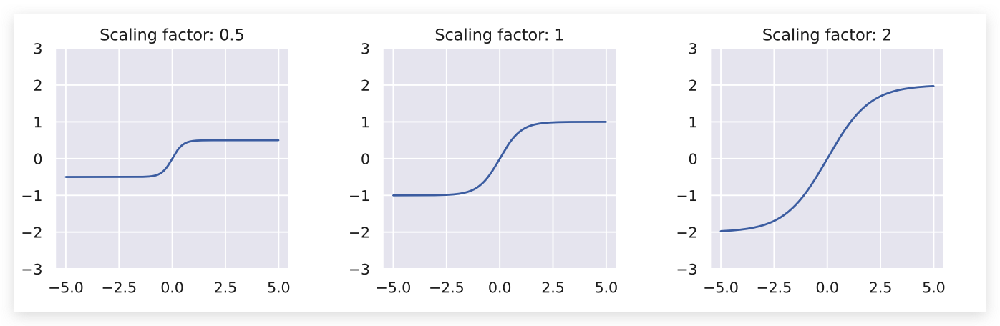  

耦合层适用于我们能想到的任何 masking 技术。然而，图像最常见的方法是使用棋盘格掩码或通道掩码将输入分成两半。一个棋盘格掩码在高度和宽度维度上分割变量，并将每个像素分配给 $z_{j+1:d}$。因此，掩码是跨通道共享的。 相反，通道掩码将信道的一半分配给 $z_{j+1,d}$ 另一半分配给了 $z_{1,j}$ 。请注意，当我们应用多个耦合层时，我们会对其他层都进行反向屏蔽，这样每个变量的转换时间都差不多。

让我们实现一个函数，为我们创建一个棋盘格掩码和通道掩码:

```python 
def create_checkerboard_mask(h, w, invert=False):
    x, y = torch.arange(h, dtype=torch.int32), torch.arange(w, dtype=torch.int32)
    xx, yy = torch.meshgrid(x, y)
    mask = torch.fmod(xx + yy, 2)
    mask = mask.to(torch.float32).view(1, 1, h, w)
    if invert:
        mask = 1 - mask
    return mask


def create_channel_mask(c_in, invert=False):
    mask = torch.cat([torch.ones(c_in // 2, dtype=torch.float32), torch.zeros(c_in - c_in // 2, dtype=torch.float32)])
    mask = mask.view(1, c_in, 1, 1)
    if invert:
        mask = 1 - mask
    return mask
```

我们还可以将相应大小的图像蒙版可视化:

```python 
checkerboard_mask = create_checkerboard_mask(h=8, w=8).expand(-1, 2, -1, -1)
channel_mask = create_channel_mask(c_in=2).expand(-1, -1, 8, 8)

show_imgs(checkerboard_mask.transpose(0, 1), "Checkerboard mask")
show_imgs(channel_mask.transpose(0, 1), "Channel mask")
```

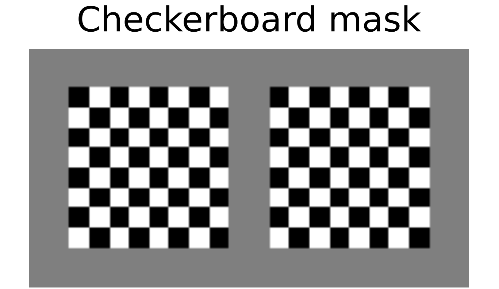  

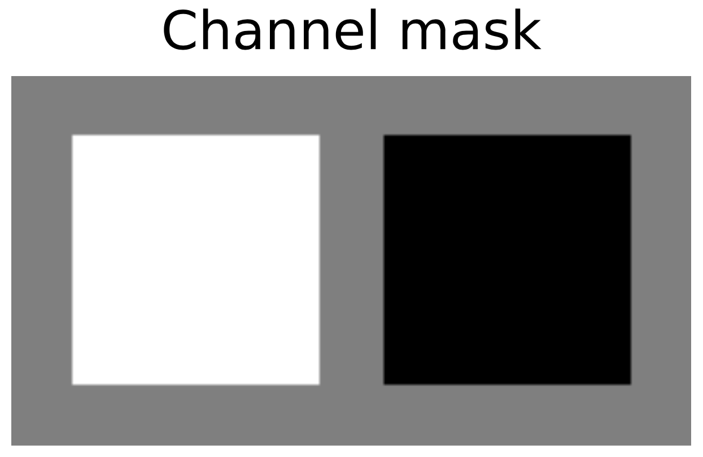  

作为耦合层的最后一个方面，我们需要确定我们希望在耦合层中应用的深度神经网络。 各层的输入是一幅图像，因此我们选择使用CNN。因为一个变换的输入依赖于之前所有的变换，所以确保一个好的梯度流通过CNN回到输入是至关重要的，我们选择Resnet来实现。 具体地说，我们使用了一个门控ResNet，它在连接前添加一个$\sigma$-门，类似于 LSTM 中的输入门。细节在这里并不重要，网络的灵感来自于Flow++。

```python 
class ConcatELU(nn.Module):
    """在两个方向(反方向和平方向)应用ELU的激活函数。

    允许非线性，同时为任何输入提供强梯度(对最后的卷积很重要)
    """

    def forward(self, x):
        return torch.cat([F.elu(x), F.elu(-x)], dim=1)


class LayerNormChannels(nn.Module):
    def __init__(self, c_in):
        """This module applies layer norm across channels in an image.

        Has been shown to work well with ResNet connections.
        Args:
            c_in: Number of channels of the input
        """
        super().__init__()
        self.layer_norm = nn.LayerNorm(c_in)

    def forward(self, x):
        x = x.permute(0, 2, 3, 1)
        x = self.layer_norm(x)
        x = x.permute(0, 3, 1, 2)
        return x


class GatedConv(nn.Module):
    def __init__(self, c_in, c_hidden):
        """
		该模块实现了带有输入门控的双层卷积 ResNet block
        Args:
            c_in: Number of channels of the input
            c_hidden: Number of hidden dimensions we want to model (usually similar to c_in)
        """
        super().__init__()
        self.net = nn.Sequential(
            nn.Conv2d(c_in, c_hidden, kernel_size=3, padding=1),
            ConcatELU(),
            nn.Conv2d(2 * c_hidden, 2 * c_in, kernel_size=1),
        )

    def forward(self, x):
        out = self.net(x)
        val, gate = out.chunk(2, dim=1)
        return x + val * torch.sigmoid(gate)


class GatedConvNet(nn.Module):
    def __init__(self, c_in, c_hidden=32, c_out=-1, num_layers=3):
        """Module that summarizes the previous blocks to a full convolutional neural network.

        Args:
            c_in: Number of input channels
            c_hidden: Number of hidden dimensions to use within the network
            c_out: Number of output channels. If -1, 2 times the input channels are used (affine coupling)
            num_layers: Number of gated ResNet blocks to apply
        """
        super().__init__()
        c_out = c_out if c_out > 0 else 2 * c_in
        layers = []
        layers += [nn.Conv2d(c_in, c_hidden, kernel_size=3, padding=1)]
        for layer_index in range(num_layers):
            layers += [GatedConv(c_hidden, c_hidden), LayerNormChannels(c_hidden)]
        layers += [ConcatELU(), nn.Conv2d(2 * c_hidden, c_out, kernel_size=3, padding=1)]
        self.nn = nn.Sequential(*layers)

        self.nn[-1].weight.data.zero_()
        self.nn[-1].bias.data.zero_()

    def forward(self, x):
        return self.nn(x)
```

最后，我们可以将去量化层、变分去量化层和耦合层加在一起，在MNIST图像上建立完整的规范化流程。 我们一共有8个Coupling Layer和4个Variational dequantization。我们在整个网络中应用棋盘格掩码，就像使用单个通道(黑白图像)一样，我们使用通道掩码。整体架构如下图所示：

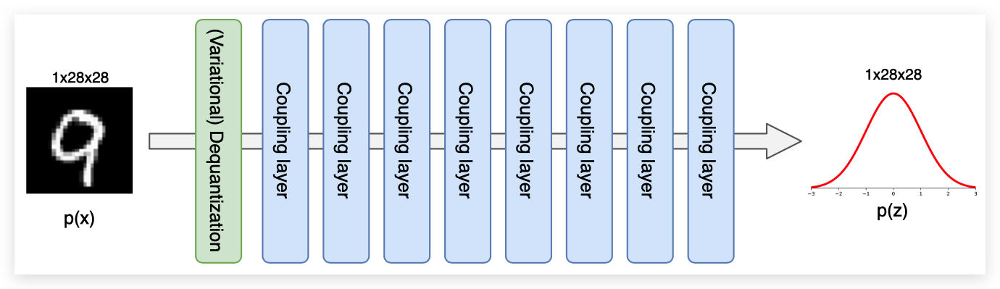  

```python 
def create_simple_flow(use_vardeq=True):
    flow_layers = []
    if use_vardeq:
		# 先堆叠4个variational dequantization layer
        vardeq_layers = [
            CouplingLayer(
                network=GatedConvNet(c_in=2, c_out=2, c_hidden=16),
                mask=create_checkerboard_mask(h=28, w=28, invert=(i % 2 == 1)),
                c_in=1,
            )
            for i in range(4)
        ]
        flow_layers += [VariationalDequantization(var_flows=vardeq_layers)]
    else:
        flow_layers += [Dequantization()]

	# 再添加8个Coupling Layer
    for i in range(8):
        flow_layers += [
            CouplingLayer(
                network=GatedConvNet(c_in=1, c_hidden=32),
                mask=create_checkerboard_mask(h=28, w=28, invert=(i % 2 == 1)),
                c_in=1,
            )
        ]
	# 将利用最上面写的ImageFlow完全model的构建
    flow_model = ImageFlow(flow_layers).to(device)
    return flow_model
```

为了实现训练，我们使用了PyTorch Lightning框架，减少了代码开销。如果有兴趣，可以查看生成的tensorboard文件，特别是图表，以查看所应用的流转换的概述。注意，由于 Normalizing Flow 的训练成本特别高，我们再次提供了预先训练的模型(请参阅笔记本后面的内容)。我们还运行了验证和测试，因为这可能需要一些时间，以及额外的重要性抽样。

```python 
def train_flow(flow, model_name="MNISTFlow"):
    # 创建一个 PyTorch Lightning trainer
    trainer = pl.Trainer(
        default_root_dir=os.path.join(CHECKPOINT_PATH, model_name), # 制定保存路径
        gpus=1 if torch.cuda.is_available() else 0, # 是否使用GPU
        max_epochs=200,
        gradient_clip_val=1.0,
        callbacks=[
            ModelCheckpoint(save_weights_only=True, mode="min", monitor="val_bpd"), # 设置模型检测点
            LearningRateMonitor("epoch"), 
        ],
    )
    trainer.logger._log_graph = True
    trainer.logger._default_hp_metric = None  # Optional logging argument that we don't need

    train_data_loader = data.DataLoader(
        train_set, batch_size=128, shuffle=True, drop_last=True, pin_memory=True, num_workers=8
    )
    result = None

    # 检查是否存在预训练模型。如果是，加载并跳过训练
    pretrained_filename = os.path.join(CHECKPOINT_PATH, model_name + ".ckpt")
    if os.path.isfile(pretrained_filename):
        print("Found pretrained model, loading...")
        ckpt = torch.load(pretrained_filename, map_location=device)
        flow.load_state_dict(ckpt["state_dict"])
        result = ckpt.get("result", None)
    else:
        print("Start training", model_name)
        trainer.fit(flow, train_data_loader, val_loader)

    # 如果没有找到结果，对验证和测试集测试最佳模型
    # Testing can be expensive due to the importance sampling.
    if result is None:
        val_result = trainer.test(flow, dataloaders=val_loader, verbose=False)
        start_time = time.time()
        test_result = trainer.test(flow, dataloaders=test_loader, verbose=False)
        duration = time.time() - start_time
        result = {"test": test_result, "val": val_result, "time": duration / len(test_loader) / flow.import_samples}

    return flow, result
```

## Multi-scale architecture

Normalizing Flow 的一个缺点是，它们在与输入完全相同的维度上运行。如果输入是高维的，那么潜空间也是高维的，这就需要更大的计算成本来学习合适的变换。然而，特别是在图像领域，许多像素包含的信息较少，因为我们可以在不丢失图像语义信息的情况下删除它们。

基于这种直觉，图像上的深度Normalizing Flow通常应用于多尺度架构。在经过前N个Flow模块后，我们 Split 出一半的潜在维度并直接在之前评估它们。 根据输入的大小，我们可以对图像再次执行 Split 操作。 上面的描述中涉及到的两个操作是Squeeze和Split，我们将在下面更详细地说明和实现它们。

### Squeeze and Split 

当我们想要删除图像中一半的像素时，我们有一个问题，即决定要削减哪些变量，以及如何重新排列图像。因此，在分割之前通常使用 squeeze 操作，它将图像分成形状的子方块 $2 \times 2 \times C,$，并将它们重新塑造成块 $1 \times 1 \times 4C,$。我们有效地将图像的高度和宽度降低了2倍，同时将通道数量缩放了4倍。然后，我们可以在通道上执行拆分操作，而不需要重新排列像素。更小的规模也使整体架构更高效。从视觉上看，squeeze 操作应将输入转换如下:

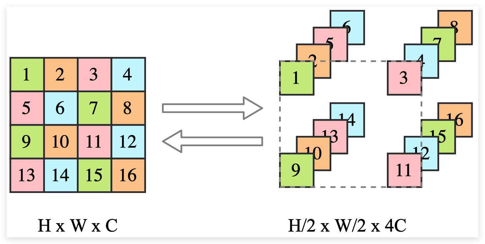  

输入是 $4 \times 4 \times 1$ 被锁放到了 $2 \times 2 \times 4$ , 每一组都是 $2 \times 2 \times 1$。

```python 
class SqueezeFlow(nn.Module):
    def forward(self, z, ldj, reverse=False):
        B, C, H, W = z.shape
        if not reverse:
            # Forward direction: H x W x C => H/2 x W/2 x 4C
            z = z.reshape(B, C, H // 2, 2, W // 2, 2)
            z = z.permute(0, 1, 3, 5, 2, 4)
            z = z.reshape(B, 4 * C, H // 2, W // 2)
        else:
            # Reverse direction: H/2 x W/2 x 4C => H x W x C
            z = z.reshape(B, C // 4, 2, 2, H, W)
            z = z.permute(0, 1, 4, 2, 5, 3)
            z = z.reshape(B, C // 4, H * 2, W * 2)
        return z, ldj
```

在继续之前，我们可以通过将输出与上面的示例图进行比较来验证我们的实现:

```python 
sq_flow = SqueezeFlow()
rand_img = torch.arange(1, 17).view(1, 1, 4, 4)
print("Image (before)\n", rand_img)
forward_img, _ = sq_flow(rand_img, ldj=None, reverse=False)
print("\nImage (forward)\n", forward_img.permute(0, 2, 3, 1))  # Permute for readability
reconst_img, _ = sq_flow(forward_img, ldj=None, reverse=True)
print("\nImage (reverse)\n", reconst_img)

Out:
Image (before)
 tensor([[[[ 1,  2,  3,  4],
          [ 5,  6,  7,  8],
          [ 9, 10, 11, 12],
          [13, 14, 15, 16]]]])

Image (forward)
 tensor([[[[ 1,  2,  5,  6],
          [ 3,  4,  7,  8]],

         [[ 9, 10, 13, 14],
          [11, 12, 15, 16]]]])

Image (reverse)
 tensor([[[[ 1,  2,  3,  4],
          [ 5,  6,  7,  8],
          [ 9, 10, 11, 12],
          [13, 14, 15, 16]]]])
```

split 操作将输入分为两部分，并直接在前一部分上求值。为了使我们的Flow操作适合于前几层的实现，我们将返回第一部分的先验概率作为该层的log行列式雅可比矩阵。它的效果与我们在Flow的末尾合并所有拆分的变量并在先验概率上进行评估是一样的。

```python 
class SplitFlow(nn.Module):
    def __init__(self):
        super().__init__()
        self.prior = torch.distributions.normal.Normal(loc=0.0, scale=1.0)

    def forward(self, z, ldj, reverse=False):
        if not reverse:
            z, z_split = z.chunk(2, dim=1)
            ldj += self.prior.log_prob(z_split).sum(dim=[1, 2, 3])
        else:
            z_split = self.prior.sample(sample_shape=z.shape).to(device)
            z = torch.cat([z, z_split], dim=1)
            ldj -= self.prior.log_prob(z_split).sum(dim=[1, 2, 3])
        return z, ldj
```

### Building a multi-scale flow

在定义 squeeze 和 split 操作之后，我们终于能够构建自己的多尺度流。深度Normalizing Flow，如Glow和Flow++，通常在 Squeeze 后直接应用 Split 操作。然而，对于浅层的 Flow，我们需要更仔细地考虑在何处放置 Split 操作，因为我们至少需要对每个变量进行最少的转换。 我们的设置受到原始RealNVP架构的启发，它比其他更先进的结构更浅。

因此，对于MNIST数据集，我们将在两个耦合层之后应用第一个 Squeeze 操作，但还没有应用 Split 操作。因为我们只使用了两个耦合层，而且每个变量只转换了一次，所以 Split 操作还为时过早。 在最终应用 Split 并再次 Squeeze 之前，我们再应用两个耦合层。最后四个耦合层的操作规模为 $7 \times 7 \times 8$。完整的流程架构如下所示：

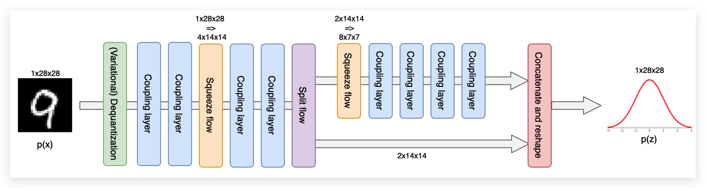  

注意，虽然耦合层内部的特征映射随着输入的高度和宽度而减少，但增加的通道数量并没有被直接考虑。为了抵消这一点，我们增加了压缩输入上耦合层的隐藏维度。尺寸通常按比例增加2，因为这大约增加了4的计算成本，抵消了 Squeeze 操作。 我们将分别为三个尺度选择隐藏维度 $32,48,64$，以保持参数数量的合理，展示多尺度架构的效率。

```python 
# 创建多尺度 Flow
def create_multiscale_flow():
    flow_layers = []

	# 4个 variational dequantization layer
    vardeq_layers = [
        CouplingLayer(
			# 门控卷积
            network=GatedConvNet(c_in=2, c_out=2, c_hidden=16),
			# 棋盘格mask
            mask=create_checkerboard_mask(h=28, w=28, invert=(i % 2 == 1)),
            c_in=1,
        )
        for i in range(4)
    ]
    flow_layers += [VariationalDequantization(vardeq_layers)]

    flow_layers += [
        CouplingLayer(
            network=GatedConvNet(c_in=1, c_hidden=32),
            mask=create_checkerboard_mask(h=28, w=28, invert=(i % 2 == 1)),
            c_in=1,
        )
        for i in range(2)
    ]
	# Squeeze 操作
    flow_layers += [SqueezeFlow()]
	# Squeeze 后加两个 CouplingLayer
    for i in range(2):
        flow_layers += [
            CouplingLayer(
                network=GatedConvNet(c_in=4, c_hidden=48), mask=create_channel_mask(c_in=4, invert=(i % 2 == 1)), c_in=4
            )
        ]
	# 进行 Split 和 Squeeze操作
    flow_layers += [SplitFlow(), SqueezeFlow()]
	# 再接4个Coupling Layer
    for i in range(4):
        flow_layers += [
            CouplingLayer(
				# 设置输入通道和隐藏通道
                network=GatedConvNet(c_in=8, c_hidden=64), mask=create_channel_mask(c_in=8, invert=(i % 2 == 1)), c_in=8
            )
        ]

    flow_model = ImageFlow(flow_layers).to(device)
    return flow_model
```

下面显示不同网络参数数量的差异:

```python 
def print_num_params(model):
    num_params = sum(np.prod(p.shape) for p in model.parameters())
    print(f"Number of parameters: {num_params:,}")

print_num_params(create_simple_flow(use_vardeq=False))
print_num_params(create_simple_flow(use_vardeq=True))
print_num_params(create_multiscale_flow())

Out:
Number of parameters: 335,128
Number of parameters: 379,556
Number of parameters: 1,062,090
```

虽然多尺度流的参数几乎是单尺度流的3倍，但其计算成本并不一定比单尺度流高。我们还将比较以下实验中的运行时。

## Analysing the flows

最后一部分，我们将训练我们在上面实现的所有模型，并尝试分析多尺度架构和变分去量化的效果。

### Training flow variants

在我们分析流模型之前，我们需要先训练它们。我们提供预先训练的模型，其中包含验证和测试性能，以及运行时信息。由于流模型的计算成本很高，我们建议您使用那些预先训练的模型来进行笔记本的第一次运行。

```
flow_dict = {"simple": {}, "vardeq": {}, "multiscale": {}}
flow_dict["simple"]["model"], flow_dict["simple"]["result"] = train_flow(
    create_simple_flow(use_vardeq=False), model_name="MNISTFlow_simple"
)
flow_dict["vardeq"]["model"], flow_dict["vardeq"]["result"] = train_flow(
    create_simple_flow(use_vardeq=True), model_name="MNISTFlow_vardeq"
)
flow_dict["multiscale"]["model"], flow_dict["multiscale"]["result"] = train_flow(
    create_multiscale_flow(), model_name="MNISTFlow_multiscale"
)
```

### Density modeling and sampling

首先，我们可以比较模型的定量结果。下表显示了所有重要的统计数据。推理时间指定了为每个模型确定64个图像批次的概率所需的时间，采样时间指定了对64个图像批次进行采样所需的时间。

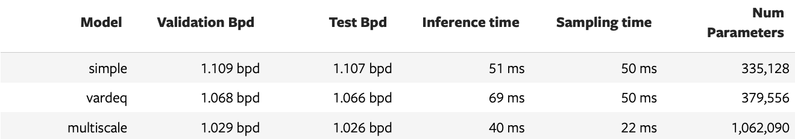  

正如我们最初预期的那样，使用变分去量化在每个维度的位元方面改进了标准去量化操作。虽然0.04bps的差异乍一看并不令人印象深刻，但对于生成式模型来说，这是相当大的进步。由于变分去量化，图像的概率评估需要更长的时间，这也导致了更长的训练时间，但它对采样时间没有影响。这是因为反向的变分反量化与反量化是一样的，它们都是找到下一个更低的整数。当我们将这两种模型与多尺度架构进行比较时，我们可以看到每维比特的分数再次下降了约0.04bpd。此外，尽管参数增加了，但推理时间和采样时间显著提高。因此，我们看到多尺度流不仅对密度建模更强，而且更高效。 接下来，我们可以测试模型的采样质量。我们应该注意到变分去量化和标准去量化的样本非常相似，因此我们在这里只看到变分去量化和多尺度模型的样本。

```python 
pl.seed_everything(44)
samples = flow_dict["vardeq"]["model"].sample(img_shape=[16, 1, 28, 28])
show_imgs(samples.cpu())
```

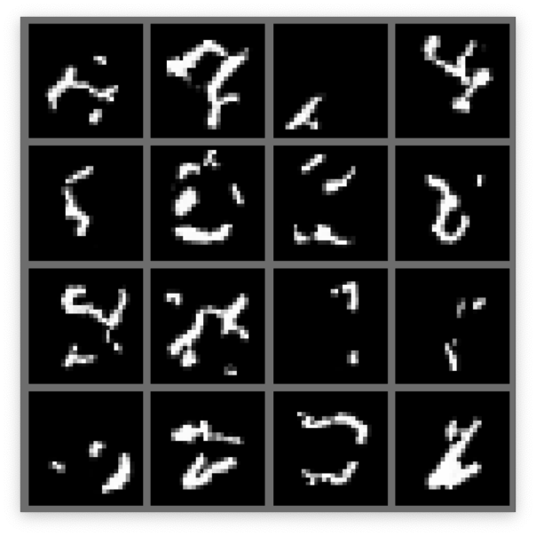  

```python 
pl.seed_everything(44)
samples = flow_dict["multiscale"]["model"].sample(img_shape=[16, 8, 7, 7])
show_imgs(samples.cpu())
```

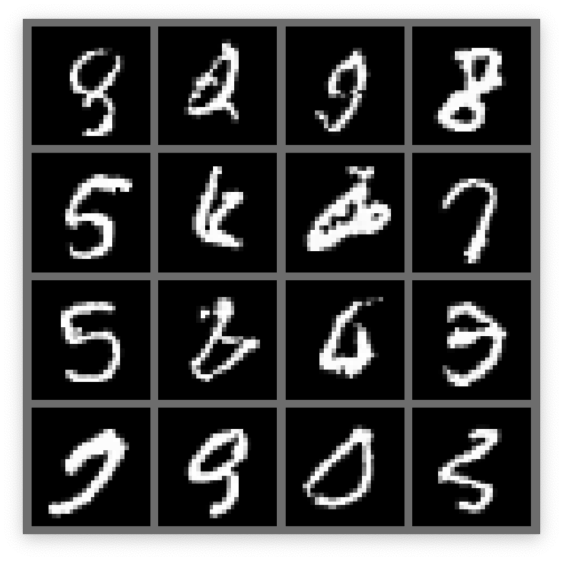  

从少数的样本中，我们可以看到简单模型和多尺度模型之间的明显区别。单尺度模型只学习了局部的、小的相关性，而多尺度模型能够学习形成数字的完整的、全局的关系。这展示了多尺度模型的另一个好处。与线性扩展方法相比，由于Normalizing Flow可以自然地模拟复杂的多模态分布，而线性扩展方法具有独立的解码器输出噪声，因此输出是尖锐的。然而，Flow 输出的样本远非完美，并非所有样本都显示出真实的数字。

### Interpolation in latent space

另一个在隐空间上流行的测试是把两个图像stack起来。由于Normalizing Flow是严格可逆的，我们可以在潜在空间中表示任何图像。 我们再次将变分去量化模型与下面的多尺度模型进行比较。

```python 
@torch.no_grad()
def interpolate(model, img1, img2, num_steps=8):
    """
    Args:
        model: object of ImageFlow class that represents the (trained) flow model
        img1, img2: Image tensors of shape [1, 28, 28]. Images between which should be interpolated.
        num_steps: Number of interpolation steps. 8 interpolation steps mean 6 intermediate pictures besides img1 and img2
    """
    imgs = torch.stack([img1, img2], dim=0).to(model.device)
    z, _ = model.encode(imgs)
    alpha = torch.linspace(0, 1, steps=num_steps, device=z.device).view(-1, 1, 1, 1)
    interpolations = z[0:1] * alpha + z[1:2] * (1 - alpha)
    interp_imgs = model.sample(interpolations.shape[:1] + imgs.shape[1:], z_init=interpolations)
    show_imgs(interp_imgs, row_size=8)

exmp_imgs, _ = next(iter(train_loader))
pl.seed_everything(42)
for i in range(2):
    interpolate(flow_dict["vardeq"]["model"], exmp_imgs[2 * i], exmp_imgs[2 * i + 1])
```

  

```python 
pl.seed_everything(42)
for i in range(2):
    interpolate(flow_dict["multiscale"]["model"], exmp_imgs[2 * i], exmp_imgs[2 * i + 1])
```

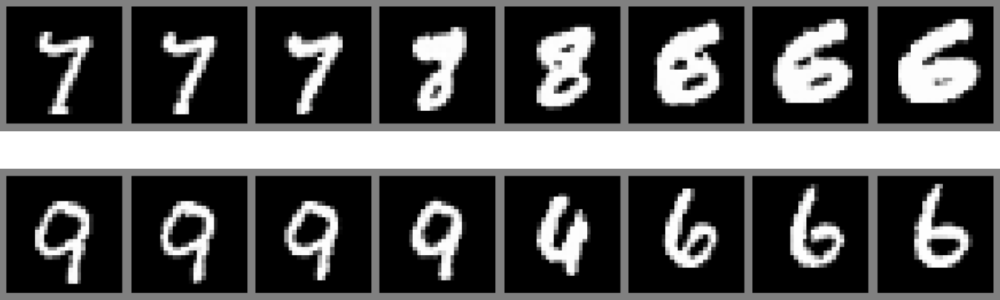  

多尺度模型的插值可以得到更真实的数字，而变分去量化模型关注的是全局不形成数字的局部模式。对于多尺度模型，我们实际上并没有在两幅图像之间做“真实的”插值，因为我们没有考虑沿着流动分割的变量(它们是所有样本的随机抽样)。  然而，正如我们将在接下来的实验中看到的，早期的变量对整体图像的影响不大。

### Visualization of latents in different levels of multi-scale

在下面，我们将更多地关注Normalizing Flow。我们想要分析哪些信息存储在早期分层的变量中，以及哪些信息用于最终变量。为此，我们采样了8幅图像，其中每幅图像具有相同的最终潜变量。下面是三个例子:

```python 
pl.seed_everything(44)
for _ in range(3):
    z_init = flow_dict["multiscale"]["model"].prior.sample(sample_shape=[1, 8, 7, 7])
    z_init = z_init.expand(8, -1, -1, -1)
    samples = flow_dict["multiscale"]["model"].sample(img_shape=z_init.shape, z_init=z_init)
    show_imgs(samples.cpu())
```

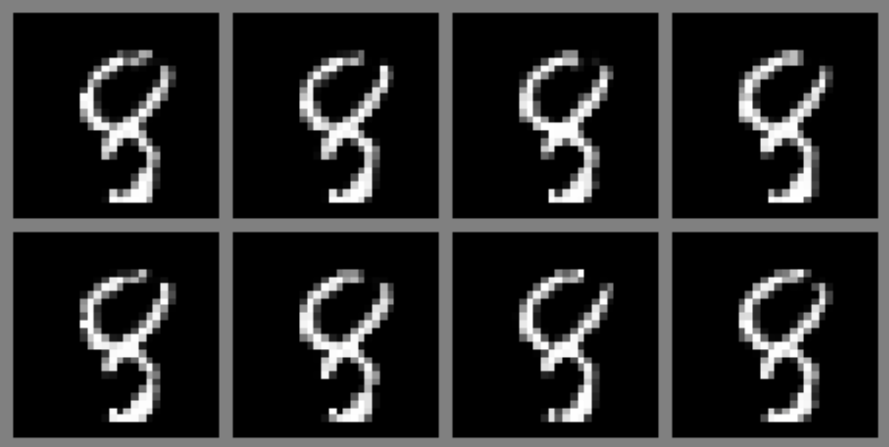  

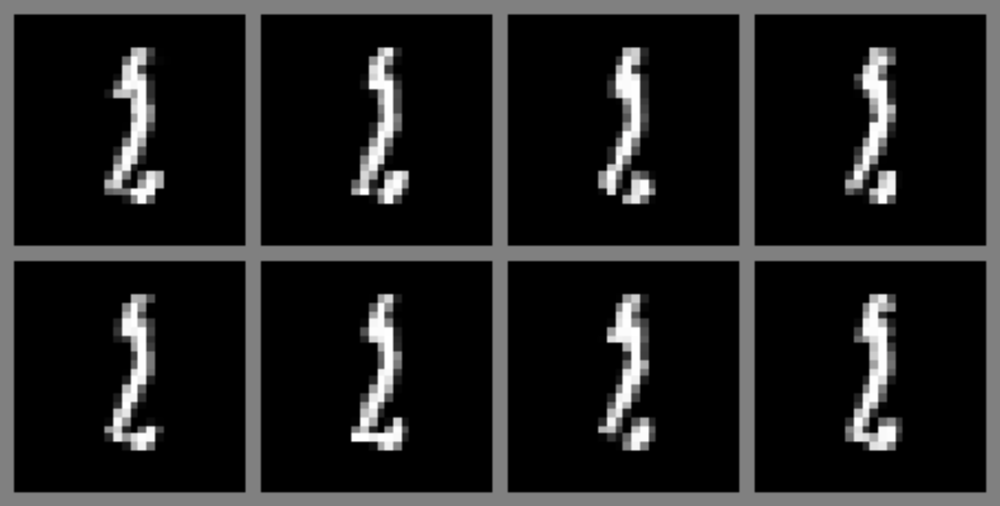  

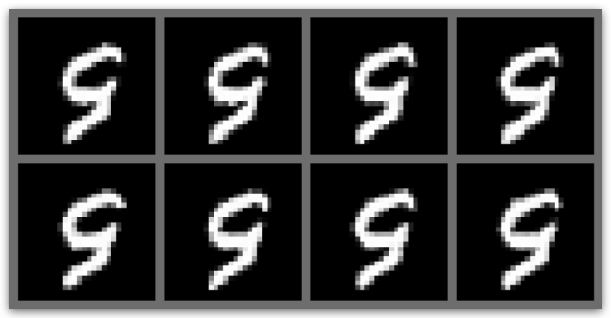  

我们看到早期的 Split 变量确实对图像有较小的影响。尽管如此，当我们仔细观察数字的边界时，还是可以发现微小的差异。例如，在8个样品的顶部有细微的不同。这表明，流确实学会了在最终变量中 Split 高级信息，而早期的 Split 包含局部噪声。

### Visualizing Dequantization

作为本笔记的最后一部分，我们将看看变分去量化的效果。我们之所以采用变分去量化，是因为尖锐的边缘/边界难以建模，而 Flow 更喜欢平滑的、类似先验的分布。来检查一下Flow 模型学习到的噪声 $q(u \mid x)$ 是如何分布的。我们可以根据去量化和变分去量化模块绘制输出值的直方图。

```python 
def visualize_dequant_distribution(model: ImageFlow, imgs: Tensor, title: str = None):
    """
    Args:
        model: The flow of which we want to visualize the dequantization distribution
        imgs: Example training images of which we want to visualize the dequantization distribution
    """
    imgs = imgs.to(device)
    ldj = torch.zeros(imgs.shape[0], dtype=torch.float32).to(device)
    with torch.no_grad():
        dequant_vals = []
        for _ in tqdm(range(8), leave=False):
            d, _ = model.flows[0](imgs, ldj, reverse=False)
            dequant_vals.append(d)
        dequant_vals = torch.cat(dequant_vals, dim=0)
    dequant_vals = dequant_vals.view(-1).cpu().numpy()
    sns.set()
    plt.figure(figsize=(10, 3))
    plt.hist(dequant_vals, bins=256, color=to_rgb("C0") + (0.5,), edgecolor="C0", density=True)
    if title is not None:
        plt.title(title)
    plt.show()
    plt.close()

sample_imgs, _ = next(iter(train_loader))
```

```python 
visualize_dequant_distribution(flow_dict["simple"]["model"], sample_imgs, title="Dequantization")
```

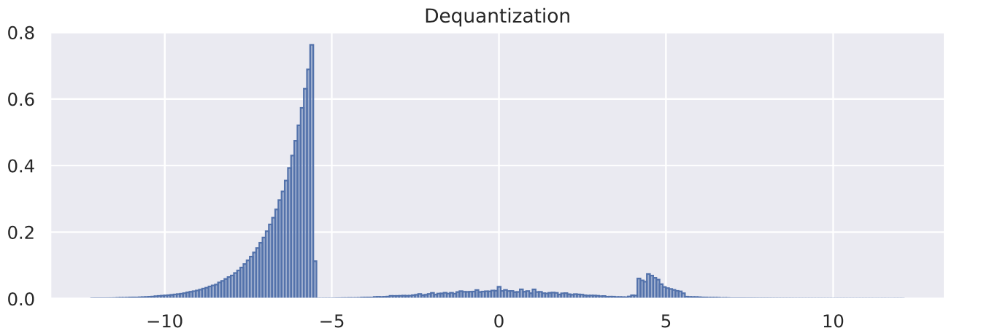  

```python 
visualize_dequant_distribution(flow_dict["vardeq"]["model"], sample_imgs, title="Variational dequantization")
```

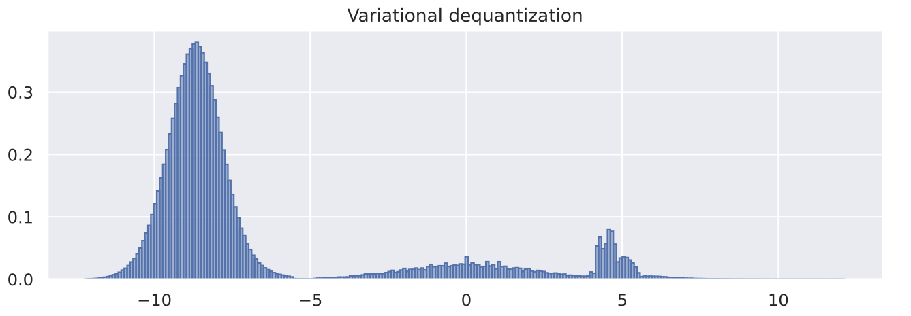  

从第一张图的去量化分布可以看出MNIST图像对0(黑色)有较强的偏倚，并且如前所述其分布有一个清晰的边界。变分去量化模块确实学习了一个更平滑的分布与高斯型曲线，可以更好地建模。对于其他值，我们需要在更深的层次上可视化分布$q(u \mid x)$ ，具体取决于输入 $x$。然而，由于所有的元素都相互作用并相互依赖，我们需要在784维中可视化分布，这已经不是那么直观了。

## 总结

总之，我们已经看到了如何实现我们自己的规范化流程，以及如果我们想将它们应用于图像会出现什么困难。去量化是将离散图像映射到连续空间的关键步骤，以防止我们不想看到的delta-peak解。虽然去量化创建了具有硬边界的超立方体，但变分去量化允许我们更好地在数据上拟合 Flow 模型。这使我们能够获得更低的维bit分数，同时不影响采样速度。最常见的 Flow 元素(耦合层)实现简单，但非常有效。此外，多尺度架构有助于捕获全局图像上下文，同时允许我们有效地扩大流。Normalizing Flow是VAEs的一个有趣的替代方案，因为它们允许在连续空间中进行精确的似然估计，并且我们可以保证每个可能的输入都有相应的潜在向量。总的来说，流量正常化是一个令人兴奋的研究领域，将在未来几年持续下去。


