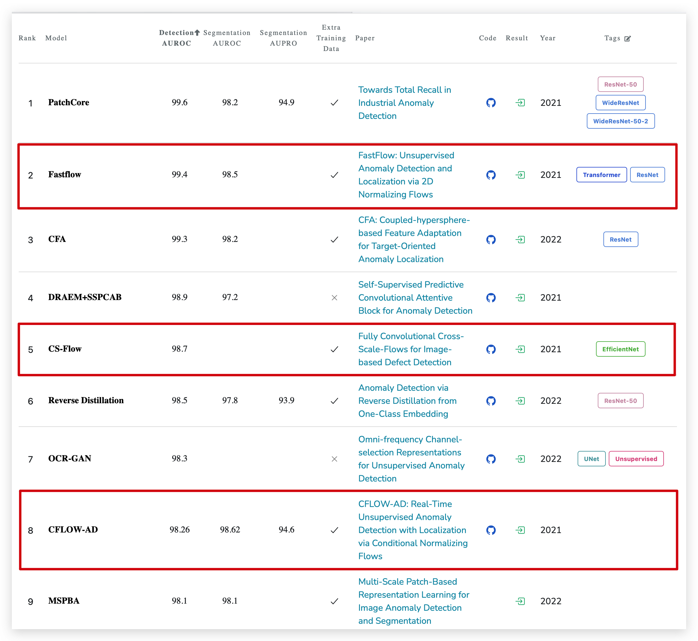
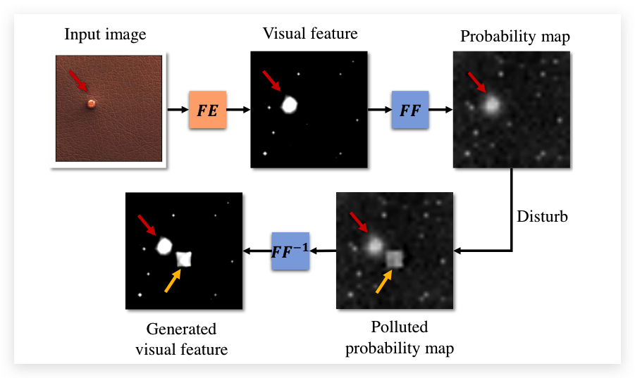
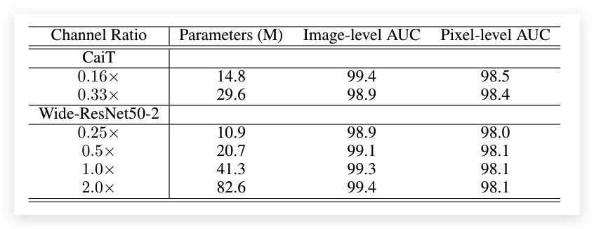

# 基于Flow的异常检测算法对比

:::tip

对比CS Flow, CFlow 和 FastFlow 三种基于Flow的异常检测算法

:::

## 效果对比

目前Fast Flow是速度最快，效果最好的基于Flow的模型，CSFlow和Cflow要差一些。CSFlow和Cflow的结构都要比Fast Flow复杂，但是不知道为啥Fast Flow的效果是最好的

  

## 实现细节

这三篇论文的实验部分都很充分，下面总结一下能从实验部分读出的点

### FastFlow

1、对于 vit 和 ResNet18 的 Backbone，只使用3x3卷积不使用1x1卷积效果更好，对于WideResnet50，使用3x3卷积搭配1x1卷积效果会更好

2、之前有一个疑问，就是Normalizing Flow生成的是一个单高斯分布的模型还是一个多高斯分布的模型，通过下图可以了解到生成的多高斯分布的模型

  

3、WideResNet 中卷积层之间中间层的大小会影响准确度

  

4、数据增强可以让Image-level AUC有一定提升

5、MVTec 的数据大多数的是对齐的，对于其他模型把图片上下左右平移可能会影响模型的精度

6、FastFlow 经常对于背景有误识别

7、在别人复现的FastFlow的代码里面，使用vit的Backbone其实效果并不是很好，反而要比WideResNet差

### CFlow-AD

1、这篇文章发现，MVTec这个数据集每个类别在不同的缩放大小下会得到不同的AUC （所以他们就取每个类别去不同输入大小下最高的）

2、由于使用了多个分支，对不同stage的元素都用NF进行了处理，所以难免它的运行速度会比较慢

3、CFlow-AD 这篇论文发现使用512输入的MobileNetv3作为特征提取模块可以有更好的效果

4、增加Normalizing FLow的Coupling Layer会获得更好的效果

### CS-Flow

1、Coupling Layer的数量达到4之后性能会到达饱和状态

## 一些问题与想法

1、大部分的模型自己实际跑的时候跑不到论文里面的精度（用官方的代码）

2、使用Normalizing Flow去做异常检测还没扩展了视频异常检测领域

