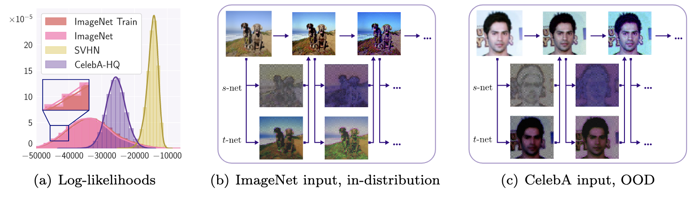
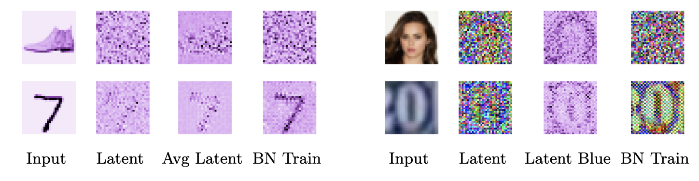
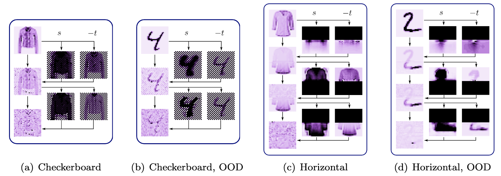
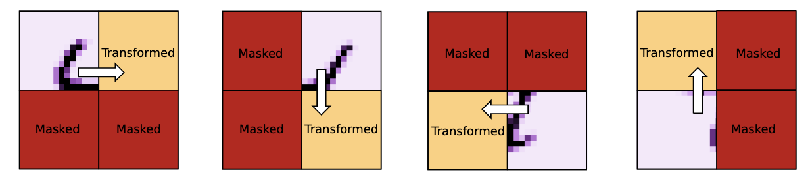
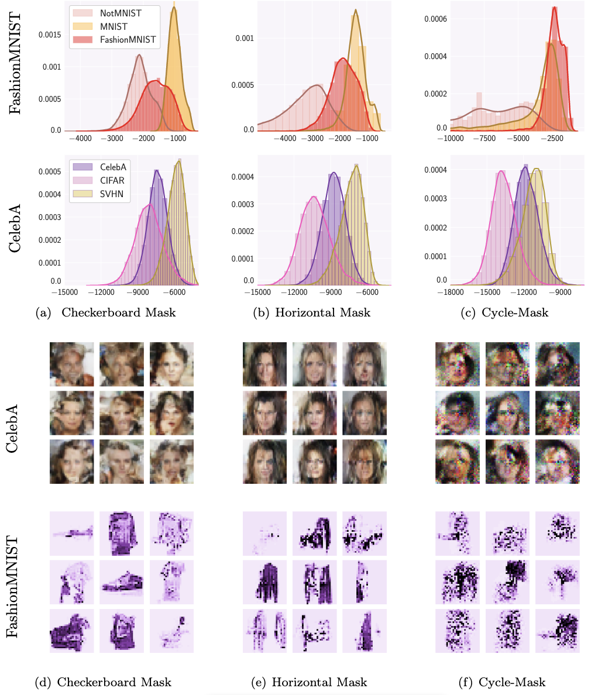
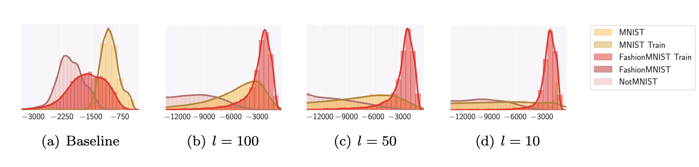

# Why Normalizing Flows Fail to Detect Out-of-Distribution Data

## 论文简介

Normalizing Flow 可以提供准确的密度估计结果，但是确不能很好的区分分布内和分布外的数据。 本文分析了这个问题的原因。 Flow 模型学习到了局部像素之间的关联性以及可以把数据分布变换到潜空间中。 该论文提出了通过修改 Flow 模型的结构可以让模型更倾向于学习语义特征，从而提高模型在异常检测任务上的性能。 同时本文还提出了一个观点： 可以生成高清图像的 Flow 模型，其生成的图像更加逼真，但是在异常检测任务上的性能会下降。 

## 论文核心

### 什么是 Out-of-distribution?

`Out-of-distribution` 和 `anomaly detection` 中异常的概念还不太一样。 `Out-of-distribution` 是将一个数据集作为训练数据，另一个数据集作为异常数据。 而 `anomaly detection` 是将一个数据集中某一个数据作为训练数据将其他类别作为异常数据。

### 论文主要论点

1. Flow 主要学习的是图像的局部像素关联而不是图像的语义信息；
2. Normalizing Flow 可以给任何结构的输入一个高的似然估计结果，可以生成高分辨率的Flow模型反而会在OOD检测上表现效果差；
3. 通过修改Coupling Layer的结构，可以让 Flow 模型学习如何对特定的数据进行转化。
4. 使用高级的特征，比如在ImageNet上预训练的Backbone所提取的特征，这样的特征帮你提取好了语义信息。

### Normalizing Flow 的偏置

文章提出的一个核心观点的就是 Normalizing Flow 学习的是局部像素之间的关联性，而不是图像的语义特征，这导致了Normalizing Flow对于没有见过的图像也可以给出一个高的似然估计结果。 但是这个结果并不是我们想要的，我们想要的是能够区分分布内和分布外的数据。

  

上图进一步说明了这个观点，图像中（b）是分布内的数据，（c）是分布外的数据，可以看到 Flow 的 `s-net` 和 `t-net` 给出的结果是类似的，这就导致了 Flow 模型不能很好的区分分布内和分布外的数据。

为了进一步证明这个关键作者对 Flow 模型输出的 `latent representation` 进行了可视化。下图中左边的四列分别是原图，Latent, 对40个添加不同 `dequantization noise` 的样本进行平均以及在训练中使用 BN，右边的四列也是类似的。 从两组数据中我们都可以在 `latent representation` 观察到图像的边缘信息， 这进一步地证明了 Flow 模型学习的是图像的局部像素关联性而不是图像的语义信息。

  

### 耦合层自适应

在上面的实验中我们已经知道了 Normalizing Flow 会根据根据像素之间的关联性进行预测，所以作者就又设计了一种实验：作者将 Mask 改成了上下遮蔽的类型，遮住上面的去预测下面的 （作者内心OS： 这次你总不能在对分布外的数据预测的非常准确了吧）。 但是结果非常的 amazing 啊，Flow 模型依然能够对分布外的模型进行重建。作者把这种现象叫做耦合层的自适应（Coupling Layer co-adaptation）。

作者也对这种现象出现的原因进行了分析，通过观测我们可以发现第一层 Coupling Layer 的输出 -t 是非常模糊的也没有明显的图像特征，但是从第二层开始， -t就变的非常的清晰。 作者给出的解释是：第一层的耦合层会把图像的像素信息进行编码，然后第二层的耦合层会把第一层的编码结果进行解码，这样就会得到一个非常清晰的图像特征。

  

### 对模型进行改进

这篇论文主要提出了两个优化点，第一个优化点是改进 Mask 的策略，第二个优化点是改进耦合层的结构（添加一个neck结构）。

#### 改进 Mask 的策略

上面已经说到了基础的 mask 方法，NF 有将信息存储后解码的嫌疑。作者提出了一种新的 mask 方法，这种方法是将图像分成了四个部分，经过4个Coupling Layer后才会对图像的信息进行完整的一次更新。具体如下图所示。

  

作者对结果进行了一定的可视化，如下图所示：

  

可以看到对 FashionMNIST 进行训练后，模型能够对分布外的数据进行重建，但是对于 MNIST 数据集，模型对分布外的数据进行重建的效果并不是很好。 不过对于 CelebA 由于使用的数据集都是人脸数据集所以模型依然给了分布数据很高的似然估计结果。

#### 改进耦合层的结构

作者在耦合层中添加了一个 neck 结构，这个结构的作用是将图像的特征进行降维，其实就是一个全连接网络，作者说让强制让特征降维可以让模型去专注于全局的信息，而不是局部的信息。 根据论文的实验来看中间维度降的越小，模型检测OOD的效果就越好。

  

### 使用深度特征

一句话就是：使用深度特征可以提高模型的检测能力。在 Normalizing Flow 之前外接一个训练好的 Backbone 提取特征。

