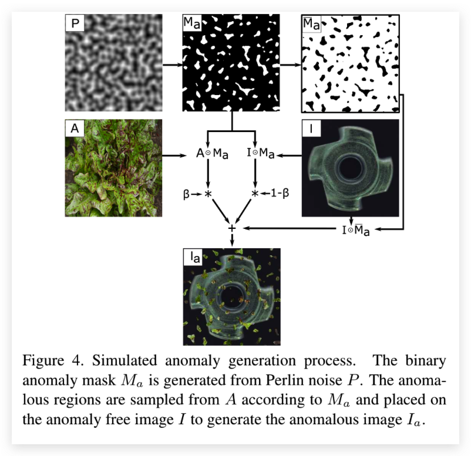

# DRAEM: Surface Anomaly Detection Network

:::note
DRÆM – A discriminatively trained reconstruction embedding for surface anomaly detection
:::

## 论文简介

最近的表面异常检测依赖于生成模型去准确的重建出正常的区域，不能重建出异常的区域。这些模型只用正常的图片进行训练，而且检测需要手工设计后处理步骤来对异常进行定位，这也阻止了优化特征提取来得到最大的检测准确度。该论文将表面异常问题看做了一个 discriminative 问题，同时提出了一种判别训练的重构异常嵌入模型（DRAEM）。

:::tip
discriminative 模型，根据条件概率对看不见的数据进行预测，可用于分类或回归问题。
:::

该篇论文提出的方法学习了异常图像的联合表示，同时它不需要对异常区域重建，它是学习正常样本和异常样本的决策边界。该方法不需要对网络输出进行额外的复杂后处理就可以直接进行异常定位，并且可以通过简单和一般的异常模拟进行训练。

### 关键技术

DRAEM 由一个重构子网络和一个判别子网络组成。 重构子网络被训练用来检测异常和重构出无异常的区域（让无异常的区域被重建）。discriminative 子网络的作用是根据重构图和原图准确地预测出异常分割地图。DRAME的结构图如下：

  

#### Reconstructive sub-network

重构子网络是一个encoder-decoder的结构，它可以将输入图像的局部模式转换为更接近正态样本分布的模式。在训练的过程中首先会生成随机噪声的 $I_a$，该子网络的任务就是让重构出添加噪声之前的原图 $I$。

重构子网络的损失函数如下：

$$
L_{r e c}\left(I, I_{r}\right)=\lambda L_{S S I M}\left(I, I_{r}\right)+l_{2}\left(I, I_{r}\right) \\
L_{S S I M}\left(I, I_{r}\right)=\frac{1}{N_{p}} \sum_{i=1}^{H} \sum_{j=1}^{W} 1-\operatorname{SSIM}\left(I, I_{r}\right)_{(i, j)},
$$

该网络的loss就是由一个l2损失项+一个SSIM损失函数组成。

#### Discriminative sub-network

该子网络使用了一个类似于U-Net的结构。 这个子网络的输入 $I_c$ 是重构网络的输出 $I_r$ 和输入图像 $I$ 通道concat（channel-wise concatenation）。$I$ 和 $I_r$ 的不同提供了异常定位的关键信息。在基于重建的异常检测方法中，Anomaly Map 是使用相似度函数(如SSIM)获得的，然而表面异常检测特定的相似度度量很难手工制作（所以就让一个网络去学是吧）。 discriminative 子网络就是要学习去自动的衡量正常样本和异常样本之间的距离。这个网络会直接输出 Anomaly Map。 这个子网络的损失函数是一个Focal loss（看流程图）。

#### 模拟异常

DRAEM并不需要真实场景下的异常图片，而是采用在图像的表面随机生成一些噪声的方式。

:::tip
DRAEM does **not require simulations to realistically reflect the real anomaly appearance in the target domain**, but rather to generate **just-out-of-distribution appearances**, which allow learning the appropriate distance function to recognize the anomaly by its deviation from normality.
:::

论文通过随机的在图片上添加柏林噪声来制造异常图片，具体的生成过程如下图所示：

  

## Conclusion

提出了一种判别训练的重构异常嵌入模型。该网络能够定位异常噪声，并从噪声图像中重建无异常图像。但是使用两个较为大型的网络，检测的速度肯定会非常的慢（一个encoder-decoder和一个U-net结构的网络），但是该篇提出的用神经网络去学习决策边界的方法确实有一定的借鉴意义。

  

