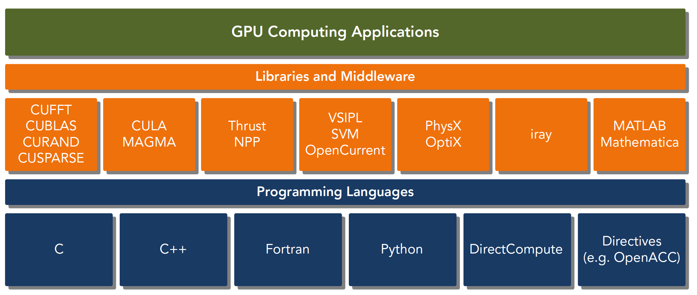
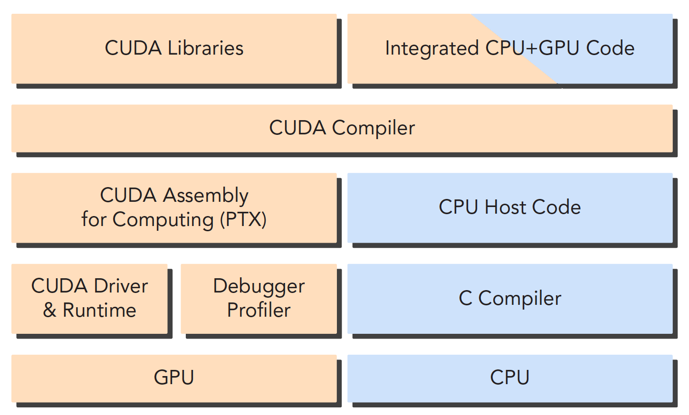

# 异构计算与 CUDA

## 异构计算与 CUDA

### 异构计算

异构计算 “Heterogeneous Computing” 是一种特殊的并行分布式计算系统。它能够经济有效地实现高计算能力，可扩展性强，能够非常高效地利用计算资源。与之相对的概念就是同构计算“Homogeneous Computing”，也就是为大家熟知的多核理念。为了突破计算算力受制于功耗的瓶颈，多核 CPU 技术得到越来越多的应用。强大的 CPU 采用越来越多的 CPU 内核这就是传统同构计算系统。很快人们就发现在 AI 人工智能和自动驾驶爆炸式增长的计算需求下，传统同构计算系统已经无法满足要求，GPU、DSP、FPGA 和 ASIC 由于特定需求下高效性越来越多的被应用。

x86 CPU+GPU 的这种异构应该是最常见的，也有 CPU+FPGA，CPU+DSP 等各种各样的组合，CPU+GPU 在每个笔记本或者台式机上都能找到。当然超级计算机大部分也采用异构计算的方式来提高吞吐量。

异构架构虽然比传统的同构架构运算量更大，但是其应用复杂度更高，因为要在两个设备上进行计算，控制，传输，这些都需要人为干预，而同构的架构下，硬件部分自己完成控制，不需要人为设计。

:::tip

异构计算是指在一个系统中，使用多种不同的处理器和协处理器，以解决一个计算问题。异构计算的目的是利用每种处理器的优势，以提高整个系统的性能。

:::

#### 异构架构

一句话概括：异构计算是指在一个系统中，使用多种不同的处理器和协处理器，以解决一个计算问题。异构计算的目的是利用每种处理器的优势，以提高整个系统的性能。

举一个例子，我们在做深度学习的时候，通常会使用 CPU 和 GPU 两种处理器。CPU 的优势是可以处理各种各样的任务，而 GPU 的优势是可以高效地进行并行计算。因此，我们可以将 CPU 用于控制流程，将 GPU 用于数据流程，以提高整个系统的性能。一台 intel i7-4790 CPU 加上两台 Titan x GPU 构成的工作站，GPU 插在主板的 PCIe 卡口上，运行程序的时候，CPU 像是一个控制者，指挥两台 Titan 完成工作后进行汇总，和下一步工作安排，所以 CPU 我们可以把它看做一个指挥者，主机端，host，而完成大量计算的 GPU 是我们的计算设备，device。

引用 [2] 里面的图片和表述，如下图所示：

  

上面这张图能大致反应 CPU 和 GPU 的架构不同。

- 左图：一个四核 CPU 一般有四个 ALU，ALU 是完成逻辑计算的核心，也是我们平时说四核八核的核，控制单元，缓存也在片上，DRAM 是内存，一般不在片上，CPU 通过总线访问内存。
- 右图：GPU，绿色小方块是 ALU，我们注意红色框内的部分 SM，这一组 ALU 公用一个 Control 单元和 Cache，这个部分相当于一个完整的多核 CPU，但是不同的是 ALU 多了，control 部分变小，可见计算能力提升了，控制能力减弱了，所以对于控制（逻辑）复杂的程序，一个 GPU 的 SM 是没办法和 CPU 比较的，但是对了逻辑简单，数据量大的任务，GPU 更高效。

:::tip

CPU 和 GPU 之间通过 PCIe 总线连接，用于传递指令和数据，CPU 和 GPU 之间的数据传输是一个很大的瓶颈，所以我们在编程的时候，要尽量减少 CPU 和 GPU 之间的数据传输。

:::

一个异构应用包含两种以上架构，所以代码也包括不止一部分：

- 主机端代码：运行在 CPU 上，负责控制整个程序的流程，比如读取数据，将数据传输到 GPU，将 GPU 计算的结果传输回 CPU，将结果写入硬盘等等。
- 设备端代码：运行在 GPU 上，负责完成大量的计算任务。

#### CUDA

CUDA 是异构计算的一种实现方式，是 NVIDIA 推出的异构计算平台和编程模型。 本来一开始 GPU 之前是不可编程的或者说是专用的，只能用来做图形处理，后来 NVIDIA 推出了 CUDA，使得 GPU 可以用来做通用计算，这样就可以利用 GPU 的高并行性来加速计算了。

CUDA 平台不是单单指软件或者硬件，而是建立在 Nvidia GPU 上的一整套平台，并扩展出多语言支持。

  

如图所示，CUDA 平台包括：

- CUDA 架构：包括 GPU 硬件架构和 CUDA 指令集架构。
- CUDA 工具链：包括 CUDA C/C++编译器，CUDA-GDB 调试器，CUDA Profiler 等。
- CUDA 运行时：包括 CUDA 驱动程序和 CUDA 运行时库，用于在 GPU 上执行 CUDA 程序。
- CUDA 编程语言：包括 CUDA C/C++和 CUDA Fortran，用于在 GPU 上编写 CUDA 程序。

**CUDA API**

CUDA API 是 CUDA 的编程接口，包括 CUDA Runtime API 和 CUDA Driver API。

- CUDA Runtime API：是一组运行时函数，用于在 CUDA 程序中调用 GPU 的硬件资源。
- CUDA Driver API：是一组底层函数，用于在 CUDA 程序中调用 GPU 的硬件资源。

驱动 API 是低级的 API，使用相对困难，运行时 API 是高级 API 使用简单，其实现基于驱动 API。

这两种 API 是互斥的，也就是你只能用一个，两者之间的函数不可以混合调用，只能用其中的一个库。

一个 CUDA 应用通常可以分解为两部分：

- CPU 主机端代码
- GPU 设备端代码

在编译的时候，CPU 代码和 GPU 代码分别编译。主机端代码通过 CPU 编译器编译，设备端代码（核函数）使用 nvcc 编译器编译。

:::tip

核函数是我们后面主要接触的一段代码，就是设备上执行的程序段

:::

上面我们提到 GPU 设备端代码是使用 nvcc 编译器编译的，那么 nvcc 是什么呢？

nvcc 是 NVIDIA CUDA Compiler 的缩写，是 NVIDIA CUDA 编译器，是一种支持 CUDA C/C++的编译器，可以将 CUDA C/C++代码编译为 PTX（Parallel Thread Execution）代码，PTX 是一种中间代码，可以在不同的 GPU 上运行，也可以编译为不同的机器码，这样就可以在不同的 GPU 上运行了。

编译的过程如下图所示：

  

## Hello World

下面我们来看一个 CUDA 的 Hello World 程序，代码如下：

```c
#include <stdio.h>

__global__ void helloFromGPU()
{
    printf("Hello World from GPU!\n");
}

int main()
{
    printf("Hello World from CPU!\n");

    helloFromGPU<<<1, 10>>>();

    cudaDeviceReset();
    return 0;
}
```

上面的代码中，我们定义了一个核函数`helloFromGPU`，然后在主函数中调用了这个核函数。

核函数是在 GPU 上执行的，所以我们需要使用`__global__`关键字来修饰核函数，这样编译器就知道这个函数是在 GPU 上执行的。

`<<<1, 10>>>`是核函数的调用语法，第一个参数 1 表示启动一个线程块，第二个参数 10 表示每个线程块包含 10 个线程。

在主函数中，我们先输出了一句话，然后调用了核函数，最后调用了`cudaDeviceReset()`函数，这个函数用于重置当前设备上的所有资源，这个函数是可选的，但是如果不调用这个函数，那么程序会在退出的时候报错。因为这句话包含了隐式同步，**GPU 和 CPU 执行程序是异步的**，核函数调用后成立刻会到主机线程继续，而不管 GPU 端核函数是否执行完毕，所以上面的程序就是 GPU 刚开始执行，CPU 已经退出程序了，所以我们要等 GPU 执行完了，再退出主机线程。

### CUDA 程序流程

一般一个 CUDA 程序的流程如下：

1. 分配 GPU 内存
2. 拷贝内存到设备
3. 调用 CUDA 内核函数来执行计算
4. 把计算完成数据拷贝回主机端
5. 内存销毁

下面我们来看一个简单的例子，代码如下：

```c
#include <stdio.h>

__global__ void add(int a, int b, int *c)
{
    *c = a + b;
}

int main()
{
    int c; // host copy of c
    int *dev_c; // device copy of c

    cudaMalloc((void**)&dev_c, sizeof(int)); // allocate space for dev_c

    add<<<1, 1>>>(2, 7, dev_c); // call add() kernel on GPU

    // copy result back from GPU to CPU
    cudaMemcpy(&c, dev_c, sizeof(int), cudaMemcpyDeviceToHost);

    // print result
    printf("2 + 7 = %d\n", c);
    // free memory on GPU
    cudaFree(dev_c);

    return 0;
}
```

上面的代码中，我们定义了一个核函数`add`，然后在主函数中调用了这个核函数。

在主函数中，我们先定义了一个变量`c`，然后定义了一个指针`dev_c`，这个指针指向 GPU 上的内存，然后我们调用了`cudaMalloc`函数来分配 GPU 内存，这个函数的第一个参数是一个指针，指向 GPU 上的内存，第二个参数是分配的内存大小。 

然后我们调用了核函数`add`，这个函数的第一个参数是 2，第二个参数是 7，第三个参数是指向 GPU 上内存的指针`dev_c`。

然后我们调用了`cudaMemcpy`函数，这个函数用于把 GPU 上的内存拷贝到主机端，这个函数的第一个参数是主机端的指针，第二个参数是 GPU 端的指针，第三个参数是拷贝的内存大小，第四个参数是拷贝的方向，这里是从 GPU 拷贝到主机端。

最后我们调用了`cudaFree`函数，这个函数用于释放 GPU 上的内存，这个函数的参数是 GPU 上的指针。

## 学习 CUDA C 代码中会遇到的 Boss

1. CPU 与 GPU 的编程主要区别在于对 GPU 架构的熟悉程度，理解机器的结构是对编程效率影响非常大的一部分，了解你的机器，才能写出更优美的代码，而目前计算设备的架构决定了局部性将会严重影响效率。$^{[2]}$ 

2. CUDA 中内存层次结构和线程层次结构是决定性能的两个重要因素。在后续的研究中，CUDA C 写核函数的时候我们只写一小段串行代码，但是这段代码被成千上万的线程执行，所有线程执行的代码都是相同的，CUDA 编程模型提供了一个层次化的组织线程，直接影响 GPU 上的执行顺序。

3. CUDA 是如何抽象硬件实现的，这里面又包含了很多的知识，比如线程组的层次结构、内存的层次结构、障碍同步等等。

这些都是我们后面要研究的。除了这些，NVIDIA 还提供了很多的工具，比如`Nvidia Nsight`、`CUDA-GDB`等等，这些工具可以帮助我们分析 CUDA 程序的性能，这些工具也是我们后面要学习的。

## 总结

本文主要介绍了 CUDA 的基本概念，包括异构计算、CUDA 程序的流程，并且概括了我们的将要遇到的苦难和使用到的工具。

:::tip

大佬说，当我们学会的 CUDA，那么编写高效异构计算就会像我们写串行程序一样流畅。希望我也能够达到这个境界。

:::


## Reference 

[1] [如何用通俗易懂的话解释异构计算？](https://www.zhihu.com/question/63207620)

[2] [【CUDA 基础】1.1 异构计算与CUDA](https://face2ai.com/CUDA-F-1-1-异构计算-CUDA/)