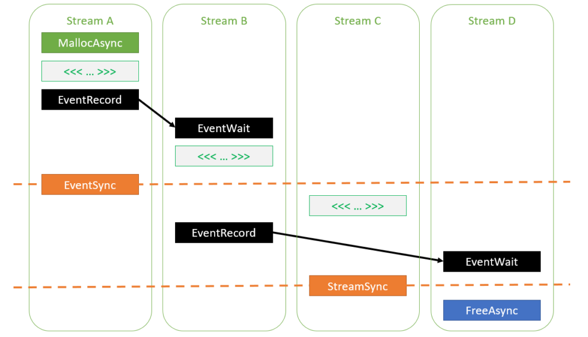

# Stream-Ordered Memory Allocator

## 1. 介绍

在 CUDA 编程中，内存管理一直是一个关键的问题。随着计算需求的增加，对于高效的内存分配和释放变得更加重要。CUDA 11.2 引入了 Stream-Ordered Memory Allocator，这是一项创新的内存管理技术，为 GPU 计算提供了更好的性能和效率。

在CUDA编程中，显存的分配和释放是一个复杂而关键的任务。传统的内存管理方法可能导致内存碎片化、数据传输瓶颈等问题，影响程序的性能。Stream-Ordered Memory Allocator 旨在解决这些问题，提供更灵活、高效的内存管理方式。

Stream-Ordered Memory Allocator 通过引入内存池概念和异步内存管理，使得程序能够更好地适应异步计算和多Stream操作，提高了内存分配和释放的效率。本文将深入介绍 Stream-Ordered Memory Allocator 的核心概念和其在CUDA编程中的作用。

## 2. Stream Ordering Efficiency

### 2.1 CUDA 中的 Stream 概念

在 CUDA 编程中，Stream 是一种异步执行的上下文，它使得 GPU 可以并行执行多个任务。每个任务都可以分配到一个独立的 Stream 中，允许它们在不互相干扰的情况下同时进行。理解 Stream 的概念对于充分利用 GPU 的并行计算能力至关重要。

默认 Stream 是 CUDA 上下文中的一个特殊 Stream，所有未显式分配到其他 Stream 的任务都会在默认 Stream 中执行。相比之下，非默认 Stream 允许任务之间的并行执行。深入理解这两种 Stream 的概念有助于更好地组织任务，提高整体性能。

### 2.2 Stream Ordering 的重要性

Stream Ordering 是指在异步执行的过程中，对任务的合理排序以最大程度地发挥 GPU 并行性。Stream Ordering Efficiency 成为 Stream-Ordered Memory Allocator 的基础，通过优化 Stream 的使用方式，提高内存管理效率，加速计算任务的完成。

Stream-Ordered Memory Allocator 在内存管理中引入了对 Stream Ordering 的优化策略。通过合理配置内存池和使用异步内存分配，它能够更好地适应任务执行的异步性，从而提高整体的计算效率。

## 3. Stream-Ordered Memory Allocator

Stream-Ordered Memory Allocator(SOMA)是一种基于CUDA的内存分配器，它可以在多个流中并行分配和释放内存。

我们知道，CUDA程序中的内存分配和释放（`cudaMalloc`和`cudaFree`）是非常昂贵的，因为它们需要与主机端的内存分配和释放进行同步。为了解决这个问题，SOMA提出了一种新的内存分配和释放机制，它可以在多个流中并行分配和释放内存，从而减少了内存分配和释放的开销。

Stream-Ordered Memory Allocator 引入了两个关键的异步内存管理函数：`cudaMallocAsync` 和`cudaFreeAsync`。这两个函数允许开发者在异步流中进行内存分配和释放操作，从而更好地与GPU任务的异步执行进行协同工作。

下面是一个示例代码，展示了如何使用这两个函数，并通过合适的事件依赖关系实现Stream-Ordered的内存管理：

```cpp
// 使用cudaMallocAsync进行异步内存分配
auto err = cudaMallocAsync(&ptr, size, streamA);

// 如果cudaMallocAsync成功完成，ptr保证是一个有效的指向内存的指针，
// 可以在stream的执行顺序中被访问
assert(err == cudaSuccess);

// 在相同的stream中启动的工作可以访问内存，因为在一个stream中的操作是串行的
kernel<<<..., streamA>>>(ptr);

// 在另一个stream中启动的工作可以访问内存，只要添加了适当的依赖关系
cudaEventRecord(event, streamA);
cudaStreamWaitEvent(streamB, event, 0);
kernel<<<..., streamB>>>(ptr);

// 在分配操作之后的某一点同步stream也能够使得任何stream都能够访问内存
cudaEventSynchronize(event);
kernel<<<..., streamC>>>(ptr);

// 释放内存需要加入所有访问的streams。这里，streamD将进行释放操作。
// 在streamD上添加一个事件依赖关系确保所有在streamB中的访问在释放之前完成
cudaEventRecord(event, streamB);
cudaStreamWaitEvent(streamD, event, 0);

// 同步streamC也确保所有在它上面的访问在释放之前完成
cudaStreamSynchronize(streamC);
cudaFreeAsync(ptr, streamD);
```

上述代码示例演示了在不同的 CUDA Streams 中，如何使用 cudaMallocAsync 和 cudaFreeAsync 进行异步内存分配和释放。其中，通过使用事件依赖关系，保证了在释放内存之前，所有对内存的访问都已经完成。

这种操作方式使得程序能够更灵活地在不同Streams中执行任务，同时确保内存的顺序访问。这是 Stream-Ordered Memory Allocator 的核心思想，通过充分利用 CUDA Streams 的并行性，提高了内存管理的效率。

下图展示了上述代码中不同 Stream 中的任务执行顺序：

  


## 4. Memory pools

在 Stream-Ordered Memory Allocator中，引入了内存池的概念，这是一项关键的优化策略，用于提高内存分配和释放的效率。

内存池是一块预先分配的内存区域，它在程序初始化阶段被分配，并在整个程序生命周期内用于动态分配和释放内存。Stream-Ordered Memory Allocator 通过引入内存池，避免了频繁的内存分配和释放操作，减少了内存碎片化，提高了内存管理效率。

在CUDA中，每个设备都有一个默认池的概念，可以使用 `cudaDeviceGetDefaultMemPool` 查询其句柄。内存池通过`cudaMemPool_t`句柄来表示，这是对内存池的抽象。通过使用这个句柄，开发者可以显式地创建自己的内存池，并直接使用它们，也可以将其设置为设备的当前池并间接使用它们。

```cpp
// 获取设备的默认内存池句柄
cudaMemPool_t defaultPool;
cudaDeviceGetDefaultMemPool(&defaultPool);
```

默认情况下，**没有显式创建的池被设置为设备的当前池时，会使用设备的默认池**。这种设计的原因在于涉及一些自定义配置，例如内存分配的策略、释放阈值等。显式创建池的目的是为了提供更多的配置选项，以满足特定应用场景的需求。

当默认池被设置为设备的当前池时，它充当当前池，可以在没有显式指定池参数的情况下，供`cudaMallocAsync`调用使用。

如果由于内存池的碎片而无法满足 `cudaMallocAsync` 的内存分配请求，CUDA驱动程序会通过**将池中未使用的内存重新映射到GPU虚拟地址空间的连续部分来对池进行碎片整理**。这种操作避免了昂贵的系统调用，同时降低了应用程序的内存占用。

```cpp
cudaMallocAsync(ptr1, size1, stream);  // 从池中分配新的内存
kernel<<<..., stream>>>(ptr1);
cudaFreeAsync(ptr1, stream);  // 将内存返回到池中

cudaMallocAsync(ptr2, size2, stream);  // 从池中分配现有的内存
kernel<<<..., stream>>>(ptr2);
cudaFreeAsync(ptr2, stream);  // 将内存返回到池中

cudaDeviceSynchronize();  // 将累积的未使用内存返回到操作系统
```


在某些情况下，**将内存从池返回到系统可能会影响性能**。通过**配置释放阈值**，可以在同步操作之后**保持未使用的内存不变，从而避免昂贵的重新分配**。释放阈值指定池缓存的最大内存量，在同步操作期间，它会将所有**多余的内存释放回操作系统**。

```cpp
// 设置释放阈值
cudaMemPoolSetReleaseThreshold(defaultPool, threshold);

// 使用非零释放阈值可以在一个迭代到下一个迭代中重用内存
for (int i = 0; i < 100; i++) {
    cudaMallocAsync(&ptr, size, stream);
    kernel<<<..., stream>>>(ptr);
    cudaFreeAsync(ptr, stream);
    cudaStreamSynchronize(stream);
}
```

上述示例演示了如何通过设置释放阈值，使得未使用的内存在同步操作之后保持不变，从而实现内存的重用，提高内存分配性能。

内存池的灵活性和配置选项使得 Stream-Ordered Memory Allocator能够更好地适应不同的应用场景，从而提供更高效的内存管理。

CUDA驱动程序还可以使用启发式方法在没有明确指定的显式依赖项的情况下重用内存。但是，这种启发式方法可能增加应用程序的不确定性，因此可以在每个池的基础上禁用。以下是一个禁用的示例：

```cpp
int enable = 0;
cudaMemPoolSetAttribute(mempool, cudaMemPoolReuseAllowOpportunistic, &enable);
cudaMemPoolSetAttribute(mempool, cudaMemPoolReuseAllowInternalDependencies, &enable);

```

这种禁用方式可以帮助应用程序提高性能或避免内存分配失败，但会增加不确定性。应用程序可以根据需要禁用这些启发式方法。

## 5. 总结

Stream-Ordered Memory Allocator 是一种创新的内存管理技术，它通过引入内存池和异步内存管理，提高了内存分配和释放的效率。通过充分利用 CUDA Streams 的并行性，它能够更好地适应异步计算和多Stream操作，提高了内存管理的效率。Pytorch 和 Paddle 等深度学习框架已经开始使用 Stream-Ordered Memory Allocator，以提高程序的性能和效率。下一篇文章将介绍 Paddle 中是如何引用 Stream-Ordered Memory Allocator 的。