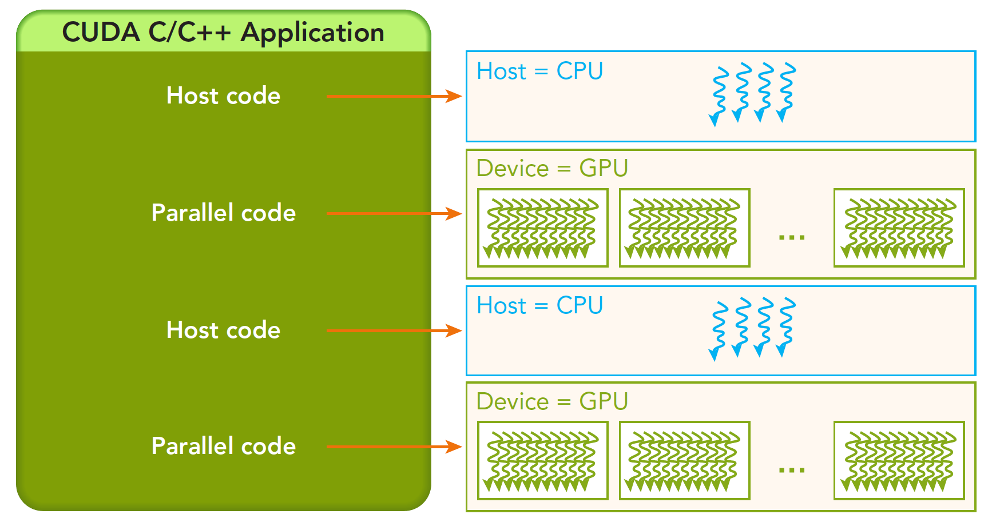
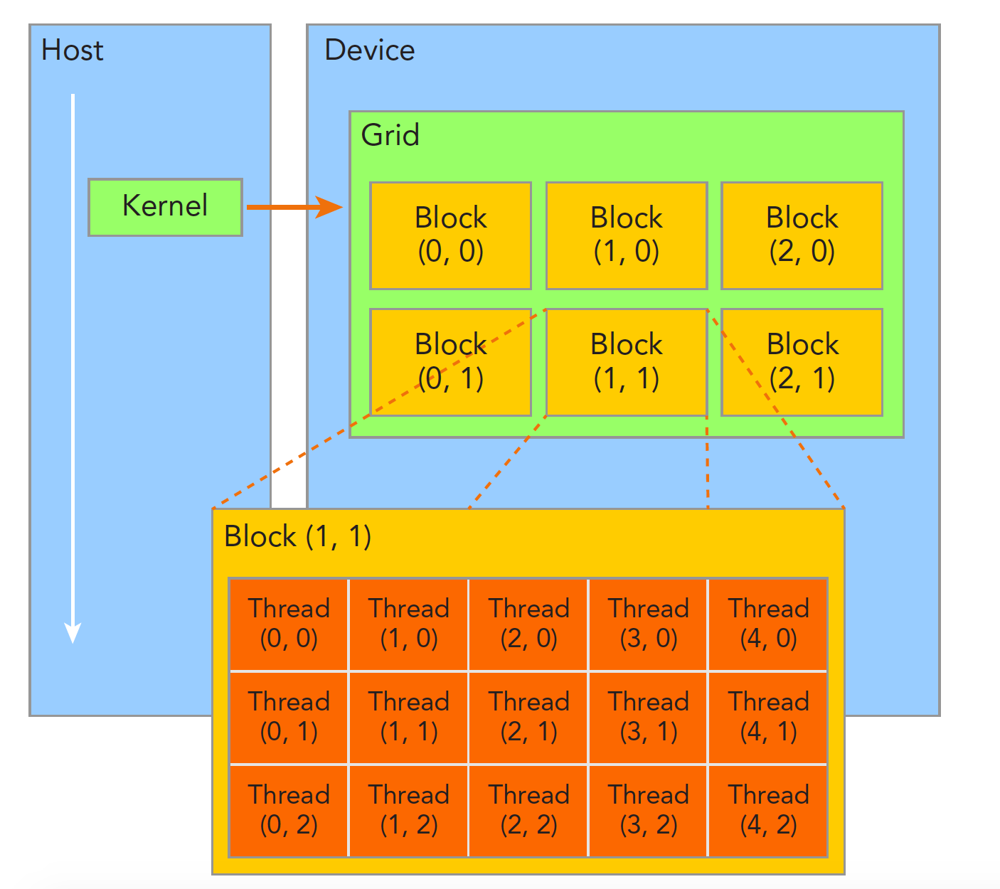

# CUDA 编程模型概述（一）

:::note

本章主要介绍 CUDA 编程模型的简要结构，包括内存管理、线程管理、核函数和错误处理等。通过本章的学习，可以对 CUDA 编程模型有一个初步的认识。

:::

## CUDA 编程模型概述

CUDA 编程模型的目标是构建应用程序和 GPU 硬件设备之间的桥梁。为此,CUDA 采用了编译型语言 CUDA C/C++,而不是解释型语言。原因是编译型语言可以被编译成优化的机器码,执行效率更高,更适合 GPU 的需求。

CUDA 编程模型为我们提供了一系列控制并行执行的接口和构造,包括核函数、内存管理、线程组织以及执行流管理等。我们可以通过这些接口和构造来定义 GPU 上的并行计算,这就是编程模型的作用。

具体来说,CUDA 通过线程块、线程网格来组织线程,实现了在 GPU 硬件核心间的可扩展映射。内存方面,CUDA 管理独立的主机内存和 GPU 设备内存,并提供内存复制机制。另外,CUDA 流使得内核执行和内存操作可以异步并发地被安排,以提高 GPU 利用效率。

总之,CUDA 编程模型为 GPU 计算提供了一个可移植的抽象层。开发者可以基于这个抽象层来设计并行算法,而不需要直接处理硬件级别的实现细节。编程模型使得同一个 CUDA 程序可以在不同的 GPU 硬件上运行,充分发挥各自的计算能力。

## CUDA 编程结构

CUDA 环境典型由 CPU 主机端和 GPU 设备端组成,两者通过 PCIe 总线连接并相互通信。但从软件层面,主机端和设备端采用了隔离的内存地址空间:

- 主机端采用系统内存,由 CPU 直接访问
- 设备端采用视频内存,由 GPU 直接管理

CUDA 6.0 之前,这两种内存空间不支持统一寻址,需要以内存复制的方式交换数据。我们当前先按传统方式编程,以加深理解主从内存的隔离特点。

一个完整的 CUDA 应用执行流程通常如下:

1. 主机端串行代码初始化数据,将数据复制到设备端内存
2. 主机端调用核函数在 GPU 设备上并行执行计算
3. 主机端将结果从设备端内存复制回系统内存

  

注意,主机端调用核函数后会立即返回,后续代码可能在核函数并行执行时同步运行。

下面我们的研究重点依次是:

1. 内存管理:主存与显存的数据传输
2. 线程管理:网格、块、线程的组织
3. 核函数:启动、编写、验证
4. 错误处理

### 内存管理

CUDA 管理独立的主机内存和设备内存,两者通过 PCIe 互联互通。主机内存由 CPU 访问,设备内存由 GPU 访问。 可以在主机端利用 cudaMalloc/cudaFree 分配和释放设备端内存;也可以在设备端用 cudaMallocManaged 统一分配主机和设备内存。

主机和设备内存之间的交换数据需要通过内存复制函数实现,如 cudaMemcpy、cudaMemcpyAsync 等。还要注意复制方向为主机到设备或设备到主机。下面表格有一些主机 API 和 CUDA C 的 API 的对比：

| 标准 C 函数 | CUDA C 函数 | 说明 |
| :---: | :---: | :---: |
| malloc | cudaMalloc | 内存分配 |
| memcpy | cudaMemcpy | 内存复制 |
| memset | cudaMemset | 内存设置 |
| free | cudaFree | 释放内存 |

内存管理中最重要的一步就是内存拷贝,下面我们来看一下内存拷贝的函数原型:

```c
cudaError_t cudaMemcpy ( void* dst, const void* src, size_t count, cudaMemcpyKind kind )
```

其中,参数 kind 指定了内存拷贝的方向,有以下几种取值:

- cudaMemcpyHostToHost:主机到主机
- cudaMemcpyHostToDevice:主机到设备
- cudaMemcpyDeviceToHost:设备到主机
- cudaMemcpyDeviceToDevice:设备到设备

下面我们来看一个简单的例子,在主机端分配内存,并初始化数据:

```c
// 主机端代码
int main(void)  
{
  int N = 10; 
  int _a,_b; // a,b的主机端副本
  int *_d_a, *_d_b, *d_c; // a,b,c的设备端副本
  int size = N * sizeof(int);

  // 为主机端a,b,c分配内存空间,并初始化输入值  
  a = (int *)malloc(size); random_ints(a, N);
  b = (int *)malloc(size); random_ints(b, N);

  // 为设备端a,b,c分配内存空间
  cudaMalloc((void **)&d_a, size);
  cudaMalloc((void **)&d_b, size); 
  cudaMalloc((void **)&d_c, size);

  // 将输入数据从主机端复制到设备端 
  cudaMemcpy(d_a, a, size, cudaMemcpyHostToDevice);
  cudaMemcpy(d_b, b, size, cudaMemcpyHostToDevice);

  // 在GPU上启动add()核函数
  add<<<N,1>>>(d_a, d_b, d_c);

  // 将设备端结果复制回主机端
  cudaMemcpy(c, d_c, size, cudaMemcpyDeviceToHost);

  // 释放内存
  free(a); free(b); free(c);
  cudaFree(d_a); cudaFree(d_b); cudaFree(d_c);
  
  return 0;
}
```

内存是分层次的，Device 中有 Global Memory、Shared Memory 和 Register，Host 中有 Global Memory 和 Register。在 Host 和 Device 之间传输数据，需要通过 PCI-E 总线，这个过程是非常耗时的。所以，我们需要尽量减少 Host 和 Device 之间的数据传输。 下图可以简单的描述这个过程：


  

共享内存（shared Memory）和全局内存（global Memory）后面我们会特别详细深入的研究，这里我们来个例子，两个向量的加法：

代码库：`https://github.com/Tony-Tan/CUDA_Freshman`


```c
// 包含CUDA运行时头文件
#include <cuda_runtime.h>  

// 包含标准输入输出头文件
#include <stdio.h>   

// 包含自定义函数头文件
#include "freshman.h"

// 在设备上将两个数组相加的函数
// a是数组1,_b是数组2,res是结果数组,_size是数组大小
void sumArrays(float *a, float *_b, float *res, const int size) {

  // 以4的步长循环遍历数组
  for(int i=0;i<size;i+=4) {
    
    // 将对应元素相加存入结果数组
    res[i]=a[i]+b[i];
    res[i+1]=a[i+1]+b[i+1]; 
    res[i+2]=a[i+2]+b[i+2];
    res[i+3]=a[i+3]+b[i+3];
  }
}

// 在GPU上将两个数组相加的核函数
// a和b是输入数组,res是结果数组
// 每个线程负责计算一个元素  
__global__ void sumArraysGPU(float *a, float *b, float *res) {

  // 获取线程ID
  int i=threadIdx.x;
  
  // 将对应元素相加存入结果数组
  res[i]=a[i]+b[i]; 
}

int main(int argc, char **argv) {

  // 设置使用的GPU设备ID
  int dev = 0;
  cudaSetDevice(dev);
  
  //数组元素数量 
  int nElem = 32;
  printf("Vector size: %d\n", nElem);
  
  // 每个元素占用的字节数
  int nByte = sizeof(float)*nElem; 

  // 在主机端分配内存
  float *a_h = (float*)malloc(nByte);
  float *b_h = (float*)malloc(nByte);
  float *res_h = (float*)malloc(nByte);
  float *res_from_gpu_h = (float*)malloc(nByte);

  // 初始化结果数组为0
  memset(res_h, 0, nByte);
  memset(res_from_gpu_h, 0, nByte);

  // 在设备端分配内存
  float *a_d, *b_d, *res_d;
  CHECK(cudaMalloc((float**)&a_d, nByte));
  CHECK(cudaMalloc((float**)&b_d, nByte));
  CHECK(cudaMalloc((float**)&res_d, nByte));

  // 初始化输入数据
  initialData(a_h, nElem); 
  initialData(b_h, nElem);

  // 从主机拷贝数据到设备
  CHECK(cudaMemcpy(a_d, a_h, nByte, cudaMemcpyHostToDevice));
  CHECK(cudaMemcpy(b_d, b_h, nByte, cudaMemcpyHostToDevice));

  // 定义线程块和网格大小
  dim3 block(nElem);
  dim3 grid(nElem/block.x);

  // 启动核函数 
  sumArraysGPU<<<grid,block>>>(a_d, b_d, res_d);

  // 打印执行配置
  printf("Execution configuration<<<%d, %d>>>\\n", block.x, grid.x);

  // 将结果从设备拷贝到主机
  CHECK(cudaMemcpy(res_from_gpu_h, res_d, nByte, cudaMemcpyDeviceToHost));

  // 在主机上执行数组相加
  sumArrays(a_h, b_h, res_h, nElem); 

  // 检查GPU计算的结果
  checkResult(res_h, res_from_gpu_h, nElem);

  // 释放内存
  cudaFree(a_d);
  cudaFree(b_d);
  cudaFree(res_d);

  free(a_h);
  free(b_h);
  free(res_h);
  free(res_from_gpu_h);

  return 0;
}
```

### 线程管理

当 CUDA 内核函数开始执行时,如何组织 GPU 上的线程变成了一个关键问题。我们需要明确下面几个事情:

1. 一个内核函数只能 launching 一个 grid;
2. 一个 grid 可以包含多个 block;
3. 每个 block 可以包含多条线程;
4. 线程按照一定的分层组织结构(grid - block - thread)来并行执行。

这样的分层组织给了我们更多灵活性,我们可以通过配置 grid 和 block 的数量,以及每个 block 中的线程数,来优化不同 kernel 的执行配置。这种分层的并行结构使得我们可以更自由和高效地利用 GPU 的计算资源。

  

同一个线程块(block)中的线程可以进行协作,具体来说主要包括两个方面:

1. 线程同步 - 通过 __syncthreads() 可以使一个线程块中的所有线程同步,用于协调线程间的操作顺序。
2. 共享内存 - 线程块中的线程可以高效地通过共享内存进行数据交换和共享。

:::tip

不同线程块中的线程是相互独立隔离的,不能直接协作。

:::

为了区分不同的线程,CUDA 为每个线程提供了一个唯一的线程 ID。主要通过下面两个内置变量获取:

1. blockIdx - 线程块在网格内的索引,用于区分不同的线程块。
2. threadIdx - 线程在线程块内的索引,用于区分同一线程块中的不同线程。

这两个变量都是 uint3 类型,包含 3 个无符号整数 x、y、z 表示多维索引。

与之对应,有两个内置变量表示线程块和网格的维度:

1. blockDim - 线程块的维度,对应线程块中的线程数。
2. gridDim - 网格的维度,对应线程块的数量。

网格通常被组织为 2 维,每个线程块被组织为 3 维。这提供了多维并行的能力。需要注意的是, dim3 是主机端定义的, 而 uint3 是设备端执行时内置的,不能在核函数中修改。

通过上述线程 ID 和维度变量,我们可以灵活地指定每个线程所处理的数据范围,将任务高效地映射到多维线程结构上。

下面的代码展示了如何使用线程 ID 和维度变量来指定每个线程所处理的数据范围:

```cpp
#include <stdio.h>
#include <cuda_runtime.h>

__global__ void checkIndex(void) {
  printf("threadIdx:(%d, %d, %d) blockIdx:(%d, %d, %d) blockDim:(%d, %d, %d) gridDim:(%d, %d, %d)\\n",
         threadIdx.x, threadIdx.y, threadIdx.z,
         blockIdx.x, blockIdx.y, blockIdx.z,
         blockDim.x, blockDim.y, blockDim.z,
         gridDim.x, gridDim.y, gridDim.z);
}

int main(int argc, char **argv) {
  // 定义一个二维的网格,每个网格包含4个线程块
  dim3 block(2, 2);
  dim3 grid(2, 2);

  // 启动核函数
  checkIndex<<<grid, block>>>();

  // 释放内存
  cudaDeviceReset();
  return 0;
}

Out:
threadIdx:(0, 0, 0) blockIdx:(0, 0, 0) blockDim:(2, 2, 1) gridDim:(2, 2, 1)
threadIdx:(1, 0, 0) blockIdx:(0, 0, 0) blockDim:(2, 2, 1) gridDim:(2, 2, 1)
threadIdx:(0, 1, 0) blockIdx:(0, 0, 0) blockDim:(2, 2, 1) gridDim:(2, 2, 1)
threadIdx:(1, 1, 0) blockIdx:(0, 0, 0) blockDim:(2, 2, 1) gridDim:(2, 2, 1)
threadIdx:(0, 0, 0) blockIdx:(1, 0, 0) blockDim:(2, 2, 1) gridDim:(2, 2, 1)
threadIdx:(1, 0, 0) blockIdx:(1, 0, 0) blockDim:(2, 2, 1) gridDim:(2, 2, 1)
threadIdx:(0, 1, 0) blockIdx:(1, 0, 0) blockDim:(2, 2, 1) gridDim:(2, 2, 1)
threadIdx:(1, 1, 0) blockIdx:(1, 0, 0) blockDim:(2, 2, 1) gridDim:(2, 2, 1)
...
```

## 总结

本章介绍了 CUDA 的基本概念和编程模型,包括 CUDA 的内存模型、核函数的定义和调用、线程管理等。 CUDA 的编程模型是基于线程的,通过将任务映射到多维线程结构上,可以高效地利用 GPU 的计算资源。CUDA 的内存模型是基于主机和设备的,主机和设备之间的数据传输需要通过显式的内存拷贝来完成。CUDA 的核函数是在设备端执行的,通过核函数的调用来启动 GPU 的计算。CUDA 的线程管理是基于线程块和网格的,通过线程 ID 和维度变量可以灵活地指定每个线程所处理的数据范围。

## 参考资料

1. [CUDA C++ Programming Guide](https://docs.nvidia.com/cuda/cuda-c-programming-guide/index.html)
2. [【CUDA 基础】2.0 CUDA 编程模型概述（一）](https://face2ai.com/CUDA-F-2-0-CUDA%E7%BC%96%E7%A8%8B%E6%A8%A1%E5%9E%8B%E6%A6%82%E8%BF%B01/)


