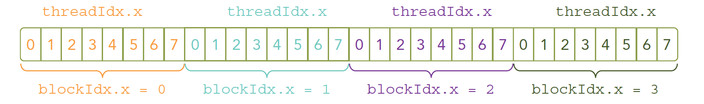

# CUDA 编程模型概述（二）

:::note

本文接着上一篇文章的内容介绍 CUDA 编程模型，关于核函数以及错误处理。

:::

## 核函数

核函数是运行在 GPU 上的代码,它在 CUDA 模型中以多线程的形式执行。我们用 NVCC 编译核函数,生成 GPU 可以执行的机器码。所以 CUDA 编程的核心就是编写核函数。我们首先要确保核函数能正确运行产生正确的结果,然后再进行各种优化,比如优化算法、调整内存和线程结构等。这些优化都要通过修改核函数代码来完成。CPU 是控制者,它启动核函数并让 GPU 去执行。接下来我们学习如何在 CPU 中启动一个核函数的执行。

想要编写一个核函数，大致分为三步，第一步是启动核函数，第二步是编写核函数，第三步是验证核函数。 下面我们分别介绍这三个步骤。

### 启动核函数

在 CPU 中启动核函数的执行，需要使用`<<<...>>>`语法。这个语法的作用是告诉编译器，我们要启动一个核函数的执行。`<<<...>>>`语法的具体形式如下：

```c
kernel_name<<<grid,block>>>(argument list);
```

其中`kernel_name`是核函数的名称，`grid`是一个`dim3`类型的变量，表示启动核函数的网格结构，`block`是一个`dim3`类型的变量，表示启动核函数的线程结构，`argument list`是核函数的参数列表。 

:::tip

在设备端访问 grid 和 block 属性的数据类型是 uint3 不能修改的常类型结构

:::

我们可以使用 dim3 类型的 grid 维度和 block 维度配置内核，也可以使用 int 类型的变量，或者常量直接初始化：

```c
kernel_name<<<4,8>>>(argument list);
```

上面这条指令的线程布局如图：

  

由于数据在全局内存中是线性存储的（基本市面上的内存硬件都是线性形式存储数据的），因此可以用变量 blockIdx.x 和 threadId.x 来进行以下操作。

1. 在网格中标识一个唯一的线程
2. 建立线程和数据元素之间的映射关系

:::tip

核函数是同时复制到多个线程执行的, 多个计算执行在一个数据，肯定是浪费时间，所以为了让多线程按照我们的意愿对应到不同的数据，就要给线程一个唯一的标识。 这样每个线程就可以根据自己的标识，去访问对应的数据了。

:::

grid 和 block 的选择对程序的速度也有很大的影响，`kernel_name<<<1, 32>>>` 和 `kernel_name<<<32, 1>>>`的执行效率是不一样的，因为前者是一个线程处理 32 个数据，后者是 32 个线程处理一个数据，显然后者的效率更高。

核函数启动的部分就是这样，还有一个需要注意的点是 “当主机启动了核函数，控制权马上回到主机，而不是主机等待设备完成核函数的运行” 。 

当然你也可以在主机端等待设备端的核函数执行完成，这样就需要使用`cudaDeviceSynchronize()`函数，这个函数会阻塞主机，直到设备端的核函数执行完成。

:::tip

所有 CUDA 核函数的启动都是异步的，这点与 C 语言是完全不同的

:::

### 编写核函数

会启动核函数后，我们就可以编写核函数了。核函数的形式如下：

```c
__global__ void kernel_name(argument list)
{
    // kernel body
}
```

和普通 C 语言函数不同核函数的定义前面有一个`__global__`修饰符，这个修饰符告诉编译器，这是一个核函数。且在设备端执行。除了`__global__` 之外还有 `__device__` 和 `__host__` 修饰符，`__device__` 修饰的函数只能在设备端执行，`__host__` 修饰的函数只能在主机端执行。如果不加修饰符，默认是 `__host__` 修饰符。

有些函数可以同时定义为 device 和 host ，这样的函数可以在主机端和设备端都执行。想要定义这样的函数，需要使用 `__host__ __device__` 修饰符。

:::tip

编写核函数的时候，需要注意以下几点：

1. 只能访问设备内存
2. 必须有 void 返回类型
3. 不支持可变数量的参数
4. 不支持静态变量
5. 显示异步行为

:::

**核函数编程例子：**

考虑一个简单的例子：将两个大小为 N 的向量 A 和 B 相加，主机端的向量加法的 C 代码如下:

```c
void add(int *a, int *b, int *c, int n)
{
    int i;
    for (i = 0; i < n; ++i)
        c[i] = a[i] + b[i];
}
```

我们可以将这个函数改写为核函数，如下：

```c
__global__ void add(int *a, int *b, int *c)
{
    int i = threadIdx.x;
    c[i] = a[i] + b[i];
}
```

为什么核函数不写循环呢？这是因为 for 循环里面的索引已经被线程索引替代了，每个线程都会执行一次循环体，这样就完成了向量的加法。

假设有一个大小为 N 的向量，我们可以使用 N 个线程来执行这个核函数，每个线程处理一个数据元素。这样就完成了向量的加法。

```c
add<<<1, N>>>(d_a, d_b, d_c);
```

### 验证核函数

在编写完核函数后，我们需要验证核函数是否正确，这里我们使用一个简单的例子来验证核函数的正确性。

```c
#include <stdio.h>
#include <stdlib.h>

void checkResult(int *hostRef, int *gpuRef, const int N)
{
    double epsilon = 1.0E-8;
    int match = 1;
    for (int i = 0; i < N; i++)
    {
        if (abs(hostRef[i] - gpuRef[i]) > epsilon)
        {
            match = 0;
            printf("Arrays do not match!\n");
            printf("host %5.2f gpu %5.2f at current %d\n", hostRef[i], gpuRef[i], i);
            break;
        }
    }
    if (match)
        printf("Arrays match.\n\n");
}
```

这个函数用来验证两个数组是否相等，如果不相等就打印出不相等的位置和值。其次，可以将执行参数设置为<<<1，1>>>，因此强制用一个块和一个线程执行核函数，这模拟了串行执行程序。这对于调试和验证结果
是否正确是非常有用的，而且，如果你遇到了运算次序的问题，这有助于你对比验证数值结果是否是按位精确的。

在开发阶段，每一步都进行验证是绝对高效的，比把所有功能都写好，然后进行测试这种过程效率高很多，同样写 CUDA 也是这样的每个代码小块都进行测试，看起来慢，实际会提高很多效率。

## 错误处理

很显然，写完代码只是第一步，还需要验证代码是否正确。由于核函数都是异步调用的，所以有时候很难确定错误发生的位置。定义一个错误处理宏封装所有的 CUDA API 调用，这简化了错误检查过程：

```c
#define CHECK(call)
{
    const cudaError_t error = call;
    if (error != cudaSuccess)
    {
        printf("Error: %s:%d, ", __FILE__, __LINE__);
        printf("code:%d, reason: %s\n", error, cudaGetErrorString(error));
        exit(1);
    }
}
```

这个宏定义了一个错误处理函数，如果 CUDA API 调用出错，就会打印出错的文件名，行号，错误代码和错误原因，然后退出程序。

你可以这样使用这个宏：

```c
CHECK(cudaMalloc((void **)&d_a, nBytes));
```


## 参考资料

1. [CUDA C++ Programming Guide](https://docs.nvidia.com/cuda/cuda-c-programming-guide/index.html)
2. [【CUDA 基础】2.0 CUDA 编程模型概述（二）](https://face2ai.com/CUDA-F-2-1-CUDA%E7%BC%96%E7%A8%8B%E6%A8%A1%E5%9E%8B%E6%A6%82%E8%BF%B02/)


