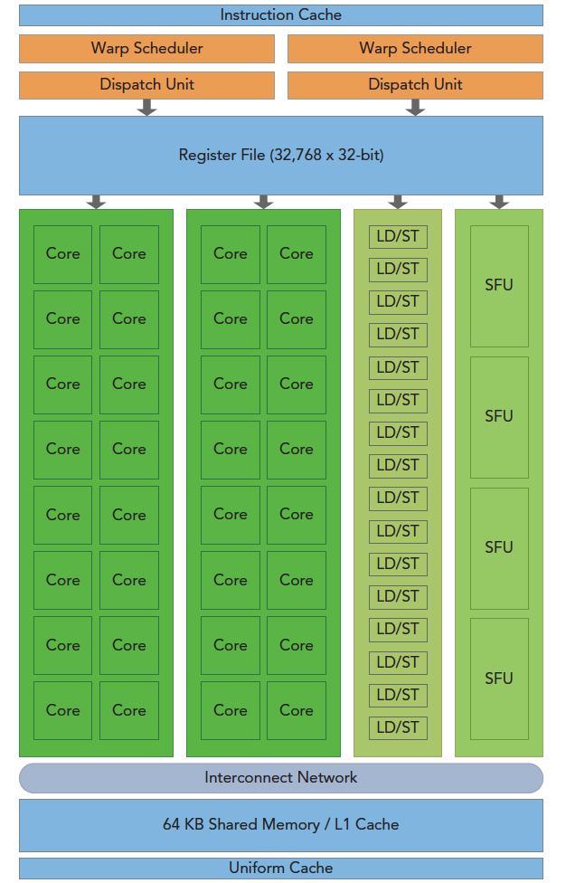
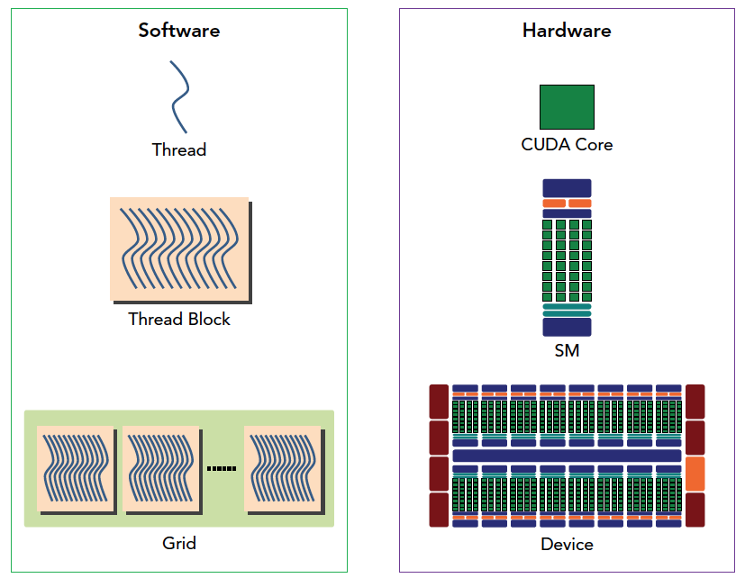
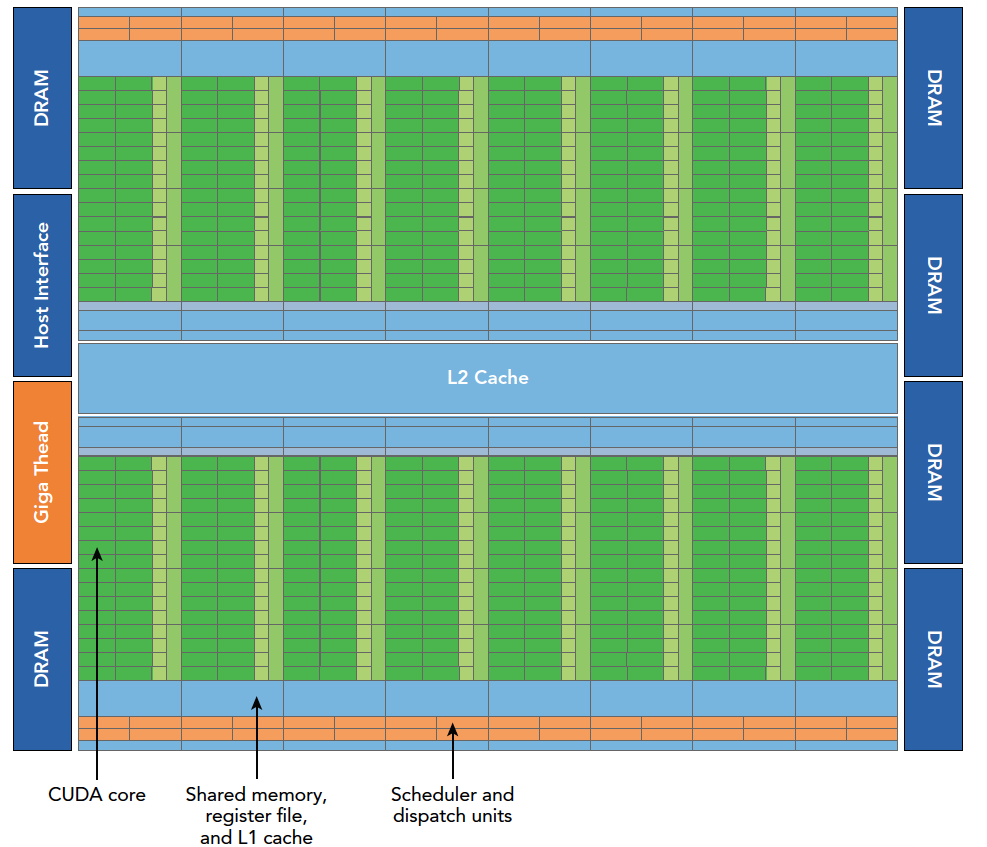
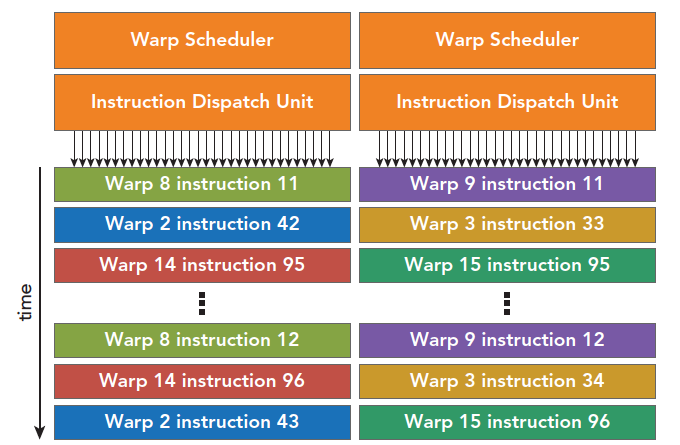
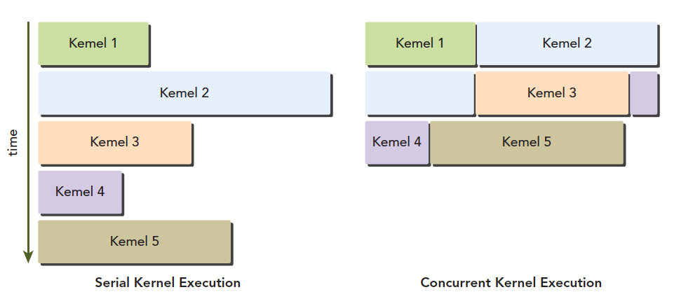

# CUDA执行模型概述

:::note

执行模型会提供一个操作视图，这个视图可以帮助我们理解CUDA程序的执行过程。CUDA 执行模型揭示了GPU并行架构的视图，根据这个视图我们可以分析线程的并发。

学习CUDA执行模型有助于我们沿着硬件设计的思路来编写CUDA程序，这样我们编写的CUDA程序才能够充分利用GPU的并行计算能力。

:::

## GPU 架构概述

:::tip

GPU架构是围绕一个流式多处理器（SM）的可扩展阵列搭建的。可以通过复制这种架构的构建块来实现GPU的硬件并行。

:::

下图说明了 `Fermi SM` 的关键组建：

  

上图中有如下的关键组件：

- CUDA核心 （对应图中的Core）
- 共享内存/一级缓存 （对应图中的Shared Memory/L1 Cache）
- 寄存器文件 （对应图中的Register File）
- 加载/存储单元 （对应图中的Load/Store Unit）
- 特殊功能单元 （对应图中的 SFU Special Function Unit）
- 线程束调度器 （对应图中的 Warp Scheduler）

:::tip

什么是Fermi SM ?

Fermi SM 是 NVIDIA 推出的第一个支持双精度浮点数的SM，它是由32个CUDA核心组成的，这些CUDA核心可以执行单精度浮点数和双精度浮点数的操作。Fermi SM 也是第一个支持CUDA C++的SM。除了 Fermi SM 之外，NVIDIA 还推出了 Kepler SM 和 Maxwell SM。

:::

### SM

流式多处理器（SM）是GPU的核心，每个SM都可以支持数百个线程的并发执行。可以把SM理解为GPU的一个计算单元，一个GPU中有很多个SM，所以GPU同时可以支持成百上千个线程的并发执行。

前面的文章中，我们学习了如何在GPU上执行一个向量加法程序，在声明核函数的时候我们需要指令每一个块中有多少个线程。多个线程块可能被分配到同一个SM中执行。

:::tip

当一个 block 被分配到一个 SM 中执行之后，他就只能在这个 SM 中执行了，不能再被分配到其他的 SM 中执行了。

:::

### 线程束

在分配给SM线程块之后，SM需要做一件事情就是把这些线程块划分到线程束里面，然后再在可用的硬件资源上进行调度执行。所谓线程束，顾名思义，就是很多线程组成的。CUDA采用单指令多线程（SIMT）架构来管理和执行线程，每32
个线程为一组，被称为线程束（warp）。线程束中的所有线程同时执行相同的指令。每个线程都有自己的指令地址计数器和寄存器状态，利用自身的数据执行当前的指令。

:::tip

一个线程束里面的线程执行的是同一条指令，但是每个线程执行的数据是不一样的。

:::

### SIMT架构与SIMD架构

SIMT 架构是指单指令多线程架构，SIMD 架构是指单指令多数据架构。SIMT 架构和 SIMD 架构的区别在于，SIMD 架构中的每个线程都是执行相同的指令，但是每个线程执行的数据是不一样的，而 SIMT 架构中的每个线程执行的是相同的指令，每个线程执行的数据也是相同的。

### 一个神奇的数字：32

前面我们说到一个线程束里面有32个线程，这个数字是怎么来的呢？这个数字是由GPU的硬件决定的，这个数字是GPU的硬件设计者根据GPU的硬件设计的时候决定的。

从概念上讲，它是SM用SIMD方式所同时处理的工作粒度。优化工作负载以适应线程束（一组有32个线程）的边界，一般这样会更有效地利用GPU计算资源。 同一个线程束可能是不饱满工作的，有的线程可以不执行指令。但是同一个线程束里面不执行指令的线程也不可以被用于执行其他指令。

### CUDA编程的组件与逻辑

CUDA程序通常由 host代码和 kernel代码组成。host代码在CPU上运行,负责Kernel的初始化,配置和调用。 kernel代码在GPU设备上运行,由并行执行的多个线程组成,实现实际的计算任务。一个kernel会被组织为一个grid,一个grid又由多个block组成。block中包含许多线程,这些线程可以通过共享内存进行通信和协作。不同block之间无法直接通信。

SM即流多处理器,是GPU硬件的基本计算单元。一个SM可以并行运行多个block中的线程。 在GPU上的流片多处理器(SM)中,共享内存和寄存器是非常重要的资源。它们在SM上的线程块之间共享,用于线程之间的合作和通信。

尽管线程块中的线程可以并行执行,但由于硬件资源限制,并非所有线程都能同时物理上运行。因此不同线程会以不同速度执行。

在并行线程间共享数据可能导致竞争状况,多个线程以未定义顺序访问同一数据,造成不可预测行为。CUDA提供了线程同步机制,确保在继续执行之前,所有线程达到同步点。但是,没有提供线程块间的同步。 CUDA提供了同步原语 `__syncthreads()`,用于同步一个block中的线程。

尽管线程块内的线程可以任意顺序调度,但活跃线程束数量受SM资源限制。当线程束闲置时(例如等待读取设备内存),SM可以从同一SM上的其他线程块调度可用线程束。线程束切换没有开销,因为硬件资源已预分配给SM上的所有线程块,最新调度的线程束状态已存于SM。

下图从逻辑角度和硬件角度描述了CUDA编程模型对应的组件：

  

## Fermi 架构

Fermi架构是NVIDIA推出的第一个完整的GPU计算架构,专门用于加速通用计算任务,而不是仅用于图形处理。

Fermi架构的主要特点包括:

- 包含512个CUDA核心,这是执行计算任务的处理器。每个核心都有整数单元和浮点单元。
- 512个核心组织为16个流多处理器(SM),每个SM有32个核心。
- 每个SM都有一级缓存、共享内存、寄存器等,用于线程间通信和数据共享。
- 16个SM共享一个768KB的二级缓存。
- PCIe接口连接CPU主机和GPU。
- GigaThread引擎用于将线程块分配给不同的SM。
- 每个SM可以同时运行2048个线程,实现大规模并行。
- 64KB的可配置共享内存/缓存,提高性能: 有利于芯片内数据的广泛重用，并大大降低了片外的通信量
- 支持并发运行多个kernel,更灵活。

Fermi架构专注GPU计算,通过更多 simpler的CUDA 核心,以及内存缓存层次结构,实现高效的通用并行计算。这些设计对CUDA编程很重要。下图展示了Fermi架构的主要组件:

  

其中 DRAM 是指显存，也就是 GPU 的内存。Host Inference 指的是主机端的推断，也就是主机端的代码。Giga Thread Engine 是指线程调度器，它负责把线程块分配到不同的 SM 中执行。

每个SM有两个线程束调度器，和两个指令调度单元，当一个线程块被指定给一个SM时，线程块内的所有线程被分成线程束，两个线程束选择其中两个线程束，在用指令调度器存储两个线程束要执行的指令。每16个CUDA核心为一个组，还有16个加载/存储单元或4个特殊功能单元。当某个线程块被分配到一个SM上的时候，会被分成多个线程束，线程束在SM上交替执行。下图展示了交替执行的过程：

  

上面曾经说过，每个线程束在同一时间执行同一指令，同一个块内的线程束互相切换是没有时间消耗的。Fermi上支持同时并发执行内核。并发执行内核允许执行一些小的内核程序来充分利用GPU，如图：

  

## Kepler 架构

Kepler架构是NVIDIA推出的第二代GPU计算架构,专门用于加速通用计算任务,而不是仅用于图形处理。Kepler 架构的主要特点包括:

- 强化的SM：Kepler的SM比Fermi的SM拥有更多的CUDA核心(192 vs 32)和更高的带宽。此外,Kepler引入了更多指令缓存,提高了指令重用率。这些改进提升了SM的计算能力和效率。
- 动态并行：Kepler可以通过增加或减少正在执行的线程的数量来动态调整并行粒度。这允许它适应不同的工作负载,提高资源利用率。
- Hyper-Q技术：Hyper-Q允许多个CPU核同时将任务提交到GPU执行队列,消除CPU和GPU之间的等待,从而提高吞吐量。以前的架构只允许一个CPU核访问GPU队列。
- 从内核中启动内核：帮助优化需要连续执行内核的CUDA应用,省去不必要的CPU-GPU同步开销。

## 参考资料

## 参考资料

1. [CUDA C编程权威指南](https://www.baidu.com/s?ie=utf-8&f=8&rsv_bp=1&rsv_idx=1&tn=baidu&wd=CUDA%20C%E7%BC%96%E7%A8%8B%E6%9D%83%E5%A8%81%E6%8C%87%E5%8D%97&fenlei=256&rsv_pq=0xfed4a61a000e3772&rsv_t=0d02lKS%2Blx%2BdvIVO447ej8nu1F1JZ2R2sUUEGNoSYLiNj3M8QV7s%2FscVGcDD&rqlang=en&rsv_enter=1&rsv_dl=tb&rsv_sug3=2&rsv_sug1=2&rsv_sug7=101&rsv_sug2=0&rsv_btype=i&prefixsug=%2526lt%253BUDA%2520%2526lt%253B%25E7%25BC%2596%25E7%25A8%258B%25E6%259D%2583%25E5%25A8%2581%25E6%258C%2587%25E5%258D%2597&rsp=9&inputT=4428&rsv_sug4=4428)
2. [【CUDA 基础】3.1 CUDA执行模型概述](https://face2ai.com/CUDA-F-3-1-CUDA%E6%89%A7%E8%A1%8C%E6%A8%A1%E5%9E%8B%E6%A6%82%E8%BF%B0/)

