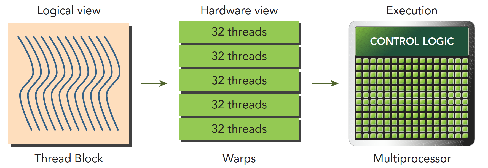
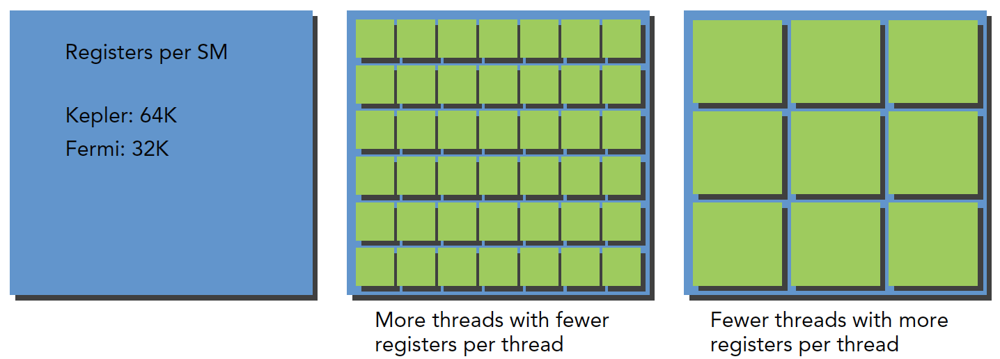
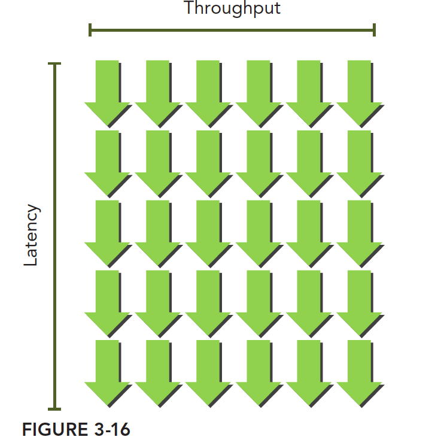

# 理解线程束执行的本质

:::note

从硬件的角度出发，启动内核的时候并不是所有的线程都会被同时执行，而是以线程束的方式执行的。上文中我们已经了解了线程束这个概念，本文中我们将会更加深入的了解线程束的执行原理。

:::


## 线程束与线程块

我们经常会看到线程块和线程束的表述，这两者之间有什么联系和区别呢？在上文中我们已经介绍了线程束是SM的基本执行单元。逻辑上我们认为GPU有多个计算网格，一个计算网格里面所有的线程就叫做一个线程块。在内核启动之后，线程块里的线程会被分配到某个SM上，然后在被分为多个线程束。下图可以很好的说明这个问题。

  

线程块是逻辑产物，也就是说在硬件里面这个概念的不存在的。内存是一维线性存在的。这样设计的好处是可以让我们的程序更加容易理解，比如有时候我们需要对一个图形进行操作，那么三维的线程块就会更加直接。

- 在每个线程块里面，每个线程都有自己的编号，这个编号是用 threadIdx.？ 来表示的。（？可以是xyz）
- 在每个线程块里面，每个线程块都有自己的编号，这个编号是用 blockIdx.？ 来表示的。（？可以是xyz）

前面的文章里面我们已经介绍过线性地址的转换工具，这里就不在详细介绍了。

## 线程束分化

在进行cuda编程的时候, 我们可以在核函数里面写if分支。我们知道一个线程束里面一共有32个线程，同一个线程束里面的线程都执行着相同的指令。也就是说同一时间线程束里面的线程要么执行if分支要么执行else分支。

不同的线程执行的数据是不一样的，同一时间线程束里面的线程执行的指令又要完全一样。这就导致在部分线程满足if分支的条件并执行if分支的时候，其他的线程就会被阻塞，这样就导致了线程束分化的问题。

线程束分化会导致GPU的利用率降低，所以我们在编写CUDA程序的时候要尽量避免线程束分化的问题。

下面是一个代码例子，我们可以通过这个例子来更好的理解线程束分化的问题。

```cpp
#include <stdio.h>
#include <cuda_runtime.h>

__global__ void mathKernel1(float *c)
{
	int tid = blockIdx.x* blockDim.x + threadIdx.x;

	float a = 0.0;
	float b = 0.0;
	if (tid % 2 == 0)
	{
		a = 100.0f;
	}
	else
	{
		b = 200.0f;
	}
	c[tid] = a + b;
}
```

这种情况下我们假设只配置一个x=64的一维线程块，那么只有两个个线程束，线程束内奇数线程（threadIdx.x为奇数）会执行else，偶数线程执行if，分化很严重。

但是如果我们换一种方法，得到相同但是错乱的结果C，这个顺序其实是无所谓的，因为我们可以后期调整。那么下面代码就会很高效

```cpp
__global__ void mathKernel2(float *c)
{
	int tid = blockIdx.x* blockDim.x + threadIdx.x;
	float a = 0.0;
	float b = 0.0;
	if ((tid/warpSize) % 2 == 0)
	{
		a = 100.0f;
	}
	else
	{
		b = 200.0f;
	}
	c[tid] = a + b;
}
```

第一个线程束内的线程编号tid从0到31，tid/warpSize都等于0，那么就都执行if语句。 第二个线程束内的线程编号tid从32到63，tid/warpSize都等于1，执行else分支。 这样就避免了线程束分化的问题。

:::tip

1. 当一个分化的线程采取不同的代码路径时，会产生线程束分化
2. 不同的if-then-else分支会连续执行
3. 尝试调整分支粒度以适应线程束大小的倍数，避免线程束分化
4. 不同的分化可以执行不同的代码且无须以牺牲性能为代价

:::

## 资源分配

在上面的例子中我们已经知道了线程束的执行原理，线程束在执行的时候主要会用到以下几个资源：

- 寄存器
- 程序计数器
- 共享内存

前面我们也说到过线程束是分配到SM上执行的，每个SM上有32位的寄存器。同时固定数量的共享内存用来在线程块中进行分配。显然，每个SM上可以运行的线程束是有限的。下图很好的说明了这个问题。

  

对于一个SM，每个线程所需要的寄存器数量越多，那么这个SM上可以运行的线程束就越少。同样的，每个线程所需要的共享内存越多，那么这个SM上可以运行的线程束就越少。**如果每个SM没有足够的寄存器或共享内存去处理至少一个块，那么内核将无法启动。**

## 活跃线程束

前面我们说到了资源的分配会影响到GPU的运行效率，我们应该让尽可能多的线程束处于活跃状态。

当计算资源被分配给一个线程块的时候，这个线程块就称为活跃的线程块。这个线程块所包含的线程束被叫做活跃线程束。也就是所活跃的线程束就是那些可以支配计算资源（寄存器、共享内存等）的线程束。活跃的线程束又可以分为三类，分别是：

1. 选定的线程束
2. 阻塞的线程束
3. 符合条件的线程束

SM中有一个组件是线程束调度器，这个组件的主要作用就是选择活跃线程束去执行运算。被选择且正在执行的线程束就叫做“选定的线程束”。被选择但是还没执行的线程束就叫做“阻塞的线程束”。如果同时满足以下两个条件则线程束符合执行条件。

1. 32个CUDA核心可用于执行
2. 当前指令中所有的参数都已就绪

:::tip

在CUDA编程中需要特别关注计算资源分配：计算资源限制了活跃的线程束的数量。因此必须了解由硬件产生的限制和内核用到的资源。为了最大程度地利用GPU，需要**最大化活跃的线程束数量。**

:::

## 隐藏延迟

隐藏延迟，简单来说就是当一个线程束中的某个线程在执行的时候，其他线程可以继续执行其他的指令。这样就可以隐藏一些延迟，提高GPU的利用率。我们不能把GPU用成CPU那样，同时只执行一个线程，这样会导致GPU的利用率很低。所谓的延迟产生的原因就是当一个计算任务在计算的时候，部分的线程束肯定会被用来计算。这部分的线程束也就是我们上面提到过的“阻塞的线程束”，无法再执行其他的指令。但是对于一个GPU来说，他是有很多个SM的，每个SM都有很多的线程束，所以在一个计算任务，任务1执行的时候，我们可以把其他的线程束用来执行其他的任务。这样任务1说产生的延迟就被隐藏了。我们可以直观的感受到，你对于“隐藏延迟”做的越好，GPU的利用率就越高。所以的任务来了之后，都有线程束可以执行，这样就可以最大化的利用GPU的计算资源。

隐藏延迟的核心目的就是**让GPU的计算资源最大化的利用**。对于指令的延迟可以分类两种：

- 算术延迟
- 内存延迟

算数指令延迟是一个算术操作从开始，到产生结果之间的时间，这个时间段内只有某些计算单元处于工作状态，而其他逻辑计算单元处于空闲。内存指令延迟很好理解，当产生内存访问的时候，计算单元要等数据从内存拿到寄存器，这个周期是非常长的。

下图就是阻塞线程束到可选线程束的过程逻辑图：

  

里面线程束0其实是有两格的时间处于等待状态，但是线程束0等待的时候，线程束2和线程束3完成了计算，这样就隐藏了延迟。

我们可以发现只要我们的线程束足够多，那么就可以隐藏更多的延迟。那么至少需要多少线程，线程束来保证最小化延迟呢？

利特尔法则（Little’s Law）可以提供一个合理的近似值：所需线程束=延迟×吞吐量

下图形象地说明了利特尔法则。假设在内核里一条指令的平均延迟是5个周期。为了保持在每个周期内执行6个线程束的吞吐量，则至少需要30个未完成的线程束。


  


对于算术运算来说，有两种可以提高并行度的方法：

- 指令级并行（ILP）：一个线程中有很多独立的指令
- 线程级并行（TLP）：很多并发地符合条件的线程

所谓指令级并行就是一个线程中有很多独立的指令，这些指令之间没有依赖关系，可以并行执行。线程级并行就是很多并发的线程，这些线程之间没有依赖关系，可以并行执行。我们可以通过这两种方法来提高并行度，从而提高GPU的利用率。

内存隐藏延迟是靠内存读取的并发操作来完成的，需要注意的是，指令隐藏的关键目的是使用全部的计算资源，而内存读取的延迟隐藏是为了使用全部的内存带宽

## 总结

本文主要介绍了线程束的执行原理，线程束的分化，资源分配，活跃线程束，隐藏延迟等等。这些知识点对于我们理解GPU的执行原理非常重要，也是我们编写CUDA程序的基础。


## 参考文章

1. [CUDA C编程权威指南](https://www.baidu.com/s?ie=utf-8&f=8&rsv_bp=1&rsv_idx=1&tn=baidu&wd=CUDA%20C%E7%BC%96%E7%A8%8B%E6%9D%83%E5%A8%81%E6%8C%87%E5%8D%97&fenlei=256&rsv_pq=0xfed4a61a000e3772&rsv_t=0d02lKS%2Blx%2BdvIVO447ej8nu1F1JZ2R2sUUEGNoSYLiNj3M8QV7s%2FscVGcDD&rqlang=en&rsv_enter=1&rsv_dl=tb&rsv_sug3=2&rsv_sug1=2&rsv_sug7=101&rsv_sug2=0&rsv_btype=i&prefixsug=%2526lt%253BUDA%2520%2526lt%253B%25E7%25BC%2596%25E7%25A8%258B%25E6%259D%2583%25E5%25A8%2581%25E6%258C%2587%25E5%258D%2597&rsp=9&inputT=4428&rsv_sug4=4428)
2. [【CUDA 基础】3.2 理解线程束执行的本质(Part I)](https://face2ai.com/CUDA-F-3-2-%E7%90%86%E8%A7%A3%E7%BA%BF%E7%A8%8B%E6%9D%9F%E6%89%A7%E8%A1%8C%E7%9A%84%E6%9C%AC%E8%B4%A8-P1/)
3. [【CUDA 基础】3.2 理解线程束执行的本质(Part II)](https://face2ai.com/CUDA-F-3-2-%E7%90%86%E8%A7%A3%E7%BA%BF%E7%A8%8B%E6%9D%9F%E6%89%A7%E8%A1%8C%E7%9A%84%E6%9C%AC%E8%B4%A8-P2/)


