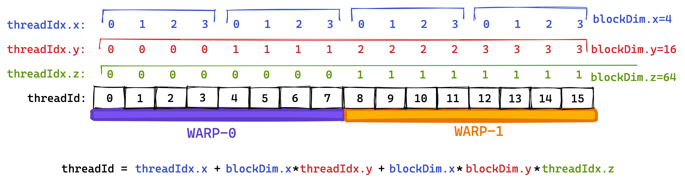
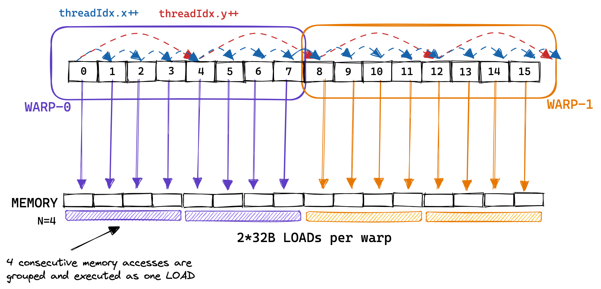
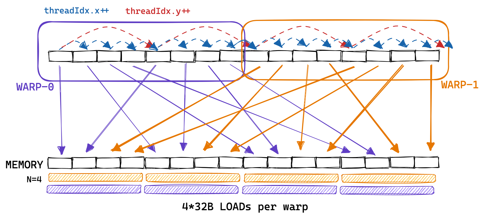
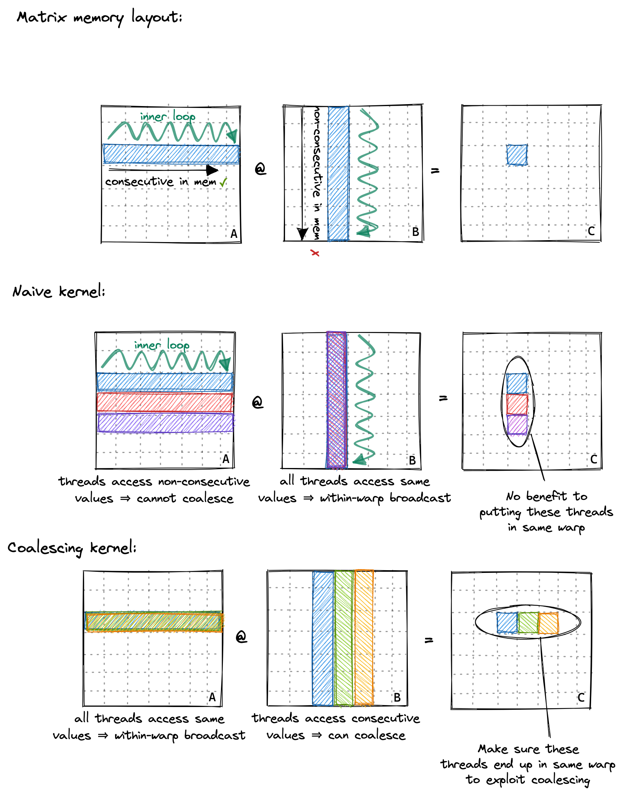

# 全局内存合并

在深入讨论全局内存合并之前，我们需要了解一下warp的概念。在执行过程中，一个块的线程被分组成所谓的warp，每个warp包含32个线程。然后，一个warp被分配给一个warp调度器，即执行指令的物理核心。

在Volta架构之前，所有warp的线程都来自同一个指令流。在分支操作中，没有采用分支的线程会通过所谓的活动掩码进行停用。然而，自从Volta以来，依赖这种“warp同步”行为已经不再是一个好主意，因为即使对于同一warp内的线程，不同分支的指令也可能交错执行。每个多处理器有四个warp调度器。warp的分组是基于连续的线程ID进行的。如果我们将blockDim设置为多维度，那么线程ID的计算如下：

```cpp
threadId = threadIdx.x+blockDim.x*(threadIdx.y+blockDim.y*threadIdx.z)
```


接着，具有相邻threadId的线程将成为同一warp的一部分。在下面的示例中，我试图使用较小的“warpsize”（实际warps始终包含32个线程）来进行说明。我喜欢将threadId的三个维度x、y、z看作是“列优先”的，因为第一个维度x在“warpspace”中是连续的。

  

第二个内核中，warp的概念变得非常重要，因为属于同一warp的线程进行的顺序内存访问可以被合并并作为一个整体执行。这就是所谓的全局内存合并。在优化内核的GMEM内存访问以实现峰值带宽时，这是需要牢记的。

下面是一个示例，展示了属于同一warp的线程进行的连续内存访问被合并在一起，使得每个warp只需进行2次32B加载就能执行8次内存访问：

  


在实际情况中，GPU支持32B、64B和128B的内存访问。因此，如果每个线程从全局内存加载一个32位的浮点数，warp调度器（可能是MIO）可以将这32*4B=128B的加载合并为一个事务。这仅在加载的浮点数在内存中是连续的，并且访问是对齐的情况下才可能发生。因此，在GPU上优化全局内存合并的方式与在CPU上优化缓存行利用有很多相似之处。

有趣的是，为了允许合并，warp内的线程必须访问连续的地址，但这些访问不必在warp内是连续的。如下图所示：如果它们不是连续的，或者由于其他原因无法合并访问，那么GPU将执行尽可能多的32B加载以获取所有浮点数，导致大量的带宽浪费。通过对我们的朴素内核进行分析，我们可以观察到非合并访问的有害效果，因为我们只能达到15GB/s的GMEM吞吐量。

  

回顾之前的内核，我们按以下方式为线程分配它们在矩阵C中的位置：

```cpp
const uint x = blockIdx.x * blockDim.x + threadIdx.x;
const uint y = blockIdx.y * blockDim.y + threadIdx.y;
```

因此，同一warp内的线程（即具有连续`threadIdx.x`的线程）从内存中非连续地加载矩阵A的行。朴素内核对A的内存访问模式看起来更像是：

  

为了实现内存合并，我们可以改变为线程分配结果矩阵C位置的方式。下面是对这种全局内存访问模式的改变进行的说明：

  

要实现这一点，我们只需更改前两行代码：

```cpp
const int x = blockIdx.x * BLOCKSIZE + (threadIdx.x / BLOCKSIZE);
const int y = blockIdx.y * BLOCKSIZE + (threadIdx.x % BLOCKSIZE);

if (x < M && y < N) {
  float tmp = 0.0;
  for (int i = 0; i < K; ++i) {
    tmp += A[x * K + i] * B[i * N + y];
  }
  C[x * N + y] = alpha * tmp + beta * C[x * N + y];
}
```

我们这样调用它：对我来说一开始并不明显，但启用GMEM协同并不会改变汇编代码，可以在Godbolt上查看SASS输出。协同访问是由硬件在内核运行时执行的。这是有道理的，因为协同访问要求对齐访问，在编译时无法保证，因为我们将矩阵指针作为函数参数传递。另外：汇编代码对我们的内部循环进行了部分展开，即使循环计数K在编译时是未知的。

```cpp
// gridDim保持不变
dim3 gridDim(CEIL_DIV(M, 32), CEIL_DIV(N, 32));
// 使blockDim成为1维，但不更改线程数
dim3 blockDim(32 * 32);
sgemm_coalescing<<<gridDim, blockDim>>>(M, N, K, alpha, A, B, beta, C);
```

全局内存协同将内存吞吐量从15GB/s提高到110GB/s。性能达到2000GFLOPS，与第一个简单内核的300GFLOPS相比有了很大的改进。对于下一个内核，我们将使用GPU的共享内存，来缓存将被重复使用的数据。

