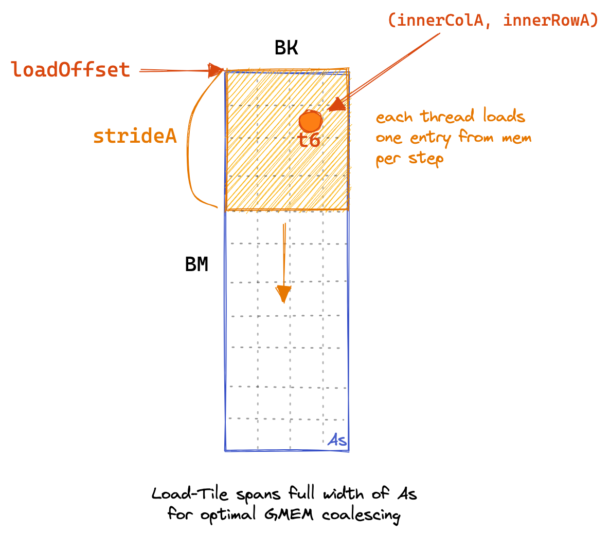
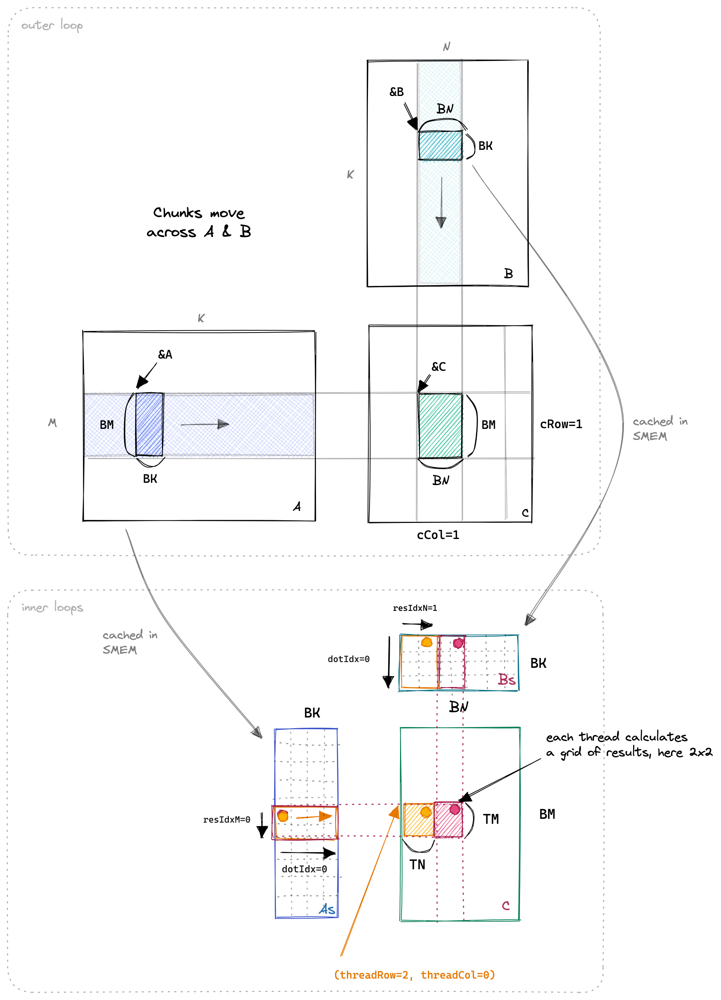
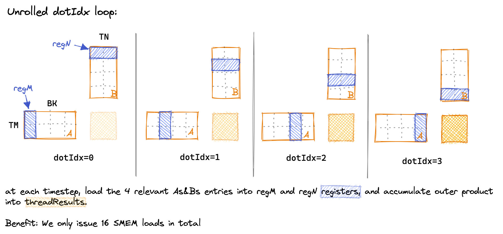

# 二维Thread Tile并行优化


第五个内核的核心思想是让每个线程计算一个8*8的C元素网格。在内核的第一阶段，所有线程协同工作，填充SMEM缓存。每个线程负责加载多个元素，具体代码如下，同时附有GMEM加载的图形示例：

```cpp
for (uint loadOffset = 0; loadOffset < BM; loadOffset += strideA) {
  As[(innerRowA + loadOffset) * BK + innerColA] =
      A[(innerRowA + loadOffset) * K + innerColA];
}
for (uint loadOffset = 0; loadOffset < BK; loadOffset += strideB) {
  Bs[(innerRowB + loadOffset) * BN + innerColB] =
      B[(innerRowB + loadOffset) * N + innerColB];
}
__syncthreads();
```

  


当SMEM缓存填充完毕后，每个线程负责将其相关的SMEM条目相乘，并将结果累加到本地寄存器中。下面展示了沿输入矩阵的外部循环，以及执行点积、TN和TM维度的三个内部循环。这个过程的可视化使得理解更加直观。

  

代码中的关键部分如下：

```cpp
// 为寄存器文件中的线程本地缓存分配空间
float threadResults[TM * TN] = {0.0};
// 为As和Bs的寄存器缓存分配空间
float regM[TM] = {0.0};
float regN[TN] = {0.0};

// 外层循环遍历
for (uint bkIdx = 0; bkIdx < K; bkIdx += BK) {
  // 填充SMEM缓存
  for (uint loadOffset = 0; loadOffset < BM; loadOffset += strideA) {
    As[(innerRowA + loadOffset) * BK + innerColA] =
        A[(innerRowA + loadOffset) * K + innerColA];
  }
  for (uint loadOffset = 0; loadOffset < BK; loadOffset += strideB) {
    Bs[(innerRowB + loadOffset) * BN + innerColB] =
        B[(innerRowB + loadOffset) * N + innerColB];
  }
  __syncthreads();

  A += BK;     // 向右移动BK列
  B += BK * N; // 向下移动BK行

  // 计算每个线程的结果
  for (uint dotIdx = 0; dotIdx < BK; ++dotIdx) {
    // 将相关的As和Bs条目加载到寄存器中
    for (uint i = 0; i < TM; ++i) {
      regM[i] = As[(threadRow * TM + i) * BK + dotIdx];
    }
    for (uint i = 0; i < TN; ++i) {
      regN[i] = Bs[dotIdx * BN + threadCol * TN + i];
    }
    // 在寄存器缓存上执行外积，累加到threadResults中
    for (uint resIdxM = 0; resIdxM < TM; ++resIdxM) {
      for (uint resIdxN = 0; resIdxN < TN; ++resIdxN) {
        threadResults[resIdxM * TN + resIdxN] +=
            regM[resIdxM] * regN[resIdxN];
      }
    }
  }
  __syncthreads();
}
```

在内部循环中，我们通过将 `dotIdx` 作为外层循环，明确加载我们在两个内部循环中所需的值到寄存器中，从而减少SMEM访问的次数。下面是对 `dotIdx` 循环随时间的可视化，展示了在每一步中哪些SMEM条目被加载到线程本地寄存器中：

  

（由于绘图需要，我不得不缩小一些维度，使其更容易绘制。在内核中：BK=TM=TN=8。）

最终的性能为：16TFLOPs，又有2倍的提升。让我们重复一下内存访问的计算。现在我们每个线程计算TM \* TN = 8 \* 8 = 64个结果。

- GMEM：K/8（外部循环迭代次数）\* 2（A+B） \* 1024/256（sizeSMEM / numThreads）加载
- SMEM：K/8（外部循环迭代次数）\* 8（dotIdx）\* 2（A+B）\* 8 加载

每个结果的内存访问：K/64 GMEM，K/4 SMEM

性能逐渐达到可接受水平，然而，由于内存管道拥塞而导致的warp停滞仍然太频繁。对于第六个内核，我们将采取两项措施来尝试改善这一点：将`As`进行转置以启用SMEM加载的自动向量化，并向编译器承诺GMEM访问的对齐。

## 参考文献

1. https://siboehm.com/articles/22/CUDA-MMM