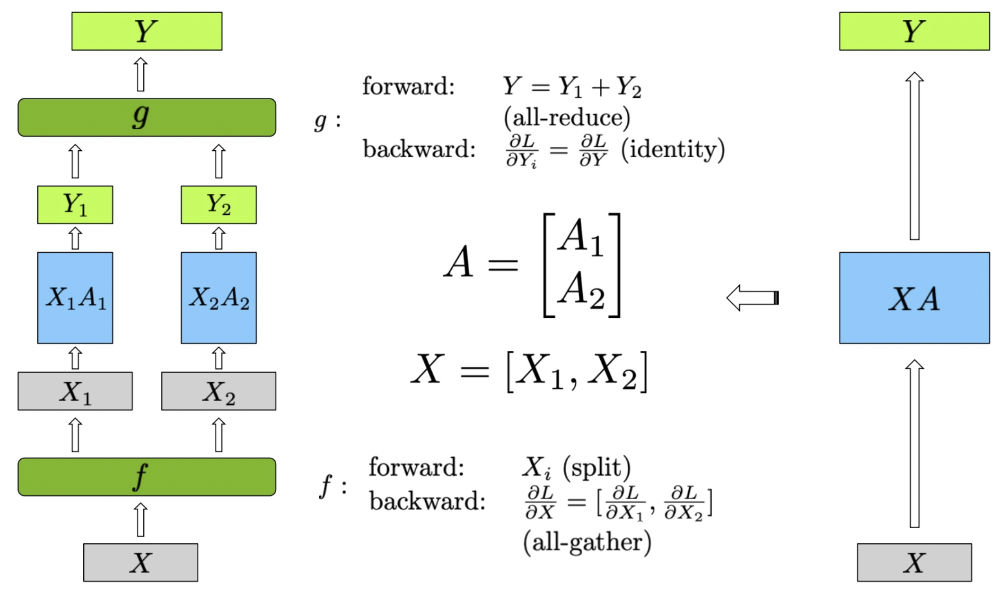
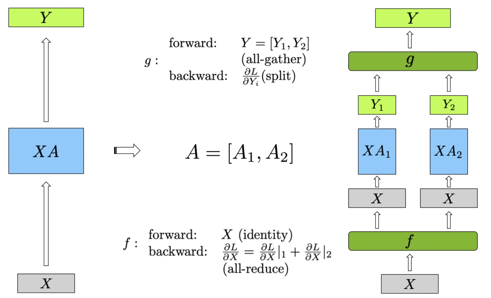
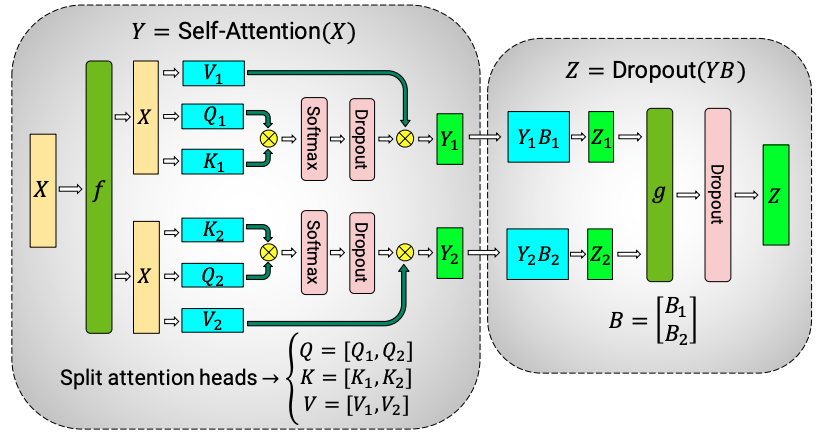
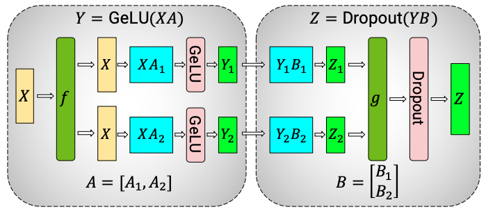

# 张量并行的实现细节

在上一篇文章中，我们深入讨论了 Megatron-LM 中分布式训练环境的初始化，`initialize_megatron()` 如何配置分布式进程组，以及 mpu 模块的结构与职责。

在这一篇文章中，我们将聚焦到张量并行的实现细节上。在 Megatron-LM 中，张量并行的核心在于将线性层的权重和计算任务切分到多个 GPU 上，并通过合理的通信机制完成计算结果的聚合。但这里面的细节并不简单。我们可以带着以下问题，阅读本篇文章：

1. 权重矩阵是如何拆分并分布到多个 GPU 上的？
2. 在前向传播和反向传播中，每个 GPU 的局部计算是如何进行的？
3. 不同 GPU 如何在反向传播时汇总梯度，并确保权重更新正确？

要回答这些问题，我们需要重点分析 Megatron-LM 中的几个关键类和模块，比如：

1. `VocabParallelEmbedding`：如何将嵌入矩阵拆分到多个 GPU。
2. `ColumnParallelLinear` 和 `RowParallelLinear`：如何实现线性层的并行化
3. 反向传播中的张量切分与通信策略

:::note

本系列文章还是聚焦在 Megatron-LM 的源码阅读上，阅读本文之前需要先了解什么是张量并行。如果你对张量并行的概念还不太了解，可以先阅读 [Megatron-LM 论文阅读](https://space.keter.top/docs/high_performance/%E5%88%86%E5%B8%83%E5%BC%8F%E8%AE%AD%E7%BB%83%E8%AE%BA%E6%96%87%E7%AC%94%E8%AE%B0/Megatron-LM)。

:::

## 1. 张量并行中的核心概念

### 1.1. 张量并行是如何工作的


在理解张量并行之前，我们需要先回到线性层的本质：**线性变换就是用一个权重矩阵 $W$ 乘以输入张量 $X$**。在大规模模型中，这个矩阵通常大到难以装进单个 GPU 的显存，于是张量并行的核心目标就变成了：**如何合理拆分矩阵计算，既能减少显存占用，又能并行计算高效**。


在 Megatron-LM 中，线性层的矩阵切分主要有两种策略：

1. **按列切分（Column-wise Partitioning）**  
2. **按行切分（Row-wise Partitioning）**

要理解这两种切分方式，我们先假设一个简单的线性层：

$$
Y = X \times W
$$

其中：

- $X$ 是输入张量，形状为 $(B, D_{\text{in}})$。
- $W$ 是权重矩阵，形状为 $(D_{\text{in}}, D_{\text{out}})$。
- $Y$ 是输出张量，形状为 $(B, D_{\text{out}})$。


**1、 按列切分：Column-wise Partitioning**  

在按列切分中，我们将**权重矩阵 $W$ 按列切分**，即将输出维度 $D_{\text{out}}$ 切分成多个子矩阵：

$$
W = [W_1 \mid W_2 \mid W_3 \mid \dots \mid W_k]
$$

其中，每个子矩阵 $W_i$ 的形状是 $(D_{\text{in}}, D_{\text{out}} / k)$，这里的 $k$ 是参与张量并行的 GPU 数量。

切分后的前向传播逻辑：
- 每个 GPU $i$ 只负责计算 $X \times W_i$，输出 $Y_i$。
- 最终通过 **AllReduce** 操作，将所有 $Y_i$ 汇总，得到最终的输出。

在 Megatron-LM 中，`ColumnParallelLinear` 正是用这种策略实现的。它的适用场景是**需要在输出维度上进行大规模扩展的线性层**，比如 GPT 模型中的全连接层。

**前向传播伪代码（`ColumnParallelLinear`）：**

```python
# 1. 本地子矩阵乘法
Y_local = torch.matmul(X, W_local)  # 每个 GPU 执行局部计算
# 2. AllReduce 汇总所有 GPU 的输出
Y_global = torch.distributed.all_reduce(Y_local, op=torch.distributed.ReduceOp.SUM)
```

因为不同 GPU 计算的 $Y_i$ 只是全局输出 $Y$ 的一部分，通过 **AllReduce** 汇总，才能得到完整的输出。这种方式有效地**减小了单个 GPU 的显存负担，但付出的代价是需要在计算完成后进行通信**。


**2、 按行切分：Row-wise Partitioning**  

相比于按列切分，**按行切分更适合处理输入维度较大的场景**。在这种策略中，我们将权重矩阵 $W$ **按行切分**：

$$
W = \begin{bmatrix}
    W_1 \\
    W_2 \\
    W_3 \\
    \vdots \\
    W_k
\end{bmatrix}
$$

每个子矩阵 $W_i$ 的形状为 $(D_{\text{in}} / k, D_{\text{out}})$。在前向传播中，输入张量 $X$ 也会被相应地按行切分，分别输入到对应的子矩阵中：

$$
X = \begin{bmatrix}
    X_1 \\
    X_2 \\
    X_3 \\
    \vdots \\
    X_k
\end{bmatrix}
$$

**前向传播伪代码（`RowParallelLinear`）：**

```python
# 1. 每个 GPU 只计算局部的子矩阵乘法
Y_local = torch.matmul(X_local, W)
# 2. AllGather 汇总所有 GPU 的局部输出
Y_global = torch.distributed.all_gather(Y_local)
```

在按行切分中，每个 GPU 只计算了全局输出的一部分，因此需要通过 **AllGather** 收集所有 GPU 的局部结果，才能拼接出完整的输出。

## 1.2. 前反向传播中的张量切分

在下图中，展示了行并行（Row Parallel）线性层的实现方法。为了更好地理解图中的内容，我们首先定义公式中的变量：

- $X$：输入矩阵
- $X_i$：输入矩阵 $X$ 的分块部分，其中 $i$ 表示分块的索引
- $A$：权重矩阵
- $A_i$：权重矩阵 $A$ 的分块部分
- $Y$：输出矩阵
- $Y_i$：中间输出矩阵，由 $X_i$ 和 $A_i$ 的乘积得到

图中的行并行（Row Parallel）线性层的具体实现步骤如下：

输入矩阵 $X$ 首先被分割成两个子矩阵 $X_1$ 和 $X_2$。这种分割是在行方向上进行，使得每个设备处理输入数据的不同部分。形式化地表示为 $X = [X_1, X_2]$。权重矩阵 $A$ 也被分割成两个子矩阵 $A_1$ 和 $A_2$，这种分割同样在行方向上进行，即 $A = [A_1; A_2]$。

每个分割的输入矩阵分别与对应的权重矩阵进行矩阵乘法计算，得到中间输出 $Y_1$ 和 $Y_2$：

$$ 
Y_1 = X_1 A_1 
$$ 

$$ 
Y_2 = X_2 A_2 
$$

最终的输出 $Y$ 是 $Y_1$ 和 $Y_2$ 的和，通过 all-reduce 实现：

$$ 
Y = Y_1 + Y_2 
$$

在前向传播中，首先将输入矩阵 $X$ 分割为 $X_1$ 和 $X_2$。分别计算 $X_1 A_1$ 和 $X_2 A_2$，得到 $Y_1$ 和 $Y_2$。然后通过 all-reduce 将 $Y_1$ 和 $Y_2$ 相加，得到最终输出 $Y$。在反向传播中，梯度 $\frac{\partial L}{\partial Y}$ 被分割为 $\frac{\partial L}{\partial Y_1}$ 和 $\frac{\partial L}{\partial Y_2}$ ，由于 all-reduce 的特性，这些梯度是相同的。每个设备分别计算自己的梯度 $\frac{\partial L}{\partial X_i}$ ，最后通过 all-gather，将梯度 $\frac{\partial L}{\partial X_i}$ 聚合，得到完整的梯度 $\frac{\partial L}{\partial X}$。

:::note

反向传播的核心在于梯度传播。为了确保模型权重在每个设备上都能正确更新，**所有设备上计算出的输入梯度 $\frac{\partial L}{\partial X_i}$ 必须基于相同的全局输出梯度 $\frac{\partial L}{\partial Y}$**。

:::




在列并行的线性层中，权重矩阵 $A$ 被分割成两个子矩阵 $A_1$ 和 $A_2$，这种分割在列方向上进行，即  $A = [A_1, A_2]$ 。输入矩阵 $X$ 保持不变，然后分别与两个子矩阵 $A_1$ 和 $A_2$ 进行矩阵乘法计算，得到中间输出 $Y_1$ 和 $Y_2$：

$$
Y_1 = X A_1
$$

$$
Y_2 = X A_2
$$

最终的输出 $Y$ 是 $Y_1$ 和 $Y_2$ 的组合，通过 all-gather 实现：

$$
Y = [Y_1, Y_2]
$$

在前向传播中，计算步骤如下：输入矩阵 $X$ 保持不变，分别计算 $X A_1$ 和 $X A_2$，得到 $Y_1$ 和 $Y_2$。然后通过 all-reduce 操作将 $Y_1$ 和 $Y_2$ 组合，得到最终输出 $Y$。

在反向传播中，梯度传播的步骤如下：梯度 $\frac{\partial L}{\partial Y}$ 被分割为 $\frac{\partial L}{\partial Y_1}$ 和 $\frac{\partial L}{\partial Y_2}$ ，然后分别传递给对应的子矩阵部分。由于全收集操作的特性，反向传播中的梯度计算如下：每个设备分别计算自己的梯度 $\frac{\partial L}{\partial X_i}$，并通过 all-reduce，将梯度 $\frac{\partial L}{\partial X_i}$ 聚合，得到完整的梯度 $\frac{\partial L}{\partial X}$ 。

  

## 2. Transformer 架构的模型如何做张量并行

一个典型的 Transformer（如 GPT）通常包含以下关键模块：

1. 输入嵌入层（Embedding 或 VocabParallelEmbedding）
2. 多头自注意力（Multi-Head Attention, MHA）
3. 前馈网络（MLP），往往有两层线性层加一个非线性激活函数（如 GeLU）
4. 层归一化（LayerNorm）、残差连接（Residual Add）等辅助操作

当我们想在 Transformer 中应用张量并行时，需要回答几个问题：

1. 多头注意力中的 Q，K，V 矩阵是否应该拆分到不同 GPU？拆分维度是多少？
2. MLP 的两个线性层如何切分权重？为什么第一层多用列切分、第二层适合行切分？
3. 残差连接与非线性激活是否会影响行/列切分的拼接方式？

回答这些问题之后，我们才能理解为什么在 GPT 模型中，某些层使用 `ColumnParallelLinear`，而另外一些场景使用 `RowParallelLinear`，以及嵌入层使用 `VocabParallelEmbedding`。

### 2.1. 自注意力（Multi-Head Attention）模块的并行策略

自注意力层的核心计算是：

$$
Q = XW^Q \\ K = XW^K \\ V = XW^V \\
\quad \text{Attention}(Q,K,V) = \text{softmax}\!\Bigl(\tfrac{QK^T}{\sqrt{d_k}}\Bigr)V
$$

在 GPT 模型中，通常将 $W^Q, W^K, W^V$ **沿着列维度（输出维度）进行切分**。每个 GPU 负责计算不同头的 Q/K/V 部分。如下图所示，每个头的计算是并行的，最终通过拼接或 All-Gather 汇总：

**列切分的原因**：切分输出维度可以轻松将多头注意力拆分到不同的 GPU 上，每个 GPU 只负责一部分计算，后续通过简单拼接即可得到完整的多头输出。

**行切分会带来的问题：** 如果对输入维度进行切分，则计算 Q/K/V 后需要先将所有部分拼接起来，才能进行 $\text{softmax}(QK^T)$。这样会带来过多的通信开销。因此，列切分在多头注意力中更高效。

  

### 2.2. MLP 的两个线性层如何切分权重

接下来我们要解答的问题是：**MLP 的两个线性层如何切分权重？为什么第一层多用列切分，第二层适合行切分？ **。


一个典型的 MLP 包含两层线性层：

$$
Y = \text{GeLU}(XW^{(1)}), \quad Z = YW^{(2)}
$$

第一层线性 $X \times W^{(1)}$ ，将权重 $W^{(1)}$ 沿输出维度切分，每个 GPU 只计算局部输出。切分后的输出通过 All-Reduce 汇总，便于在全局上做激活函数（如 GeLU）。因为 GeLU 是非线性的，如果输出 $XW^{(1)}$ 没有汇总就直接激活，会导致最终结果错误。

第二层没有非线性激活的阻碍，可以将输入维度切分到不同的 GPU 上，减少通信开销。最后用 All-Gather 拼接成完整的输出即可。

  


### 2.3. 残差连接与非线性激活如何影响行/列切分

**残差连接**（$X + f(X)$）是逐元素加法，不依赖行或列的具体切分方式。无论是列切分还是行切分，在拼接成完整输出后，都可以直接进行残差计算。

**LayerNorm** 是对通道维度做归一化，因此不需要特殊的行/列切分。只需要在拼接完成后做归一化即可。

## 3. 张量并行中权重的分布与初始化

在上一节，我们讨论了 Transformer 架构的各个模块如何做张量并行。这里，我们聚焦到具体实现层面，看看 GPT 模型在 Megatron-LM 中如何实现权重的分布和初始化。

GPT 模型的组网代码位于 `megatron/core/models/gpt/gpt_model.py` 中，其网络结构大致分为以下几部分：

- Embedding 层：利用 `VocabParallelEmbedding` 将输入 token 映射到隐藏向量空间
- Transformer 编码器：由多层 `TransformerBlock` 组成，包含多头注意力机制和前馈网络
- 输出层：使用 `ColumnParallelLinear` 将隐藏状态转换为词汇表概率分布

核心代码如下，省略了其他细节：

```python
class GPTModel(LanguageModule):
    ...
    def __init__(self, config, transformer_layer_spec, vocab_size, ...):
        super().__init__(config=config)
        # 1. Embedding层
        self.embedding = LanguageModelEmbedding(
            config=self.config,
            vocab_size=vocab_size,
            ...
        )
        # 2. Transformer解码器
        self.decoder = TransformerBlock(
            config=self.config, spec=transformer_layer_spec, ...
        )
        # 3. 输出层
        self.output_layer = ColumnParallelLinear(
            config.hidden_size,
            self.vocab_size,
            config=config,
            ...
        )
    ...
```

其中，“张量并行” 集中体现在以下文件中的类，`megatron/core/tensor_parallel/layers.py`：

1. `VocabParallelEmbedding`（行切分词汇表维度）
2. `ColumnParallelLinear`（列切分输出维度）
3. `RowParallelLinear`（行切分输入维度）

这些类在权重初始化和前后向传播中，都显式地考虑了“张量并行进程组”以及“如何切分矩阵到多个 GPU”两件事。 `ParallelAttention` 也是组合 `ColumnParallelLinear` 和 `RowParallelLinear` 实现的。

让我们以 `ColumnParallelLinear` 为例，看看它的构造函数是如何执行 “列切分 + 初始化” 的。

```python
class ColumnParallelLinear(torch.nn.Module):
    def __init__(self, input_size, output_size, *, config: ModelParallelConfig, init_method, ...):
        super().__init__()
        ...
        world_size = get_tensor_model_parallel_world_size()
        # 1. 列切分 - 每个 GPU 拆分 output_size
        self.output_size_per_partition = divide(output_size, world_size)

        # 2. 在本 GPU 上分配该段权重的空间
        self.weight = Parameter(
            torch.empty(
                self.output_size_per_partition, 
                input_size,
                device=torch.cuda.current_device(),
                dtype=config.params_dtype,
            )
        )
        # 3. 调用初始化函数
        if config.perform_initialization:
            _initialize_affine_weight_gpu(self.weight, init_method, partition_dim=0, ...)
        ...
```

代码中，`self.output_size_per_partition` 表示当前 GPU 需要存储的列数，每个 GPU 只存储它负责的部分权重。类似地，在 `RowParallelLinear` 中，只需将 `partition_dim` 改为 1，即可实现行切分。而在 `VocabParallelEmbedding` 中，则是通过计算 `[vocab_start_index, vocab_end_index)` 来确定每个 GPU 负责的词向量行范围。

其实核心的思想还是：**将权重矩阵切分到多个 GPU 上，每个 GPU 只负责一部分权重的计算和存储**。所以我们在初始化权重时，也需要考虑到这一点，确保每个 GPU 上的权重 “切分” 是正确的。

## 4. 前反向传播的实现

前向传播的核心思想是将权重矩阵合理切分到多个 GPU 上，让每个 GPU 只负责一部分局部计算，然后通过通信机制拼接或汇总得到全局结果。在这里，我们以 `ColumnParallelLinear` 和 `RowParallelLinear` 为例，详细解析矩阵列切分与行切分的实现。

### 4.1. ColumnParallelLinear 的前反向传播

话不多少，让我们直接看 `ColumnParallelLinear` 的前向传播代码：

```python
def forward(self, input_: torch.Tensor):
    # Step 1: 每个 GPU 只计算局部输出 Y_i = X × W_i
    output_parallel = torch.matmul(input_, self.weight.T)

    # Step 2: 如果需要全局输出，则使用 All-Gather 汇总各 GPU 的 Y_i
    if self.gather_output:
        output = gather_from_tensor_model_parallel_region(output_parallel)
    else:
        output = output_parallel

    return output
```


在 `ColumnParallelLinear` 的前向传播中，如果设置了 `gather_output=True`，局部输出 $Y_i = X \times W_i$ 会被拼接成完整的输出 $Y = [Y_1, Y_2, ..., Y_k]$。这就是 `gather_from_tensor_model_parallel_region` 的主要作用：在前向传播中，将所有 GPU 的局部输出沿着最后一个维度拼接成全局结果。

```python
def gather_from_tensor_model_parallel_region(input_):
    """Wrapper for autograd function: forward: AG, backward: split <last dim>"""
    return _GatherFromModelParallelRegion.apply(input_)
```

这段代码是一个包装函数，调用了 `_GatherFromModelParallelRegion` 类。我们接下来看看这个类是如何工作的。


**1、前向传播：`_gather_along_last_dim`**

```python
class _GatherFromModelParallelRegion(torch.autograd.Function):
    """Gather the input from model parallel region and concatenate."""

    @staticmethod
    def forward(ctx, input_):
        """Forward function."""
        return _gather_along_last_dim(input_)
```

前向传播调用 `_gather_along_last_dim` 函数：

```python
def _gather_along_last_dim(input_):
    """Gather tensors and concatenate along the last dimension."""

    world_size = get_tensor_model_parallel_world_size()

    # 如果只有 1 个 GPU，直接返回
    if world_size == 1:
        return input_

    # 计算新的张量尺寸
    dim_size = list(input_.size())
    dim_size[0] = dim_size[0] * world_size  # 假设按批次维度进行拼接

    # 创建输出张量
    output = torch.empty(dim_size, dtype=input_.dtype, device=torch.cuda.current_device())

    # 使用 all_gather 将所有 GPU 的局部输出拼接起来
    torch.distributed.all_gather_into_tensor(
        output, input_.contiguous(), group=get_tensor_model_parallel_group()
    )

    # 沿最后一维拼接
    tensor_list = output.chunk(world_size, dim=0)
    output = torch.cat(tensor_list, dim=-1).contiguous()

    return output
```

**执行流程：**

1. **初始化输出张量**：计算出拼接后的张量大小 `dim_size`。
2. **使用 All-Gather 收集局部结果**：调用 `torch.distributed.all_gather_into_tensor` 从各个 GPU 上收集局部结果。
3. **拼接结果**：将收集到的局部结果沿着最后一维拼接成完整的输出。

假设有两个 GPU，局部输出分别是：

- GPU 0: $Y_0$ 形状为 $(B, D/2)$
- GPU 1: $Y_1$ 形状为 $(B, D/2)$

拼接后的全局输出：

$$
Y = [Y_0, Y_1] \quad \text{形状为 } (B, D)
$$

**2、反向传播：`_split_along_last_dim`**

反向传播中，每个 GPU 只需要计算自己负责的部分权重的梯度，因此需要将全局梯度分割成局部梯度。`_GatherFromModelParallelRegion` 类的反向传播调用了 `_split_along_last_dim`：

```python
@staticmethod
def backward(ctx, grad_output):
    """Backward function."""
    return _split_along_last_dim(grad_output)
```

```python
def _split_along_last_dim(input_):
    """Split the tensor along its last dimension and keep the corresponding slice."""

    world_size = get_tensor_model_parallel_world_size()

    # 如果只有 1 个 GPU，直接返回
    if world_size == 1:
        return input_

    # 将全局张量沿着最后一维拆分为多个局部张量
    input_list = split_tensor_along_last_dim(input_, world_size)

    # 只保留当前 GPU 对应的部分
    rank = get_tensor_model_parallel_rank()
    output = input_list[rank].contiguous()

    return output

def split_tensor_along_last_dim(
    tensor: torch.Tensor, num_partitions: int, contiguous_split_chunks: bool = False
) -> List[torch.Tensor]:
    # Get the size and dimension.
    last_dim = tensor.dim() - 1
    last_dim_size = divide(tensor.size()[last_dim], num_partitions)
    # Split.
    tensor_list = torch.split(tensor, last_dim_size, dim=last_dim)
    # Note: torch.split does not create contiguous tensors by default.
    if contiguous_split_chunks:
        return tuple(chunk.contiguous() for chunk in tensor_list)

    return tensor_list
```

1. **全局张量分割**：使用 `split_tensor_along_last_dim` 函数将全局梯度张量沿着最后一个维度切分成多个子张量，每个子张量对应一个 GPU。
2. **选择局部子张量**：每个 GPU 只保留与自己对应的子张量。

例子：假设全局梯度张量的形状为 $(B, D)$，其中 $D$ 被分割到两个 GPU 上：

- GPU 0 需要计算 $W_0$ 对应的局部梯度，保留前 $D/2$ 列。
- GPU 1 需要计算 $W_1$ 对应的局部梯度，保留后 $D/2$ 列。

### 4.2. RowParallelLinear 的前反向传播

`RowParallelLinear` 的前向传播与 `ColumnParallelLinear` 类似，只是在计算局部输出时，是将输入张量 $X$ 按行切分，然后与权重矩阵 $W$ 相乘。在反向传播中，同样需要将全局梯度张量沿着最后一个维度切分成多个子张量，每个子张量对应一个 GPU。

我们先来看 `RowParallelLinear` 的前向传播代码：

```python
def forward(self, input_: torch.Tensor):
    # Step 1: 如果输入没有预先切分，则先按行划分
    if not self.input_is_parallel:
        input_parallel = scatter_to_tensor_model_parallel_region(input_)
    else:
        input_parallel = input_

    # Step 2: 计算局部结果 Y_i = X_i × W_i
    output_parallel = torch.matmul(input_parallel, self.weight.T)

    # Step 3: 汇总局部结果
    output = reduce_from_tensor_model_parallel_region(output_parallel)

    return output
```

在前向传播中，如果输入张量 $X$ 没有预先切分，会先调用 `scatter_to_tensor_model_parallel_region` 函数将输入张量按行切分。然后计算局部输出 $Y_i = X_i \times W_i$，最后通过 `reduce_from_tensor_model_parallel_region` 汇总局部结果。

```python
def reduce_from_tensor_model_parallel_region(input_):
    """Wrapper for autograd function: forward: all reduce, backward copy"""
    return _ReduceFromModelParallelRegion.apply(input_)
```

`reduce_from_tensor_model_parallel_region` 函数调用了 `_ReduceFromModelParallelRegion` 类，我们接下来看看这个类是如何工作的。

**1、前向传播：`_reduce`**

```python
class _ReduceFromModelParallelRegion(torch.autograd.Function):
    """All-reduce the input from the model parallel region."""
    @staticmethod
    def forward(ctx, input_):
        """Forward function."""
        return _reduce(input_)
```

前向传播调用 `_reduce` 函数：

```python
def _reduce(input_):
    """All-reduce the input tensor across model parallel group."""

    # Bypass the function if we are using only 1 GPU.
    if get_tensor_model_parallel_world_size() == 1:
        return input_

    # All-reduce.
    torch.distributed.all_reduce(input_.contiguous(), group=get_tensor_model_parallel_group())

    return input_
```

就是简单的调用 `torch.distributed.all_reduce` 函数，将局部输出 $Y_i$ 汇总到全局输出 $Y$。

**2、反向传播**

```python
    @staticmethod
    def backward(ctx, grad_output):
        """Backward function."""
        return grad_output
```

反向传播中，直接返回梯度张量 `grad_output`。这里没有额外的梯度计算，因为在前向传播中，每个 GPU 只计算了全局输出的一部分，因此在反向传播中，只需要将梯度张量传递给对应的 GPU 即可。

## 5. 张量并行下嵌入层的特殊处理

在大规模语言模型（如 GPT）中，词汇表往往非常庞大，比如 GPT-3 的词汇表大小可以达到 50,000 甚至更多。为了适应大规模训练，Megatron-LM 对嵌入层进行了张量并行优化。

### 5.1. 如何在不同 GPU 上分布词汇表

在 Megatron-LM 中，嵌入矩阵 $W$ 按行切分，即每个 GPU 存储部分词汇表对应的嵌入权重。假设总词汇表大小为 $V$，有 $k$ 个 GPU，则每个 GPU 负责的嵌入矩阵大小为：

$$
\text{local\_vocab\_size} = \frac{V}{k}
$$

不同 GPU 上的嵌入矩阵索引范围如下：

$$
\text{GPU}_i \text{负责的索引范围} = \left[\frac{i \times V}{k}, \frac{(i+1) \times V}{k}\right)
$$

让我们看看 `megatron/core/tensor_parallel/layers.py` 中 `VocabParallelEmbedding` 类的实现：

```python
class VocabParallelEmbedding(torch.nn.Module):
    def __init__(self, num_embeddings, embedding_dim, init_method, config, ...):
        super(VocabParallelEmbedding, self).__init__()
        
        # 每个 GPU 只负责部分词汇表行
        self.vocab_start_index, self.vocab_end_index = (
            VocabUtility.vocab_range_from_global_vocab_size(
                num_embeddings,
                get_tensor_model_parallel_rank(),
                get_tensor_model_parallel_world_size()
            )
        )
        self.num_embeddings_per_partition = self.vocab_end_index - self.vocab_start_index

        # 分配嵌入矩阵的本地权重
        self.weight = Parameter(
            torch.empty(
                self.num_embeddings_per_partition, embedding_dim,
                device=torch.cuda.current_device(), dtype=config.params_dtype
            )
        )

        # 执行初始化
        if config.perform_initialization:
            _initialize_affine_weight_gpu(self.weight, init_method, partition_dim=0)
```

在初始化嵌入矩阵时，首先计算出每个 GPU 负责的词汇表索引范围，然后根据索引范围分配本地权重。这样每个 GPU 只负责部分词汇表的嵌入权重，减少了单个 GPU 的显存负担。

### 5.2. 嵌入层的前向传播

在前向传播中，输入张量 $X$ 是一个整数张量，表示输入的词汇 ID。在 `VocabParallelEmbedding` 类中，前向传播的实现如下：

```python
def forward(self, input_):
    if self.tensor_model_parallel_size > 1:
        # 构建掩码：检测哪些输入 token 不在当前 GPU 管辖范围内
        input_mask = (input_ < self.vocab_start_index) | (input_ >= self.vocab_end_index)
        masked_input = input_.clone() - self.vocab_start_index
        masked_input[input_mask] = 0
    else:
        masked_input = input_

    # 执行嵌入查找
    output_parallel = F.embedding(masked_input, self.weight)

    # 对掩码位置的嵌入向量清零
    if self.tensor_model_parallel_size > 1:
        output_parallel[input_mask, :] = 0.0

    # 如果需要全局嵌入结果，执行 reduce-scatter 操作
    if self.reduce_scatter_embeddings:
        output_parallel = output_parallel.transpose(0, 1).contiguous()
        output = reduce_scatter_to_sequence_parallel_region(output_parallel)
    else:
        output = reduce_from_tensor_model_parallel_region(output_parallel)
    return output
```

在前向传播中，首先构建了一个掩码，用于检测输入 token 是否在当前 GPU 管辖范围内。然后执行嵌入查找，将输入 token 映射到对应的嵌入向量。最后，如果需要全局嵌入结果，会执行 `reduce_scatter_to_sequence_parallel_region` 操作，将局部嵌入结果汇总到全局输出。

### 5.3. 嵌入层的反向传播

在反向传播阶段，每个 GPU 只计算自己负责的嵌入矩阵的梯度 $\partial L / \partial W_i$，并通过 `AllReduce` 操作将各 GPU 上的梯度合并，以更新全局的嵌入权重。

## 6. 总结

在这篇文章中，我们从 张量并行的基本原理 出发，深入到 Megatron-LM 的具体实现，理解了权重的分布、局部计算和梯度同步的整个流程。以 GPT 模型为例，我们分析了为什么有些层使用 列切分，有些层使用 行切分，以及嵌入层在张量并行中的特殊设计。

但我们是否已经真正掌握了张量并行的潜力？或许还有更多值得我们探讨的，当我们将权重划分得越来越细、GPU 数量越来越多时，通信开销是否会逐渐抵消计算的加速效果？当这种平衡被打破时，是否有新的并行策略可以补位？ 这篇文章中我们略过过了 `ParallelAttention` 的实现，它是如何将 `ColumnParallelLinear` 和 `RowParallelLinear` 结合起来的？

张量并行只是分布式训练的冰山一角，但它为我们揭示了大规模模型背后的逻辑之美。或许你在阅读这篇文章时，对这些技术细节感到复杂，但它们正是支撑像 GPT 这样改变世界的 AI 系统的基石。期待你能带着这些问题，继续探索分布式训练的广阔天地。

下一个问题，也许不是如何并行化一个矩阵，而是如何并行化一个未来。


## 参考资料

1. https://www.cnblogs.com/rossiXYZ/p/15871062.html
2. https://zhuanlan.zhihu.com/p/622212228
3. https://space.keter.top/docs/high_performance/%E5%88%86%E5%B8%83%E5%BC%8F%E8%AE%AD%E7%BB%83%E8%AE%BA%E6%96%87%E7%AC%94%E8%AE%B0/Megatron-LM
4. https://github.com/NVIDIA/Megatron-LM