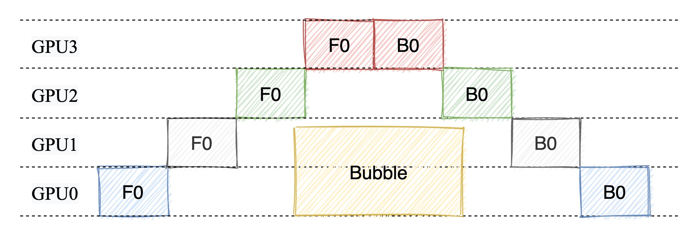
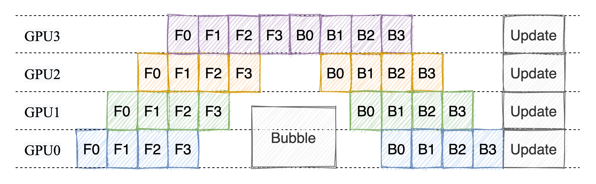
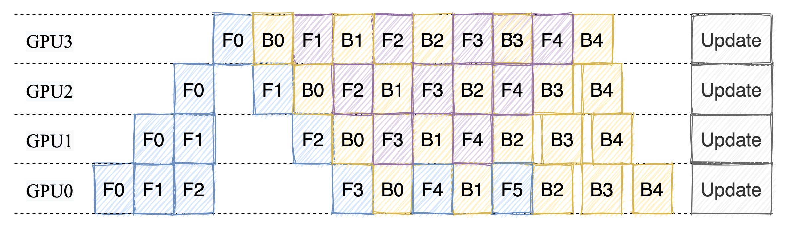
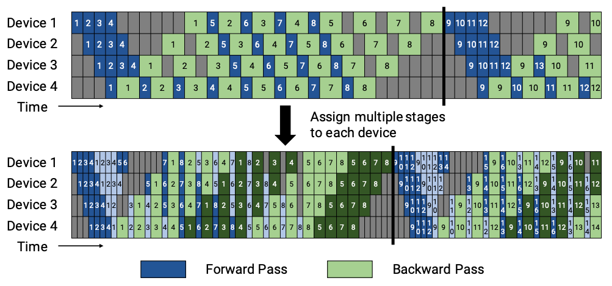

# 流水线并行调度的实现细节

流水线并行是一种将模型不同部分分配到多个 GPU 上，并行处理多个数据微批次的策略。它通过让每个 GPU 专注于模型的一部分，将计算和通信流水化，从而可以训练更大的模型。

在这篇文章中，我们将深入探讨**流水线并行的调度机制**，尤其是如何协调微批次的前向传播和反向传播，最大限度地减少 GPU 空闲时间。后续的文章会介绍**流水线中的通信机制**，即如何高效传递张量，避免通信瓶颈和死锁。

这篇文章将引导你了解 Megatron-LM 中流水线并行的核心调度机制，包括：

1. 1F1B 调度策略：一边前向传播，一边反向传播，为什么这种策略最常见？
2. 如何协调多个 GPU 间的任务调度？
3. 普通流水线与 Interleaved Pipelining 有何不同？

:::tip

Megatron 版本：v0.10.0

:::

## 1. 流水线并行的基础概念

当我们面对数百亿、甚至上万亿参数的超大规模模型时，单纯靠数据并行和张量并行已经无法有效地“放下”整个模型。流水线并行正是为了解决模型规模过大这个核心问题而设计的一种并行策略：将模型的不同层（或子模块）分别放到不同的 GPU 上，让数据分批次依次在这些 GPU 上流动，从而突破显存限制，进一步扩大可训练的模型规模。

然而，并不是所有的流水线并行方式都一样高效。从简单的无流水线到交错流水线，它们形成了一条优化路径——逐步提升并行度、减少计算和通信中的“气泡”（空闲时间）。

### 1.1. 无流水线并行

先从最简单的场景开始想象——没有流水线，也就是所有任务都按照顺序完成。前向传播时，我们依次通过模型的每一层，计算输出；完成所有层的前向计算后，才开始执行反向传播。整个过程单纯且直接，但也非常低效。

这种策略的最大问题是资源浪费。只有少数 GPU 在工作，其他 GPU 大部分时间都处于空闲状态。因此，当模型规模增大时，这种方法几乎不可行。

  

### 1.2. 普通流水线并行（FThenB）

为了提高效率，普通流水线并行通过将计算任务分阶段，让每个 GPU 负责特定的部分，同时引入了 **微批次（microbatch）** 的概念。

在普通流水线中，模型被拆分成多个阶段（stage），每个 GPU 负责其中的一部分层。数据则被拆分成若干个微批次，每个微批依次经过不同的阶段。比如：

1. 微批次 1 先经过 GPU 0，完成第一部分的计算后传递到 GPU 1；
2. 同时，GPU 0 开始处理微批次 2，形成“接力赛”般的流水线。

但流水线并不是一开始就高效工作的，它有三个关键阶段：

1. warmup（预热阶段）
2. steady state（稳定阶段）
3. cooldown（冷却阶段）

在预热阶段，由于微批次刚刚进入流水线，部分 GPU 可能还没有开始工作。这类似于接力赛中，前几棒的选手刚起跑时，后面的选手只能等着接棒。

随着更多微批次进入流水线，所有 GPU 都会开始同时处理任务，进入稳定阶段。这是流水线的最佳状态，每个 GPU 都有任务在运行，资源利用率达到峰值。

当最后一个微批次进入流水线并处理完毕时，流水线逐渐停止，进入冷却阶段。这一阶段类似接力赛的最后几棒，所有选手逐渐完成各自的任务。

  

但是我们可以观察到 FThenB 的缺点：前向传播和反向传播是串行执行的，即前向传播完成后才开始反向传播。这样会导致 **GPU 之间的资源利用率不高**，因为在前向传播阶段，反向传播阶段的 GPU 会处于空闲状态。

此外 FThenB 还有一个非常严重的问题就是，FThenB 由于前向传播和反向传播是串行执行的，会导致**反向传播的需要的中间变量无法释放，从而导致显存占用过高，甚至 OOM**。

### 1.3. 1F1B 调度策略

为了解决 FThenB 的问题，引入了 1F1B 调度策略。1F1B 的全称是 **1 Forward 1 Backward**，即一边前向传播，一边反向传播。



在 F-then-B 中，每个微批次的前向传播结果必须保留到反向传播开始时才能释放。因此，如果有 $K$ 个微批次，每个微批次需要存储的激活值为 $M$（单位：MB），则显存需求如下：

$$
\text{显存需求（F-then-B）} = K \times M
$$

这意味着，随着微批次数量 $K$ 增加，显存需求线性增长。

在 1F1B 中，前向传播和反向传播交替进行，因此在计算一个微批次的反向传播时，前向传播结果可以立刻释放。这种交替执行的模式减少了显存占用。

显存需求可近似表示为：

$$
\text{显存需求（1F1B）} \approx 2 \times M
$$

由于交替执行，每次只需要存储当前微批次的前向结果和上一个微批次的反向结果，因此显存需求与微批次数量无关。

假设：

- 每个微批次的前向传播激活值为 500 MB；
- 使用 8 个微批次（$K = 8$）；
- 每个 GPU 显存容量为 16 GB。

在 F-then-B 中，显存需求为：

$$
\text{显存需求} = 8 \times 500 \, \text{MB} = 4000 \, \text{MB}
$$

在 1F1B 中，显存需求为：

$$
\text{显存需求} \approx 2 \times 500 \, \text{MB} = 1000 \, \text{MB}
$$

随着微批次数量增加，F-then-B 的显存需求会远远超过 1F1B。 当然了这样的分析其实并不准确，因为实际上显存的占用还和模型的结构有关，一般来说 1F1B 的显存占用会比 F-then-B 小。

至于 Bubble 率，我们在图上通过最简单的“数格子”也可以很容易看出，1F1B 的 Bubble 率要比 FThenB 低。

### 1.4. Interleaved Pipelining

普通流水线并行虽然在一定程度上提升了并行计算的效率，但当模型参数继续增大时，依然存在问题：某些 GPU 可能在等待其他阶段完成时会闲置。为了进一步优化这一点，Megatron-LM 提出了交错流水线并行，它在普通流水线的基础上引入了更细粒度的模型分块（model chunks）。

交错的关键：

- 将模型进一步划分为多个小块（`num_model_chunks`），每个小块都有自己的微批
- 微批和小块交替执行，让每个 GPU 在同一时刻可以处理不同层的计算

  

通过把模型划分为多个小块，其他 GPU 可以在某个 GPU 处于反向传播阶段时，继续执行前向传播。这样，每个 GPU 都可以在整个流水线中保持忙碌，提高了资源利用率。

下面我们就来看看 Megatron-LM 是如何实现 1F1B 和 Interleaved Pipelining 的。

## 2. Megatron 中如何实现流水线并行切图

在介绍调度策略之前，我想我们有必要先来看看 Megatron-LM 是如何实现流水线并行切图的。流水线并行切图指的是将模型切分为多个部分，每个 GPU 上的模型只负责处理其中的一部分。

由于 Transformer 模型的结构，每一个 Block 都是一样的，因此我们只需要计算每个 Rank 需要处理的 Layer 数量就可以了。相关逻辑在 `megatron/core/transformer/transformer_block.py` 中。

```python
def get_num_layers_to_build(config: TransformerConfig) -> int:
    """
    确定当前流水线阶段需要构建的 Transformer 层的数量
    """
    
    # 检查是否配置了首尾阶段的不均匀层数分配
    if config.first_pipeline_num_layers is not None or config.last_pipeline_num_layers is not None:
        assert (
            parallel_state.get_virtual_pipeline_model_parallel_world_size() is None
        ), "不均匀层分配与交错流水线调度不兼容"

        # 剩余的层数需要在其他流水线阶段中分配
        layers_to_distribute = config.num_layers
        # 计算剩余的流水线阶段数量
        pipeline_stages_left = parallel_state.get_pipeline_model_parallel_world_size()

        # 如果配置了首阶段层数，优先分配到第一阶段
        if config.first_pipeline_num_layers is not None:
            layers_to_distribute -= config.first_pipeline_num_layers
            pipeline_stages_left -= 1
            # 如果当前是第一阶段，直接返回层数
            if parallel_state.is_pipeline_first_stage():
                return config.first_pipeline_num_layers

        # 如果配置了尾阶段层数，优先分配到最后阶段
        if config.last_pipeline_num_layers is not None:
            layers_to_distribute -= config.last_pipeline_num_layers
            pipeline_stages_left -= 1
            # 如果当前是最后阶段，直接返回层数
            if parallel_state.is_pipeline_last_stage():
                return config.last_pipeline_num_layers

        # 确保剩余的层数可以均匀分配到剩余的流水线阶段中
        assert (
            layers_to_distribute % pipeline_stages_left == 0
        ), "剩余层数必须能被剩余的流水线阶段整除"

        # 计算每个阶段分配的层数
        num_layers_per_pipeline_rank = layers_to_distribute // pipeline_stages_left
    
    else:
        # 均匀分配的情况：每个流水线阶段平均分配层数
        pipeline_ranks = config.pipeline_model_parallel_size
        num_layers_per_pipeline_rank = config.num_layers // pipeline_ranks

    # 检查是否使用了虚拟流水线并行（交错流水线分配）
    if parallel_state.get_virtual_pipeline_model_parallel_world_size() is not None:
        # 交错流水线并行：
        # 每个流水线阶段的层数进一步被虚拟流水线切分
        vp_size = parallel_state.get_virtual_pipeline_model_parallel_world_size()
        num_layers_per_virtual_rank = num_layers_per_pipeline_rank // vp_size
        num_layers_to_build = num_layers_per_virtual_rank

    else:
        # 非交错流水线并行：
        # 每个阶段分配一组连续的层
        num_layers_to_build = num_layers_per_pipeline_rank

    # 返回当前流水线阶段实际需要构建的层数
    return num_layers_to_build
```

其核心逻辑就是根据配置文件中的 `num_layers` 和 `pipeline_model_parallel_size` 计算出每个 Rank 需要处理的 Layer 数量。如果配置了 `first_pipeline_num_layers` 和 `last_pipeline_num_layers`，则优先分配给首尾阶段；否则均匀分配。

:::tip

如果是老版的 Megatron-LM，可以在 `ParallelTransformer` 类中找到类似的逻辑

:::

再获取了每个 Rank 需要处理的 Layer 数量后，在构建 Transformer 模型时，就可以根据这个数量来创建当前 Rank 需要处理的 Layer。

```python
def _get_block_submodules(
    config: TransformerConfig, spec: Union[TransformerBlockSubmodules, ModuleSpec]
):
    ...
    elif isinstance(spec, ModuleSpec):
        if issubclass(spec.module, TransformerBlock):
            return spec.submodules
        elif issubclass(spec.module, BaseTransformerLayer):
            num_layers = get_num_layers_to_build(config)
            return TransformerBlockSubmodules(
                layer_specs=[spec] * num_layers, layer_norm=LayerNormImpl
            )
        else:
            raise Exception(f"specialize for {spec.module.__name__}.")
    else:
        raise Exception(f"specialize for {type(spec).__name__}.")
```


## 3. 1F1B 调度策略的实现

在 Megatron-LM 中，流水线并行逻辑都由一个入口函数 `get_forward_backward_func` 决定：

```python
def get_forward_backward_func():
    pipeline_model_parallel_size = parallel_state.get_pipeline_model_parallel_world_size()
    
    if pipeline_model_parallel_size > 1:
        if parallel_state.get_virtual_pipeline_model_parallel_world_size() is not None:
            return forward_backward_pipelining_with_interleaving
        else:
            return forward_backward_pipelining_without_interleaving
    else:
        return forward_backward_no_pipelining
```

`forward_backward_pipelining_without_interleaving` 和 `forward_backward_pipelining_with_interleaving` 分别对应了 1F1B 和 Interleaved Pipelining。

让我们从 `forward_backward_pipelining_without_interleaving` 的实现逻辑入手，看看 1F1B 调度是如何在不同 GPU 之间协调的。

首先我们先计算 warmup 阶段需要处理的微批次数量，这个数量取决于当前 Rank 在流水线中的位置：

```python
    # 计算 warmup 阶段需要处理的微批次数量
    num_warmup_microbatches = (
        parallel_state.get_pipeline_model_parallel_world_size()
        - parallel_state.get_pipeline_model_parallel_rank()
        - 1
    )
    num_warmup_microbatches = min(num_warmup_microbatches, num_microbatches)
    num_microbatches_remaining = num_microbatches - num_warmup_microbatches
```

`num_warmup_microbatches` 表示当前 Rank 在 warmup 阶段需要处理的微批次数量，我们结合图就可以理解，不同 Rank 在 warmup 阶段的任务是不一样的。

假设 `num_microbatches` 为 8，`pipeline_model_parallel_size` 为 4，那么每个 Rank 在 warmup 阶段需要处理的微批次数量如下：

- Rank 0：3
- Rank 1：2
- Rank 2：1
- Rank 3：0

由于流水并行需要从其他 Rank 接收数据，或者给其他 Rank 发送数据，因此我们需要计算当前 Rank 需要接收和发送的张量形状：

```python
# 获取当前流水线的模型层类型和通信的张量形状
model_type = get_model_type(model)
encoder_decoder_xattn = get_model_xattn(model)
rank = parallel_state.get_pipeline_model_parallel_rank()

recv_tensor_shapes = get_tensor_shapes(
    rank=rank - 1,
    model_type=model_type,
    seq_length=seq_length,
    micro_batch_size=micro_batch_size,
    decoder_seq_length=decoder_seq_length,
    config=config,
    encoder_decoder_xattn=encoder_decoder_xattn,
)

send_tensor_shapes = get_tensor_shapes(
    rank=rank,
    model_type=model_type,
    seq_length=seq_length,
    micro_batch_size=micro_batch_size,
    decoder_seq_length=decoder_seq_length,
    config=config,
    encoder_decoder_xattn=encoder_decoder_xattn,
)
```

`get_tensor_shapes` 函数的作用是 根据当前设备所在的流水线阶段和模型结构（如编码器、解码器或编码-解码结构），计算需要在设备间传输的张量形状。如果是 纯编码器或纯解码器模型，只需要传输单个张量，即 `(seq_length, micro_batch_size, hidden_size)`。我们这里目前只考虑 Decoder-Only 的模型，对其他模型结构的处理可以参考源码。

接下来就是 1F1B 三个阶段对应的逻辑：

**1、 Warmup 阶段**

在 Warmup 阶段，我们需要逐步填充流水线，即每个微批次依次执行前向传播，并逐步填充流水线。每个微批次接收来自上一个流水线阶段的张量（input_tensor），然后进行前向计算，最后将输出张量（output_tensor）传递到下一个阶段。

```python
# 1. Warmup 阶段：逐步填充流水线
for i in range(num_warmup_microbatches):
    # 决定当前微批次是否需要对部分激活进行检查点保存（激活检查点机制用于减少显存消耗）
    # 如果 max_outstanding_backprops 为 None，则不进行激活检查点操作
    checkpoint_activations_microbatch = (
        i % max_outstanding_backprops
        >= config.num_microbatches_with_partial_activation_checkpoints
        if max_outstanding_backprops is not None else None
    )

    # 从上一个流水线阶段接收前向传播的张量
    # recv_forward 会阻塞，直到接收到来自上一阶段的数据
    input_tensor = recv_forward(recv_tensor_shapes, config)

    # 执行当前微批次的前向传播
    # forward_step 函数会计算当前模型部分的输出张量，并返回计算的输出和处理的 token 数量
    output_tensor, num_tokens = forward_step(...)

    # 将当前微批次的输出张量发送到下一个流水线阶段
    send_forward(output_tensor, send_tensor_shapes, config)
    total_num_tokens += num_tokens.item()

    if not forward_only:
        # 如果进行反向传播，则需要保存当前微批次的输入和输出张量，以便后续反向传播使用
        input_tensors.append(input_tensor)
        output_tensors.append(output_tensor)

        # 在某些配置下，释放不再需要的输出张量，节省显存
        deallocate_output_tensor(output_tensor[0], config.deallocate_pipeline_outputs)

# 如果 warmup 阶段执行完后还有剩余的微批次，准备接收下一个阶段的前向张量
# 这一步为后续的 1F1B 稳态阶段（steady state）做准备
if num_microbatches_remaining > 0:
    input_tensor = recv_forward(recv_tensor_shapes, config)
```

Warmup 阶段执行的都是前向传播，每个 Rank 都会从上一个 Rank 接收到数据，然后执行前向传播，最后将结果传递给下一个 Rank。如果是第一个 Rank，`recv_forward` 函数会返回一个 None，表示没有数据需要接收。这时候在 `forward_step` 函数中，会从 `data_iterator` 中拿数据。`forward_step` 以及通信操作的源码我们就不展开了，本篇文章主要是讲解调度策略。

Warmup 阶段执行完后，我们就进入了 Steady State 阶段。这个阶段是流水线的稳定运行阶段，前向传播和反向传播交错执行。我们将会交错执行 `num_microbatches_remaining` 个微批次。

假设 `num_microbatches_remaining` 为 8，`pipeline_model_parallel_size` 为 4，那么每个 Rank 在 Steady State 阶段需要处理的微批次数量如下：

- Rank 0：8 - 3 = 5
- Rank 1：8 - 2 = 6
- Rank 2：8 - 1 = 7
- Rank 3：8 - 0 = 8


```python
# 2. Steady State 阶段：执行 1F1B
# 在 steady state 阶段，流水线处于稳定运行状态，前向传播和反向传播交错执行（1F1B 调度）。

for i in range(num_microbatches_remaining):
    # 判断是否是最后一个微批次
    last_iteration = i == (num_microbatches_remaining - 1)

    # 判断当前微批次是否需要激活检查点
    # 激活检查点策略是根据最大未完成的反向传播批次数决定的，以平衡显存和计算开销
    checkpoint_activations_microbatch = (
        (i + num_warmup_microbatches) % max_outstanding_backprops
        >= config.num_microbatches_with_partial_activation_checkpoints
        if max_outstanding_backprops is not None else None
    )

    # 执行当前微批次的前向传播，类似于 warmup 阶段
    output_tensor, num_tokens = forward_step(...)
    # 累加处理的 token 数量
    total_num_tokens += num_tokens.item()

    if forward_only:
        # 如果只进行前向传播（不计算梯度），将输出张量发送到下一个流水线阶段
        send_forward(output_tensor, send_tensor_shapes, config)
        # 如果不是最后一个微批次，从上一个阶段接收下一个输入张量
        if not last_iteration:
            input_tensor = recv_forward(recv_tensor_shapes, config)

    else:
        # 如果需要反向传播，执行交错通信：
        # 发送前向输出张量到下一个阶段，并接收来自下一个阶段的反向传播梯度
        output_tensor_grad = send_forward_recv_backward(output_tensor, send_tensor_shapes, config)

        # 保存当前微批次的输入和输出张量，用于后续反向传播
        input_tensors.append(input_tensor)
        output_tensors.append(output_tensor)

        # 如果配置允许，释放不再需要的输出张量，节省显存
        deallocate_output_tensor(output_tensor[0], config.deallocate_pipeline_outputs)

        # 从保存的张量列表中取出用于反向传播的输入和输出张量
        input_tensor = input_tensors.pop(0)
        output_tensor = output_tensors.pop(0)

        # 如果是最后一个微批次，并且 warmup 阶段为空（即没有延迟），启用梯度同步
        if num_warmup_microbatches == 0 and last_iteration:
            enable_grad_sync()

        # 计算反向传播的梯度
        input_tensor_grad = backward_step(
            input_tensor, output_tensor, output_tensor_grad, model_type, config
        )

        if last_iteration:
            # 如果是最后一个微批次，将梯度发送到上一个阶段
            input_tensor = None
            send_backward(input_tensor_grad, recv_tensor_shapes, config)
        else:
            # 发送当前梯度到上一个阶段，同时接收新的前向输入
            input_tensor = send_backward_recv_forward(input_tensor_grad, recv_tensor_shapes, config)

```

**2. Steady State 阶段**

在 Steady State 阶段，每个 Rank 会将前向传播的结果传递给下一个 Rank，同时接收上一个 Rank 传递过来的反向传播梯度并计算梯度。

通信相关的逻辑被封装在 `send_forward`、`recv_forward`、`send_forward_recv_backward`、`send_backward`、`recv_backward`、`send_backward_recv_forward` 函数中。

:::note

这里有个思考题各位读者可以思考一下：在稳定阶段的最后俩个卡上是有交叉通信的情况，这样会不会导致死锁呢？

:::

在流水线并行训练中，每个阶段都会产生大量的中间张量（例如前向输出），这些张量不仅会占用显存，还会阻碍其他计算。因此，为了优化显存使用，Megatron-LM 引入了 `deallocate_output_tensor 机制，确保在必要时释放内存。

```python
def deallocate_output_tensor(out, deallocate_pipeline_outputs=False):
    '''伪内存释放（pseudo-deallocate）：将输出张量的 '.data' 字段重置为标量张量。
    
    这个方法应该在输出张量发送到下一个流水线阶段后立即调用。
    在这个时刻，输出张量只需要保留 '.grad_fn' 字段，用于反向传播。
    它的 '.data' 字段则可以安全释放以节省显存。
    '''
    if (out is None) or (not deallocate_pipeline_outputs):
        # 如果输出张量为空，或者没有开启显存释放选项，直接返回。
        return
    
    # 确保输出是一个 torch.Tensor 对象
    assert isinstance(out, torch.Tensor), f"预期是 Tensor 类型，但收到 {type(out).__name__} 类型"
    
    # 确保释放的张量不是另一个张量的视图，否则释放会导致基础张量也受到影响
    assert out._base is None, "不能释放基于其他张量创建的视图张量。"

    # 将张量的 `.data` 字段设置为一个大小为 1 的标量张量，伪释放显存
    out.data = torch.empty((1,), device=out.device, dtype=out.dtype)
```

`deallocate_output_tensor 的核心功能是 “伪内存释放（pseudo-deallocate）”。**它并不真正释放张量对象，而是通过将张量的数据部分重置为一个标量**，达到“节省显存”的效果。

在反向传播中，PyTorch 只需要通过 `.grad_fn` 追踪计算图，逐层计算梯度。`.data` 部分只用于存储前向计算的结果，在输出被传递到下一个流水线阶段后，这部分数据就变得冗余。

**3、Cooldown 阶段**

最后阶段的冷却阶段就比较简单了，就是计算完剩余的 Backward 任务，在 warmup 阶段积累的微批次可能还未完成反向传播。因此，在 cooldown 阶段，针对这些微批次逐步执行反向传播，直至所有梯度回传结束。


```python
# 反向传播的 Cooldown 阶段：在所有前向传播结束后，逐步完成剩余的反向传播任务。
if not forward_only:  # 仅在需要反向传播时执行该阶段。
    for i in range(num_warmup_microbatches):  # 遍历 warmup 阶段积累的微批次。
        
        # 如果是最后一个反向传播步骤，启用异步梯度同步。
        # 仅在流水线的第一个阶段或者未定义自定义同步函数时执行。
        if i == num_warmup_microbatches - 1:
            if config.grad_sync_func is None or rank == 0:
                enable_grad_sync()

        # 从 warmup 阶段保存的张量列表中取出输入和输出张量，用于反向传播。
        input_tensor = input_tensors.pop(0)  # 取出对应的前向传播输入张量。
        output_tensor = output_tensors.pop(0)  # 取出对应的前向传播输出张量。

        # 从下游设备接收反向传播的梯度张量。
        output_tensor_grad = recv_backward(send_tensor_shapes, config)

        # 计算当前阶段的反向传播梯度，主要基于输入张量、输出张量和接收到的下游梯度。
        input_tensor_grad = backward_step(
            input_tensor, output_tensor, output_tensor_grad, model_type, config
        )

        # 将计算得到的梯度发送到上游设备，以便继续反向传播。
        send_backward(input_tensor_grad, recv_tensor_shapes, config)

    # 处理剩余的梯度同步操作，确保所有设备间的梯度都正确同步。
    if no_sync_context is not None:  # 如果存在未完成的同步上下文，开启同步。
        enable_grad_sync()
        if config.grad_sync_func is not None:
            # 如果定义了自定义的梯度同步函数，调用它以同步所有模型参数的梯度。
            config.grad_sync_func(model.parameters())
```

代码中有一个值得注意的地方，就是在最后一个反向传播步骤时，启用了异步梯度同步并且会同步所有模型参数的梯度。在刚刚开始的时候，我们通过 disable_grad_sync 函数关闭了梯度同步，这是因为在流水并行的时候，不同的 GPU 只负责不同部分的模型，因此每一步反向传播的梯度更新只在本地完成，没有必要在每个微批次中进行全局同步。这样做的目的是**最大程度减少通信开销**，尤其是在处理多个微批次的情况下。

但是到了最后一个反向传播步骤时，事情就不一样了。我们需要确保：

1. 所有 GPU 上的局部梯度都正确同步并合并，特别是对于数据并行和流水并行混合的场景；
2. 跨设备共享的参数梯度也需要进行同步，例如 LayerNorm 或嵌入层等在多个阶段间共享的参数；
3. 准备下一次迭代时，所有必要的参数都已更新并可用，防止旧参数带来的计算延迟或错误

因此，在最后一个微批次结束时调用 `enable_grad_sync`，通过触发全局梯度同步来确保这些要求得以实现。尤其是**混合并行策略（数据并行和流水线并行结合使用）**下，这一步是非常重要的。


## 4. Interleaved Pipelining 调度策略的实现

`Interleaved Pipelining` 是 Megatron-LM 中的一种流水线并行调度策略，它在 1F1B 的基础上引入了更细粒度的模型分块（model chunks）。你可以理解为他在 1F1B 的基础上再次切分模型。

它的主要实现在 `forward_backward_pipelining_with_interleaving` 函数中，我们来看看它是如何实现的。这里的逻辑也是比较复杂，Megatron-LM 里面洋洋洒洒写了将近 1000 行代码，让我们来一点点分析。

前面一些检查还有类似禁用异步梯度同步的操作我们这里就跳过了，着重看调度策略的实现。

首先我们创建一个调度表，用于确定每个虚拟微批次 (virtual_microbatch_id) 对应的模型块 (model_chunk_id) 和微批次 ID (microbatch_id)。

`microbatch_group_size_per_vp_stage` 参数定义了在每个虚拟流水线阶段（包括前向和反向计算）中，同时执行的微批次数。默认值为 `pipeline_parallel_size`。一般情况下，`microbatch_group_size_per_vp_stage` 的值都是 `pipeline_parallel_size`，即每个虚拟流水线阶段同时执行的微批次数等于流水线并行大小。我们可以看上面的调度图里，就是 `microbatch_group_size_per_vp_stage` 为 4，`pipeline_parallel_size` 为 4，`num_microbatches` 为 8 的情况。

假设，我们有一个 Layer 数为 32 的 GPT 模型，流水线并行大小为 4，微批次数为 8。首先按照卡去切分模型，我们有 32 个 Layer，4 个卡，那么每个卡上的 Layer 数为 8。**注意调度表只是计算在这 8 个 Layer 上的微批次的分配情况，而不是整个模型的分配情况**。 你看下面的代码里面，取的是 `len(model)`，上面讲模型切分的时候我们提过，每个卡只会处理一部分 Layer。

所以在我们的例子中，`model_chunk_id` 的取值范围是 0-7，`microbatch_id` 的取值范围是 0-7。`schedule_table` 就是一个二维数组，每一行代表一个虚拟微批次，第一列是 `microbatch_id`，第二列是 `model_chunk_id`。

| virtual_microbatch_id | microbatch_id | model_chunk_id |
| --------------------- | ------------- | -------------- |
| 0                     | 0             | 0              |
| 1                     | 1             | 0              |
| 2                     | 2             | 0              |
| 3                     | 3             | 0              |
| 4                     | 0             | 1              |
| 5                     | 1             | 1              |
| 6                     | 2             | 1              |
| 7                     | 3             | 1              |
| ...                     | ...             | ..         |
| 63                     | 7             | 7             |


```python 
schedule_table = []

# 遍历微批次组，每次迭代的步长为 microbatch_group_size_per_vp_stage
for min_microbatch_id_in_group in range(0, num_microbatches, config.microbatch_group_size_per_vp_stage):
    # 判断当前组是否是最后一个微批次组
    if min_microbatch_id_in_group + config.microbatch_group_size_per_vp_stage >= num_microbatches:
        # 如果是最后一组，可能不足一个完整的微批次组，因此只填充剩下的微批次
        schedule_table.extend(
            [
                (microbatch_id, model_chunk_id)
                for model_chunk_id in range(len(model))  # 遍历所有模型块
                for microbatch_id in range(min_microbatch_id_in_group, num_microbatches)  # 遍历剩余的微批次
            ]
        )
    else:
        # 如果是完整的一组，正常填充调度表
        schedule_table.extend(
            [
                (microbatch_id, model_chunk_id)
                for model_chunk_id in range(len(model))  # 遍历所有模型块
                for microbatch_id in range(
                    min_microbatch_id_in_group,
                    min_microbatch_id_in_group + config.microbatch_group_size_per_vp_stage,
                )  # 遍历当前组内的微批次
            ]
        )

# 从调度表中分离出两个单独的表：
# microbatch_id_table：对应每个 virtual_microbatch_id 的微批次 ID
# model_chunk_id_table：对应每个 virtual_microbatch_id 的模型块 ID
microbatch_id_table, model_chunk_id_table = zip(*schedule_table)
```

调度表会被用在 `get_microbatch_id_in_model_chunk`、`is_first_microbatch_for_model_chunk` 这些辅助函数中，用于确定当前虚拟微批次对应的模型块和微批次 ID。


接下来，我们就来看看具体的调度过程，`Interleaved Pipelining` 的调度也分为三个阶段：Warmup、Steady State 和 Cooldown。

**1、 Warmup 阶段**

代码中还有一些针对通信优化的操作，这部分的逻辑我们放在下一篇文章中讲解。如果把所有的通信优化逻辑都去掉，剩下的代码逻辑并不复杂，和 1F1B 的 Warmup 阶段类似。

看代码的时候我们可以时刻结合上面的调度图来理解，以 Warmup 阶段的 1 卡举例子，`num_warmup_microbatches` 在图里面为 8。每个任务处理好自己的 `send` 和 `recv` 操作，从上一个 Rank 接收数据，执行前向传播，然后将结果传递给下一个 Rank。

代码实现如下：

```python
# 开始进行 warmup 阶段的前向传播
parallel_state.set_virtual_pipeline_model_parallel_rank(0)  # 设置当前虚拟流水线的模型块为第 0 块
# 接收来自前一阶段的输入张量
input_tensors[0].append(p2p_communication.recv_forward(tensor_shape, config))

...

# 遍历 warmup 阶段的所有微批次，进行前向传播
for k in range(num_warmup_microbatches):
    # 获取当前虚拟微批次对应的模型块 ID，并更新虚拟流水线的模型块状态
    cur_model_chunk_id = get_model_chunk_id(k, forward=True)
    parallel_state.set_virtual_pipeline_model_parallel_rank(cur_model_chunk_id)

    # 如果开启了通信重叠优化，非流水线第一个阶段在必要时等待接收完成
    if config.overlap_p2p_comm_warmup_flush:
        ...

    # 判断当前阶段是否需要从前一个流水线阶段接收张量
    recv_prev, next_forward_model_chunk_id = recv_tensor_from_previous_stage(k, forward=True)

    # 如果是最后一个微批次，跳过接收操作
    if k == (total_num_microbatches - 1):
        recv_prev = False

    # 如果启用了通信重叠优化，提前接收下一步需要的数据
    if config.overlap_p2p_comm_warmup_flush and not parallel_state.is_pipeline_first_stage(ignore_virtual=True):
        ...

    ...

    # 获取当前微批次在模型块中的具体微批次 ID，并执行前向传播
    microbatch_id = get_microbatch_id_in_model_chunk(k, forward=True)
    output_tensor = forward_step_helper(k, microbatch_id, checkpoint_activations_microbatch)

    # 如果是流水线的最后一个阶段，不需要向后发送输出张量
    if parallel_state.is_pipeline_last_stage():
        output_tensor = None

    # 根据不同的通信模式，决定是进行直接通信还是缓冲通信
    if not config.overlap_p2p_comm_warmup_flush:
        if (
            k == (num_warmup_microbatches - 1)
            and not config.overlap_p2p_comm
            and not forward_only
            and not all_warmup_microbatches
        ):
            # 如果是最后一个 warmup 微批次并且后续还需要反向传播，则需要准备接收反向传播的梯度
            input_tensor_grad = None
            recv_next = True
            if parallel_state.is_pipeline_last_stage(ignore_virtual=True):
                recv_next = False
            (input_tensor, output_tensor_grad) = (
                p2p_communication.send_forward_backward_recv_forward_backward(
                    output_tensor,
                    input_tensor_grad,
                    recv_prev=recv_prev,
                    recv_next=recv_next,
                    tensor_shape=tensor_shape,
                    config=config,
                )
            )
            output_tensor_grads[num_model_chunks - 1].append(output_tensor_grad)
        else:
            # 正常情况下发送前向输出并接收下一个微批次的输入
            input_tensor = p2p_communication.send_forward_recv_forward(
                output_tensor, recv_prev=recv_prev, tensor_shape=tensor_shape, config=config
            )
        if recv_prev:
            # 将接收到的输入张量存储到对应的模型块中
            input_tensors[next_forward_model_chunk_id].append(input_tensor)
        deallocate_output_tensor(output_tensor, config.deallocate_pipeline_outputs)  # 释放输出张量占用的内存
    else:
        # 如果启用了通信重叠优化，使用非阻塞的发送和接收
        ...

    # 如果启用了通信重叠，还需要提前接收反向传播的梯度信息
    if config.overlap_p2p_comm:
        ...
```

**2、 Steady State 阶段**


在稳定阶段中，前向传播和反向传播交错执行，与普通 1F1B 不同的是，Interleaved Pipelining 引入了更细粒度的模型分块，因此需要根据当前虚拟微批次的模型块 ID 来执行相应的前向和反向传播操作。

在每个前向传播中，流水线会先定位到当前微批次所属的模型块，并调用 `forward_step_helper` 函数执行前向计算，同时生成输出张量 `output_tensor`。接着，系统会通过 `get_microbatch_id_in_model_chunk` 确定微批次在当前模型块中的具体位置。这一步非常关键，因为 Interleaved Pipelining 允许多个微批次在不同的模型块中并行执行，需要准确调度。

紧接着，在同一微批次的反向传播阶段，系统会再次根据当前虚拟微批次的 模型块 ID 确定反向计算的入口，调用 `backward_step_helper`` 来计算输入张量的梯度`input_tensor_grad`。由于每个阶段的前向输出是下一个阶段的输入，而反向梯度需要传递给上一个阶段，因此张量的通信变得至关重要。

通过 `p2p_communication.send_forward_backward_recv_forward_backward` 函数，每个流水线阶段不仅将当前的前向输出张量发送到下一个阶段，同时接收来自上一阶段的输入张量。它里面的实现细节我们也放在下一篇文章中讲解。

代码实现如下：

```python
# 进入稳定阶段（1F1B）的前向和反向传播循环
for k in range(num_microbatches_remaining):
    # 计算当前前向传播微批次的虚拟索引
    forward_k = k + num_warmup_microbatches  # 当前微批次的索引等于剩余微批次的偏移量加上 warmup 阶段已处理的微批次

    # 获取当前微批次的模型块 ID 并设置流水线的虚拟状态
    cur_model_chunk_id = get_model_chunk_id(forward_k, forward=True)
    parallel_state.set_virtual_pipeline_model_parallel_rank(cur_model_chunk_id)

    # 获取当前模型块中对应的微批次 ID
    microbatch_id = get_microbatch_id_in_model_chunk(forward_k, forward=True)

    if config.overlap_p2p_comm:
        # 如果启用了点对点通信重叠优化，执行相应的优化逻辑（这里被省略）
        ...
    else:
        # 如果没有启用通信重叠，则直接进行前向传播
        output_tensor = forward_step_helper(
            forward_k, microbatch_id, checkpoint_activations_microbatch
        )

        # 开始反向传播阶段
        backward_k = k  # 对应的反向传播微批次索引
        input_tensor_grad = backward_step_helper(backward_k)  # 计算当前微批次的反向梯度

        # 发送前向输出张量和反向传播的梯度张量，并接收下一步所需的数据
        # 确定当前阶段是否需要发送和接收张量，如果不需要则设置为 None
        forward_model_chunk_id = get_model_chunk_id(forward_k, forward=True)
        parallel_state.set_virtual_pipeline_model_parallel_rank(forward_model_chunk_id)
        # 如果是最后一个流水线阶段，则没有下游需要接收输出张量
        if parallel_state.is_pipeline_last_stage():
            output_tensor = None

        backward_model_chunk_id = get_model_chunk_id(backward_k, forward=False)
        parallel_state.set_virtual_pipeline_model_parallel_rank(backward_model_chunk_id)
        # 如果是第一个流水线阶段，则没有前驱需要发送反向梯度
        if parallel_state.is_pipeline_first_stage():
            input_tensor_grad = None

        # 判断当前阶段是否需要从上一个或下一个流水线阶段接收张量
        recv_prev, next_forward_model_chunk_id = recv_tensor_from_previous_stage(
            forward_k, forward=True
        )
        recv_next, next_backward_model_chunk_id = recv_tensor_from_previous_stage(
            backward_k, forward=False
        )

        # 如果是最后一个微批次，则跳过接收操作
        if k == (num_microbatches_remaining - 1):
            recv_prev = False

        # 执行点对点通信，发送和接收必要的张量
        (input_tensor, output_tensor_grad) = (
            p2p_communication.send_forward_backward_recv_forward_backward(
                output_tensor,  # 当前阶段的前向输出张量
                input_tensor_grad,  # 当前阶段的反向输入梯度
                recv_prev=recv_prev,  # 是否从前一阶段接收输入张量
                recv_next=recv_next,  # 是否从后一阶段接收反向梯度
                tensor_shape=tensor_shape,  # 张量的形状
                config=config,  # 配置对象
            )
        )

        # 释放当前输出张量占用的内存以节省显存
        deallocate_output_tensor(output_tensor, config.deallocate_pipeline_outputs)

        # 如果接收到前一阶段的输入张量，将其存储到相应的数据结构中
        if recv_prev:
            input_tensors[next_forward_model_chunk_id].append(input_tensor)
        # 如果接收到后一阶段的反向传播梯度张量，将其存储到相应的数据结构中
        if recv_next:
            output_tensor_grads[next_backward_model_chunk_id].append(output_tensor_grad)

# 释放最终的输出张量占用的内存
deallocate_output_tensor(output_tensor, config.deallocate_pipeline_outputs)

```

**3、 Cooldown 阶段**

最后就是 Cooldown 阶段，这个阶段的逻辑也比较简单，就是处理剩余的反向传播任务。在 Warmup 阶段积累的微批次可能还未完成反向传播，因此在 cooldown 阶段，针对这些微批次逐步执行反向传播，直至所有梯度回传结束。

```python
# 运行冷却阶段的反向传播（flush 出流水线中的剩余张量）。
if not forward_only:  # 如果不是仅前向模式，需要执行反向传播。
    # 遍历所有剩余的微批次，从稳定阶段切换到冷却阶段。
    for k in range(num_microbatches_remaining, total_num_microbatches):
        # 确定当前虚拟微批次对应的模型块 ID，设置虚拟流水线的状态。
        cur_model_chunk_id = get_model_chunk_id(k, forward=False)
        parallel_state.set_virtual_pipeline_model_parallel_rank(cur_model_chunk_id)

        # 如果当前不是流水线的最后阶段，并且不是第一个微批次，可能需要等待接收下一阶段的张量。
        if not parallel_state.is_pipeline_last_stage() and k != 0:
            if config.overlap_p2p_comm_warmup_flush:
                # 如果启用了通信重叠优化，则处理对应的等待句柄。
                ...
            else:
                # 否则，处理正常的同步通信等待。
                if recv_next_wait_handles is not None and recv_next_wait_handles:
                    recv_next_wait_handle = recv_next_wait_handles.pop(0)
                    recv_next_wait_handle.wait()  # 等待接收操作完成。

        # 确定当前是否需要从下一个阶段接收反向传播的梯度。
        recv_next, next_backward_model_chunk_id = recv_tensor_from_previous_stage(
            k, forward=False
        )

        # 如果是最后一个微批次，不再接收新的张量。
        if k == (total_num_microbatches - 1):
            recv_next = False

        # 调用反向传播步骤，计算当前微批次的输入张量梯度。
        input_tensor_grad = backward_step_helper(k)

        # 如果是流水线的第一个阶段，则没有需要向前发送的反向梯度。
        if parallel_state.is_pipeline_first_stage():
            input_tensor_grad = None

        # 如果启用了通信重叠优化，处理非阻塞的发送和接收。
        if config.overlap_p2p_comm_warmup_flush:
            ...
        else:
            # 否则，正常地进行反向传播张量的发送和接收。
            output_tensor_grad = p2p_communication.send_backward_recv_backward(
                input_tensor_grad, recv_next=recv_next, tensor_shape=tensor_shape, config=config
            )

            # 如果需要接收反向传播的张量，则将其存储到对应的结构中。
            if recv_next:
                output_tensor_grads[next_backward_model_chunk_id].append(output_tensor_grad)

    # 如果存在前一阶段的发送等待句柄，则等待其完成。
    if send_prev_wait_handle is not None:
        send_prev_wait_handle.wait()

    # 启动所有剩余的梯度同步操作。
    enable_grad_sync()
    if config.grad_sync_func is not None:
        # 遍历所有模型块，执行未完成的梯度同步。
        for model_chunk_id in range(num_model_chunks):
            if model_chunk_id not in synchronized_model_chunks:
                # 使用自定义的梯度同步函数同步模型块的参数。
                config.grad_sync_func[model_chunk_id](model[model_chunk_id].parameters())
                synchronized_model_chunks.add(model_chunk_id)
```

这就是 Interleaved Pipelining 调度策略的实现，相比于 1F1B，Interleaved Pipelining 引入了更细粒度的模型分块，允许多个微批次在不同的模型块中并行执行，从而提高了流水线的利用率。

## 5. 总结

流水线并行通过将模型划分到多个 GPU 上并交错处理多个微批次，使得训练更大规模的模型成为可能。在这篇文章中，我们剖析了 Megatron-LM 中的流水线调度机制，尤其是 1F1B 调度策略是如何高效协调前向传播与反向传播，避免 GPU 闲置的。我们探索了普通流水线与 Interleaved Pipelining 的区别，展示了如何利用调度表分配微批次任务，确保不同模型块间的任务无缝衔接。最后，我们也讨论了冷却阶段如何完成剩余的梯度更新和同步。在理解这些机制后，相信你对流水线并行的执行流程有了更清晰的认识。

下一步，我们将深入探讨流水并行中的通信技术，看看如何避免交叉通信，以及如何利用异步通信和通信重叠优化提高训练效率。


## 参考资料

1. https://zhuanlan.zhihu.com/p/651341660
2. https://zhuanlan.zhihu.com/p/432969288
3. https://juejin.cn/post/7330916433559814184
4. https://arxiv.org/pdf/2104.04473
5. https://space.keter.top/docs/high_performance/Paddle%E8%87%AA%E5%8A%A8%E5%B9%B6%E8%A1%8C%E5%8E%9F%E7%90%86/Paddle%E5%B9%B6%E8%A1%8C%E7%BC%96%E6%8E%92%E4%B8%8E%E6%89%A7%E8%A1%8C