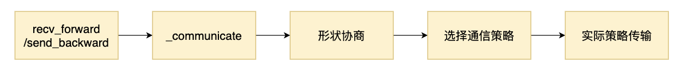
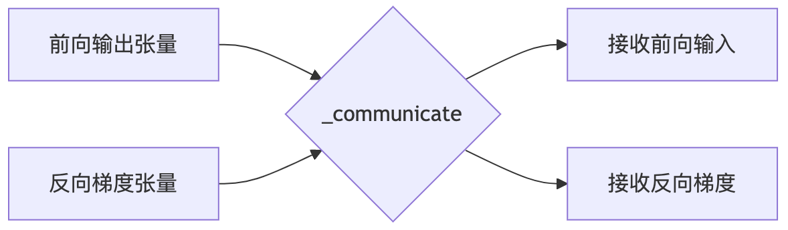
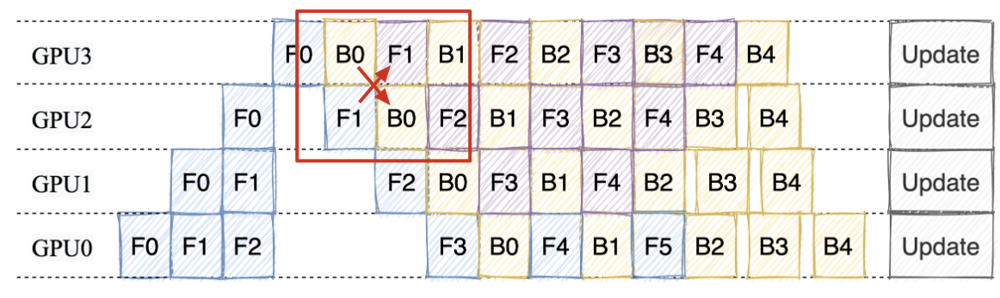
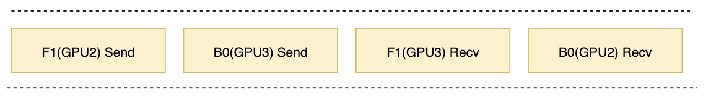

# 流水线并行中的通信机制

在前一篇文章中，我们详细探讨了流水线并行调度机制，重点介绍了如何将模型拆分为多个部分，并在不同的 GPU 上并行计算多个微批次，以加速训练过程。然而，流水线并行的高效性不仅依赖于合理的调度策略，更离不开高效的通信机制。如果你有给公司训练框架适配流水并行的经验，那么你一定遇到过流水并行算法 hang 住的情况。别看 Megatron 里面的流水并行通信代码不是很多，其中有很多设计的巧思考。

在这篇文章中，我们将继续承接前文的讨论，深入分析流水线并行中的通信机制。我们将探讨**如何通过 `_communicate` API 高效地在各个计算阶段之间传递张量**，并且解释一些关键通信接口如 `recv_forward`、`recv_backward`、`send_forward` 和 `send_backward` 是如何实现的。这些接口和 `_communicate` API 紧密相关，通过它们，多个 GPU 可以顺利地完成前向传播和反向传播过程中的数据交换。

希望你能带着以下问题阅读本文：

1. **`recv_forward`、`recv_backward`、`send_forward` 和 `send_backward` 是如何依赖 `_communicate` 实现的？**
2. **如何避免交叉通信中的死锁问题？**

## 1. 通信机制全景图

Megatron 在训练过程中，数据需要在多个设备和不同的管道阶段之间传递。为了确保数据的顺利流动，它将通信过程分为几个重要的环节。在整个过程中，核心函数的调用链如下所示：

  

`recv_forward/send_backward`：在每个微批次的前向和后向传播中，数据的发送与接收操作是最基本的通信任务。recv_forward 函数负责从前一个阶段接收数据，而 `send_backward` 函数则将数据发送到下一个阶段。这是每个训练步骤中的基本操作，确保数据在不同阶段之间传递。除了 `recv_forward/send_backward` 外还有 `send_forward_backward_recv_forward_backward` 等 接口，不过都是对 `_communicate` 的封装。

`_communicate` 这个函数是通信过程中的核心，负责协调各个阶段之间的张量传输。它不仅仅传递数据，还会在必要时与其它阶段进行协调，尤其是在形状协商和选择通信策略的环节中起到了决定性作用。`_communicate` 主要是用来处理不同阶段之间的张量形状信息，并在此基础上确定适合的通信策略。

当微批次的序列长度不一致时，Megatron 需要先交换张量的形状信息（即，形状协商），确保数据格式的一致性。这个步骤对于后续的通信非常重要，特别是对于**变长序列或动态批量大小的情况**。通过形状协商，各个阶段能够提前知道数据的形状，从而优化后续的传输过程。

  

## 2. `_communicate` 函数详解

`_communicate` 函数是 Megatron 中最核心的通信函数之一，它负责在不同的训练阶段之间传递张量。这个函数主要有以下几个功能：

1. **接收来自前一个阶段的数据**：如果需要从前一个阶段接收数据，`_communicate` 会创建一个接收张量的函数，并在接收到数据后返回这个张量。
2. **接收来自下一个阶段的数据**：如果需要从下一个阶段接收数据，`_communicate` 会创建一个接收张量的函数，并在接收到数据后返回这个张量。
3. **发送数据给前一个阶段**：如果需要向前一个阶段发送数据，`_communicate` 会将数据发送给前一个阶段。
4. **发送数据给下一个阶段**：如果需要向下一个阶段发送数据，`_communicate` 会将数据发送给下一个阶段。

代码实现可以分为以下几个步骤：

1. **形状协商**： 如果微批次的序列长度不一致，需要先进行形状协商，确保数据的一致性。
2. **选择通信策略**：根据模型并行配置 (config)，选择适当的通信策略（如同步或异步通信）。
3. **执行实际的数据传输**：根据需要接收的数据，创建接收张量的函数。

### 2.1 通信前的准备操作

在进行具体的通信之前，`_communicate` 函数会先进行一些准备操作，包括形状协商和选择通信策略。这些操作是确保数据传输的顺利进行的重要步骤。

这部分代码比较简单，我贴上带有注释的代码，方便大家理解：

```python
    # 初始化用于接收来自前后阶段的张量的函数
    tensor_recv_prev_func = None
    tensor_recv_next_func = None

    # 如果不是变量长度序列，则接收前后阶段的形状与传入的 tensor_shape 相同
    if not config.variable_seq_lengths:
        recv_prev_shape = tensor_shape
        recv_next_shape = tensor_shape
    else:
        # 如果序列长度是变量长度，则先进行形状协商
        recv_prev_shape, recv_next_shape = _communicate_shapes(
            tensor_send_next, tensor_send_prev, recv_prev, recv_next, config
        )

    # 定义创建接收张量的函数（前一个阶段的张量）
    def create_tensor_recv_prev():
        return torch.empty(
            recv_prev_shape,
            requires_grad=True,
            device=torch.cuda.current_device(),
            dtype=config.pipeline_dtype,  # 使用 pipeline dtype
        )

    # 定义创建接收张量的函数（下一个阶段的张量）
    def create_tensor_recv_next():
        return torch.empty(
            recv_next_shape,
            requires_grad=True,
            device=torch.cuda.current_device(),
            dtype=config.pipeline_dtype,  # 使用 pipeline dtype
        )

    # 如果需要从前一个阶段接收数据，设置接收张量的函数
    if recv_prev:
        if config.pipeline_dtype is None:
            raise RuntimeError("pipeline_dtype must be provided if recv_prev is True")
        if tensor_shape is None:
            raise RuntimeError("tensor_shape must be specified if recv_prev is True.")
        tensor_recv_prev_func = create_tensor_recv_prev  # 将创建张量的函数指向前一个阶段的接收函数

    # 如果需要从下一个阶段接收数据，设置接收张量的函数
    if recv_next:
        if config.pipeline_dtype is None:
            raise RuntimeError("dtype must be provided if recv_next is True")
        if tensor_shape is None:
            raise RuntimeError("tensor_shape must be specified if recv_next is True.")
        tensor_recv_next_func = create_tensor_recv_next  # 将创建张量的函数指向下一个阶段的接收函数

    # 根据配置选择通信方法
    if config.use_ring_exchange_p2p:
        # 如果使用环形交换通信
        def _ring_exchange_wrapper(**kwargs):
            torch.distributed.ring_exchange(**kwargs)  # 使用环形交换进行数据传输
            return []

        p2p_func = _ring_exchange_wrapper  # 设置为环形交换函数
    elif config.batch_p2p_comm:
        # 如果使用批量点对点通信
        assert wait_on_reqs
        p2p_func = _batched_p2p_ops  # 设置为批量点对点通信操作函数
    else:
        # 默认使用常规点对点通信
        p2p_func = _p2p_ops
```

后面我们不讨论其他的通信策略，主要以 `_p2p_ops` 为例，说明具体的通信过程。这个函数也是有很多设计的函数。


### 2.2. 具体通信过程

在进行具体通信过程之前，首先需要获取 Pipeline 并行通信组和前后 Rank 标号：

```python
    # 获取当前 pipeline 中的分组信息（例如，不同的阶段之间的组别、前后设备的 rank）
    pp_group = get_pipeline_model_parallel_group()
    next_rank = get_pipeline_model_parallel_next_rank()
    prev_rank = get_pipeline_model_parallel_prev_rank()

    # 如果并行组只有一个元素，将其转为列表以简化后续处理
    if not isinstance(pp_group, list):
        pp_group = [pp_group]
        next_rank = [next_rank]
        prev_rank = [prev_rank]
    
    # 初始化请求列表，用于存储通信请求
    reqs = [] if config.use_ring_exchange_p2p or config.batch_p2p_comm else {}

    # 初始化请求列表，用于存储通信请求
    reqs = [] if config.use_ring_exchange_p2p or config.batch_p2p_comm else {}

    # 用于存储接收到的张量（来自前后阶段）
    tensor_recv_prev_list = []
    tensor_recv_next_list = []
```

在纯 pp 场景下，`pp_group` 就是一个长度为 1 的列表，比如 4 卡的情况下，`pp_group` 就是 `[[0, 1, 2, 3]]`。如果是 4 卡，张量并行度为 2，流水线并行度也为 2，那么 `pp_group` 就是 `[[0, 2], [1, 3]]`。`[0, 2]` 是一个 pp 组，`[1, 3]` 是一个 pp 组。

接下来，我们遍历每个流水并行组及其对应的 rank，执行数据传输：

```python
    # 遍历每个管道组及其对应的 rank，执行数据传输
    for group, nr, pr in zip(pp_group, next_rank, prev_rank):
        # 如果需要接收来自前一个阶段的数据，则创建接收张量
        if tensor_recv_prev_func is not None:
            tensor_recv_prev = tensor_recv_prev_func()
            tensor_recv_prev_list.append(tensor_recv_prev)
        else:
            tensor_recv_prev = None

        # 如果需要接收来自下一个阶段的数据，则创建接收张量
        if tensor_recv_next_func is not None:
            tensor_recv_next = tensor_recv_next_func()
            tensor_recv_next_list.append(tensor_recv_next)
        else:
            tensor_recv_next = None

        # 调用通信函数进行数据传输
        p2p_reqs = p2p_func(
            tensor_send_prev=tensor_send_prev,
            tensor_recv_prev=tensor_recv_prev,
            tensor_send_next=tensor_send_next,
            tensor_recv_next=tensor_recv_next,
            group=group,
            prev_pipeline_rank=pr,
            next_pipeline_rank=nr,
        )

        # 如果是多个请求，追加到请求列表中
        if isinstance(p2p_reqs, list):
            reqs.extend(p2p_reqs)
        else:
            reqs.update(p2p_reqs)
```

其中，`p2p_func` 是一个通信函数，它可以是 `_p2p_ops`、`_batched_p2p_ops` 或 `_ring_exchange_wrapper`。这里我们以 `_p2p_ops` 为例，说明具体的通信过程。

### 2.3. 奇数偶数通信策略

在介绍奇偶通信策略之前，我们先想一个问题，对于下图 1F1B 中的交叉通信点，如果我们正常的通信策略是先发送再接收，那么会怎么样呢？

  

此时用于通信的 cuda stream 上有了 4 个任务分别是 `F1(GPU2) Send`、`B0(GPU3) Send`、`F1(GPU2) Recv` 和 `B0(GPU3) Recv`。每个发送操作都在等待对方设备的接收操作，而接收操作因排在发送之后根本无法被触发，形成闭环等待。由于**所有操作在同一个 CUDA Stream 中顺序执行**，当第一个发送操作卡在等待状态时，后续所有操作（包括能解除等待的接收操作）永远无法被执行。



如果我们调换一下顺序，让 3 号 GPU 先接收，再发送，那么就不会出现死锁的情况。这就是奇偶通信策略的由来。

`_p2p_ops` 函数就是用了这样的思路，对于 `next_rank` 这个方向，奇数 Rank 先接收再发送，偶数 Rank 先发送再接收。对于 `prev_rank` 这个方向，奇数 Rank 先发送再接收，偶数 Rank 先接收再发送。

```python
def _p2p_ops(...):
    if rank % 2 == 0:
        # 偶数Rank顺序：发送→接收→发送→接收
        isend(next_rank) → irecv(prev_rank) → isend(prev_rank) → irecv(next_rank)
    else:
        # 奇数Rank顺序：接收→发送→接收→发送
        irecv(prev_rank) → isend(next_rank) → irecv(next_rank) → isend(prev_rank) 
```

具体通信过程调用了 `Pytorch` 的通信原语，这里我们不展开讨论，感兴趣的同学可以参考 Pytorch 官方文档。

## 3. 通信接口介绍

在 Megatron 中，`recv_forward`、`recv_backward`、`send_forward` 和 `send_backward` 是最常用的通信接口。这些接口是对 `_communicate` 函数的封装，用于在不同的训练阶段之间传递张量。这些接口的实现非常简单，主要是调用 `_communicate` 函数，并传递相应的参数。

代码比较简单，我贴上带有注释的代码

```python
def recv_forward(tensor_shape: Shape, config: ModelParallelConfig) -> torch.Tensor:
    """从流水线前一阶段接收前向传播张量（单向接收）
    
    关键执行顺序：应在对应的发送操作之后调用
    Args:
        tensor_shape: 预期接收张量的形状（用于预分配缓冲区）
        config: 并行配置参数
    Returns:
        input_tensor: 从前一阶段接收的输入张量（首阶段返回None）
    """
    # 首阶段不需要接收前向输入
    if core.parallel_state.is_pipeline_first_stage():
        input_tensor = None
    else:
        # 通信计时（用于性能分析）
        if config.timers is not None:
            config.timers('forward-recv', log_level=2).start()
        # 调用底层通信：仅接收前向张量
        input_tensor, _, _ = _communicate(
            tensor_send_next=None,
            tensor_send_prev=None,
            recv_prev=True,  # 接收前向传播数据
            recv_next=False,
            tensor_shape=tensor_shape,
            config=config,
        )
        if config.timers is not None:
            config.timers('forward-recv').stop()
    return input_tensor

def send_backward(input_tensor_grad: torch.Tensor, config: ModelParallelConfig) -> None:
    """向流水线前一阶段发送反向传播梯度（单向发送）
    
    关键执行顺序：必须先于对应的接收操作调度
    Args:
        input_tensor_grad: 要发送的梯度张量
        config: 并行配置参数
    """
    # 首阶段不需要发送反向梯度
    if not core.parallel_state.is_pipeline_first_stage():
        if config.timers is not None:
            config.timers('backward-send', log_level=2).start()
        # 调用底层通信：仅发送反向梯度
        _communicate(
            tensor_send_next=None,
            tensor_send_prev=input_tensor_grad,  # 发送反向传播梯度
            recv_prev=False,
            recv_next=False,
            tensor_shape=None,
            config=config,
        )
        if config.timers is not None:
            config.timers('backward-send').stop()

def send_forward_recv_backward(
    output_tensor: torch.Tensor, tensor_shape: Shape, config: ModelParallelConfig
) -> torch.Tensor:
    """批量操作：发送前向结果 + 接收反向梯度（跨阶段通信）
    
    关键设计：通过捆绑发送/接收操作避免死锁
    Args:
        output_tensor: 要发送到下一阶段的前向计算结果
        tensor_shape: 预期接收梯度的形状
        config: 并行配置
    Returns:
        output_tensor_grad: 从下一阶段接收的梯度
    """
    if core.parallel_state.is_pipeline_last_stage():
        output_tensor_grad = None
    else:
        if config.timers is not None:
            config.timers('forward-send-backward-recv', log_level=2).start()
        # 组合通信：发送前向结果到下一阶段，同时从下一阶段接收梯度
        _, output_tensor_grad, _ = _communicate(
            tensor_send_next=output_tensor,  # 前向发送
            tensor_send_prev=None,
            recv_prev=False,
            recv_next=True,  # 接收反向梯度
            tensor_shape=tensor_shape,
            config=config,
        )
        if config.timers is not None:
            config.timers('forward-send-backward-recv').stop()
    return output_tensor_grad

def send_forward_recv_forward(
    output_tensor: torch.Tensor,
    recv_prev: bool,
    tensor_shape: Shape,
    config: ModelParallelConfig,
    overlap_p2p_comm: bool = False,
) -> torch.Tensor:
    """流水线并行关键操作：发送前向结果到下一阶段 + 接收前向输入
    
    设计要点：通过双向通信实现流水线气泡优化
    Args:
        overlap_p2p_comm: 是否允许通信与计算重叠（需配合CUDA stream使用）
        wait_handles: 当启用重叠时返回通信句柄，用于后续同步
    """
    if config.timers is not None:
        config.timers('forward-send-forward-recv', log_level=2).start()
    # 组合通信：发送到下一阶段，同时可能从上一阶段接收
    input_tensor, _, wait_handles = _communicate(
        tensor_send_next=output_tensor,
        tensor_send_prev=None,
        recv_prev=recv_prev,  # 控制是否接收前向输入
        recv_next=False,
        tensor_shape=tensor_shape,
        wait_on_reqs=(not overlap_p2p_comm),  # 是否等待通信完成
        config=config,
    )
    if config.timers is not None:
        config.timers('forward-send-forward-recv').stop()
    # 返回通信句柄用于异步等待
    if overlap_p2p_comm:
        return input_tensor, wait_handles
    return input_tensor

# 其他函数的注释结构类似，核心注意点：
# 1. 明确每个通信操作的方向性（send/recv 前向/反向）
# 2. 标注组合通信中的操作顺序要求
# 3. 强调跨设备依赖关系（如为什么需要特定顺序）
```

## 4. 总结

本文揭示了 Megatron 流水线并行中通信机制的设计精髓。其核心在于通过 _communicate 函数实现张量传输的动态协调：当处理变长序列时，设备间会先进行形状协商，预先交换张量维度信息以确定通信缓冲区大小，这一机制有效避免了因数据格式不匹配导致的传输错误。更关键的是**奇偶 Rank 交替通信策略——偶数设备遵循"先发后收"的顺序，奇数设备采用"先收后发"的逆序**，这种非对称的通信时序成功打破了传统点对点通信中可能形成的闭环等待，避免了死锁风险。

在实际应用中，我们可以通过调用 recv_forward、recv_backward、send_forward 和 send_backward 等接口，实现不同阶段之间的数据传输。这些接口是对 _communicate 函数的封装，简化了通信过程的调用，提高了代码的可读性和可维护性。

最后大家可以思考一下，如果我们不使用奇偶通信策略，有没有其他的解决方案呢？


## 参考资料

1. https://zhuanlan.zhihu.com/p/651341660
2. https://zhuanlan.zhihu.com/p/432969288
3. https://juejin.cn/post/7330916433559814184
4. https://arxiv.org/pdf/2104.04473
5. https://space.keter.top/docs/high_performance/Paddle%E8%87%AA%E5%8A%A8%E5%B9%B6%E8%A1%8C%E5%8E%9F%E7%90%86/Paddle%E5%B9%B6%E8%A1%8C%E7%BC%96%E6%8E%92%E4%B8%8E%E6%89%A7%E8%A1%8C
6. https://blog.csdn.net/qinduohao333/article/details/131987595