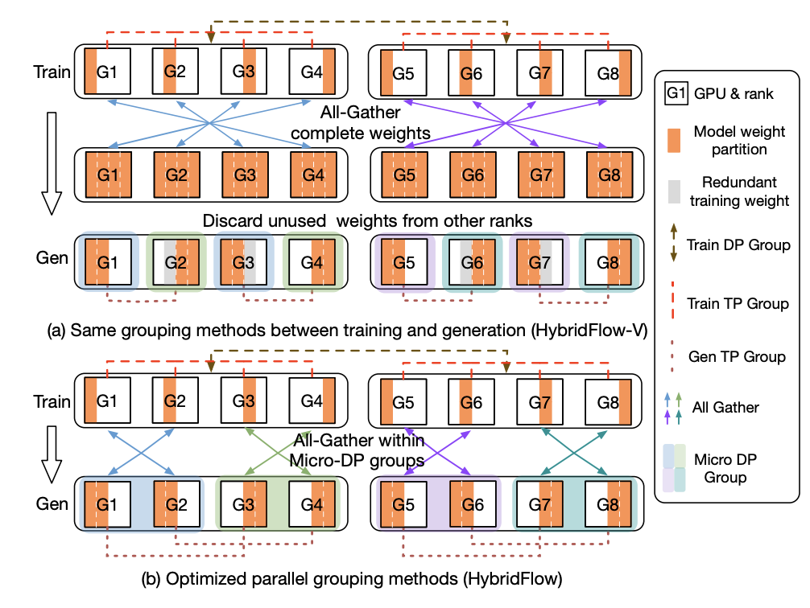
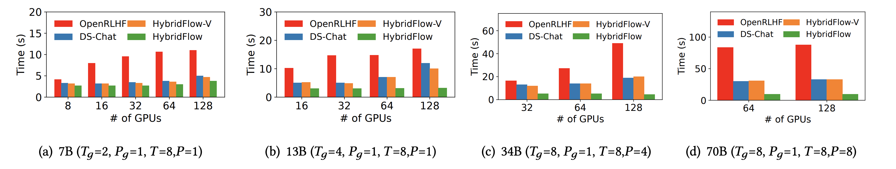
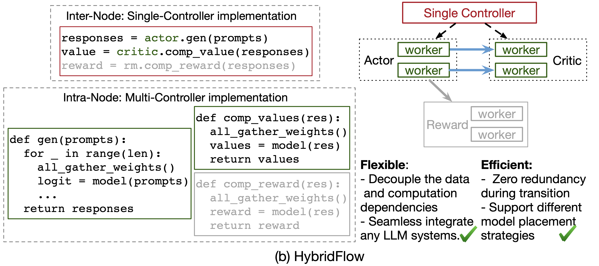
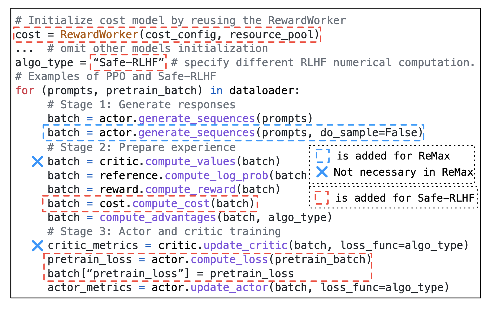
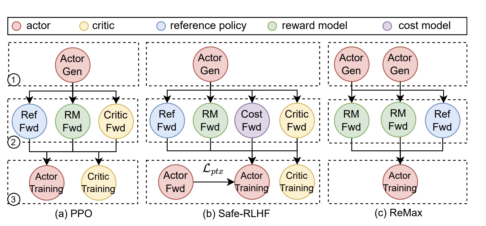
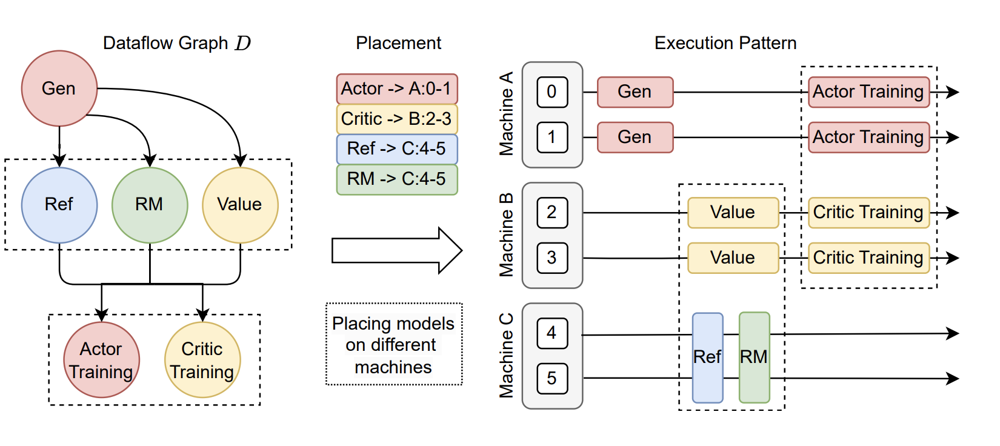
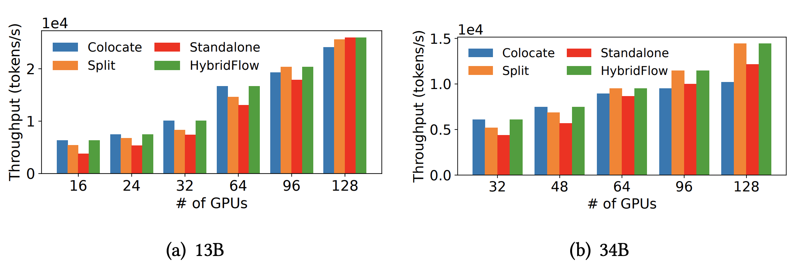

# veRL 源码解析（一）：RLHF 训练框架的挑战与 veRL 的破解之法

## 1. RLHF 工程化的 “不可能三角”

大型语言模型（LLM）的崛起，将强化学习从学术象牙塔推向了工业应用的前沿。RLHF 已成为 LLM 对齐、行为塑造的 “黄金标准”。然而，其工程实现并非坦途。当前业界主流的 RLHF 框架，多是基于现有大模型训练框架（如 Megatron-LM、DeepSpeed）和高性能推理服务（如 vLLM、SGLang）的“缝合怪”。

这种 “胶水工程” 虽然能快速启动，却在系统层面陷入了一个难以调和的 “不可能三角”：极致的性能、灵活的建模、高效的资源利用。

本文作为 veRL 源码解析系列的首篇，将分析 RLHF 工程化的核心痛点，剖析这个“不可能三角”的内在矛盾，并揭示 veRL 及其背后的 HybridFlow 思想，是如何以一种系统性的、颠覆性的思考，为破解这一难题提供了全新的视角。


## 2. 性能瓶颈：训练与推理的高昂 “切换成本”

### 2.1. 核心矛盾

RLHF 流程的核心是 Actor 模型的迭代优化，这天然地将一个模型置于两种截然不同的“工作模式”中：生成（Rollout） 和 模型更新（Update）。Actor 训练是计算密集型，而生成（Rollout）是内存密集型。

**Rollout 模式（推理）**：追求极致的 吞吐量和低延迟。推理引擎（如 vLLM、SGLang）为此进行了大量优化：KV Cache 管理、动态批处理、单机内张量并行 (TP)。

**Update 模式（训练）**：追求极致的 模型规模和训练稳定性。训练框架（如 Megatron-LM、DeepSpeed）为此进行了复杂设计：3D 并行（张量并行 TP、流水线并行 PP、数据并行 DP）、激活重计算、优化器状态分片。

这两种模式的优化目标和实现方式，导致了它们对模型权重的 物理布局（Sharding Scheme） 和 显存管理策略 存在根本性差异。比如我们以 Megatron-LM 和 vLLM 为例：

- **Megatron-LM**：为训练效率，可能将 Transformer 层的 QKV 权重合并并进行列并行切分（TP）；流水线并行则将不同层分布在不同 GPU 上。其参数和优化器状态可能被进一步分片到不同 GPU 甚至 CPU。
- **vLLM/SGLang**：为推理效率，可能需要独立的 Q、K、V 矩阵，或采用不同的张量并行切分方式。其核心显存开销在于 KV Cache，而非模型参数本身。

### 2.2. 切换成本

当同一个 Actor 模型需要在 Rollout 和 Update 模式之间切换时，传统架构的 “缝合怪”不 得不面对一个问题：**模型权重需要被重新组织和传输**。 这种切换可能导致显著的通信和内存开销。例如，对齐一个 70B 模型，每次 RLHF 迭代中将 140GB 的模型权重从训练转移到生成，可能占用迭代时间的 36.4%。

将 GPU A 上的 Megatron 格式权重，拷贝到 CPU，进行复杂的重组（如拆分 QKV、重新切片），再拷贝到 GPU B 上的 vLLM 这个过程**涉及大量的 PCIe 带宽消耗和 CPU 计算**。并且切换过程中，GPU 处于闲置状态，无法进行任何有效计算。这直接导致 RLHF 迭代周期的延长，成为性能瓶颈。

### 2.3. veRL 的破解之法

veRL 提出了一套 3D-HybridEngine，实现了 Actor 模型在训练和生成阶段之间高效重新分配，实现所谓的**零内存冗余并显著减少通信开销**。 

veRL 在**同一组设备上部署 Actor 训练和生成阶段，并使用同一份 Actor 模型权重副本**。这并非简单地将训练和推理模型加载到同一台机器上，而是指**在物理显存层面，模型权重只有一份**。3D-HybridEngine 的目标是让训练引擎和推理引擎能够**共享**这份物理副本，并通过**零成本的 “视图切换”**来适应各自的并行需求。

  

传统的模型权重重分配方法（HybridFlow-V）在训练和生成阶段使用相同的并行分组方法，但由于并行大小不同，会导致部分 GPU 上存在冗余权重，且在切换时需要 All-Gather 完整权重再 Partition。上图的 (a) 子图就展示了这个过程。这种方法导致 GPU 在中间状态的时候会保留了当前阶段不需要的权重。且通信开销巨大：每次切换都需要进行一次 全局的 `All-Gather` 操作，将所有分片汇聚到每个 GPU 上，再进行重新分片。

veRL 提出的核心优化在于 **重新设计生成阶段的并行分组方法，以实现与训练阶段的权重布局** 在物理上的重叠。

上图 (b) 展示了 veRL 的关键优化，其核心思想是：在训练时，就以一种**跨 DP 的张量并行 (TP) 重组方式预设权重布局**，使得生成阶段的 TP 分组在物理上刚好复用训练时的 shard，无需复制。

具体操作如下：

8 个 GPU 的训练 / 生成并行布局：

- PP（流水线并行）数：1（即无切片）
- TP（张量并行）数：2
- DP（数据并行）数：2

共：1 × 2 × 2 = 4 GPU per stage，2 stage → 共 8 GPU

veRL 在训练时将权重按 TP 方向分片后，分布在以下 GPU，每两张为一个 TP 组：

```plain
[G1, G2], [G3, G4], [G5, G6], [G7, G8]
```

而为了切换到生成阶段，假设目标是：

- 生成 TP 数：2（但组合方式不同）
- 微 DP 数：4（每组两张卡）

veRL 提前按照如下方式划分生成 TP 组：

```plain
生成 TP 分组（交叉组合）：
[G1, G3], [G2, G4], [G5, G7], [G6, G8]
生成 Micro-DP 分组：
[G1, G2], [G3, G4], [G5, G6], [G7, G8]
```

这种交叉组合的结构确保了每个生成 TP 组都能复用训练时已有的权重切片。每个 GPU 只保存自己训练时的 shard，不需要为生成阶段额外加载完整的权重副本。

传统方法需要全组 all-gather，再 partition，veRL 只需在 Micro-DP 内做局部 All-Gather 即可。

  

与基线相比，veRL 的平均将切换时间减少了 55.2%，在 70B 模型上更是减少了高达 89.1%。

## 3. 建模瓶颈：被 “胶水代码” 禁锢的算法灵活性

### 3.1. 核心矛盾

RLHF 远非一个固定的算法，它是一个仍在高速演进的研究领域。PPO 只是起点，DPO、IPO、KTO、DAPO 等新算法层出不穷。这些算法的共同特点是：**它们改变了 `Worker` 之间的依赖关系和数据流**。

例如：

1. DPO：抛弃了独立的 Reward Model，直接在偏好数据上优化 Actor，这改变了数据源和损失函数的计算方式
2. DAPO：：在 PPO 的基础上，引入了一个额外的“偏好损失”项，这需要在标准的 PPO 流程中插入新的计算节点
3. 更复杂的奖励机制：可能需要多个 Reward Model（例如，一个用于评估有用性，一个用于评估无害性），并将它们的输出进行加权组合

这些算法的共同特点是：**它们改变了计算节点的数量、类型，以及节点之间的数据依赖关系**。

然而，现有的 RLHF 框架大多采用 多控制器 (multi-controller) 范式。在这种范式下，每个模型（Actor, Critic 等）都由一个独立的分布式程序来管理。开发者必须在每个程序的代码中，手动处理复杂的集体通信（如 all_gather）和点对点通信，以协调数据流。

这种 “计算与通信深度嵌套” 的模式，导致整个系统变得极其僵化。当需要从 PPO 切换到 Safe-RLHF 时，开发者可能需要修改所有相关模型的代码，以适应新的 cost model 带来的数据流变化。

### 3.2. 分层混合编程模型

veRL 提出了一种分层混合编程模型，其思想精髓如下图所示：

  

veRL 将系统解耦为两个层次：

**上层：单控制器 (Single-Controller) 协调数据流**

在这一层，整个 RLHF 流程被抽象为一个由多个逻辑模型节点构成的 数据流图 (Dataflow Graph)。开发者面对的是一组高层 API，如 `actor.generate_sequences()`、`critic.compute_values()`。他们可以用 简单的、顺序的 Python 代码来描述算法逻辑，就像在单机上编程一样。

下图展示了这种模式的好处：从 PPO 切换到 ReMax 或 Safe-RLHF，真的只需要 **增删或修改几行高层 API 调用** 即可，无需关心底层的分布式实现。

  

**下层：多控制器 (Multi-Controller) 执行分布式计算**

在高层 API 的背后，每个模型节点（Worker）内部依然采用高效的多控制器范式。当 `actor.update_actor()` veRL 会自动地在分配给 Actor 的一组 GPU 上，执行一个高效的分布式训练任务（例如，由 Megatron-LM 驱动）。

这一层负责处理所有复杂的并行计算、梯度同步等，但其复杂性被完全封装在 Worker 内部，不会暴露给上层的算法逻辑开发者。

通过这种 **“上层单控灵活编排，下层多控高效执行”** 的分层设计，veRL 成功地 解耦了“算法逻辑”与“分布式实现”。这使得算法研究者可以专注于算法本身的创新，而系统工程师可以专注于底层计算的优化，两者互不干扰。

## 4. 资源瓶颈：被“静态绑定”浪费的 GPU

“不可能三角”的最后一个顶点，是资源利用效率。在动辄需要数百张 GPU 的 RLHF 训练中，每一分的 GPU 资源都极其宝贵。

### 4.1. 核心矛盾

RLHF 流程中的各个模型，其工作负载和资源需求是高度 异构 (heterogeneous) 的。 为了更好的对齐效果，实践中经常使用小尺寸的 Actor（例如 7B）搭配大尺寸的 Critic 和 Reward Model（例如 70B）。此外不同 Worker 的活跃时间也不同，Actor 在生成和训练阶段都活跃，而 Critic 和 Reward Model 只在准备（Preparation）和训练（Training）阶段的特定步骤中才参与计算。

  

上图中阶段 1，2，3 分别表示生成（Generation）、准备（Preparation）和训练（Training）。

现有的 RLHF 框架（如 DeepSpeed-Chat, NeMo-Aligner）往往采用简单的 静态放置策略。例如：

- 完全共置 (Colocate)：将所有模型放置在同一组 GPU 上，如 DeepSpeed-Chat。这种策略虽然最大化了 GPU 的“繁忙”时间，但由于不同模型的工作负载不均衡，会导致计算/通信效率低下，无法充分利用每张卡的算力。
- 完全分离 (Standalone)：为每个模型分配独立的 GPU 资源，如 OpenRLHF。这种策略虽然可以为每个模型量身定制并行策略，但下图展示了其弊端：在 Rollout 阶段，分配给 Critic、Ref 和 RM 的 GPU 将 完全空闲。

  

这种一刀切式的静态资源绑定，无法适应 RLHF 任务的动态和异构特性。

### 4.2. veRL 的灵活放置与自动映射

veRL 的核心思想是 将模型放置（Placement）本身也视为一个可优化的变量。 

veRL 首先将物理的 GPU 设备虚拟化为逻辑上的 `ResourcePool`。这是一个关键的解耦步骤，它将“计算任务”与“物理硬件”分离开来。 开发者可以决定如何将不同的 Worker 映射到不同的 ResourcePool 上。

- 映射到 **同一个** ResourcePool 的模型，将实现 **共置 (colocate)**，共享同一组 GPU 资源，并通过时间分片的方式顺序执行，以避免 OOM。
- 映射到 **不同的** ResourcePool 的模型，将被部署在物理隔离的 GPU 上，它们的执行可以 **自动并行**。

手动配置模型放置策略仍然需要大量的专家经验。为此 veRL 提出了一个自动设备映射算法，该算法的目标是，在给定的硬件集群（总 GPU 数量 N，单机 GPU 数量 Q）和 RLHF 数据流图（模型 L 及其工作负载 W）下，自动搜索出能 **最小化端到端延迟** 的最优放置方案。

它的工作流程是这样的：

1. **枚举放置计划 (Placement)**：算法首先枚举所有可能的模型划分方式（get_placements），例如，是 `{Actor, Critic, RM}` 全部分离，还是 `{Actor, Ref}` 共置，`{Critic, RM}` 共置。
2. **枚举资源分配 (Allocation)**：对于每一种放置计划，算法会枚举所有可能的 GPU 资源分配方案（`enum_alloc`）。
3. **自动并行策略搜索 (Auto-Parallelism)**：在给定的放置和资源分配下，算法会为每个 Worker 调用一个 auto_parallel 模块，该模块利用一个 **性能模拟器 (simu)** 来搜索最优的并行策略（TP, PP, DP 的组合）。
4. **成本估算与决策**：最后，通过一个 `d_cost` 函数估算整个数据流图的总延迟，并找出使延迟最小化的那一套完整的“放置+分配+并行”策略。

我们会在后续的源码解析部分来深入探究这里的流程，不过我认为目前 veRL 的自动并行策略搜索是一个非常有前景的方向，就像传统分布式中的自动并行一样，它可以大大降低 RLHF 系统的工程复杂度。

下图给了不同放置策略下 veRL 的吞吐：

  

在小规模集群（< 96 GPU）上，算法倾向于选择 `colocate` 策略，以最大化 GPU 利用率。在超大规模集群（> 96 GPU）上，算法则会自动切换到 `split` 或 `standalone` 策略，因为此时通过任务并行获得的收益，已经超过了 GPU 阶段性空闲带来的损失。


## 5. 总结

回到我们最初提出的 RLHF 工程化“不可能三角”——极致的性能、灵活的建模、高效的资源利用。传统的 RLHF 框架，由于其“缝合”的本质，往往只能顾此失彼，在三者之间做出痛苦的妥协。

veRL 通过一套连贯的、分层的设计哲学，对整个 RLHF 流程进行了系统性的重构。

面对训练和推理异构并行导致的权重重组开销， veRL 提出了革命性的`3D-HybridEngine`。它通过精心设计的交叉并行分组策略，使得生成阶段可以直接复用训练阶段的权重分片，避免了全局 All-Gather，实现了最小化的通信开销。

面对算法快速演进带来的建模僵化问题，veRL 采用了 “上层单控，下层多控” 的分层编程模型。上层提供给算法开发者的是一套简洁、灵活的高层 API，可以像搭积木一样轻松构建和修改算法流程；下层则将复杂的分布式计算完全封装在 Worker 内部。这种 “逻辑与实现” 的彻底解耦，为算法的快速迭代提供了非常大的自由度。

面对 GPU 资源的巨大浪费，veRL 提供了从 “共置分时复用” 到 “分离并行执行” 的灵活放置选项，更设计了一套**自动映射算法**，能够根据硬件和模型特性，自动搜索出最优的“放置+分配+并行”组合策略。

在本系列接下来的文章中，我们将深入 veRL 的开源代码，逐一剖析这些颠覆性的思想是如何被转化为一行行精巧、高效的工程实现的，敬请期待。


