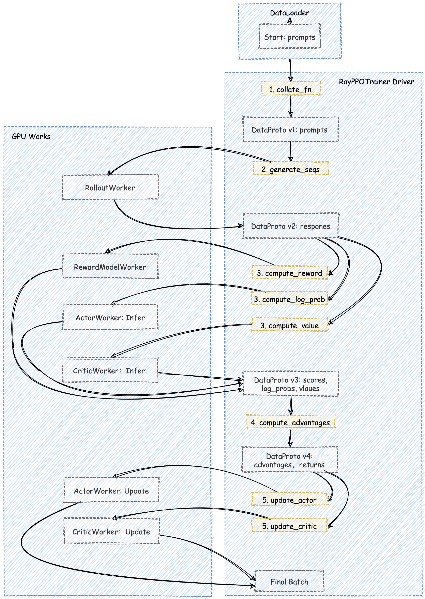

# veRL 源码解析（二）：四大核心组件与调度中心

## 1. 引言

在上一篇文章中，我们探讨了 veRL 的设计哲学，为解决 RLHF 工程化的“不可能三角”指明了方向。

本篇文章将深入 veRL 的开源代码，聚焦于 veRL 的核心架构，希望大家可以带着问题来阅读本篇文章：

1. 构成 veRL 系统骨架的 “四梁八柱” 分别是什么？
2. 中心调度器，是如何将这些独立的部件组织起来协同工作的？
3. 在一次完整的 PPO 迭代中，数据是如何在这些组件之间流动并驱动模型学习的？

## 2. `Worker` 的四大核心角色

在深入 veRL 的具体组件之前，我们先简要回顾一下它所服务的核心算法——近端策略优化（PPO） 的工作流程。**PPO 驱动的 RLHF 流程，本质上是一个“生成-评估-学习”的循环迭代过程**，通常包含以下三个核心阶段：

1. **生成 (Rollout)**：使用当前版本的 Actor 模型，针对一批给定的 prompt，生成相应的 response。这是产生新经验数据的过程
2. **评估 (Evaluation / Preparation)**：对生成的数据进行“打分”和“评估”
    - Reward Model 负责从“人类偏好”的角度，给 response 打一个奖励分数 reward
    - Critic Model 负责从“策略价值”的角度，评估在当前状态下，未来能获得的总回报期望值 value
    - Actor Model 和 Reference Model 负责计算生成该 response 的对数概率 log_probs，用于后续计算策略更新的幅度
3. **学习 (Learning / Update)**：利用评估阶段产生的所有信息（reward, value, log_probs），计算出 **优势函数(Advantage)**，并最终用它来更新 Actor 和 Critic 的模型参数。

在 veRL 的架构里，所有的计算任务，无论多么复杂，都被统一抽象为一种名为 `Worker` 的基本单元。这种设计体现了软件工程中 “接口统一” 和 “关注点分离” 的核心思想。 Worker 是 veRL 分布式系统中的 “功能器官”，每个 Worker 都封装了特定的模型、配置和计算逻辑，独立自主地完成自己的任务。

在典型的基于 PPO 的 RLHF 流程中，veRL 的“四梁八柱”正是由以下四种核心的 Worker 角色构成：

**1、经验的生产者：`RolloutWorker`**

作为 RLHF 流程的起点，RolloutWorker 使用当前 Actor 策略生成 (prompt, response) 经验对。veRL 并不重复造轮子去实现一个推理引擎，而是将 RolloutWorker 设计成一个通用的接口，支持多种推理引擎（如 vLLM/SGLang 等）。

**2、偏好的打分者：`RewardModelWorker`**

RewardModelWorker 负责模拟人类偏好，为生成的 response 打分，提供核心的 reward 信号。

RewardModelWorker 是一个完全独立的打分模型。它的模型结构通常与 Critic 类似，都拥有一个输出标量的 价值头 (Value Head)。但它加载的是一套在人类偏好数据集上专门训练过的权重。它的存在，是将“客观的价值判断”（基于人类标注）从 Actor 的策略优化中分离出来。

**3、价值的评估者：`CriticWorker`**

Critic 的作用不是判断 response 的好坏，而是评估 Actor 当前策略的“平均水平”。它的训练是一个经典的监督学习过程，其目标（“标签”）是 RayPPOTrainer 根据 reward 计算出的未来总回报（Return）。

通过不断让自己的预测逼近 returns，Critic 为 Actor 的更新提供了一个动态的、准确的“参照系”，告诉 Actor 某个 action 带来的 reward 究竟是“意料之中的好”还是“出乎意料的好”，从而让学习过程更加稳定。

**4、策略的执行者与学习者：`ActorWorker`**

Actor 的学习不是无的放矢的。它更新的唯一依据，是 PPO 算法的核心——**优势函数 `A(s, a)`** 和 **裁剪目标函数**。 作为 RLHF 的核心，它既要评估策略（计算 `log_probs`），也要学习策略（根据 `advantage` 更新模型）。

本篇文章中，我们先不深入到这些 Worker 的实现里面，大家只需要知道它们的职责和功能即可。在后续文章里面，我们会逐一剖析这些 Worker 的内部实现。

## 3. veRL 的指挥棒：Hydra 配置系统

在我们深入 RayPPOTrainer 这个调度中心之前，必须先了解 veRL 是如何管理其庞大而复杂的参数体系的。如果你直接去看 RayPPOTrainer 的初始化代码，会发现它接收一个名为 config 的核心对象，它几乎控制着从模型结构到训练流程的每一个细节。这个 config 对象从何而来？

答案是 Hydra，veRL 全面拥抱了由 Facebook Research 开发的 Hydra 框架作为其配置管理系统。理解 Hydra 是读懂 veRL 如何运行和实验的关键第一步。

### 3.1. 分层组合：像搭积木一样构建配置

通过对源码的分析，我们可以看到在训练主入口 `verl/trainer/main_ppo.py` 中，有一个关键的装饰器：

```python
# verl/trainer/main_ppo.py

@hydra.main(config_path="config", config_name="ppo_trainer", version_base=None)
def main(config):
    # ...
    run_ppo(config)
```

Hydra 允许我们将配置按模块拆分到不同的 YAML 文件中，然后在主配置文件里像搭积木一样把它们“组合”起来。

veRL 的基础配置位于 `verl/trainer/config/` 目录下。其中，`ppo_trainer.yaml` 是一个核心的基础配置文件，它定义了 PPO 训练所需的大部分默认参数。它内部也使用了 defaults 列表来组合更细粒度的模块，比如 Actor 和 Critic 的配置：

```yaml
# verl/trainer/config/ppo_trainer.yaml

defaults:
  # 引入 actor 的默认配置，来自于 actor/dp_actor.yaml
  - actor@actor_rollout_ref.actor: dp_actor
  # 引入 critic 的默认配置，来自于 critic/dp_critic.yaml
  - critic@critic: dp_critic
  # ... 其他模块
  - _self_ # 表示合并当前文件中的其他配置
```

### 3.2. 实验覆盖：在不修改源码的情况下进行实验

这种组合模式在运行具体实验时会非常的方便，我们用 `gsm8k_multiturn_grpo.yaml` 来举例看一下：

```yaml
# examples/sglang_multiturn/config/gsm8k_multiturn_grpo.yaml

hydra:
  searchpath:
    - file://verl/trainer/config

defaults:
  - ppo_trainer  # <--- 关键：首先，加载所有 ppo_trainer.yaml 的默认配置
  - _self_       # <--- 然后，应用当前文件中的覆盖配置

# ---- 以下是针对本实验的特定覆盖 ----
data:
  max_prompt_length: 1024
  train_batch_size: 256
  # ...

actor_rollout_ref:
  rollout:
    name: sglang # 将默认的 rollout 引擎改为 sglang
    multi_turn:
      enable: True # 开启多轮对话模式
      # ...
```

当你通过命令行启动这个实验时，Hydra 首先加载 `ppo_trainer.yaml` 及其引用的所有基础配置。然后，将 `gsm8k_multiturn_grpo.yaml` 中的配置覆盖到基础配置之上。在了解了 Hydra 的工作原理后，我们就可以继续来看 veRL 的核心调度器 RayPPOTrainer 了。


## 4. 调度中心：`RayPPOTrainer`

`RayPPOTrainer` 是 veRL 的核心调度器，它不亲自执行繁重的计算任务，但负责**编排整个 PPO 流程**，驱动各个 Worker 在正确的时间做正确的事，并管理它们之间的数据流转。

### 4.1. 静态的“执行图”

RayPPOTrainer 的核心是其 `fit()` 方法。这段代码虽然是一个 Python for 循环，但我们不应将其看作一个简单的循环，而应将其理解为一个 **被代码固化下来的 Execution Graph**。

```python
# verl/trainer/ppo/ray_trainer.py
class RayPPOTrainer:
    def fit(self):
        """
        PPO 训练的主循环。
        这个方法是 veRL 的“心脏”，它编排了所有 Worker 的协作，
        并以一种部分并行的模式，高效地执行 RLHF 的每一步。
        """
        # ... (初始化 logger, progress_bar, global_steps 等) ...

        for epoch in range(self.config.trainer.total_epochs):
            for batch_dict in self.train_dataloader:
                metrics = {}      # 用于收集当前 step 的所有监控指标
                timing_raw = {}   # 用于收集当前 step 的各阶段耗时

                # ... (处理 profiler 的启动逻辑) ...

                # 将从 dataloader 来的原始字典，转换为 veRL 的标准数据结构 DataProto
                batch: DataProto = DataProto.from_single_dict(batch_dict)

                # 准备生成(Rollout)阶段的输入数据。
                # 从主 batch 中 pop 出仅用于生成的 keys，剩下的 keys 用于后续阶段。
                # 这样做可以减小 RPC 传输的数据量。
                gen_batch = batch.pop(
                    batch_keys=["input_ids", "attention_mask", "position_ids"],
                    non_tensor_batch_keys=["raw_prompt_ids", ...], # 其他非张量key
                )

                # ... (数据重复，以匹配 rollout.n 的设置) ...

                # =================================================================
                # == STAGE 1: Rollout - 生成经验数据
                # =================================================================
                # 根据配置，选择同步或异步模式进行生成
                if not self.async_rollout_mode:
                    # 同步模式：直接调用，阻塞直到生成完成
                    gen_batch_output = self.actor_rollout_wg.generate_sequences(gen_batch)
                else:
                    # 异步模式：通过 AgentLoopManager 提交生成请求
                    gen_batch_output = self.async_rollout_manager.generate_sequences(gen_batch)

                # =================================================================
                # == STAGE 2: 数据聚合与准备
                # =================================================================

                # 将生成的结果 (如 responses) 合并回主 batch 对象
                batch = batch.union(gen_batch_output)

                # ... (可选的数据平衡操作，如 _balance_batch) ...

                # =================================================================
                # == STAGE 3: 并行计算 Logits, Values
                # =================================================================
  
                # 在 reward 任务异步执行的同时，并行执行以下 RPC 调用
  
                # 3a. 计算旧策略的 Log Probs
                old_log_prob = self.actor_rollout_wg.compute_log_prob(batch)
                entropys = old_log_prob.batch["entropys"]
                response_masks = batch.batch["response_mask"]
                loss_agg_mode = self.config.actor_rollout_ref.actor.loss_agg_mode
                entropy_agg = agg_loss(loss_mat=entropys, loss_mask=response_masks, loss_agg_mode=loss_agg_mode)
                old_log_prob_metrics = {"actor/entropy": entropy_agg.detach().item()}
                metrics.update(old_log_prob_metrics)
                old_log_prob.batch.pop("entropys")
                batch = batch.union(old_log_prob)
  
                # ... (此处省略了 rollout_log_probs 和 actor_log_probs 的差异计算，与主逻辑无关)
  
                # 3b. 计算参考策略的 Log Probs
                if self.use_reference_policy:
                    # compute reference log_prob
                    with marked_timer("ref", timing_raw, color="olive"):
                        if not self.ref_in_actor:
                            ref_log_prob = self.ref_policy_wg.compute_ref_log_prob(batch)
                        else:
                            ref_log_prob = self.actor_rollout_wg.compute_ref_log_prob(batch)
                        batch = batch.union(ref_log_prob)
  
                # 3c. 计算 Critic 的 Values
                if self.use_critic:
                    with marked_timer("values", timing_raw, color="cyan"):
                        values = self.critic_wg.compute_values(batch)
                        batch = batch.union(values)

                # =================================================================
                # == STAGE 4: 同步与 Reward/Advantage 计算
                # =================================================================
                with marked_timer("adv", timing_raw, color="brown"):
                    # 4a. 计算 Reward (可能是异步的)
                    if self.use_rm:
                        reward_tensor = self.rm_wg.compute_rm_score(batch)
                        batch = batch.union(reward_tensor)
  
                    if self.config.reward_model.launch_reward_fn_async:
                        future_reward = compute_reward_async.remote(batch, self.config, self.tokenizer)
                        reward_tensor, reward_extra_infos_dict = ray.get(future_reward)
                    else:
                        reward_tensor, reward_extra_infos_dict = compute_reward(batch, self.reward_fn)
  
                    # 将最终的 reward 分数放入 batch
                    batch.batch["token_level_scores"] = reward_tensor
  
                    # ... (可选的 KL 惩罚项应用) ...
  
                    # 4b. 在 Driver 端，利用已有的 rewards 和 values 计算 advantage 和 returns
                    batch = compute_advantage(batch, ...)

                # =================================================================
                # == STAGE 5: 模型更新
                # =================================================================

                # 5a. 更新 Critic 网络
                if self.use_critic:
                    critic_output = self.critic_wg.update_critic(batch)
                    # ... (收集 critic 的训练指标) ...

                # 5b. 更新 Actor 网络 (在 critic warmup 之后)
                if self.config.trainer.critic_warmup <= self.global_steps:
                    actor_output = self.actor_rollout_wg.update_actor(batch)
                    # ... (收集 actor 的训练指标) ...

            # ... (日志记录、checkpoint 保存、验证集评估等收尾工作) ...
```

`fit()` 方法的结构与 PPO 的三阶段理论完全对应。代码的顺序就是数据流动的顺序，可读性极强。所有的计算任务都由 RayPPOTrainer 这个单一实体发起调用（`self.actor_rollout_wg.generate_sequences(...)`），而不是分散在各个 Worker 内部。

并且得益于 Ray 的分布式特性，不存在数据依赖的 Worker 之间可以并行执行。我们在代码里面可以看到 `compute_reward_async.remote` 的调用，它会将计算任务异步提交给 Ray 的调度器，而不阻塞当前线程。

这种 单控制器 (Single-Controller) 模式，使得 veRL 极大地简化了复杂数据依赖的管理。

### 4.2. 统一的通信接口：`WorkerGroup`

RayWorkerGroup 的核心使命，是将 RayPPOTrainer 发出的 单一逻辑指令，转化为对底层 **一组 Ray Actor** 的具体物理操作。它封装了所有“一对多”的复杂通信模式。

我们来看它是如何通过 `@register` 装饰器和 `func_generator` 实现这一点的。当 veRL 启动时，RayWorkerGroup 动态地为每个注册了的 Worker 方法（如 update_actor）生成一个代理方法。

```python
@register(dispatch_mode=DP_COMPUTE_PROTO)
def update_actor(self, data: DataProto):
    ...
```

这个装饰器的内部实现如下：

```python
# verl/single_controller/ray/base.py
# func_generator 的作用是为 WorkerGroup 动态创建代理方法
def func_generator(self, method_name, dispatch_fn, collect_fn, execute_fn, blocking):
    class Functor:
        def __call__(this, *args, **kwargs):
            # 1. 分发数据：根据 dispatch_fn，将数据切片或广播
            args, kwargs = dispatch_fn(self, *args, **kwargs)
            # 2. 执行任务：调用 execute_fn，将任务发送给所有底层的 actor
            output = execute_fn(method_name, *args, **kwargs)
            # 3. （可选）阻塞等待结果
            if blocking:
                output = ray.get(output)
            # 4. 收集结果：根据 collect_fn，将所有 actor 的返回结果聚合
            output = collect_fn(self, output)
            return output
    return type(method_name, (Functor,), {})()
```

它定义了 RayPPOTrainer 的一次方法调用所经历的完整生命周期：**分发 -> 执行 -> 收集**。

现在，我们看 RayWorkerGroup 是如何使用这个模板的。`execute_fn` 通常会指向 `execute_all_async`。

```python
# verl/single_controller/ray/base.py
class RayWorkerGroup(WorkerGroup):
    def execute_all_async(self, method_name: str, *args, **kwargs):
        # ...
        # 检查参数是否是需要为每个 worker 单独指定的列表
        # (这是实现 DP_COMPUTE_PROTO 的关键)
        if all(isinstance(arg, list) and len(arg) == len(self._workers) for arg in args):
            # 如果是，则为每个 worker 分配其对应的数据切片
            result = []
            for i in range(len(self._workers)):
                sliced_args = tuple(arg[i] for arg in args)
                # ...
                result.append(
                    self._execute_remote_single_worker(
                        self._workers[i], 
                        method_name, 
                        *sliced_args,
                        **sliced_kwargs
                    )
                )
            return result

        # 默认情况：将相同的参数广播给所有 worker
        return [self._execute_remote_single_worker(worker, method_name, *args, **kwargs)
                for worker in self._workers]

    def _execute_remote_single_worker(self, worker, method_name: str, *args, **kwargs):
        # 最终，调用底层 Ray Actor 的远程方法
        remote_call = getattr(worker, method_name)
        return remote_call.remote(*args, **kwargs)
```

当 RayPPOTrainer 调用 `actor_wg.update_actor(batch)` 时，它实际上触发的是 RayWorkerGroup 中那个动态生成的代理方法。

代理方法首先会调用一个 `dispatch_fn`。这个函数会根据 `@register` 中定义的 `dispatch_mode`（如 `DP_COMPUTE_PROTO`）来处理数据。如果是 DP 模式，它会将 batch 切分成多份，为 `execute_all_async` 准备好一个参数列表。如果是广播模式，它则什么都不做。

`execute_all_async` 接收到分发后的参数。它会遍历内部持有的所有底层 Worker Actor 的句柄（`self._workers`），并通过 `ray.remote()` 调用它们各自的同名方法。这一步是并行的，Ray 会将这些远程任务调度到对应的 GPU 上执行。

任务执行后返回的是一组 Ray ObjectRef（future 对象）。代理方法接着会调用一个 `collect_fn`，它可能会对这组 future 执行 `ray.get()` 来同步等待所有结果，或者对返回的数据进行聚合（如 all_reduce）。

通过 RayWorkerGroup 这个强大的抽象层，RayPPOTrainer 的调度代码变得异常简洁。它只需要说：“Actor 们，更新你们自己(update_actor)”，而完全**无需关心 Actor 到底有几个、分布在哪里、数据应该如何切分**。所有这些复杂的分布式通信和任务管理，都被 RayWorkerGroup 优雅地封装了起来。这正是 veRL 能够同时支持多种并行策略而上层代码保持不变的关键所在。

## 5. 数据的“生命周期”

在 veRL 中，所有在 Worker 之间流转的数据，都被统一封装在一个名为 DataProto 的数据结构中。它不仅仅是一个字典，更承载着 RLHF 流程中所有的信息演变。理解 DataProto 的生命周期，对理解 veRL 系统如何协作非常重要。

在我们追踪 DataProto 在各个 Worker 之间的旅程之前，我们有必要先回答一个更根本的问题：**第一个 `DataProto` 对象是如何诞生的？**

在 veRL 中，DataProto 的声明周期是：

**Parquet 文件 -> RLHFDataset -> DataLoader -> batch_dict -> DataProto**

Parquet 是 veRL 推荐的数据格式，通常包含 prompt 文本和相关元信息。RLHFDataset 负责读取本地或远程 Parquet 文件，按 max_prompt_length 过滤样本，并应用聊天模板格式化对话。随后，执行分词、填充、截断，将样本转为固定长度的张量。

DataLoader 在 RayPPOTrainer 中创建，将处理后的样本组织成 batch，产出 batch_dict。

此时，DataProto 登场。通过 `DataProto.from_single_dict(batch_dict)`，普通字典被封装为 veRL 内部统一的数据协议，正式进入 RLHF 流程。

加下来我们将以一次 PPO 迭代为例，用一张 端到端的数据流图 来追踪 DataProto 的演变过程。

  

RayPPOTrainer 的 fit() 循环从 `train_dataloader` 中取出一个 `batch_dict`。这个字典通常只包含 `input_ids`、`attention_mask` 等表示 prompt 的基本信息。这些信息被封装成第一个版本的 DataProto 对象。

接下来进入到 PPO 的 生成 (Generation) 和 准备 (Preparation) 阶段。这个初生的 DataProto 开始了它的旅程，它被 RayPPOTrainer 依次（或并行地）发送给各个 Worker，每经过一个，就会被赋予新的信息。

流经 `RolloutWorker`：DataProto v1 被发送去执行 `generate_sequences`。RolloutWorker 返回生成的 responses，并将其合并，形成 DataProto v2。

DataProto v2 被同时发送给 RewardModelWorker, ActorWorker (执行 `compute_log_prob`), 和 CriticWorker (执行 `compute_values`)。

这三个 Worker 并行地完成计算，各自返回自己的结果。RayPPOTrainer 将这些结果全部合并，形成了 DataProto v3。

此时的 DataProto v3 已经包含了计算优势函数所需的所有输入。这个计算通常是轻量级的，因此 RayPPOTrainer 会在 Driver 进程本地 直接调用 `compute_advantage` 函数。

`compute_advantage` 函数会计算出 `advantages` 和 `returns`，并将其加入到数据中，至此，DataProto v4 已经准备好了。

接下来 DataProto v4 被最后一次分发，分别发送给 ActorWorker 和 CriticWorker 的 update 方法。

ActorWorker 从中取出 `advantages`, `old_log_probs` 等信息，计算 PPO 损失并更新自己的权重。CriticWorker 从中取出 returns 作为学习目标，计算 MSE 损失并更新自己的权重。它们返回训练过程中的 metrics，标志着 DataProto 在本次迭代中的使命正式完成。

## 6. 总结

通过本篇文章的分析，我们解构了 veRL 的静态核心架构。我们看到，veRL 通过：

1. 权责分明的 `Worker` 角色 (四梁八柱)
2. 中心化的 `RayPPOTrainer` 调度器 (中枢神经系统)
3. 统一的 `DataProto` 数据载体

成功地将一个复杂的分布式系统，组织成了一个逻辑清晰、协作有序的整体。它的代码真的太优雅了，看的我好感动，希望大家也能感受到这种美，veRL 的设计哲学和架构思路非常值得我们学习。

下面的文章中，我们将继续深入 veRL 的源码，来看它如何实现零拷贝共享，敬请期待！


