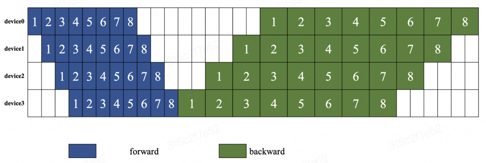
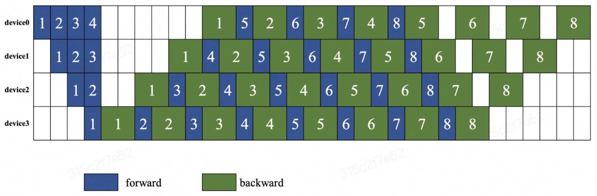

# Paddle流水并行编排与执行流程

## 简介

流水线并行是一种模型并行技术,它沿着前向计算和反向传播的方向,将深度学习模型划分成多个线性的阶段,使不同阶段可以并行运行在不同的设备上。这种并行方式可以有效提升计算效率,缩短训练时间。

在流水线并行中,一个训练步骤通常被划分为三个子阶段:

- Forward: 前向计算,每个阶段计算并输出中间结果给下一个阶段;
- Backward: 反向传播,每个阶段根据上一个阶段的梯度计算并传递当前阶段的梯度;
- Update: 参数更新,收集所有阶段的梯度并更新模型参数。

通过并行运行,不同阶段的计算可以高效重叠,极大提升吞吐量。

Paddle 通过 Strategy 和 Engine 等模块支持流水线并行。用户只需简单配置,即可对模型自动进行流水线切分,简化训练流程。

Engine 是 Paddle 中用于支持流水线并行的高层API (`python/paddle/distributed/auto_parallel/static/engine.py`)

Engine提供了高层封装,整合了自动并行转换、执行调度等关键流程。通过 Strategy 配置流水线策略, Engine 可以自动对模型进行流水线切分,生成分段Program; 然后组织分布式执行, 大幅降低使用门槛。

后面我们将详细介绍Engine中流水线并行的自动编排与执行流程的核心代码实现。

## 流水线并行策略配置

在Engine中,流水线并行策略是按照传入的strategy配置的。比如你想使用 `FThenB` 的流水线并行策略, 可以这样配置:

```python
# From test/auto_parallel/pipeline_scheduler_unittest.py
def apply_pass(schedule_mode="FThenB", enable_send_recv_overlap=False):
    strategy = auto.Strategy()
    strategy.auto_mode = "semi"
    strategy.reinit = True

    pipeline = strategy.pipeline
    pipeline.enable = True
    pipeline.schedule_mode = schedule_mode
    pipeline.accumulate_steps = 4
    pipeline.enable_send_recv_overlap = enable_send_recv_overlap

    return strategy

def main():
    strategy = apply_pass(schedule_mode="FThenB", enable_send_recv_overlap=False)
    model = xxx
    loss = xxx
    opt = xxx
    engine = auto.Engine(model, loss, opt, strategy=strategy)
```

`auto.Strategy` 是一个配置类，主要用于存储用户配置的策略信息。流水线并行策略主要包含 `FThenB`、`1F1B` 两种模式。 

下面我们用两张图来说明两种编排模式。下图说明了 `FThenB` 的编排模式，等待所有的设备都执行完前向计算后，再执行反向传播。

  

在 `1F1B` 的编排模式下，每个设备先执行前向计算，然后再执行反向传播。不等待所有设备都执行完前向计算，就开始执行反向传播。

  

## 自动编排阶段

Engine在接收到用户定义的流水线并行策略后,会自动完成训练 Program 的并行编排。下面我们以 Engine 中的 `_prepare_program` 方法作为基线, 来看看具体的实现逻辑。

`_prepare_program()` 方法主要包含模型的构建、规划、并行化和初始化等过程。它的代码如下:

```cpp
def _prepare_program(self, mode, init_parameters=True):
    # Do the build process
    self._build(mode)
    # Do the planning process
    self._plan(mode)
    # Do the parallel process
    self._parallel(mode)
    # Init comm
    self._init_comm()
    if init_parameters:
        # startup program
        self._initialize(mode)
    self._has_prepared[mode] = True
```

具体来说:

1. _build() 方法会构建计算图。在动态图模式下,会调用to_static方法将动态图转为静态图;在静态图模式下, 会直接构建静态计算图。
2. _plan() 方法会进行并行策略的规划,生成并行方案。
3. _parallel() 方法会根据并行方案对模型进行并行化改造。 
4. _init_comm() 方法会实例化 Program 中的通信操作。
5. _initialize() 方法会进行参数初始化等操作,完成并行环境的准备。

其中 `_build()`、`_plan()` 和 `_parallel()` 是核心的模型构建和并行化过程。`_init_comm()` 和 `_initialize()` 则主要是进行并行环境的初始化。

`_prepare_program()` 方法被 `fit()`、`evaluate()`、`predict()` 等调用, 目的是在训练/验证/预测前构建并准备好并行执行的环境。这样后续的训练循环等就可以直接在这个环境下高效地运行了。

### 串行 program 的构建

:::tip

PaddlePaddle 的 Program 是一个计算图，它描述了一个深度学习模型的结构和计算过程。 ([Program 介绍](https://space.keter.top/docs/high_performance/%E6%B7%B1%E5%BA%A6%E5%AD%A6%E4%B9%A0%E6%A1%86%E6%9E%B6%E5%BC%80%E5%8F%91/%E9%9D%99%E6%80%81%E5%9B%BE%E7%BB%84%E7%BD%91%E8%BF%87%E7%A8%8B#%E4%BB%80%E4%B9%88%E6%98%AF-program))

:::

_build()函数是 AutoParallel 中的模型构建过程, 它会构建计算图来表示模型。 `_build` 函数首先检测当前的执行模式，以确定是动态图还是静态图模式。如果当前处于动态图模式，函数会进入这个分支。在动态图模式下，模型的构建是动态的，因此需要创建一个 `ProgramHelper` 实例，该实例帮助构建动态图。它包括创建前向计算图、计算损失和度量指标等。在静态图模式下，模型的计算图是静态的，因此函数会克隆原始的静态计算图，并创建占位符（placeholder）用于输入数据和标签。

```python
# From python/paddle/distributed/auto_parallel/static/engine.py
def _build(self, mode):
    # 检查当前是否在动态图模式，或者已经处于动态图模式
    if in_dynamic_mode() or self._dygraph_mode:
        # 进入动态图模式
        paddle.disable_static()  # 关闭静态图模式
        self._dygraph_mode = True  # 标记当前为动态图模式
        self._logger.info("Building model with 'to_static' method.")

        # 创建 ProgramHelper 对象，用于帮助构建计算图
        self.program_helper = ProgramHelper(
            self._model,
            self._loss,
            self._metrics,
            self._inputs_spec,
            self._labels_spec,
        )
        # 构建前向计算主Program
        with utils.unique_name.guard():
            self.program_helper.build_program(mode)

        # 获取具体的计算图（Concrete Program）以及静态图模式下的主Program和启动Program
        self.concrete_program = self.program_helper.concrete_program
        serial_main_prog = self.program_helper.main_program
        serial_startup_prog = self.program_helper.startup_program

        # 获取输入数据和标签，以及模型的输出、损失和度量指标
        self._inputs = self.program_helper.input_vars
        self._labels = self.program_helper.label_vars
        outputs = self.program_helper.output_vars
        self._losses = self.program_helper.loss_vars
        metrics = self.program_helper.metric_vars

        # 恢复静态图模式
        paddle.enable_static()
    else:
        # 进入静态图模式
        # 检查是否已经构建了静态图模式下的计算上下文
        dist_context = self._dist_contexts.get(mode, None)
        if dist_context is not None:
            return

        outputs = []
        metrics = []
        self._losses = []
        # 克隆原始静态主Program
        serial_main_prog = self._orig_main_prog.clone()
        # 克隆原始静态启动Program
        serial_startup_prog = self._orig_startup_prog.clone()  
        if not self._skip_build:
            with static.program_guard(
                serial_main_prog, serial_startup_prog
            ), utils.unique_name.guard():
                self._inputs = [
                    s._create_feed_layer() for s in self._inputs_spec
                ]
                self._labels = [
                    s._create_feed_layer() for s in self._labels_spec
                ]

                outputs = auto_utils.to_list(self._model(*self._inputs))

                # 如果不是预测模式，并且定义了损失函数（loss）
                if mode != "predict" and self._loss:
                    # 确保损失函数是 paddle.nn.Layer 类的实例或可调用函数
                    assert isinstance(
                        self._loss, paddle.nn.Layer
                    ) or callable(
                        self._loss
                    ), "the type of `loss` of the Engine arguments should be sub classes of `paddle.nn.Layer` or any callable function."
                    self._losses = auto_utils.to_list(
                        self._loss(*(outputs + self._labels))
                    )

                # 如果不是预测模式，并且存在输出或标签数据
                if mode != "predict" and (outputs or self._labels):
                    # 计算度量指标
                    for metric in self._metrics:
                        metrics.append(
                            auto_utils.to_list(
                                metric.compute(*(outputs + self._labels))
                            )
                        )
        # 如果是训练模式，确保损失是一个 Variable
        elif mode == "train":
            assert isinstance(
                self._loss, Variable
            ), "the type of `loss` of the Engine arguments should be Variable."
            self._losses = auto_utils.to_list(self._loss)
```

论是动态图还是静态图模式，函数都会准备分布式训练所需的上下文。这包括前向计算图（serial_main_prog）、启动计算图（serial_startup_prog）、损失函数（self._loss）、输入占位符（self._inputs）、输出变量（outputs）、度量指标（metrics）等信息。

如果启用了分布式数据并行，函数会将输入数据和标签的占位符根据数据并行策略进行分割，以支持数据的并行处理。

```python 
# From python/paddle/distributed/auto_parallel/static/engine.py
    # 获取默认的分布式上下文，该上下文包含了关于分布式训练的配置信息
    default_ctx = get_default_distributed_context()

    # 检查默认上下文是否具有分布式注解
    if not default_ctx.has_annotation:
        # 如果默认上下文没有分布式注解，说明当前模型没有明确的分布式策略

        # 创建一个新的全局进程组（world process group）
        # 这是因为数据并行通常需要所有的进程参与，以便正确地在不同设备上分发数据
        new_process_group(list(range(self._nranks)))

        # 将默认上下文的 data_parallel 属性设置为 True，表示当前模型使用了数据并行
        default_ctx.data_parallel = True

        # 对输入占位符（input placeholders）进行处理，确保它们符合数据并行的要求
        # 对于每个输入变量 var，使用 auto_utils.set_data_parallel(var) 来将其标记为数据并行
        # 这意味着输入数据将根据并行策略在不同设备上分发
        self._inputs = [
            auto_utils.set_data_parallel(var) for var in self._inputs
        ]

        # 对标签占位符（label placeholders）进行类似的处理，以支持数据并行
        self._labels = [
            auto_utils.set_data_parallel(var) for var in self._labels
        ]
```

函数构建完成后，返回的是一个包含所有构建信息的 `DistributedContext` 对象。这个对象包括前向计算图、启动计算图、优化器、损失函数、输入占位符、输出变量、度量指标等，以支持分布式训练和数据并行。

```python 
# From python/paddle/distributed/auto_parallel/static/engine.py
    # 定义 feed_vars 字典，用于存储输入和标签的占位符
    feed_vars = {"inputs": self._inputs, "labels": self._labels}

    # 定义 fetch_vars 字典，用于存储需要从计算图中获取的变量
    fetch_vars = {
        "outputs": paddle.utils.flatten(outputs),  # 将输出变量展平以便获取
        "loss": self._losses,  # 损失函数的变量
        "metrics": metrics,  # 度量指标的变量
    }

    # 如果当前模式不是训练模式，将 serial_main_prog 设置为测试模式的克隆
    if mode != "train":
        serial_main_prog = serial_main_prog.clone(for_test=True)

    # 使用 auto_utils.set_recompute_segments 函数设置需要重新计算的分段（segments）
    # 这通常与模型的某些部分相关，用于控制哪些部分需要重新计算以支持梯度合并等功能
    auto_utils.set_recompute_segments(
        self._model,  # 当前模型
        self._losses,  # 损失函数的变量
        self._strategy,  # 分布式策略配置
        serial_main_prog  # 主Program
    )

    # 创建分布式上下文对象，并将其存储在 self._dist_contexts[mode] 中
    # 该上下文包括主Program、启动Program、优化器、损失函数、输入占位符、输出变量、集群配置、策略配置以及 JSON 配置
    self._dist_contexts[mode] = DistributedContext(
        serial_main_prog,  # 主Program
        serial_startup_prog,  # 启动Program
        self._optimizer,  # 优化器
        self._losses,  # 损失函数的变量
        feed_vars,  # 输入占位符
        fetch_vars,  # 输出变量
        self._cluster,  # 集群配置
        self._strategy,  # 分布式策略配置
        self._json_config  # JSON 配置
    )

    # 创建另一个分布式上下文对象，并将其存储在 self._fwd_dist_contexts[mode] 中
    # 这个上下文对象与前一个对象类似，用于前向计算
    self._fwd_dist_contexts[mode] = DistributedContext(
        serial_main_prog,  # 主Program
        serial_startup_prog,  # 启动Program
        self._optimizer,  # 优化器
        self._losses,  # 损失函数的变量
        feed_vars,  # 输入占位符
        fetch_vars,  # 输出变量
        self._cluster,  # 集群配置
        self._strategy,  # 分布式策略配置
        self._json_config  # JSON 配置
    )

    # 设置当前模式的梯度缩放因子，根据分布式策略配置中的 gradient_scale
    self._dist_contexts[mode].gradient_scale = self._strategy.gradient_scale

    # 创建当前模式的前向 program 的克隆，以备后续使用
    self._fwd_main_progs[mode] = serial_main_prog.clone()
```

我们可以注意到 `auto_utils.set_recompute_segments` 用于设置需要重新计算的分段。这个函数的目的是配置计算图中的重新计算分段，以便在分布式训练中可以选择性地重新计算这些分段，从而提高性能和降低通信开销。这在大规模深度学习模型的分布式训练中非常有用。这里不做详细介绍，感兴趣的小伙伴可以自行阅读源码。

### 生成并行策略

_plan() 函数是 AutoParallel 中的规划过程,它会生成并行执行的详细方案。下面是 `_plan()` 函数的代码:

```python
# From python/paddle/distributed/auto_parallel/static/planner_v2.py
def _plan(self, mode):
    if self._planned_mode is None:
        # 如果之前没有规划模式，将当前模式设置为已规划的模式
        self._planned_mode = mode  
    elif self._strategy.auto_mode != "semi":
        # 如果策略的自动模式不是 "semi"，则初始化分布上下文
        # "semi" 表示半自动模式，即用户可以自定义一些规划信息
        self._init_dist_context(mode)  

    # 创建一个名为 Planner 的对象，用于规划分布式计算任务
    self._planners[mode] = Planner(mode, self._dist_contexts[mode])
    self._planners[mode].plan()

    # 推断数据并行的相关信息
    inputs_var = self._dist_contexts[mode].serial_feed_vars["inputs"]
    labels_var = self._dist_contexts[mode].serial_feed_vars["labels"]
    block = self._dist_contexts[mode].serial_main_program.global_block()
    feed_list = []

    # 获取用于数据并行的 feed 列表
    for var in inputs_var + labels_var:
        if var.name in block.vars:
            feed_list.append(block.vars[var.name])

    self._dp_world_sizes = []  # 存储数据并行的设备数量
    self._dp_ranks = []  # 存储数据并行的设备id

    # 遍历 feed 列表，获取数据并行的设备数量和设备id
    for feed_var in feed_list:
        dp_world_size, dp_rank = auto_utils.get_input_split_info(
            self._cur_rank, feed_var, self._dist_contexts[mode]
        )
        self._dp_world_sizes.append(dp_world_size)
        self._dp_ranks.append(dp_rank)
```


Planner 类是 AutoParallel 中实现自动并行规划的核心类,它的主要作用是生成并行方案并完成计算图的分布式标注。plan() 是 Planner 最关键的方法。

```python 
# From python/paddle/distributed/auto_parallel/static/planner_v2.py
def plan(self):
    # 获取日志记录器，用于记录日志信息
    logger = get_logger(logging.INFO)
    
    # 初始化变量 path
    path = None

    # 如果存在 JSON 配置，尝试获取 "tuner_load_path" 键对应的值作为 path
    if self._dist_context._json_config:
        try:
            path = self._dist_context._json_config["tuner_load_path"]
        except:
            path = None

    # 检查 path 是否存在以及是否是有效的文件路径
    if path and os.path.exists(path):
        # 加载已有的并行方案相关逻辑
        ...

    # 如果没有加载分布式属性
    if not self._load:
        if self._strategy.auto_mode != "semi":
            self._parallel_tuner.tune()
        else:
            # 完成前向注释
            self._completer.complete_forward_annotation()

    # 根据环境变量 "PADDLE_AUTO_PARALLEL_STAGE" 来判断是否执行
    if os.getenv("PADDLE_AUTO_PARALLEL_STAGE", "run") != "run":
        sys.exit()

    # 解析前向子块
    self._dist_context.block_state.parse_forward_blocks(
        self._dist_context.serial_main_program
    )
```

Planner 的 `plan()` 方法首先会检查是否存在已有的并行方案。如果存在，它会加载已有的并行方案，否则根据自动并行策略进行自动规划。我们可以看到，自动规划的核心是 `self._parallel_tuner.tune()` 和 `self._completer.complete_forward_annotation()`。

`self._parallel_tuner.tune()` 的作用是自动搜寻最优的并行策略。它会构建搜索空间,然后通过评估不同的并行方案,选择总体执行时间最短的方案作为最终的并行策略。

`self._completer.complete_forward_annotation()` 的作用是补全计算图中的并行属性,完成并行化。如果在semi模式下,直接使用用户定义的并行属性进行补全。否则使用使用tune函数优化得到的最优策略进行补全。在 `tune()` 方法中也会调用 `complete_forward_annotation()`。

:::tip

分布式标注(Distributed Annotation)指在分布式训练的计算图上,给操作符(Operators)和张量(Tensors)添加分布式属性的过程。这些分布式属性用于指导程序如何将运算分配到不同的设备上执行。Paddle Complete 类的作用就是完成计算图的分布式标注,给图中的操作符和张量添加分布式属性。比如 `complete_forward_annotation()` 中主要包括一下分布式标记：

- process_mesh: 进程网格,描述了操作符将运行在哪些进程上。
- dims_mapping: 维度映射表,描述了张量在不同进程间如何分割。
- impl_type: 实现类型,表示具体的分布式实现算法。
- impl_idx: 实现索引,用于区分不同的实现。

:::

### 并行化改造


### 流水线编排

上面已经提到过，在初始化 engine 类的时候会传入 `strategy` 参数，这个参数是一个 `auto.Strategy` 类的实例，用于配置流水线并行的策略。在 Strategy 类中，有一个 `pipeline` 属性，用于指定流水并行的编排模式。

在 Parallelizer 执行 `parallel` 时候会在 `_apply_post_optimization` 中将编排模式（schedule_mode）保存到 `main_program._pipeline_opt["standalone_opt"]` 中。这个属性会在 ExecutorCache 中的 `_get_program_and_executor` 中被读取，用于编排Program。下面是相关代码：

```python
# python/paddle/base/executor.py
new_program = program.clone()
if (
    new_program._pipeline_opt
    and "standalone_opt" in new_program._pipeline_opt
):
    from paddle.distributed.passes.pipeline_scheduler_pass import (
        apply_pass,
    )

    standalone_opt = new_program._pipeline_opt["standalone_opt"]
    pass_name = standalone_opt["schedule_mode"]
    plan = apply_pass(
        new_program, new_program, pass_name, standalone_opt
    )
```

在 `apply_pass` 中会调用 `FThenB` 或者 `1F1B` 的编排策略，将 `main_program` 切分成多个子 Program。下面是 `apply_pass` 的相关代码：

```python 
def apply_pass(main_program, startup_program, pass_name, pass_attr={}):
    assert pass_name in [
        "FThenB",
        "1F1B",
        "Eager1F1B",
    ], f"pipeline scheduler only support FThenB, 1F1B and Eager1F1B, but recieve {pass_name}"

    if pass_name == "1F1B":
        pass_attr["enable_backward_forward_overlap"] = int(
            os.environ.get("FLAGS_1f1b_backward_forward_overlap", 0)
        )

    # 初始化 pipeline_scheduler pass
    pipeline_pass = new_pass("pipeline_scheduler_" + pass_name, pass_attr)
    pass_context = PassContext()
    # 编排的主要入口
    pipeline_pass.apply([main_program], [startup_program], pass_context)
    # 获取编排后的 plan
    plan = pass_context.get_attr("plan")
    return plan
```

编排的主要入口是 `pipeline_pass.apply`，`FThenB` 和 `1F1B` 的核心代码在 `pipeline_scheduler_pass.py` 中，其中还使用了一些继承类。下面我们先来梳理一下类之间的继承关系。其中主要涉及到的类包括：PassBase、PipelinePassBase、PipelineFThenBPass和Pipeline1F1BPass。

PassBase 是所有Pass的基类，PipelinePassBase 是所有流水线编排Pass的基类，PipelineFThenBPass 和 Pipeline1F1BPass 分别是 FThenB 和 1F1B 的编排Pass。

```python
PassBase - PipelinePassBase - PipelineFThenBPass
                            - Pipeline1F1BPass
```

在 PassBase 中定义了 `apply` 方法，`apply` 来方法中又进一步封装了 `_apply_impl` 和 `_apply_single_impl` 方法。PipelinePassBase 中重写了 `_apply_single_impl` 方法:

```python 
# python/paddle/distributed/passes/pipeline_pass_base.py
def _apply_single_impl(self, main_program, startup_program, context):
    """
    执行并行计算的具体实现逻辑

    Args:
        main_program (Program): 主Program。
        startup_program (Program): 启动Program。
        context (PassContext): Pass的上下文信息。
    """
    # 获取到拆分后的子Program和对应的类型
    job_types, sub_programs = self._partial_programs(main_program)

    jobs = self._create_job_list()

    type_to_program = dict(zip(job_types, sub_programs))
    set_skip_gc_vars(
        self.get_attr("num_micro_batches"), type_to_program, jobs
    )

    for type in type_to_program.keys():
        type_to_program[type] = type_to_program[type].desc
    plan = core.Plan(jobs, type_to_program)
    context.set_attr("plan", plan)
```

可以看到进行编排的核心逻辑在 `_partial_programs` 和 `_create_job_list` 中，不同的编排策略会有不同的实现。下面我们来看看 `FThenB` 和 `1F1B` 的实现。

#### FThenB 编排策略

FThenB 编排的实现逻辑在 PipelineFThenBPass 类中实现，它继承自 PipelinePassBase 类。PipelineFThenBPass 中重写了 `_partial_programs` 和 `_create_job_list` 方法。 `_partial_programs` 方法的实现逻辑如下

```python
# python/paddle/distributed/passes/pipeline_scheduler_pass.py
def _partial_programs(self, program):
    """
    将主Program进行拆分，还可以实现前向和后向的计算任务重叠以提高计算效率。

    Args:
        program (Program): 主Program。

    Returns:
        tuple: 包含两个列表，第一个列表包含子Program的类型（如LR、FORWARD、BACKWARD、OPT），第二个列表包含相应的子Program。
    """
    # 注意：标志 "enable_send_recv_overlap" 可能会增加GPU的保留内存。
    enable_send_recv_overlap = self.get_attr("enable_send_recv_overlap")
    types = [LR, FORWARD, BACKWARD, OPT]

    # 获取前向和后向子Program的列表
    sub_program_list = _program_for_fthenb_and_1f1b(
        program, enable_send_recv_overlap
    )
    return types, sub_program_list
```

其中 `_program_for_fthenb_and_1f1b` 的主要作用是将主Program进行拆分，还可以实现前向和后向的计算任务重叠以提高计算效率。 这里我们暂时不讨论任务重叠的实现，只关注拆分的实现逻辑。下面是 `_program_for_fthenb_and_1f1b` 的实现逻辑：

```python
# python/paddle/distributed/passes/pipeline_scheduler_pass.py
def _program_for_fthenb_and_1f1b(program, enable_send_recv_overlap=False):
    # 为fthenb和1f1bProgram创建子Program列表

    if enable_send_recv_overlap:
        # 如果启用了发送接收操作的重叠，调用函数以进行重叠
        _overlap_send_recv(program)
    else:
        # 否则，插入同步操作以确保顺序执行
        _insert_sync_for_fthenb_1f1b(program)

    # 创建四个子Program，分别用于LR、FORWARD、BACKWARD和OPT任务
    lr_prog = Program()
    fwd_prog = Program()
    bwd_prog = Program()
    opt_prog = Program()

    # 分割Program并将操作添加到各个子Program中
    def _split_ops(block):
        # 根据操作的角色将操作分成四类：LR、FORWARD、BACKWARD和OPT
        lr_ops = []
        fwd_ops = []
        bwd_ops = []
        opt_ops = []
        for op in src_block.ops:
            if is_lr_sched_op(op):
                lr_ops.append(op)
            elif is_forward_op(op):
                fwd_ops.append(op)
            elif is_backward_op(op):
                bwd_ops.append(op)
            elif is_optimize_op(op):
                opt_ops.append(op)
            else:
                raise ValueError(
                    "The op role: "
                    + str(op.attr('op_role'))
                    + " isn't one of LRSched, Forward, Backward or Optimizer."
                )
        return lr_ops, fwd_ops, bwd_ops, opt_ops

    def _add_ops_into_block(src_block, dst_block, ops):
        # 将操作添加到指定的子Program块中
        for op in ops:
            _create_program(src_block, dst_block, op)

    for idx, src_block in enumerate(program.blocks):
        # 遍历主Program的块
        lr_ops, fwd_ops, bwd_ops, opt_ops = _split_ops(src_block)
        if idx == 0:
            # 对于第一个块，添加LR、FORWARD、BACKWARD和OPT操作到相应子Program块
            lr_block = lr_prog.block(0)
            _add_ops_into_block(src_block, lr_block, lr_ops)

            fwd_block = fwd_prog.block(0)
            _add_ops_into_block(src_block, fwd_block, fwd_ops)

            bwd_block = bwd_prog.block(0)
            _add_ops_into_block(src_block, bwd_block, bwd_ops)

            opt_block = opt_prog.block(0)
            _add_ops_into_block(src_block, opt_block, opt_ops)
        else:
            if len(lr_ops):
                # 对于后续块，如果有LR操作，创建新的LR子Program块并将LR操作添加到其中
                lr_block = lr_prog._create_block(
                    parent_idx=src_block.parent_idx
                )
                lr_block._set_forward_block_idx(src_block.forward_block_idx)
                _add_ops_into_block(src_block, lr_block, lr_ops)

            if len(fwd_ops):
                # 同样，为FORWARD操作创建新子Program块
                fwd_block = fwd_prog._create_block(
                    parent_idx=src_block.parent_idx
                )
                fwd_block._set_forward_block_idx(src_block.forward_block_idx)
                _add_ops_into_block(src_block, fwd_block, fwd_ops)

            if len(bwd_ops):
                # 为BACKWARD操作创建新子Program块
                bwd_block = bwd_prog._create_block(
                    parent_idx=src_block.parent_idx
                )
                bwd_block._set_forward_block_idx(src_block.forward_block_idx)
                _add_ops_into_block(src_block, bwd_block, bwd_ops)

            if len(opt_ops):
                # 为OPT操作创建新子Program块
                opt_block = opt_prog._create_block(
                    parent_idx=src_block.parent_idx
                )
                opt_block._set_forward_block_idx(src_block.forward_block_idx)
                _add_ops_into_block(src_block, opt_block, opt_ops)

        for fetch_op in src_block.ops:
            if fetch_op.type in ["fetch", "fetch_v2"]:
                in_name = fetch_op.input_arg_names[0]
                dst_block = None
                for block in [lr_block, fwd_block, bwd_block, opt_block]:
                    if block._find_var_recursive(in_name):
                        dst_block = block
                        break
                if dst_block:
                    _create_program(src_block, dst_block, fetch_op)

    lr_prog._sync_with_cpp()
    fwd_prog._sync_with_cpp()
    bwd_prog._sync_with_cpp()
    opt_prog._sync_with_cpp()

    lr_prog._rollback()
    fwd_prog._rollback()
    bwd_prog._rollback()
    opt_prog._rollback()

    # 返回四个子Program，依次为LR、FORWARD、BACKWARD和OPT
    return [lr_prog, fwd_prog, bwd_prog, opt_prog]
```

其中 `_insert_sync_for_fthenb_1f1b` 的作用是插入同步操作，以实现"F-Then-B"和"1F-1B"流水线并行模式。插入同步操作的主要目的是确保在流水线并行训练中各个阶段（前向传播、后向传播、优化等）的计算流和通信流之间能够协同工作，以保持数据的一致性和正确性。这里我们不做详细介绍，感兴趣的小伙伴可以自行阅读源码 ([_insert_sync_for_fthenb_1f1b](https://github.com/AndSonder/Paddle/blob/1e7798fb1a0f1fdba48c006a17b30303aec8df57/python/paddle/distributed/passes/pass_utils.py#L409-L514))。

`_program_for_fthenb_and_1f1b` 剩下的主要逻辑就是将主Program进行拆分，然后将操作添加到各个子Program中，我们一共有四个子Program，分别用于LR、FORWARD、BACKWARD和OPT任务。

:::note

`_set_forward_block_idx` 是什么？和 `micro-batch id` 有关系吗?


:::

在获得了 `job_types` 和 `sub_programs` 之后，我们就可以调用 `_create_job_list` 方法来创建 Job 列表。下面是 `_create_job_list` 的实现逻辑：

```python
# python/paddle/distributed/passes/pipeline_scheduler_pass.py
def _create_job_list(self):
    """
    创建前向-后向流水线并行计算任务的任务列表。

    Returns:
        list: 包含不同类型计算任务的列表，如LR、FORWARD、BACKWARD、OPT。
    """
    # 获取micro-batch的数量，通常由外部传递给流水线并行计算。
    num_micro_batches = self.get_attr("num_micro_batches")

    # 创建一个空的任务列表，用于存储不同类型的计算任务。
    job_list = []

    # 创建LR（学习率计算）任务，并将其添加到任务列表中。
    lr_job = core.Job(LR)
    job_list.append(lr_job)

    # 为每个micro-batch创建前向计算任务。
    for i in range(num_micro_batches):
        forward_job = core.Job(FORWARD)
        forward_job.set_micro_batch_id(i)
        job_list.append(forward_job)

    # 为每个micro-batch创建后向计算任务。
    for i in range(num_micro_batches):
        backward_job = core.Job(BACKWARD)
        backward_job.set_micro_batch_id(i)
        job_list.append(backward_job)

    # 创建一个优化任务，通常在所有micro-batch计算后执行。
    opt_job = core.Job(OPT)
    opt_job.set_micro_batch_id(0)  # 通常只有一个优化任务，所以micro-batch次ID为0
    job_list.append(opt_job)

    # 返回包含不同类型计算任务的任务列表。
    return job_list
```

由于 `FThanB` 编排策略就是在所有的 Forward 计算完成之后才会进行 Backward 计算，所以在 `_create_job_list` 中，我们会为每个 micro-batch 创建前向计算任务和后向计算任务。最后添加一个优化任务。 在获取了jobs之后，我们就可以将它们添加到 `plan` 中，然后返回 `plan`。

```python
# python/paddle/distributed/passes/pipeline_scheduler_pass.py
def _apply_single_impl(self, main_program, startup_program, context):
    ...
    plan = core.Plan(jobs, type_to_program)
    context.set_attr("plan", plan)
```

:::note

jobs 和 type_to_program 之间的关系是怎样的？

jobs 是一个列表，包含了不同类型的计算任务，如 LR、FORWARD、BACKWARD、OPT。type_to_program 是一个字典，key 是计算任务的类型，value 是对应的子Program。

:::

#### 1F1B 编排策略

1F1B 的编排策略顾名思义就是一个Forward之后跟一个Backward，这里的Forward和Backward都是指一个 micro-batch 的计算。1F1B 编排的实现逻辑在 Pipeline1F1BPass 类中实现，它继承自 PipelinePassBase 类。Pipeline1F1BPass 中重写了 `_partial_programs` 和 `_create_job_list` 方法。 `_partial_programs` 方法的实现逻辑如下

```python
def _partial_programs(self, program):
    # 获取 "enable_send_recv_overlap" 标志，该FLAG可能增加显存消耗。
    enable_send_recv_overlap = self.get_attr("enable_send_recv_overlap")

    # 定义计算任务的类型列表，包括 LR、FORWARD、BACKWARD 和 OPT。
    types = [LR, FORWARD, BACKWARD, OPT]

    # 调用 _program_for_fthenb_and_1f1b 函数，根据输入的 program 和 enable_send_recv_overlap 创建子程序。
    sub_programs = _program_for_fthenb_and_1f1b(program, enable_send_recv_overlap)

    # 获取 "enable_backward_forward_overlap" 标志，用于确定是否启用前向传播和后向传播之间的交叠。
    enable_backward_forward_overlap = self.get_attr("enable_backward_forward_overlap")

    if enable_backward_forward_overlap:
        # 如果启用了前向传播和后向传播之间的交叠，记录日志以指示启用。
        logger.info("Backward forward overlap enabled in 1F1B.")

        # 从子程序列表中获取前向传播和后向传播的程序。
        forward_program, backward_program = sub_programs[1], sub_programs[2]

        # 调用 _backward_forward_overlap 方法，将前向传播和后向传播的程序进行重组，
        # 以确保它们可以正确地交替执行。
        (
            splitted_backward_job_types,
            splitted_backward_programs,
            splitted_forward_job_types,
            splitted_forward_programs,
        ) = self._backward_forward_overlap(backward_program, forward_program)

        # 更新计算任务的类型列表和子程序列表，将交叠后的任务类型和程序添加进去。
        types += splitted_forward_job_types + splitted_backward_job_types
        sub_programs += (
            splitted_forward_programs + splitted_backward_programs
        )

    for i in range(len(types)):
        logger.debug(
            f"type = {types[i]}, sub_programs = {sub_programs[i]}\n"
        )
    
    # 记录调试信息，打印在稳定阶段执行的计算任务类型。
    logger.debug(f"jobs_in_stable_phase = {self.jobs_in_stable_phase}")

    # 返回计算任务类型列表和相应的子程序列表。
    return types, sub_programs
```

这里面的 `_backward_forward_overlap` 主要是用于实现前向传播和后向传播之间的交叠，是1F1B调度的优化算法。我们这里不做详细介绍，感兴趣的小伙伴可以自行阅读源码。除了 `_backward_forward_overlap` 之外，1F1B 的 `_partial_programs` 和 FThenB 的 `_partial_programs` 逻辑是一样的，都是调用 `_program_for_fthenb_and_1f1b` 函数，根据输入的 program 和 enable_send_recv_overlap 创建子Program。

下面我们来看看 `_create_job_list` 的实现逻辑：

```python
# python/paddle/distributed/passes/pipeline_scheduler_pass.py
def _create_job_list(self):
    num_micro_batches = self.get_attr("num_micro_batches")
    pp_stage = self.get_attr("pp_stage")
    pp_degree = self.get_attr("pp_degree")

    job_list = []
    lr_job = core.Job(LR)
    job_list.append(lr_job)

    # 确保micro-batch数大于等于计算任务的度数
    assert (
        pp_degree <= num_micro_batches
    ), "Num of micro batches should larger than or equal to pp degree."

    micro_batch_in_warmup = pp_degree - pp_stage
    micro_batch_in_1f1b = num_micro_batches - micro_batch_in_warmup

    # 预热阶段
    forward_micro_batch_id = 0
    for i in range(micro_batch_in_warmup):
        forward_job = core.Job(FORWARD)
        forward_job.set_micro_batch_id(forward_micro_batch_id)
        job_list.append(forward_job)
        forward_micro_batch_id += 1

    backward_micro_batch_id = 0
    for i in range(micro_batch_in_1f1b):
        # 为稳定阶段中的每个计算任务（BACKWARD和FORWARD）创建对应的任务
        # 每个micro-batch中都有一个BACKWARD和一个FORWARD计算任务
        for job_type in self.jobs_in_stable_phase:
            job = core.Job(job_type)
            micro_batch_id = (
                forward_micro_batch_id
                if job_type.startswith(FORWARD)
                else backward_micro_batch_id
            )
            job.set_micro_batch_id(micro_batch_id)
            job_list.append(job)
        forward_micro_batch_id += 1
        backward_micro_batch_id += 1

    for i in range(micro_batch_in_warmup):
        backward_job = core.Job(BACKWARD)
        backward_job.set_micro_batch_id(backward_micro_batch_id)
        job_list.append(backward_job)
        backward_micro_batch_id += 1

    # 创建优化任务
    opt_job = core.Job(OPT)
    opt_job.set_micro_batch_id(0)
    job_list.append(opt_job)
    return job_list
```


可以看到，1F1B 的 `_create_job_list` 和 FThenB 的逻辑略有不同，1F1B 的 `_create_job_list` 中会根据 `pp_stage` 和 `pp_degree` 来确定前向计算任务和后向计算任务的数量。在稳定阶段中，每个 micro-batch 中都有一个 BACKWARD 和一个 FORWARD 计算任务。最后添加一个优化任务。

:::note

为什么需要这个预热阶段？

:::

## 执行流程

在获取到编排好的 `plan` 之后，我们就可以初始化 `Executor` 对象，然后执行 `Executor` 的 `run` 方法。下面是初始化 `StandaloneExecutor` 对象的代码：

```python
# python/paddle/base/executor.py
new_program = program.clone()
if (
    new_program._pipeline_opt
    and "standalone_opt" in new_program._pipeline_opt
):
    from paddle.distributed.passes.pipeline_scheduler_pass import (
        apply_pass,
    )

    standalone_opt = new_program._pipeline_opt["standalone_opt"]
    pass_name = standalone_opt["schedule_mode"]
    plan = apply_pass(
        new_program, new_program, pass_name, standalone_opt
    )
else:
    ...
    plan = core.Plan([default_job], type_to_program)

new_exe = _StandaloneExecutor(place, plan, scope)
return new_program, new_exe
```

_StandaloneExecutor 是C++端的一个类，下面是它的构造函数：

```cpp
下面是对提供的代码块的详细注释：

```cpp
StandaloneExecutor::StandaloneExecutor(const platform::Place& place,
                                       const interpreter::Plan& plan,
                                       Scope* scope)
    : place_(place), plan_(plan), scope_(scope) {
  // 获取计划中micro-batch的数量。
  int64_t micro_batch_num = plan_.MicroBatchNum();

  // 调整待等待的强制事件向量的大小，以匹配micro-batch的数量。
  vec_force_events_to_wait_.resize(micro_batch_num);

  // 为每个micro-batch创建新的 Scope，并将其存储在 micro_batch_scopes_ 中。
  for (int64_t i = 0; i < micro_batch_num; ++i) {
    micro_batch_scopes_.emplace_back(&scope->NewScope());
  }

  // 创建一个用于日志记录的字符串流，显示micro-batch的创建。
  std::stringstream ss;
  ss << "Create " << micro_batch_num << " micro_batch_scopes for scope "
     << scope_ << " : ";
  for (Scope* scope : micro_batch_scopes_) {
    ss << scope << ", ";
  }
  VLOG(6) << ss.str();

  // 获取计划中的所有Job
  const auto& jobs = plan_.JobList();

  // 对每个Job执行以下操作。
  for (const auto& job : jobs) {
    const std::string& job_type = job->Type();
    std::shared_ptr<ProgramDesc> program = nullptr;
    std::shared_ptr<::pir::Program> ir_program = nullptr;

    if (FLAGS_enable_pir_api || FLAGS_enable_new_ir_in_executor) {
      ir_program = plan_.IrProgram(job_type);
    } else {
      program = std::make_shared<ProgramDesc>(*(plan_.Program(job_type)));
    }

    int64_t micro_batch_id = job->MicroBatchId();

    // 检查micro-batch ID 是否在合理范围内。
    PADDLE_ENFORCE(
        micro_batch_id >= 0 && micro_batch_id < micro_batch_num,
        phi::errors::Unavailable("The micro batch id (%lld) out of bound, "
                                 "which should be in the range of [0, %lld].",
                                 micro_batch_id,
                                 micro_batch_num));

    // 如果存在多个micro-batch并且未启用 PIR API，则设置 Feed 和 Fetch 操作的列属性。
    if (micro_batch_num > 1 && !FLAGS_enable_pir_api) {
      SetColAttrForFeedFetchOps(program, micro_batch_num, micro_batch_id);
    }

    interpreter::ExecutionConfig execution_config;
    execution_config.create_local_scope = false;
    execution_config.skip_gc_vars = job->SkipGcVars();

    // 当前仅支持 CPU。
    // 如果启用新 IR，创建一个包含计算的 IR 程序并将其更新为计划。
    if (FLAGS_enable_new_ir_in_executor) {
      ... // 新IR相关代码暂不讨论
    } else {
      // 创建 InterpreterCore 并将其存储在 interpretercores_ 中。
      interpretercores_.emplace_back(
          std::make_shared<InterpreterCore>(place_,
                                            program->Block(0),
                                            micro_batch_scopes_[micro_batch_id],
                                            execution_config));
      interpretercores_.back()->SetCopyProgram(program);

      // 设置强制等待事件信息。
      auto prog_inter = const_cast<ProgramInterpreter*>(
          static_cast<const ProgramInterpreter*>(
              interpretercores_.back()->Impl()));
      prog_inter->SetForceEventsToWaitInfo(
          &(vec_force_events_to_wait_[micro_batch_id]));

      ...
      }
    }
  }
}
```

在初始化的时候，Paddle会为每个job都创建一个 `InterpreterCore` 对象，然后将这些 `InterpreterCore` 对象存储在 `interpretercores_` 中。在后续的执行过程中，Paddle会根据不同job执行不同`InterpreterCore` 对象。初始化了StandaloneExecutor对象之后，我们就可以执行 `run` 方法了。下面是 C++ 端 `run` 方法的实现逻辑：

```cpp
paddle::framework::FetchList StandaloneExecutor::Run(
    const std::vector<std::string>& feed_names) {
  // 创建一个事件记录器，用于跟踪 StandaloneExecutor::run 方法的执行。
  platform::RecordEvent record_event(
      "StandaloneExecutor::run", platform::TracerEventType::UserDefined, 1);

  // 获取计划中的所有作业。
  const auto& jobs = plan_.JobList();

  // 用于跟踪不同类型的作业的第一个出现位置的映射。
  std::map<std::string, size_t> type_to_first_id;

  // 如果共享构建结果的标志为假，执行以下操作。
  if (!is_interpretercore_build_result_shared_) {
    // 为第一个作业设置其类型的映射，并确保所有其他相同类型的作业共享工作队列。
    type_to_first_id[jobs[0]->Type()] = 0;
    for (size_t job_idx = 1; job_idx < jobs.size(); ++job_idx) {
      interpretercores_[job_idx]->ShareWorkQueueFrom(interpretercores_[0]);
      if (type_to_first_id.count(jobs[job_idx]->Type()) == 0) {
        type_to_first_id[jobs[job_idx]->Type()] = job_idx;
      }
    }
    // 将共享构建结果的标志设置为真。
    is_interpretercore_build_result_shared_ = true;
  }

  // 迭代所有作业。
  for (size_t job_idx = 0; job_idx < jobs.size(); ++job_idx) {
    const auto& job = jobs[job_idx];
    const std::string& job_type = job->Type();

    // 创建一个事件记录器，用于跟踪每个作业的执行。
    platform::RecordEvent record_event(
        job_type + "-" + std::to_string(job->MicroBatchId()),
        platform::TracerEventType::UserDefined,
        1);

    // 记录详细日志，显示作业的索引、类型和micro-batch ID。
    VLOG(6) << "Run job (" << job_idx << "), type = " << job_type
            << ", micro_batch_id =" << job->MicroBatchId();

    // 如果作业类型已经在 type_to_first_id 中，且未启用新 IR，则共享构建结果。
    if (type_to_first_id.count(job_type) != 0 &&
        !FLAGS_enable_new_ir_in_executor) {
      interpretercores_[job_idx]->ShareBuildResultsFrom(
          interpretercores_[type_to_first_id[job_type]]);
    }

    // 如果作业的数量大于 1 且作业类型不是 "forward"，则运行作业（使用一个空的临时feed名称列表）。
    // 否则，运行作业并传递真正的 feed 名称列表。
    if (jobs.size() > 1 && job_type != "forward") {
      const std::vector<std::string> tmp_feed_names = {};
      interpretercores_[job_idx]->Run(tmp_feed_names, /*need_fetch = */ false);
    } else {
      interpretercores_[job_idx]->Run(feed_names, /*need_fetch = */ false);
    }
  }

  // 记录每个作业的运行时间，如果启用了 CUDA 且自动并行分析器被激活。
#if defined(PADDLE_WITH_CUDA)
  if (FLAGS_auto_parallel_profiler) {
    std::unordered_map<std::string, int> job_type_to_id;
    for (size_t job_idx = 0; job_idx < jobs.size(); ++job_idx) {
      const auto& job = jobs[job_idx];
      const std::string& job_type = job->Type();
      double start_time, end_time;
      std::tie(start_time, end_time) =
          interpretercores_[job_idx]->InterpreterRunTime();
      if (job_type_to_id.count(job_type) == 0) {
        job_type_to_id[job_type] = 0;
      } else {
        job_type_to_id[job_type] += 1;
      }

      // 记录每个作业的运行时间信息，以便生成并行流水线时间线。
      // 作业运行时信息可以通过 "profiler_helper_static.py" 脚本从日志中提取。
      // 请不要修改这部分，因为它可能会影响正则表达式匹配的结果。
      VLOG(0) << "Profiler Info: Job (" << job_type_to_id[job_type]
              << "), type = " << job_type
              << ", micro_batch_id = " << job->MicroBatchId()
              << ", job_start_time = " << std::to_string(start_time)
              << ", job_end_time = " << std::to_string(end_time);
    }
  }
#endif

  // 返回 Fetch Tensors，根据是否启用新 IR 采取不同的操作。
  if (FLAGS_enable_new_ir_in_executor) {
    // 创建一个 FetchList，包含需要获取的张量。
    framework::FetchList fetch_res;
    for (auto& var_name : fetch_var_names_) {
      auto* var = scope_->FindVar(var_name);
      fetch_res.push_back(var->Get<phi::DenseTensor>());
    }

    return fetch_res;
  } else {
    // 获取 "interpreter::kFetchVarName" 变量，其中包含需要返回的 Fetch Tensors。
    auto* fetch_var = scope_->FindVar(interpreter::kFetchVarName);
    if (fetch_var) {
      return std::move(*fetch_var->GetMutable<framework::FetchList>());
    } else {
      return {};
    }
  }
}
```


## 疑问

1、为什么感觉最后进行流水编排的时候，前面的build等操作都没有用到呢？

2、通过看代码还是没搞懂paddle是如何做多机多卡的，感觉 `pipeline_scheduler_pass.py` 里面的内容和多卡没啥关系？

3、overleap 优化的部分需要着重看吗？

