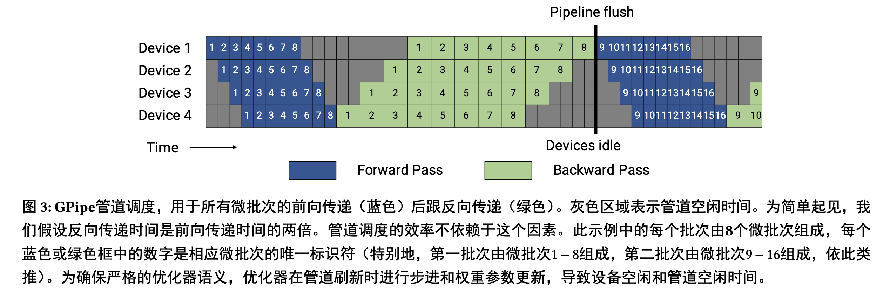
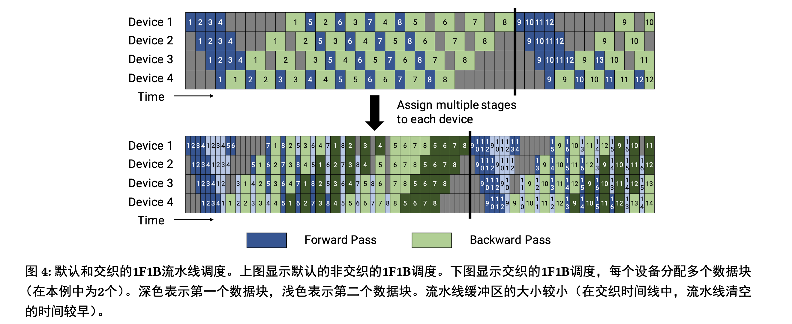
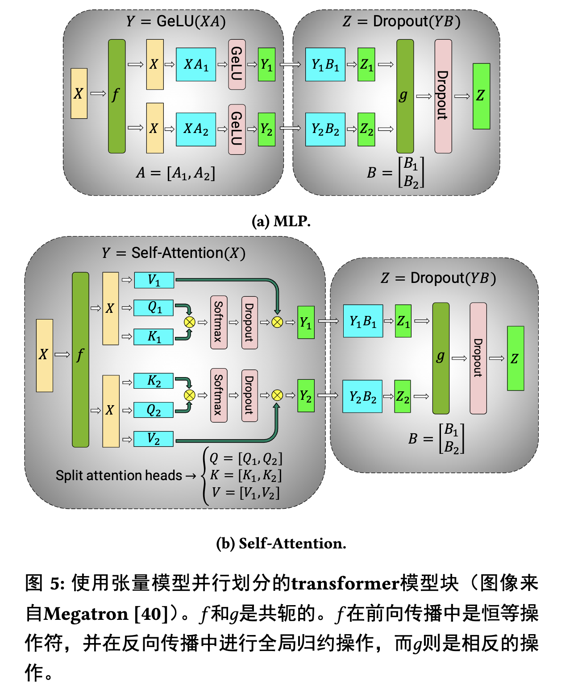

# 基于GPU集群的高效大规模语言模型训练 论文阅读笔记

:::tip

Efficient Large-Scale Language Model Training on GPU Clusters Using Megatron-LM

:::

本文主要围绕着一个问题来进行：

“如何将并行技术结合起来，以便在给定批次大小的情况下，最大限度地提高大型模型的训练吞吐量，同时保持严格的优化器语义。”

## 1. Abstract 

这篇论文的核心内容是如何将**PTD-P（节点间流水并行、节点内张量并行和数据并行）组合起来**，实现在训练具有一万亿参数的大型模型时高吞吐量（502 petaFLOP/s），从而在合理的时间内完成端到端训练（对于一万亿参数模型估计需要约3个月时间）。论文讨论了与每种并行性质相关的各种权衡，以及在组合时需要精心考虑它们之间的相互作用。此外，论文还展示了**如何利用跨多个GPU服务器的流水线并行性、多个GPU服务器内的张量并行性和数据并行性的结合**，以在优化的集群环境中，通过高带宽链接在同一台服务器和服务器之间的GPU之间，实现训练具有万亿参数的模型，进行优雅的扩展。在实验中，作者展示了对3072个A100 GPU的几乎线性扩展性，每个GPU的端到端训练吞吐量达到163 teraFLOP/s（包括通信、数据处理和优化），总吞吐量达到502 petaFLOP/s，使用混合精度来训练一个具有万亿参数的GPT模型。这种吞吐量有助于实际的训练时间：论文估计这个模型的端到端训练时间约为3个月。论文表示这是该规模模型所取得的最快训练吞吐量：过去的系统无法训练如此大的模型，因为它们没有结合流水线和张量并行性。

## 2. 常用的并行技术

### 2.1 数据并行

数据并行是一种并行计算方法，它通过**将数据分成多个批次，并将每个批次分配给不同的计算节点进行处理，从而加快大规模数据的处理速度**。在深度学习领域中，数据并行通常被用于将训练数据集分成多个小批次，并将每个小批次分配给不同的GPU进行处理。这样可以利用GPU的并行计算能力，加速深度学习模型的训练过程。

需要注意的是，数据并行虽然可以显著加速深度学习模型的训练过程，但是它也存在一些限制和挑战。例如，当处理的数据量非常大时，数据并行需要大量的内存和存储空间，这可能会导致内存溢出或存储空间不足的问题。此外，由于每个计算节点都需要执行相同的计算操作，因此对于一些需要进行全局归约的操作（如梯度累积、权重更新等），需要在所有计算节点之间进行通信和同步，这可能会导致通信开销和同步延迟的问题。

### 2.2 管道并行

管道并行（Pipeline Parallelism）是一种将模型划分为多个阶段，并将这些阶段分散到多个设备上的并行计算方法。在管道并行中，模型的每个阶段都由不同的设备处理，这些设备之间通过数据传输进行通信。

具体来说，每个设备在完成前一阶段的计算后，将结果传输给下一个设备，然后开始下一阶段的计算。这样，每个设备都处于不同的阶段，从而实现了并行计算。

管道并行的主要优点是可以**将模型划分为多个阶段，并使用多个设备同时处理不同的阶段，从而提高了计算效率**。然而，管道并行也存在一些问题，例如**通信开销和同步问题**。为了解决这些问题，需要合理地划分模型和调整设备之间的通信协议。

### 2.2.1 Default Schedule.

GPipe 提出了一种先执行批次中所有微批次的前向传递，然后再执行所有微批次的后向传递的调度方法（如下图所示）

  

我们可以量化GPipe的流水线泡沫大小 $\left(t_{p b}\right)$ 。我们将批次中微批次的数量表示为 $m$, 流水线阶段的数量 (用于流水线并行性的设备数量）表示为 $p$, 假设完美或理想的扩展的每次迭代的时间表示为 $t_{i d}$, 单个微批次的前向传递和后向传递的执行时间为 $t_f$ 和 $t_b$ 。在这个调度中, 流水线泡沫由批次开始时的 $p-1$ 次前向传递以及批次结束时的 $p-1$ 次后向传递组成。流水线泡沫中所用的总时间为 $t_{p b}=(p-1) \cdot\left(t_f+t_b\right)$ 。批次的理想处理时间为 $t_{i d}=m \cdot\left(t_f+t_b\right)$ 。因此, 流水线泡沫中花费的理想计算时间的比例为:

$$
\text { Bubble time fraction (pipeline bubble size) }=\frac{t_{p b}}{t_{i d}}=\frac{p-1}{m}
$$

这个比例随着流水线阶段数量的增加而增加，因为更多的前向和后向传递将被添加到流水线中。此外，批次的规模也会影响这个比例，因为更大的批次将导致更少的微批次，从而使得流水线泡沫在总处理时间中所占的比例更大。因此，Default Schedule 的可扩展性取决于批次大小和流水线阶段数量的选择。

Megatron-LM 中使用了 **PipeDream-Flush 算法**。PipeDream-Flush 算法在训练开始时进入一个**热身阶段**（对应下图中训练刚刚开始的时候），在这个阶段，工作节点执行不同数量的前向传播。热身阶段结束后，每个工作节点进入稳定状态，执行一次前向传播，然后跟随一次反向传播（1F1B）。在每个批次结束时，对所有剩余的小批次完成反向传播。

这种调度方法将**泡泡所花费的时间保持不变，但将未完成的前向传播最多限制为流水线阶段的数量**。因此，与 GPipe 调度相比，PipeDream-Flush 调度**将激活存储在更少的小批次中（而不是 GPipe 调度中的批次中的小批次），从而减少了内存占用**。

当小批量大小远大于流水线深度时，PipeDream-Flush 比 GPipe 更有效。因为在这种情况下，GPipe 需要将整个中间激活集保留在内存中，而 PipeDream-Flush 只需要存储每个流水线阶段的输入激活。

  

### 2.3 张量并行

在Megatron中，张量并行算法被用于处理Transformer模型的每一层。具体来说，Megatron使用特定的分割策略来处理Transformer层的自注意力块和多层感知机（MLP）块。

对于MLP块，Megatron使将其拆分为多个子矩阵，并将它们分配到不同的GPU上进行处理。每个GPU执行子矩阵的计算，并返回计算结果给主GPU进行全局归约操作。MLP块包含两个GEMM（general matrix multiplication）和一个GeLU非线性激活函数：

$$
Y = \operatorname{GeLU}(XA).  Z = \operatorname{Dropout}(YB).
$$

我们可以将 $A$ 沿其列拆分为 $A=\left[A_1, A_2\right]$ 。这种分区使得GeLU非线性函数可以独立地应用于每个分区GEMM的输出:

$$
\left[Y_1, Y_2\right]=\left[\operatorname{GeLU}\left(X A_1\right), \operatorname{GeLU}\left(X A_2\right)\right] .
$$

这种做法无需进行同步操作 (如果 $A$ 按行分割, 则需要同步操作, 因为GeLU是非线性的)。

然后, 第二个权重矩阵 $B$ 的行可以沿着行进行分割, 以消除GEMM之间的任何通信需求 (如下图a所示), 如下所示:

$$
B=\left[\begin{array}{l}
B_1 \\
B_2
\end{array}\right], Y=\left[Y_1, Y_2\right] .
$$

第二个GEMM的输出在Dropout层之前通过多个GPU进行降维。

利用多头注意力操作中的内在并行性来分割 self-attention 块 (如下图b所示)。键 $(K)$ 、查询 $(Q)$ 和值 $(V)$ 矩阵可以以列并行的方式分割。输出的线性层可以直接在注意力操作的分割输出上进行操作 (权重矩阵通过行分割)。

  

## 3. 组合不同并行技术

### 3.1 张量并行与管道并行的组合

