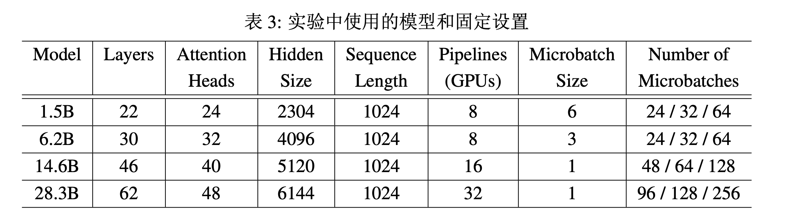
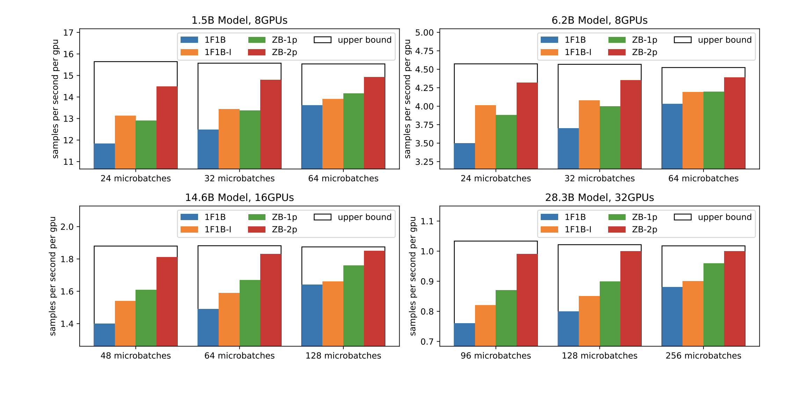

# Zero Bubble 并行策略

:::tip

ZERO BUBBLE PIPELINE PARALLELISM

:::

## 1. 简介

管道并行 (Pipeline Parallelism) 是一种并行策略，它将模型的不同部分分配到不同的设备上，以便在不同设备上并行执行。这种并行策略的优势在于，它可以在不增加单个设备上的模型大小的情况下，提高模型的训练速度。之前的管道并行策略, 如 1F1B 或者 FThenB 都会有 Bubble 的问题，即某些设备处于空闲状态。而且 Bubble 一般认为是不可避免的，但是这篇论文提出了 Zero Bubble 的概念，即不产生 Bubble 的管道并行策略。

0-Bubble 是一种新的管道并行策略，它是核心思想是将反向计算分为两部分，一部分计算输入的梯度，另一部分计算参数的梯度。0-Bubble 还引入了一种新的技术，即在优化器步骤中绕过同步，以实现真正的 0-Bubble。

## 2. 相关工作

目前管道并行 (PP) 效率在很大程度上取决于被称为流水线气泡的设备空闲时间量。由于层之间的依赖关系，气泡似乎是不可避免的。早期解决这个问题的杰出工作是 GPipe [1]，它试图通过增加管道中并发批次的数量来减少气泡比率。然而，这样做的直接后果是增加了峰值内存需求。为了减轻这一问题，GPipe 在向后传递期间重新计算中间激活的部分时丢弃了一部分。然而，这种方法引入了约20%的计算开销。一系列改进 GPipe 的工作侧重于异步 PP，包括  PipeDream [2]。异步 PP 在理论上是无气泡的，它极大地提高了管道效率，但是以牺牲精确优化语义为代价。另一方面，在同步设置下也进行了改进。解决GPipe限制的一个显著调度策略被称 one-forward-one-backward (1F1B [3])。它最初是在异步设置下
由 PipeDream 提出的，后来也在同步设置下引入。1F1B 通过提前调度向后传递来实现更快的内存清除。在相同数量的微批次下，它产生类似的气泡比率，但在峰值内存方面具有明显优势。基于 1F1B，引入了 1F1B 交错策略。通过将多个阶段分配给同一设备，它进一步减少了气泡大小，但以更多的通信和更高的峰值内存为代价。

## 3. Zero Bubble

### 3.1 调度方案

直到今天，Bubble 仍然是 PP 面临的最大问题。这篇论文的作者发现 PP 可以通过以更精细的粒度表示和调度计算图来进一步优化。经典的深度学习框架是以层为粒度设计的，而现代深度学习编译器使用不同的中间表示来在各个层面进行优化。尽管更细的粒度通常意味着更大的搜索空间，但由于缺乏导航该空间的优化工具，因此选择合适的粒度至关重要。

0-Bubble 中第一个优化点就是将反向计算分为两部分:

神经网络可以被分解为堆叠的层。每一层都有两个相关的函数, 前向和后向。在前向传递中, 输入 $\boldsymbol{x}$ 通过参数化映射 $f(\boldsymbol{x}, \boldsymbol{W})$ 转换为输出 $\boldsymbol{y}$ 。后向传递对于训练至关重要, 涉及两个计算: $\nabla_{\boldsymbol{x}} f(\boldsymbol{x}, \boldsymbol{W})^{\top} \frac{d \ell}{d \boldsymbol{y}}$ 和 $\nabla_{\boldsymbol{W}} f(\boldsymbol{x}, \boldsymbol{W})^{\top} \frac{d \ell}{d \boldsymbol{y}}$ 。相应地, 它们计算相对于输入 $\boldsymbol{x}$ 和层参数 $W$ 的梯度。为方便起见, 我们使用单个字母 $B$ 和 $W$ 分别表示这两个计算, $F$ 表示前向传递。传统上, $B$ 和 $W$ 被分组并提供为单个后向函数。这种设计在概念上对用户友好, 并且对于数据并行 DP 而言效果良好, 因为在第 $i$ 层权重梯度的通信可以与第 $i-1$ 层的后向计算重叠。然而, 在 PP 中, 这种设计不必要地增加了顺序依赖的计算, 即第 $i-1$ 层的 $B$ 依赖于第 $i$ 层的 $W$, 这通常对管道的效率不利。

Zero Bubble 基于 1F1B 的思想进行改进, 1F1B 的思路如下图所示，从热身阶段开始。在这个阶段， Wo r ke r进行不同数量的前向传递，每个阶段通常比其紧随其后的阶段多执行一个前向传递。在热身阶段之后，每个 Worker 过渡到稳定状态，他们交替执行一个前向传递和一个后向传递，确保各阶段之间的工作负载均匀分配。在最后阶段，每个 Worker 处理未完成的在途微批次的后向传递，完成批处理。

  

Zero Bubble 调度将后向传递拆分为 B 和 W 传递，F 和 B 来自同一微批次的仍然必须在流水线阶段之间保持顺序依赖。然而，W可以在同一阶段的相应 B 之后的任何位置灵活安排。这允许策略性地安排 W 来填充流水线中的气泡。有许多可能的调度方案可以优于 1F1B。下图展示了手工调度方案，展示了更细粒度在减少流水线气泡方面的优势。

  

ZB-H1 确保所有工作节点的最大峰值内存使用量不超过 1F1B 的内存使用量。ZB-H1 通常遵循 1F1B 的调度，但根据预热微批次的数量调整 W 的起始点。这确保所有工作节点保持相同数量的在途微批次。结果，如图3（顶部）所示，泡泡大小减小到 1F1B 大小的三分之一。这种减少是因为与1F1B 相比，B 在所有工作节点上更早启动，并且尾部泡泡由后启动的 W 传递填充。由于 W 通常使用的内存少于B(表1)，第一个工作节点具有与1F1B一致的最大峰值内存使用量。

如果允许比 1F1B 更大的内存占用并且有足够数量的微批次时，就可以实现零气泡调度，我们将其标记为ZB-H2。在热身阶段引入更多的 F 传递来填充初始 B 之前的气泡。此外还重新排列尾部的 W 传递，将布局从梯形变为平行四边形，消除了管道中的所有气泡。

注意，这里移除了优化器步骤之间的同步，下面我们讨论这个问题。

### 3.2 移除优化器步骤之间的同步

在大多数 PP 实践中，为了数值稳健性，通常会在优化器步骤中执行管道阶段上的同步。例如，需要计算全局梯度范数以进行梯度范数裁剪。在混合精度设置中执行 NAN 和 INF 值的全局检查。这两者都需要跨所有阶段进行全局归约通信。然而，在优化器步骤中的同步破坏了平行四边形（见图3），使零 Bubble 变得不可能。为了解决这个问题，论文作者提出了一种新的技术，即在优化器步骤中绕过同步，以实现真正的 0-Bubble。

在现有实现中，首先启动全局状态的全局归约通信，然后进行以全局状态为条件的优化器步骤。然而，我们注意到大多数情况下全局状态没有影响，例如，全局检查 NAN 和 INF 很少触发，因为在稳健设置中，大多数迭代不应该有数值问题；经验上梯度裁剪率也相当低，难以证明每次迭代都需要同步全局梯度范数。

所以 Zero-Bubble 采取了**后验证**的方式。在每个阶段在优化器步骤之前，从前一阶段接收到一个部分归约的全局状态，与当前阶段的局部状态结合，然后传递到下一个阶段。每个阶段的优化器步骤由部分归约状态控制，例如，当发现 NAN 或部分归约梯度范数超过裁剪阈值时跳过更新。在下一次迭代的热身阶段，完全归约的全局状态然后从最后一个阶段传播回第一个阶段。收到全局状态后，每个阶段执行验证以决定前一个优化器步骤是否合法。如果需要对梯度进行修正，则会发出回滚，然后根据完全归约的全局状态重新执行优化器步骤。整体流程如下图所示：

  

### 3.3 定量分析

用 $p$ 表示阶段数，$b$ 表示每个微批的大小。对于 Transformer 架构，用 $a$ 表示注意力头的数量，$s$ 表示序列长度，$h$ 表示隐藏维度大小。使用符号 $M_B / M_W$ 表示存储一个 $B / W$ 传递的激活所需的内存，$T_F / T_B / T_W$ 表示一个 $F / B / W$ 传递的运行时间。为简单起见，仅对 Transformer 架构进行定量分析，使用类似于 GPT-3 的典型设置，其中前馈中的隐藏维度大小为 $4h$，每个注意力头的维度大小为 $h/a$。

在计算 FLOPs 时仅考虑矩阵乘法操作，因为它们在 Transformer 层中贡献了大部分计算量。在前向传递中的每个矩阵乘法操作，在相应的反向传递中有两个具有相同FLOPs的矩阵乘法操作，每个属于 $B$ 或 $W$。用于计算 Transformer 层 FLOPs 的近似公式在下表中。可以看到 $T_W < T_F < T_B$ 和 $T_B + T_W = 2T_F$。在 $B$ 完成后，释放一些不再使用的激活，但保留一些额外的梯度（见上图中的 $\nabla_{\boldsymbol{z}} L$）用于 $W$。根据表格结果可以得出，$W$ 所需的总内存少于 $B$。

  

在不假设 $T_F = T_B = T_W$ 的情况下，ZB-H1 和 ZB-H2 的峰值激活内存和 Bubble 大小如下图所示。可以看到，ZB-H1 和 1F1B 的峰值激活内存相似，但 Bubble 大小减小了。 

## 4. 自动搜索最佳调度方案

尽管手工制定的调度方案提供了简单性和更好的可理解性, 但在实际应用中面临几个问题。首先, 在假设 $T_F=T_B=T_W$ 的情况下进行调度会引入不必要的气泡, 特别是对于这些值差异显著的模型。此外, 在手工制定的调度中通常忽略了在阶段之间传输激活/梯度所需的通信时间（表示为 $T_{\mathrm{comm}}$ ), 导致管道流中出现明显的延迟。最后, 在可用内存不足以容纳足够的微批次以实现无气泡调度的情况下, 平衡减小气泡大小和遵守内存限制变得特别具有挑战性。

为了解决这些挑战并确保泛化到实际场景, 文中提出了可以自动搜索最佳调度方案的算法。设管道阶段数 $p$ 、微批次数 $m$ 、激活内存限制 $M_{\mathrm{limit}}$, 以及运行时间估计 $T_F 、 T_B 、 T_W$和 $T_{\mathrm{comm}}$ 。论文中设计了一种启发式策略, 特别是当 $m$ 足够大时, 总是生成最优或接近最优的解决方案。问题可以表述为整数线性规划问题, 可以通过现成的整数线性规划求解器解决问题。在一定规模下的情况，这两种方法可以结合使用: 首先使用启发式解决方案作为初始化, 然后通过整数线性规划进一步优化。

尽管手工制定调度方案简单易懂，但在实际应用中存在几个问题。首先，假设 $T_F=T_B=T_W$ 会导致不必要的等待，尤其是对于各阶段时间差异很大的模型。其次，忽略阶段间激活/梯度传输所需的通信时间 $T_{\mathrm{comm}}$ 会导致明显的延迟。最后，当内存不足以容纳足够的微批次时，调整气泡大小与内存限制之间的平衡变得更加困难。

为了解决这些问题并适应实际场景，论文中提出了一种算法，可自动搜索最佳调度方案，考虑到管道阶段数、微批次数、内存限制以及各阶段的运行时间。论文中提出一种启发式策略，可在微批次数足够大时生成接近最优解。此外，可以将问题形式化为整数线性规划，并结合使用现有的求解器来解决规模适中的情况。这两种方法可结合使用：首先采用启发式解决方案作为初始值，然后通过整数线性规划进一步优化。

启发式算法有以下步骤：

1. **热身阶段：** 在内存允许的情况下，尽可能安排更多的 $F$，以减少第一个 $B$ 前的等待时间。如果内存还有余量，可以安排额外的 $F$，但可能会延迟后续的 $B$。

2. **稳定阶段：** 在热身阶段后，我们交替安排 $F$ 和 $B$。当有空闲时间超过 $T_W$ 时，插入 $W$ 填充等待时间。即使等待时间不足 $T_W$，但当前等待时间会增加所有阶段中最大的等待时间时，我们也会插入 $W$。当内存接近饱和时，也会插入 $W$ 释放一些内存。

3. **阶段间调度：** 确保每个阶段在用尽 $F$ 之前至少安排一个比下一个阶段更多的 $F$。当差异超过一定阈值时，考虑跳过某些阶段中的 $F$。

4. **资源用尽：** 在每个阶段，当 $F$ 和 $B$ 任务完成时，按顺序安排所有剩余的 $W$ 任务。

## 5. 回滚优化器

当需要回滚优化器步骤时，一种典型的方法是存储参数和优化器状态的历史版本，并在需要时恢复到这个历史版本。然而，这种方法在内存上效率低下，需要大量的复制操作，这肯定会影响训练性能。对于大多数优化器，步骤函数在算术上是可逆的。在这一观察下，论文提出了一种新颖的技术来执行原地优化器回滚，避免分配额外内存，并且只在执行回滚时需要额外的计算。如算法中所示，展示了如何回滚 AdamW 优化器的步骤函数：

  

这个算法是针对AdamW优化器设计的一种“原地回滚”（in-place rollback）策略。在这个算法中，有一系列优化器的状态变量，包括学习率 $\gamma$，动量参数 $\beta_1$ 和 $\beta_2$，误差项 $\epsilon$，权重衰减率 $\lambda$，一阶矩量 $m$，二阶矩量 $v$，参数 $\theta$，以及时间戳 $t$。

主要包含两个函数：$\text{STEP}(g)$ 和 $\text{ROLLBACK}(g)$。

1. $\text{STEP}(g)$ 函数实现了优化器的前进步骤。在每次迭代中，更新时间戳 $t$，计算梯度 $g$ 的一阶矩量和二阶矩量 $m$ 和 $v$，然后根据时间衰减调整这些矩量的估计值。最后，根据AdamW的更新规则，更新参数 $\theta$。

2. $\text{ROLLBACK}(g)$ 函数实现了优化器的回滚操作。它首先计算了当前时间点下一阶和二阶矩量的修正值 $m'$ 和 $v'$。然后，使用这些修正值来更新参数 $\theta$，并且根据AdamW的更新规则进行相应的梯度回滚操作。最后，时间戳 $t$ 减少以反映回滚操作。

## 6. 实验结果

论文开源的Megatron-LM项目实现，并使用类似于GPT-3的模型进行了性能评估，详见表3。在实验中，首先进行了一定数量的迭代分析，收集了 $T_F$、$T_B$、$T_W$ 和 $T_{comm}$ 的实测值。然后，将这些值输入到自动流水线调度算法中，以确定最佳的调度方案。值得注意的是，初始和最终流水线阶段的 Transformer 层比中间阶段少一个。这种设计是为了补偿初始和最终阶段中额外的嵌入查找和损失计算，以防止它们成为瓶颈并导致其他阶段出现等待时间。

  

实验利用了分布在由RoCE RDMA网络相互连接的4个节点上的32个NVIDIA A100 SXM 80G GPU。每次迭代的运行时间在几次热身迭代之后被记录。

下图给出了不同流水线调度方案吞吐量的对比：

  

ZB-2p 一贯优于所有其他方法。值得注意的是，1F1B、1F1B-I 和 ZB-1p 的吞吐量与微批次数量呈强正相关。相比之下，ZB-2p 即使在较少的微批次下也能保持效率。这是因为 ZB-2p 中的气泡率几乎接近零（表 5），其吞吐量已经接近上限。相比之下，ZB-1p 的设计旨在具有与 1F1B 基准相似的峰值内存成本。在 8 个 GPU 设置中，它显示出与 1F1B-I 相当的吞吐量。在多节点设置中，通信带宽更成为瓶颈的情况下，ZB-1p
明显优于 1F1B-I，突显了其在减少管道气泡而不增加额外通信成本方面的优势。

下表给出了不同流水线调度方案的 Bubble 率：

  

将手工制作的调度 ZB-H1 和 ZB-H2 作为自动搜索调度的基准。在大多数设置中，ZB-2p 的泡沫率低于1%，这是所有调度中最好的。相比之下，ZB-H2 的表现一直不如ZB-2p。这证明了我们的自动调度算法通过使用更准确的TF、TB、TW 和Tcomm估计更好地适应现实场景。相反，ZB-1p 与ZB-H1 之间并未观察到这种改进，这可能是因为内存限制成为主导因素。所有的方法都明显优于 1F1B。

## 7. 总结

论文提出了 Zero Bubble 管道并行策略，它通过将反向传递分为两部分来减少气泡。Zero Bubble 还引入了一种新的技术，即在优化器步骤中绕过同步，以实现真正的 0-Bubble。论文还提出了一种自动搜索最佳调度方案的算法，以及一种原地回滚优化器的技术。实验结果表明，Zero Bubble 管道并行策略在吞吐量和泡沫率方面优于其他管道并行策略。

## References

1. Yanping Huang, Youlong Cheng, Ankur Bapna, Orhan Firat, Dehao Chen, Mia Chen, HyoukJoong
Lee, Jiquan Ngiam, Quoc V Le, Yonghui Wu, et al. Gpipe: Efficient training of giant neural
networks using pipeline parallelism. Advances in neural information processing systems, 32, 2019.
2. Aaron Harlap, Deepak Narayanan, Amar Phanishayee, Vivek Seshadri, Nikhil Devanur, Greg Ganger, and Phil Gibbons. Pipedream: Fast and efficient pipeline parallel dnn training. arXiv preprint arXiv:1806.03377, 2018.
3. Deepak Narayanan, Mohammad Shoeybi, Jared Casper, Patrick LeGresley, Mostofa Patwary, Vijay Korthikanti, Dmitri Vainbrand, Prethvi Kashinkunti, Julie Bernauer, Bryan Catanzaro, et al. Efficient large-scale language model training on gpu clusters using megatron-lm. In Proceedings of the International Conference for High Performance Computing, Networking, Storage and Analysis, pp. 1–15, 2021.

