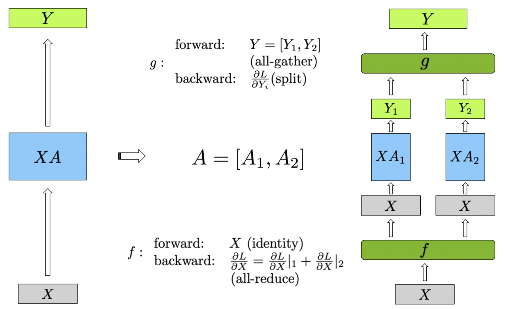
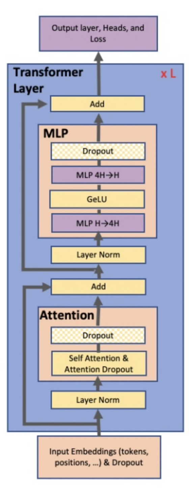
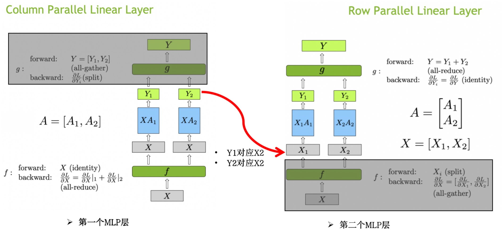
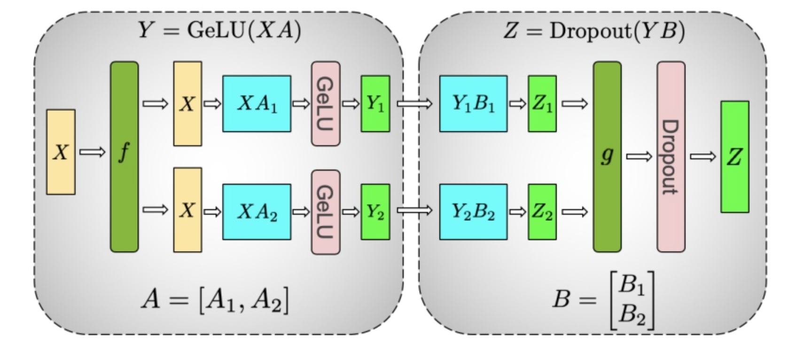
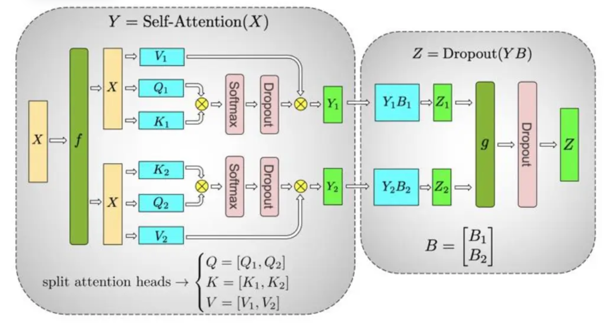

# Megatron-LM 论文阅读

:::tip

Efficient Large-Scale Language Model Training on GPU Clusters Using Megatron-LM

:::

## 1. 介绍

Megatron-LM 是 NVIDIA 发布的一个大规模语言模型训练工具，NVIDIA 还将 Megatron-LM 开源[^1]，提供了详细的文档和代码示例。Megatron-LM 是基于 Transformer 架构去设计的，它并不适用于 CNN 模型。Megatron-LM 的目标是在 GPU 集群上训练大规模的语言模型，NVIDIA 使用了 512 个 V100 GPU，一共 64 个 DGX-2H 服务器，价值一个小目标。

Megatron-LM 针对 Transformer 模型的 MLP 和 Self-Attention 模块设计了高效的并行算法。他将 pipeline 并行和 tensor 并行结合起来，论文里面提到 pipeline 并行和 tensor 并行是正交和互补的。

  

接下来将详细介绍 Megatron-LM 是如何处理 MLP 和 Self-Attention 模块的 tensor 并行的

## 2. 普通张量并行

之前的文章[^2]中我们介绍过普通的模型并行，简单来说就是将模型分成多份，每个 GPU 计算一部分模型，然后将结果合并。这里我们再拓展一下，普通的模型并行可以分为两种，一种是横向切分，一种是纵向切分。

### 2.1 Row Parallel Linear Layer

在图中，展示了行并行（Row Parallel）线性层的实现方法。为了更好地理解图中的内容，我们首先定义公式中的变量：

- $X$：输入矩阵
- $X_i$：输入矩阵 $X$ 的分块部分，其中 $i$ 表示分块的索引
- $A$：权重矩阵
- $A_i$：权重矩阵 $A$ 的分块部分
- $Y$：输出矩阵
- $Y_i$：中间输出矩阵，由 $X_i$ 和 $A_i$ 的乘积得到

图中的行并行（Row Parallel）线性层的具体实现步骤如下：

输入矩阵 $X$ 首先被分割成两个子矩阵 $X_1$ 和 $X_2$。这种分割是在行方向上进行，使得每个设备处理输入数据的不同部分。形式化地表示为 $X = [X_1, X_2]$。权重矩阵 $A$ 也被分割成两个子矩阵 $A_1$ 和 $A_2$，这种分割同样在行方向上进行，即 $A = [A_1; A_2]$。

每个分割的输入矩阵分别与对应的权重矩阵进行矩阵乘法计算，得到中间输出 $Y_1$ 和 $Y_2$：

$$ 
Y_1 = X_1 A_1 
$$ 

$$ 
Y_2 = X_2 A_2 
$$

最终的输出 $Y$ 是 $Y_1$ 和 $Y_2$ 的和，通过 all-reduce 实现：

$$ 
Y = Y_1 + Y_2 
$$

在前向传播中，首先将输入矩阵 $X$ 分割为 $X_1$ 和 $X_2$。分别计算 $X_1 A_1$ 和 $X_2 A_2$，得到 $Y_1$ 和 $Y_2$。然后通过 all-reduce 将 $Y_1$ 和 $Y_2$ 相加，得到最终输出 $Y$。在反向传播中，梯度 $\frac{\partial L}{\partial Y}$ 被分割为 $\frac{\partial L}{\partial Y_1}$ 和 $\frac{\partial L}{\partial Y_2}$ ，由于 all-reduce 的特性，这些梯度是相同的。每个设备分别计算自己的梯度 $\frac{\partial L}{\partial X_i}$ ，最后通过 all-gather，将梯度 $\frac{\partial L}{\partial X_i}$ 聚合，得到完整的梯度 $\frac{\partial L}{\partial X}$。

  

### 2.2 Column Parallel Linear Layer

在列并行的线性层中，权重矩阵 $A$ 被分割成两个子矩阵 $A_1$ 和 $A_2$，这种分割在列方向上进行，即  $A = [A_1, A_2]$ 。输入矩阵 $X$ 保持不变，然后分别与两个子矩阵 $A_1$ 和 $A_2$ 进行矩阵乘法计算，得到中间输出 $Y_1$ 和 $Y_2$：

$$
Y_1 = X A_1
$$

$$
Y_2 = X A_2
$$

最终的输出 $Y$ 是 $Y_1$ 和 $Y_2$ 的组合，通过 all-gather 实现：

$$
Y = [Y_1, Y_2]
$$

在前向传播中，计算步骤如下：输入矩阵 $X$ 保持不变，分别计算 $X A_1$ 和 $X A_2$，得到 $Y_1$ 和 $Y_2$。然后通过 all-reduce 操作将 $Y_1$ 和 $Y_2$ 组合，得到最终输出 $Y$。

在反向传播中，梯度传播的步骤如下：梯度 $\frac{\partial L}{\partial Y}$ 被分割为 $\frac{\partial L}{\partial Y_1}$ 和 $\frac{\partial L}{\partial Y_2}$ ，然后分别传递给对应的子矩阵部分。由于全收集操作的特性，反向传播中的梯度计算如下：每个设备分别计算自己的梯度 $\frac{\partial L}{\partial X_i}$，并通过 all-reduce，将梯度 $\frac{\partial L}{\partial X_i}$ 聚合，得到完整的梯度 $\frac{\partial L}{\partial X}$ 。

  

## 3. Tensor 并行在 Transformer 中的应用

在 Transformer 模型中，主要包含两个模块：MLP 模块和 Self-Attention 模块。本小节介绍的是 Megatron-LM 中最核心的部分，即如何在 Transformer 模型中应用 tensor 并行。

### 3.1 Transformer 模型结构

传统的 Transformer 模型结构如下图所示，每个 Transformer 模块包含两个子模块：MLP 模块和 Self-Attention 模块。

  

### 3.2 MLP 模块的 Tensor 并行

MLP 模块是由两个线性层和一个激活函数组成。对于第一个 MLP 层，对应的计算操作可以表示为：

$$
Y = \text{GeLU}(XA)
$$

如果 A 按照行（row）进行切分，由于 Gelu 是非线性的，所以不能直接将 $A$切分为$A_1$和$A_2$，然后分别计算 $XA_1$和$XA_2$，因为：

$$
\text{GeLU}(X_1A_1 + X_2A_2) \neq \text{GeLU}(X_1A_1) + \text{GeLU}(X_2A_2)
$$

所以对于第一个 MLP 层，不能直接使用行并行的方式进行计算。我们只能按列进行切分。第二个 MLP 模块之后没有 Gelu 激活函数，所以可以按行进行切分。而且也只能按照行进行切分，因为我们需要把第一个 MLP 模块的输出作为第二个 MLP 模块的输入[^3]。第一个 MLP 模块的输出是俩个不一样的部分 $Y_1$ 和 $Y_2$，所以不能直接按列进行切分。整个过程的计算流程如下：

$$
\begin{aligned}
A^{(1)} & =\left[A_1^{(1)}, A_2^{(1)}\right] \\
Y_1^{(1)} & =\operatorname{GeLU}\left(X A_1^{(1)}\right) \\
Y_2^{(1)} & =G e L U\left(X A_1^{(1)}\right) \\
Y^{(1)} & =\left[Y_1^{(1)}, Y_2^{(1)}\right] \\
& =\left[G e L U\left(X A_1^{(1)}\right), G e L U\left(X A_2^{(1)}\right)\right] \\
A^{(2)} & =\left[\begin{array}{l}
A_1^{(2)} \\
A_2^{(2)}
\end{array}\right] \\
Y^{(1)} \times A^{(2)} & =\left[Y_1^{(1)} Y_2^{(1)}\right] \times\left[\begin{array}{l}
A_1^{(2)} \\
A_2^{(2)}
\end{array}\right] \\
& =\left[Y_1^{(1)} \cdot A_1^{(2)}, Y_2^{(1)} \cdot A_2^{(2)}\right] \\
Y^{(2)} & =Y_1^{(1)} \cdot A_1^{(2)}+Y_2^{(1)} \cdot A_2^{(2)}
\end{aligned}
$$

可以看到我们省略掉了第一个 MLP 的 g 函数和第二个 MLP 的 f 函数。下图可以更好的展示这个过程：

  

最终的整体图如下：

  

### 3.3 Self-Attention 模块的 Tensor 并行

首先我们先回忆一下自注意模块的计算过程吧：

$$
\begin{aligned}
Q & = X W_Q \\
K & = X W_K \\
V & = X W_V \\
\text { Attention }(Q, K, V) & = \text { softmax }\left(\frac{Q K^{T}}{\sqrt{d_{k}}}\right) V
\end{aligned}
$$

其中 $Q$、$K$、$V$分别是 Query、Key 和 Value 矩阵，$W_Q$、$W_K$、$W_V$ 分别是 Query、Key 和 Value 的权重矩阵，$d_k$ 是 Key 的维度。在 Self-Attention 模块中，$Q$、$K$、$V$ 都是输入矩阵 $X$ 乘以对应的权重矩阵得到的。

Transformer 模型中的 Multi-Head Attention 层由多个自注意力块组成。每个自注意力头都可以独立计算，最后，再将结果拼接（concat）起来。也就是说，可以把每个头的参数放到一块 GPU 上[^4]。

在 MHA 层，对三个参数矩阵 Q，K，V，按照“列切割” ，每个头放到一块 GPU 上，做并行计算。对线性层 B，按照“行切割” 。

完整流程可以看下图：

  

:::tip

在实际应用中，并不一定按照一个 head 占用一块 GPU 来切割权重，我们也可以一个多个 head 占用一块 GPU，这依然不会改变单块 GPU 上独立计算的目的。所以实际设计时，我们尽量保证 head 总数能被 GPU 个数整除[^4]。

:::

现在我们可以想一下一个 Transformer Layer 中到底做了几次 all-reduce 操作。我们可以看到，对于每个 Transformer Layer，forward 的时候，我们需要做 2 次 all-reduce，backward 的时候，我们需要做 2 次 all-reduce。一共 4 次 all-reduce。

## 4. 总结

Megatron-LM 是 NVIDIA 发布的一个大规模语言模型训练工具，它是基于 Transformer 架构设计的。Megatron-LM 主要针对 Transformer 模型的 MLP 和 Self-Attention 模块设计了高效的并行算法。

[^1]: https://github.com/NVIDIA/Megatron-LM
[^2]: https://space.keter.top/docs/high_performance/%E5%88%86%E5%B8%83%E5%BC%8F/Paddle%E5%B9%B6%E8%A1%8C%E7%BC%96%E6%8E%92%E4%B8%8E%E6%89%A7%E8%A1%8C#%E6%A8%A1%E5%9E%8B%E5%B9%B6%E8%A1%8C
[^3]: https://www.mltalks.com/posts/3016692145/
[^4]: https://juejin.cn/post/7269698032655728640
