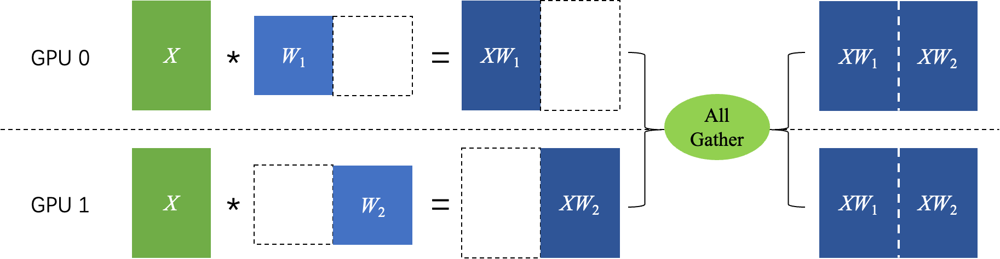
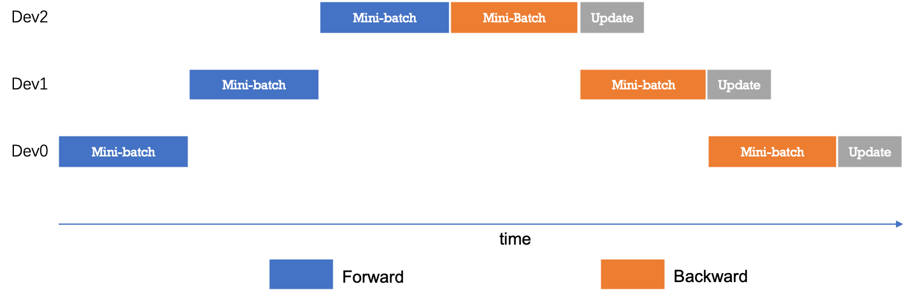

# 分布式训练简介

:::note

分布式训练简单来说就是将一个模型的训练任务分配到多张卡/多台机器上进行训练，这样可以大大加快训练速度。这其中涉及**多机任务拆分**、**集群训练资源配置**、**平衡训练速度和收敛速度**、**弹性训练与容错**等多项重要技术。在大模型、大数据量的训练任务中，分布式训练是必不可少的。

:::

## 应用场景

分布式训练主要的应用场景就是例如当训练数据量较大时，单卡训练耗时过长，需要分布式训练技术提高训练效率；或者当单卡无法支持训练时，即单卡显存无法放下全量模型参数时，可使用分布式训练技术将模型参数等模型信息切分到多张卡或多台设备上，以保证模型可训练。简单来说无外乎两点：

- 加快训练速度
- 让单卡无法训练的模型可训练

## 分布式训练技术原理

当下分布式训练主要有两种训练模型，第一种是集合通信模型，第二种是参数服务器模型。集合通信模型适用于 CV/NLP 相关的任务，参数服务器模型适用于 CTR 等相关的任务。这是因为一般来说 CV/NLP 相关的任务模型的参数都比较稠密，而搜索/推荐相关的任务模型的参数都比较稀疏。稠密参数（Dense_Var）是指每个 step 都会更新的参数，比如 FC 的 Weight 参数。稀疏参数（Sparse_Var）是指每个 step 不是必须更新的参数，如 Embedding 参数，只会更新当前 step 中涉及到的 key 的相应 value。下图非常详细的给出了如何选择分布式训练模型的方法：

  

### 集合通信模式

集合通信模型适合处理 CV/NLP 领域这样具有稠密参数的模型。它有多种方式将数据/模型切分到多个设备上。每个设备可以成为一个 Worker，每个 Worker 都需要及时的知道全局梯度信息。这样的话，每个 Worker 都需要将自己的梯度信息发送给其他的 Worker，同时也需要接收其他 Worker 的梯度信息。这样的通信方式就是集合通信模式。

集合通信有好几种并行方式：数据并行（包含纯数据并行、分组参数并行和张量模型并行）、流水线并行和专家并行，下面我们分别简单进行介绍。

#### 数据并行

##### 纯数据并行

纯数据并行是深度学习领域最常用的并行方法。在此策略下数据集被平均分为多份，每个卡上保存完整的模型参数并独立处理一份子数据集，以加速模型训练过程。

> 数据并行适用于模型参数较少的情况，一张卡可以放下完整的模型参数。这样的策略能让我们增加 batch_size，加快训练速度

纯数据并行的时候，不同 Worker 之间的梯度要如何进行交互呢？一般来说纯数据并行模式下，各个卡上的模型参数一样，输入数据不一样，每个卡各自计算出梯度再使用 AllReduce 算法进行梯度的交互。AllReduce 算法是一种集合通信算法，它的作用是将各个卡上的梯度进行求和获得全局参数。最后，全局参数梯度进入优化器进行参数更新，完成一个完整的 mini-batch 训练流程。

下图详细的说明了纯数据并行的训练流程：

  

数据并行模式下，将数据集平均分为多份，每个卡上保存完整的模型参数并独立处理一份子数据集，以加速模型训练过程。在数据并行训练过程中，每个卡上的输入数据是不同的。各个卡独立地执行网络的前向运算和反向计算，计算出各自卡上的参数梯度。随后，使用 AllReduce 等集合通信原语，将各个卡上计算出的参数梯度进行累加聚合，得到最终的全局参数梯度。最后，全局参数梯度进入优化器进行参数更新，完成一个完整的 mini-batch 训练流程。图中的箭头表示了各个卡之间的通信过程。

:::tip

集合通信原语是集合通信的基础操作的集合，如广播（Broadcast）、收集（Gather）、分散（Scatter）、规约（Reduce）等。其中规约是指将集群内多个节点将数据发送给一个节点，这个节点会使用接收到的数据集中运算，如累加、累积、均值、方差等等。而上文提到的 AllReduce 则是指多对多的规约，即有多个数据发送节点和多个数据接收节点，所有节点的规约运算结果会广播到所有节点上。

:::

优点：
1. 数据并行是一种简单有效的并行策略，适用于大多数深度学习模型。
2. 可以通过将训练数据分成多个批次并将每个批次分配给不同的设备来加速模型的训练。
3. 可以在多个 GPU 或分布式系统上实现，从而提高了训练速度。

缺点：
1. 可能需要更多的内存，因为每个设备都需要存储模型的完整副本。
2. 不适用于大型模型，因为它可能会导致内存不足的问题。
3. 在某些情况下，由于梯度同步的需要，可能会导致通信开销增加，影响训练性能。

##### 分组参数切片

在模型参数较多的情况下，一张卡无法放下完整的模型参数，这时候就需要将模型参数切分到多张卡上。 《ZeRO: Memory Optimizations Toward Training Trillion Parameter Models》 论文指出在每个 GPU 上都保存一份模型参数和优化器状态副本是冗余的。飞桨的参数切片数据并行技术实现了 ZeRO 论文中的三阶段参数切片技术，可依次将优化器状态、参数梯度和模型参数切分到各个卡上，并在此基础上支持分组混合并行技术（组内参数切片+组间数据并行），显著降低模型的显存占用，支持百亿参数模型高效训练。在介绍分组切片之前，让我们先通过一张图了解一下参数切片的原理：

  

在图中，有两张卡，每张卡保存一部分模型参数和优化器状态。不同卡之间使用 AllGather 通信同步参数和优化器状态。这样，每个设备上的两张卡都可以访问到全局的模型信息，但只需要存储一部分模型信息，从而节省了显存空间。我们可以在一个设备的不同卡之间采用参数切片的策略，并在不同设备之间采用数据并行的策略，从而实现分组切片数据并行。下图详细的说明了分组切片的原理：

  

图 7 展示了分组参数切片的数据并行原理。分组参数切片的数据并行是一种混合并行策略，它将数据并行和模型并行结合起来，以降低模型的显存占用。具体地，它将模型参数和优化器状态等切分到不同的设备上，并在每个设备上使用数据并行进行训练。在图 7 中，每个设备上有两张卡，每张卡保存一部分模型参数和优化器状态。每个设备上的两张卡使用数据并行进行训练，即每张卡处理不同的输入数据，并通过 AllReduce 通信同步梯度。不同设备之间使用 AllGather 通信同步参数和优化器状态。这样，每个设备上的两张卡都可以访问到全局的模型信息，但只需要存储一部分模型信息，从而节省了显存空间。

优点：
1. 分组参数切片将模型的参数切分成多个部分，每个部分分配给不同的设备进行训练，因此适用于大规模的模型和分布式训练。
2. 可以有效地利用多个设备的计算资源，从而提高训练速度。
3. 可以降低每个设备的内存需求，因为每个设备只需要存储部分参数。

缺点：
1. 需要仔细设计模型以实现参数的分组切片，这可能需要一些额外的工程工作。
2. 可能需要复杂的通信和同步机制，以确保参数之间的正确更新，这可能会引入一些开销。
3. 对于某些模型结构，可能会导致不均匀的负载分布，需要额外的调整来平衡计算负载。

##### 张量模型并行

张量模型并行依赖的是矩阵乘法的分块算法，将模型参数切分到多张卡上，每张卡上保存一部分模型参数。在每个卡上，模型参数被切分为多个块，每个块保存在不同的卡上。下图简介的说明了张量模型并行的原理：

  

对张量 $W$ 按列进行切分，然后各个卡独立计算矩阵乘法，最后通过 AllGather 通信得到最终的计算结果，即： $Z = X * W = X * [W_1, W_2] = [XW_1, XW_2]$。

优点：
1. 张量模型并行将模型的不同层分配给不同的设备，适用于大型、深层次的模型，如深度神经网络。
2. 可以显著提高模型的训练速度，因为每个设备只需要处理模型的一部分，从而降低了计算负担。
3. 可以充分利用异构硬件，例如将前向传播分配给 GPU，而将反向传播分配给 TPU。

缺点：
1. 需要复杂的模型拆分和管理，以确保不同设备上的子模型协同工作。
2. 引入了通信和同步的开销，需要谨慎设计和实现，以避免性能瓶颈。
3. 需要大量的硬件资源，特别是对于大型模型和多设备设置，可能需要更多的设备。

#### 流水线并行

流水线并行是模型并行的一种，其原理是把模型的不同层放置在不同卡上运行，参数也按层分配到不同的卡上，以降低模型的显存占用。

如下图所示，网络共包含 4 层，我们可以把第 0 层放置在卡 0 上运行，第 1 层和第 2 层放置在卡 1 上运行，第 4 层放置在卡 2 上运行。在训练过程中，卡 0 接收输入数据进行计算，并将计算结果发送给卡 1；卡 1 接收到卡 0 的计算结果后进行计算，并将计算结果发送给卡 2；卡 2 接收到卡 1 的计算结果后进行计算，得到损失函数值，完成前向计算。反向计算逻辑与前向刚好相反。 这个过程就像是流水线一样，每个卡都在处理不同的数据，从而提高了训练效率。

  

下图展示了朴素的流水线并行调度逻辑。无论是前向还是反向计算，每个时刻有且仅有一个设备进行计算，其他设备均处于空闲状态，设备利用率和计算效率较差。

  

为了优化流水线并行中设备的计算效率，可以进一步将 mini-batch 切分成若干更小粒度的 micro-batch，以提升流水线并行的并发度，进而达到提升设备利用率和计算效率的目的。如下图所示，一个 mini-batch 被切分为 4 个 micro-batch；前向阶段，每个设备依次计算单个 micro-batch 的结果；从而增加了设备间的并发度，降低了流水线并行 bubble 空间比例，提高了计算效率。

  

优点：
1. 流水线并行可以用于处理大型深度学习模型，因为它将模型分成多个阶段，每个阶段都可以在不同的设备上并行运行。
2. 可以通过降低每个阶段的计算负担来提高训练速度。
3. 适用于具有多个处理阶段的复杂模型，如语音识别或机器翻译。

缺点：
1. 需要精心设计模型，将其分成可以并行处理的阶段。
2. 可能需要复杂的调度和通信机制来协调不同阶段的计算。
3. 难以实现通信和同步，可能会导致性能瓶颈。

#### 专家并行

当模型规模达到万亿及以上时，上述并行策略无论是计算效率还是显存占用都无法有效实施。飞桨支持了专家并行（Mixture of Experts）的稀疏模型并行训练策略。在专家并行训练过程中，每个 mini-batch 仅有部分的专家网络被激活，从而大大提高计算效率，降低显存占用。目前，专家并行是训练万亿及以上参数规模模型的主要方式。

  

具体地，专家并行将网络某一层或多层的结构扩展为含有多个类似结构的网络，称为 Expert 网络。输入数据先通过门控网络（Gating Network）对各 Expert 网络进行打分，打分值排名前 Top K 的 Expert 网络才被激活，其他 Expert 网络均不进行计算，最终网络的输出结果是各个被激活的 Expert 网络输出结果的加权平均值。

优点：

1. 计算效率提高：专家网络在训练过程中只激活部分专家网络，而不是全部。这样可以大大降低计算需求，提高训练效率，特别适用于大规模模型。
2. 显存占用减少：由于只有部分专家网络被激活，所以显存占用相对较低，这有助于在有限硬件资源下训练大规模模型。
3. 稀疏性：专家网络引入了稀疏性，只有排名前 Top K 的专家网络才会参与计算，这有助于模型更好地学习和泛化。
4. 适用于巨大模型：专家并行是目前训练万亿及以上参数规模模型的主要方式，可以处理极大规模的深度学习模型。

缺点：
1. 模型设计复杂：实现专家网络需要对模型进行扩展，将某一层或多层结构扩展为多个类似结构的 Expert 网络，并添加门控网络来选择激活的专家网络。这需要额外的工程工作和设计。
2. 门控网络开销：门控网络的计算和管理可能会引入一些开销，需要精心设计和优化，以避免性能瓶颈。
3. 超参数选择：需要选择合适的 Top K 参数来激活专家网络。不恰当的选择可能会影响模型性能。

### 参数服务器模式

参数服务器适合处理 CTR 这样具有稀疏参数的模型。这种模式下除了有 Worker，还有一个 Server 端。Worker 端根据海量的数据产生梯度信息，然后将梯度信息发送给 Server 端。Server 端根据收到的梯度信息更新模型参数，然后将更新后的模型参数发送给 Worker 端。这样的通信方式就是参数服务器模式。这种模式和联邦学习的思想比较接近，但是参数服务器模式下的 Server 端只是一个中间节点，不会保存任何数据，也不会参与模型的训练。

