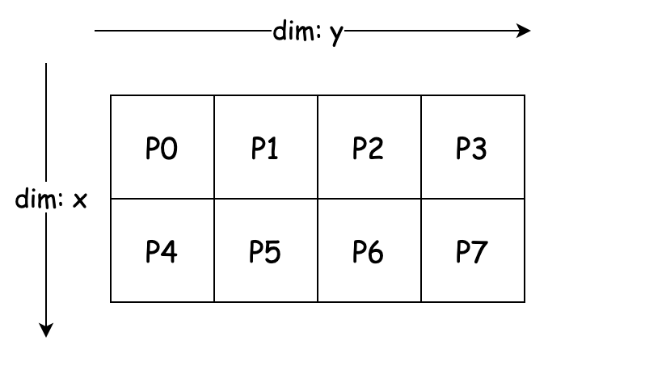
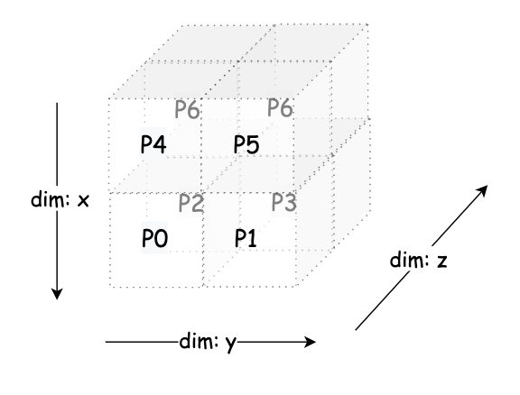
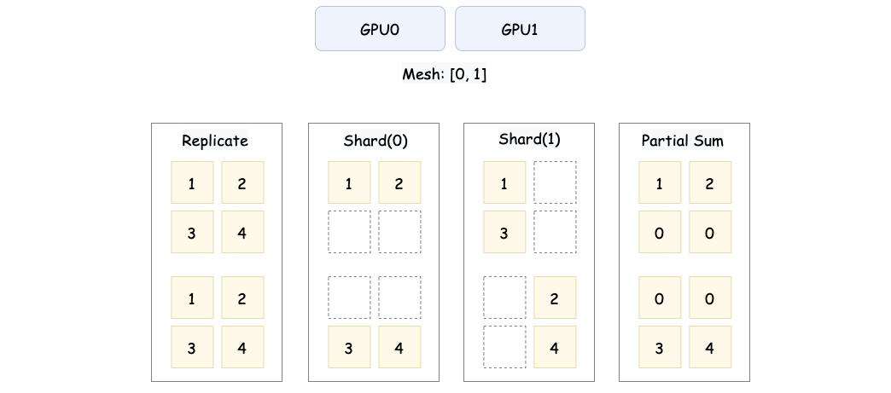

# 主流框架如何定义和管理分布式张量

## 1. 引言

分布式张量 Dtensor（Distributed Tensor）是一个专门设计的抽象和工具，用于描述和管理分布式 Tensor 的分布式属性。DTensor 的概念由 Google 在 TensorFlow 的发展中引入，并逐步成为常见的分布式训练优化方案，也被其他框架如 PyTorch 和 Paddle 等参考和使用。

## 2. 分布式张量模型

在分布式训练中，描述张量如何在设备间分布是一个关键问题。主流框架都采用了一种通用的分布式张量模型，由 `Mesh` 和 `Layout` 两个核心概念组成。

### 2.1 Mesh：设备拓扑的逻辑表示

Mesh 是设备的一种笛卡尔拓扑表示。它将计算设备（如 GPU 或 TPU）组织成一个多维网格，用于描述设备间的逻辑关系。可以简单理解为一个设备的多维数组，每个维度称为一个 “网格维度”。

一个 Mesh 通常由以下部分构成：

1. 设备列表：Mesh 包含的物理设备
2. 网格维度：设备按照逻辑维度组织，例如二维网格可以表示为行和列
3. 网格维度名称：每个维度可以用一个唯一的名称标识，便于分片描述

设有 8 个 GPU，编号为 0, 1, 2, 3, 4, 5, 6, 7，我们可以将其组织成一个 2x4 的二维 Mesh，如下图所示：

  

**示例：2D Mesh**

在实际应用过程中，我们可以在不同的 Mesh 纬度上做不同的并行化操作，比如我们可以在这个 2x4 Mesh 上实现 2D 并行，其中 数据并行的并行度为 2，张量并行的并行度为 4。

将批量数据分片到 dim: x 的 2 组设备：

- 第一组：`P0, P1, P2, P3` 处理第 1 个数据分片
- 第二组：`P4, P5, P6, P7` 处理第 2 个数据分片

将权重矩阵 W 切分到 `dim: y` 的 4 个设备。在每个数据并行组中，列按张量并行切分，P0 负责 `W[:, 0:256]`，P1 负责 `W[:, 256:512]`，依此类推。每组的设备并行计算自己的数据分片和张量分片，前向传播计算完成后，设备之间通过通信去共享中间结果。

进一步的我们可以想一想，利用 8 个 GPU 如何实现 3D 并行，即在 3 个维度上进行并行化操作:

dim: x（数据并行）：

- 第 1 组数据并行：`[P0, P1, P2, P3]`
- 第 2 组数据并行：`[P4, P5, P6, P7]`

dim: y（流水线阶段）：

- 第一列（流水线阶段 1）：`[P0, P1, P4, P5]`
- 第二列（流水线阶段 2）：`[P2, P3, P6, P7]`

dim: z（张量并行）：

- 第 1 组张量并行：`[P0, P2, P4, P6]`
- 第 2 组张量并行：`[P1, P3, P5, P7]`



### 2.2 dimsMapping/Placements：张量的分布描述

在分布式训练中，描述张量如何在设备网格（Mesh）上分布需要三个关键信息：

1. 张量维度（Tensor Dimension, axis）：张量的逻辑形状
2. 设备网格维度（Device Mesh Dimension, dim）：设备集群的逻辑拓扑
3. axis 到 dim 的映射关系：张量的每个维度（axis）如何映射到设备网格的维度（dim）

两种常见的描述方式：

1. dimsMapping：直接将张量维度与设备网格维度的映射关系用整数列表表示
2. placements：通过具体的分片类型（如 Sharded 或 Replicated）来描述每个张量维度的切分方式

**示例**：

假设张量 $X$ 的形状为 $[16, 1024, 1024]$（即 $[b, s, h]$）。设备网格为 $[2, 2]$。

我们希望：

- 张量的第 0 维（batch, $b$）映射到 Mesh 的第 1 维
- 张量的第 1 维（seq, $s$）映射到 Mesh 的第 0 维
- 张量的第 2 维（hidden, $h$）不切分，完整保存在每个设备上

用 dimsMapping 表述就是 `[1, 0, -1]`

- 第 0 维 $b$ 分布到 Mesh 的第 1 维
- 第 1 维 $s$ 分布到 Mesh 的第 0 维
- 第 2 维 $h$ 未切分，完整保存在设备上

placements 的表述就是 `["Sharded", "Sharded", "Replicated"]`

- $b$ 和 $s$ 被切分到设备
- $h$ 未切分，完整存储

#### 三种常见的分片类型

在 placements 中，常见的分片类型有三种：

1. Sharded：张量被切分到多个设备上，每个设备存储张量的一部分
2. Replicated：张量完整复制到每个设备上
3. Partial：指每个计算设备只拥有部分值，需要通过指定的规约操作才能恢复成全量数据

  

这张图展示了张量在分布式设备上的三种常见分布方式。第一种是 **Replicated**，即张量的完整数据被复制到每个设备上，所有设备存储的内容完全一致。比如 $X = \begin{bmatrix} 1 & 2 \\ 3 & 4 \end{bmatrix}$，在 GPU0 和 GPU1 上都保存完整的矩阵。

第二种是 **Sharded**，表示张量被切分到不同设备上，每个设备只存储张量的一部分。按行切分（Sharded(0)）时，GPU0 存储 $\begin{bmatrix} 1 & 2 \end{bmatrix}$，GPU1 存储 $\begin{bmatrix} 3 & 4 \end{bmatrix}$。按列切分（Sharded(1)）时，GPU0 存储 $\begin{bmatrix} 1 \\ 3 \end{bmatrix}$，GPU1 存储 $\begin{bmatrix} 2 \\ 4 \end{bmatrix}$。

第三种是 **Partial**，设备存储的不是完整的切片，而是部分计算结果。例如图中的 **Partial Sum**，GPU0 存储的是原始张量的第 0 行数据 $\begin{bmatrix} 1 & 2 \\ 0 & 0 \end{bmatrix}$，GPU1 存储的是原始张量的第 1 行数据 $\begin{bmatrix} 0 & 0 \\ 3 & 4 \end{bmatrix}$。通过进一步的规约操作（如 AllReduce），可以将所有设备上的部分结果合并为完整张量 $\begin{bmatrix} 1 & 2 \\ 3 & 4 \end{bmatrix}$。

但是这里有一个问题，dimsMapping 如果是纯数字，那么就没办法表述 Partial 状态，因此如果我们希望某个维度是 Partial 的，那么就 dimsMapping 需要扩展 partial 的状态。我们可以看下 Paddle 里面的例子：

```plain
(%463) = "pd_op.cast" (%460) {dtype:float32,op_dist_attr:{mesh:{shape:[2,2],process_ids:[2,3,6,7]},operand(0):{mesh_shape:[2,2],process_ids:[2,3,6,7],dims_mappings:[-1,1], partial(0,SUM), placements:[Partial(reduce_type=SUM), Shard(dim=1)]},result(0):{mesh_shape:[2,2],process_ids:[2,3,6,7],dims_mappings:[-1,1], partial(0,SUM), placements:[Partial(reduce_type=SUM), Shard(dim=1)]},chunk_id:-1},op_role:1,stop_gradient:[false]} : (pd_dist.tensor<4096x4096xf16, mesh_shape:[2,2],process_ids:[2,3,6,7],dims_mappings:[-1,1], partial(0,SUM), placements:[Partial(reduce_type=SUM), Shard(dim=1)]>) -> pd_dist.tensor<4096x4096xf32, mesh_shape:[2,2],process_ids:[2,3,6,7],dims_mappings:[-1,1], partial(0,SUM), placements:[Partial(reduce_type=SUM), Shard(dim=1)]>
```

我们可以看到这里的 dims_mappings 里面有 partial 的状态，`dims_mappings:[-1,1], partial(0,SUM)` 表示第 0 纬度是 partial 的，reduce 的方式是 SUM，这样就可以表述 partial 的状态了。

:::note
其实我感觉这里同时存 Placements 和 dimsMappings 有点冗余，因为 placements 里面已经包含了 dimsMappings 的信息，这里两者都存了，感觉有点冗余。
:::

## 3. 操作的分布式信息存储


