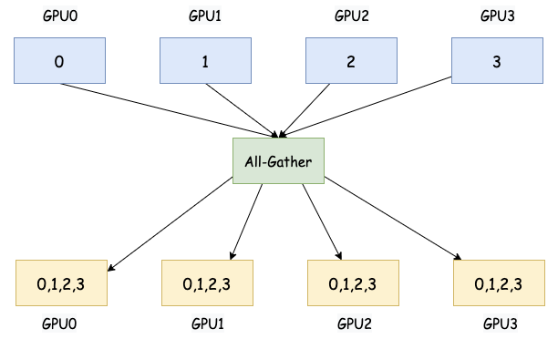

# 各种通信操作大白话解释

## 1. Reduce

`Reduce` 将所有参与进程的局部数据通过指定的归约操作（例如，求和、乘积、最大值、最小值等）进行聚合，并将结果存储在指定的根进程上。

大白话：每个人手里都有一些数字。Reduce 就是把大家手里的数字都加起来（或者用其他方式合并，比如取最大值、最小值），最终只让其中一个人（通常是指定的根进程）知道结果。

  

## 2. Scatter

Scatter 将一个指定的根进程将其拥有的数据分割成若干份，并将每一份发送给一个参与进程

大白话：有一个人手里有一副扑克牌。Scatter 就是这个人把牌一张一张地发给其他人，直到发完为止。每个人拿到一部分牌。

## 3. Broadcast 

Broadcast 是一种点到多点的集合通信操作，其中一个进程（通常是 rank 0 或指定的根进程）将其拥有的数据发送给所有其他参与进程。

大白话：有一个人知道一个重要的消息。Broadcast 就是这个人把这个消息告诉所有人，大家都听到了。

  

## 4. All-Reduce

All-Reduce 对所有参与进程的局部数据执行指定的归约操作（例如，求和、求平均等），并将结果广播回给所有参与进程。这是数据并行训练中同步梯度的关键操作。

大白话：每个人手里都有一些数字。All-Reduce 不仅把大家的数字加起来，而且最后每个人都知道这个总和是多少。

  

## 5. All-Gather

All-Gather 中每个参与进程将其拥有的局部数据发送给所有其他参与进程。最终，每个进程都将拥有来自所有其他进程的数据。

大白话: 每个人手里都有一小块拼图。All-Gather 不仅把所有人的拼图都收集起来，而且最后每个人都拿到了一份完整的拼图。

  

在模型并行训练大模型时，例如将模型的不同层或子模块分配到不同的设备上，All-Gather 可以用于在这些不同的部分之间收集必要的中间计算结果。例如，在 Transformer 模型中，不同 attention heads 的输出可能需要在后续层进行聚合。

## 6. Reduce-Scatter

Reduce-Scatter 首先对所有参与进程的局部数据执行归约操作（例如，求和），然后将归约后的结果分割成若干份，并将每一份分发给对应的参与进程。在数据并行训练中，Reduce-Scatter 通常用于将梯度聚合到不同的设备上。

大白话: 每个人手里都有一串数字。Reduce-Scatter 先把所有人的数字对应位置加起来（就像 Reduce），得到一个总的数字串。然后，再把这个总的数字串分成几份，每个人拿到其中一份。

对于训练非常大的模型，梯度同步的通信开销可能非常高。Reduce-Scatter 是一种更高效的梯度同步方式，它可以将聚合后的梯度直接分发给对应的 worker 进行参数更新，而不需要将梯度广播给所有 worker。

## 7. All-To-All

All-To-All 将每个参与进程将其数据分割成 N 份（N 是参与进程的总数），并将第 i 份发送给第 i 个进程。每个进程都会向其他所有进程发送数据，并从其他所有进程接收数据。

大白话: 想象一下，每个人都有一封秘密信要寄给其他人。All-To-All 就是每个人都给其他每个人写一封信，并且把这些信都寄出去，同时自己也会收到来自其他每个人的信。

  

All-to-All 通信可以用于在 MoE 训练中，让每个专家节点将计算结果发送到所有其他节点，以实现全局数据聚合，