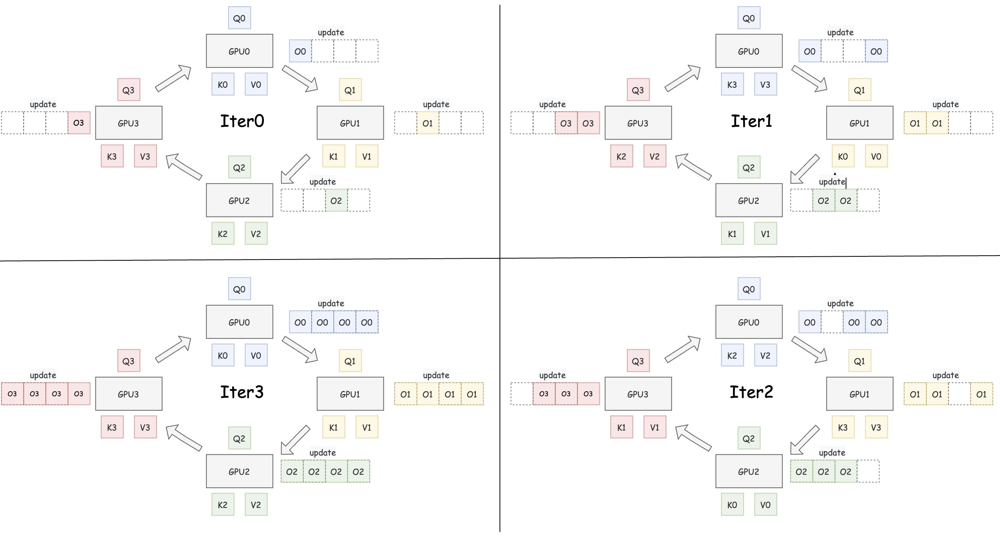

# 动手实现 Ring Attention

## 1. 为什么关注 Ring Attention 代码


近年来，Transformer 架构和其核心的 Attention 机制无疑是深度学习领域最耀眼的明星之一。从自然语言处理到计算机视觉，Attention 机制凭借其捕捉长距离依赖关系的能力，在众多任务上取得了突破性的进展。

然而，这种强大的能力并非没有代价。标准 Self-Attention 机制的计算复杂度和内存占用都与输入序列长度 $N$ 的平方成正比，即 $O(N^2)$。这意味着当序列长度增加时，所需的计算资源会急剧增长。对于动辄包含数万甚至数十万个 Token 的长文档、高分辨率图像或长时间序列数据，标准 Attention 很快就会变得难以承受，成为模型扩展的瓶颈。

为了突破这一限制，研究者们提出了各种优化方案，例如稀疏 Attention、低秩近似以及像 FlashAttention 这样的 I/O 感知优化技术。而 **Ring Attention** 则是近年来备受关注的一种巧妙方法，它专门为**分布式计算环境**（例如多 GPU 或多 TPU 训练）设计，旨在高效处理那些单张卡内存无法容纳的超长序列。

你可能已经听说过 Ring Attention 的概念——将序列分块，然后在计算设备组成的“环”上传递 Key 和 Value。但理论描述往往是抽象的。**真正理解一个算法的最好方式之一，就是深入它的代码实现。**

因此，这篇博客的目的并非进行复杂的理论推导或数学证明，而是**聚焦于一份清晰、可运行的 PyTorch 代码实现**。我们将一起逐行剖析这份代码，看看 Ring Attention 的核心思想——分块计算、环状通信、在线更新——是如何转化为具体的张量操作和控制流的。通过这种方式，我们希望你能直观地、深刻地理解 Ring Attention 的工作原理，而不仅仅是停留在概念层面。

准备好了吗？让我们一起潜入代码的世界，揭开 Ring Attention 的面纱！

## 2. Ring Attention 核心思路速览

想象我们有 4 个计算单元（GPU 0, 1, 2, 3）围成一圈。

  

:::note

图片参考了猛猿大佬的图，佬的图画的太好了！

:::

这张图直观地展示了 Ring Attention 如何在多个计算单元（如图中的 GPU 0, 1, 2, 3）组成的环上协同工作。让我们一步步来看：

初始状态 (Iter0)，  首先，完整的 Query (Q), Key (K), Value (V) 张量被分成块。每个 GPU 分配到对应的 Q, K, V 块（例如，GPU0 获得 Q0, K0, V0）。

其中 Q 块固定： 每个 GPU 上的 Q 块 (Q0, Q1, Q2, Q3) 在整个过程中都固定不动。单 K/V 对： 每个 GPU 在任何时刻只持有一对 K/V 块。初始时，就是它自己对应的 K/V 块。

环状计算与通信 (Iter1, Iter2, Iter3...)

这是 Ring Attention 的核心所在，它将计算和通信巧妙地结合起来：

在每次迭代（如 Iter1）开始时，每个 GPU 利用其固定的 Q 块和当前持有的 K/V 块进行 Attention 计算。例如，在 Iter1 中，GPU0 计算 `Attention(Q0, K0, V0)` 的一部分。这个计算过程并不需要生成完整的注意力矩阵，而是采用类似 FlashAttention 的“在线更新”方法，逐步更新内部累积的输出状态（图中用 update 和旁边的累积方块表示，实际上每个 GPU 只维护一组不断更新的状态 O, l, m）。

与此同时（理想情况下），GPU 之间开始传输数据。传输的内容仅仅是 Key (K) 块和 Value (V) 块。

- 发送： 每个 GPU 将自己当前使用完的 K/V 块发送给环上的下一个 GPU。
- 接收： 每个 GPU 从环上的上一个 GPU 接收新的 K/V 块，准备用于下一次迭代的计算。

如图 Iter1 所示： GPU0 使用 (K0, V0) 计算后，将 (K0, V0) 发送给 GPU1，并从 GPU3 接收 (K3, V3)。其他 GPU 同理，形成一个顺时针的 K/V 流动环。

这个流程体现了 Ring Attention 的精妙之处：

1. 计算顺序无关性： 就像 FlashAttention 一样，只要能拿到当前的累积状态 (O, l, m)，计算 `Attention(Qi, Kj, Vj)` 的顺序（例如先算 K0 还是先算 K1）并不影响最终结果。这为灵活的计算调度提供了可能。
2. 显存节省： 相比于朴素的分块方法（可能需要在每个 GPU 上缓存所有 K/V 块），Ring Attention 每个 GPU 只需存储一对 K/V 块，显著降低了显存占用，尤其是在处理超长序列时。图中 GPU0 在 Iter1 时虽然收到了 (K3, V3)，但它只需要为下一次计算准备，当前计算只依赖 (K0, V0)。
3. 通信计算重叠： Ring Attention 的核心优化目标是让 K/V 块的传输时间被 Attention 的计算时间所覆盖。如果设计得当（例如调整块大小、优化网络通信），数据传输带来的额外开销可以被隐藏在计算过程中，从而在节省显存的同时，尽量不牺牲计算效率。


:::note

图中为 $Q_i$ 画出的多个累积 update 块是为了清晰地展示每一轮迭代后的状态变化。在实际实现中，每个 GPU 只维护一组不断更新的输出 O、最大值 m 和归一化因子 l。

:::

## 3. PyTorch 详解：让 Ring Attention “跑起来”

接下来，我们将深入到 PyTorch 的实现代码中，分析 Ring Attention 的具体实现。初始化分布式环境的代码和一些工具函数我们就不细说了，主要关注 Ring Attention 的核心实现部分。

大家感兴趣可以直接去 [ring_attn.py](https://github.com/AndSonder/space.keter.top/tree/master/docs/high_performance/%E5%88%86%E5%B8%83%E5%BC%8F%E8%AE%AD%E7%BB%83%E5%9F%BA%E7%A1%80%E7%9F%A5%E8%AF%86/codes/ring_attn.py) 中查看完整代码。

下面我们来详细看看主函数 `ring_attention_distributed_fwd` 的实现, 其核心执行流程可以分解为三个流程我们依次介绍。

### 3.1 初始化与准备工作

当每个 GPU 进程调用这个函数时，首先会进行一系列的准备工作：

1. 获取基本信息
2. 创建本地累积状态张量
3. 准备当前轮次的 K/V 块和接收缓冲区

```python
# 1. 获取基本信息
batch_size, n_heads, chunk_size, head_dim = q_local.shape
device = q_local.device

# 2. 创建本地累积状态张量
o_local = torch.zeros_like(q_local)
l_local = torch.zeros(batch_size, n_heads, chunk_size, 1, device=device, dtype=torch.float32)
m_local = torch.full((batch_size, n_heads, chunk_size, 1), -float('inf'), device=device, dtype=torch.float32)

# 3. 准备当前轮次的 K/V 块和接收缓冲区
k_curr = k_local.clone()
v_curr = v_local.clone()
k_recv_buffer = torch.empty_like(k_local)
v_recv_buffer = torch.empty_like(v_local)
```

`o_local`, `l_local`, 和 `m_local` 是每个 GPU 的“记账本”，用于在环状计算过程中逐步累积结果：

- `o_local` 存储 Attention 输出的分子部分，在 FlashAttention 论文中表示为 $O$。
- `l_local` 存储 Softmax 的分母部分, 在 FlashAttention 论文中表示为 $l$。
- `m_local` 存储计算 Softmax 时的最大值

`k_curr` 和 `v_curr` 是当前 GPU 持有的 K/V 块，`k_recv_buffer` 和 `v_recv_buffer` 用于接收来自环上其他 GPU 的 K/V 块。

### 3.2 核心环状计算与通信

这是 Ring Attention 算法的核心。这个循环会执行 `world_size` (GPU 数量，这里是 4) 次，确保每个 GPU 的 `q_local` 都有机会与所有的 K/V 块进行交互。

在每一次 `step` (每一圈) 中，会依次执行以下子步骤：

**1、本地 Attention 计算**

```python
# --- 计算逻辑开始 ---
scores_ij = torch.matmul(q_local, k_curr.transpose(-2, -1)) / (head_dim ** 0.5)
# ... (省略 mask 应用) ...
m_ij = torch.max(scores_ij, dim=-1, keepdim=True)[0]
p_ij = torch.exp(scores_ij - m_ij)
l_ij = torch.sum(p_ij, dim=-1, keepdim=True)
o_ij = torch.matmul(p_ij, v_curr)

m_prev = m_local
l_prev = l_local
o_prev = o_local

m_new = torch.maximum(m_prev, m_ij)
exp_diff_m_prev = torch.exp(m_prev - m_new)
exp_diff_m_ij = torch.exp(m_ij - m_new)
l_new = exp_diff_m_prev * l_prev + exp_diff_m_ij * l_ij
o_new = (exp_diff_m_prev * o_prev + exp_diff_m_ij * o_ij)

o_local = o_new
l_local = l_new
m_local = m_new
# --- 计算逻辑结束 ---
```

在每个 GPU 上，首先计算当前的注意力分数 `scores_ij`，然后应用 Softmax 和其他操作来更新 `o_local`, `l_local`, 和 `m_local`。这个过程与 FlashAttention 中的在线更新方法类似，首先计算当前块的统计量，然后与之前的累积状态进行合并得到新的状态。

### 3.3 阻塞式环状通信 (K/V 块的发送与接收)

在每个迭代中，当前 GPU 会将自己计算完的 K/V 块发送到下一个 GPU，并从上一个 GPU 接收新的 K/V 块。这个过程是阻塞式的，确保每个 GPU 在发送和接收数据时不会发生冲突。

```python
k_to_send = k_curr # 准备发送刚计算完的 K
v_to_send = v_curr # 准备发送刚计算完的 V

if rank % 2 == 0: # 偶数 Rank
    dist.send(tensor=k_to_send, dst=next_rank)
    dist.send(tensor=v_to_send, dst=next_rank)
    dist.recv(tensor=k_recv_buffer, src=prev_rank)
    dist.recv(tensor=v_recv_buffer, src=prev_rank)
else: # 奇数 Rank
    dist.recv(tensor=k_recv_buffer, src=prev_rank)
    dist.recv(tensor=v_recv_buffer, src=prev_rank)
    dist.send(tensor=k_to_send, dst=next_rank)
    dist.send(tensor=v_to_send, dst=next_rank)
```

这里使用了 PyTorch 的 `dist.send` 和 `dist.recv` 函数来实现 GPU 之间的通信。

需要注意的是，这里使用了一个简单的奇偶数 Rank 机制来决定发送和接收的顺序。这是非常经典的解死锁的方法，确保每个 GPU 在发送和接收数据时不会发生冲突。

**3、更新下一轮计算所需的 K/V 块**

在每次迭代结束时，当前 GPU 会更新 `k_curr` 和 `v_curr` 为接收到的 K/V 块，以便在下一轮计算中使用。

```python
k_curr = k_recv_buffer.clone()
v_curr = v_recv_buffer.clone()
```

**4、同步所有进程**

在每次迭代结束时，使用 `dist.barrier()` 来确保所有 GPU 都完成了当前的计算和通信。这是一个同步点，确保所有 GPU 在进入下一轮迭代之前都处于一致的状态。

```python
dist.barrier()
```

### 3.4 最终结果归一化

当 `for` 循环迭代完 `world_size` 次后，所有 GPU 都完成了对所有 K/V 块的计算。最后一步是将每个 GPU 上的 `o_local` 和 `l_local` 进行归一化，以得到最终的 Attention 输出。

```python
l_local_safe = torch.where(l_local == 0, torch.ones_like(l_local), l_local)
final_o_local = o_local / l_local_safe
```

这里用了安全除法，避免了除以零的情况。最后用累积的分子 `o_local` 除以累积的分母 `l_local_safe`，完成 Softmax 的归一化，得到当前 GPU 负责的那部分序列的最终 Attention 输出 `final_o_local`。

`final_o_local` 是每个 GPU 上的最终输出张量，包含了当前 GPU 计算的 Attention 结果。在训练过程中，这个输出会通过 `dist.all_gather` 函数收集到主 GPU 上，形成完整的 Attention 输出。


## 4. 总结

Ring Attention 的核心魅力在于其分而治之与高效协同的思想。它巧妙地将庞大的计算任务分解到各个计算单元，并通过环状通信模式，让每个单元在处理本地任务的同时，又能“窥见”全局信息（即所有的 Key 和 Value）。我们实现的简化版本，虽然采用了阻塞通信，牺牲了部分性能，却清晰地揭示了数据如何在 GPU 间流动、状态如何累积、以及如何通过精巧的通信模式（如奇偶交错）避免死锁。

Ring Attention 作为一种分布式场景下优化 Attention 通信效率的策略，虽然在大模型训练中很有价值，但它也存在一些显著的缺点或局限性。

比如他需要通常需要 Q/K/V 的维度结构一致，难以适配 多模态输入 或 结构不对称的 Transformer（如 MQA、GQA）。如 PyTorch 的 torch.nn.MultiheadAttention、xFormers、Flash Attention 等都未原生支持 ring attention。


## 参考文献

1. https://zhuanlan.zhihu.com/p/4963530231
2. https://zhuanlan.zhihu.com/p/683714620
3. https://arxiv.org/abs/2310.01889

