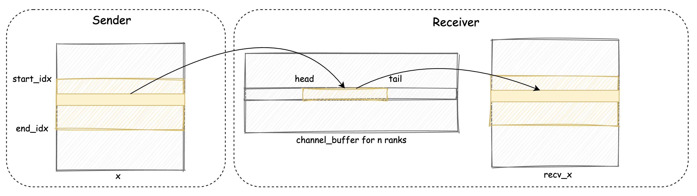

# DeepEP 邮局（一）：机内 MoE 通信

随着 DeepSeek 的爆火，Moe 架构已经成了现在超大模型的标配了，它通过将模型参数扩展到海量的“专家”网络中，并为每个输入 Token 动态选择一部分专家进行计算，成功地在控制计算成本的同时，极大地提升了模型容量和性能 。

然而，MoE 的强大威力背后，隐藏着一个巨大的工程挑战：

**All-to-All 通信**。想象一下，在一个拥有 64 个 GPU 的集群中，每个 GPU 上的数千个 Token 都可能需要被发送到其他任意一个 GPU 上的专家那里进行计算 。这瞬间产生了一场数据传输的 “通信风暴”。

如果采用传统方法，让每个 Token 都与目标专家直接点对点通信，网络将迅速拥塞，通信延迟将成为整个训练或推理流程的瓶颈。

DeepEP 是 DeepSeek 团队开源的一个高性能通信库，它从根基上重新设计了一套优雅、高效的通信范式。本文中，我们用一个邮局模型来帮助大家理解 DeepEP 的核心设计思路。

现在，让我们走进 DeepEP 邮局系统的第一站——**“同城邮局”**。

这个场景对应的是单台服务器内部的多张 GPU（例如 8 张）之间的通信。它们就像是同一座城市里的 8 家分局，彼此之间有高速公路（NVLink）相连，物流速度极快。但即便如此，如果没有一套精妙的调度系统，8 家分局同时向彼此寄送成千上万的包裹，依然会造成分拣中心的混乱。

DeepEP 的同城邮局系统，将这个复杂的过程拆解为两个核心环节：“晨会规划”和“异步派送”。

## 1. `notify_dispatch`：投递前的“晨会”


通信的第一步，是所有邮递员（GPU）在正式派送前召开一次简短而关键的“晨会”。

**目的只有一个：**

共同制定一份全局一致的 **《投递计划总账》**，明确每条邮路上包裹应投放的位置，避免数据混乱。

这个“晨会”分为四个步骤，我们结合图来看一下：


**步骤一：Token 数量申报（每个 Rank 自主填写寄信清单）**

每个 Rank（如 Rank 0, i, j）本地生成 `num_tokens_per_rank`： 表示 “我要发给每个 Rank 的 token 数量”，即：寄件数量表

这个数组的长度为 `num_ranks`，第 j 个位置表示要发给 Rank j 的数量。

**步骤二：数据交换（通过 NVLink 汇总清单）**

所有 Rank 将 `num_tokens_per_rank` 通过 NVLink 网络进行交换，形成一个 2D 矩阵 `per_rank_buffer`。 第 i 行表示 Rank i 发出的 token 分布， 第 j 列表示 Rank j 将收到的 token 来源分布。

**步骤三：收件清单提取（构建 `num_recv_tokens_per_rank`）**

每个 Rank 只关心自己会收到哪些 token，因此提取 `per_rank_buffer` 的第 i 列。 得到 `num_recv_tokens_per_rank`，表示“我会从哪些 Rank 收到多少 token”。这份表格就是“我的收件篮计划”，用于后续准确定位数据接收位置。

**步骤四：全局同步（确保所有 Rank 的清单一致）**

在进入下一步数据发送前，所有 Rank 都需完成“申报 → 汇总 → 提取”的三步流程。故设置 barrier，确保全局通信计划构建完成后再继续派送。

你可能会好奇，上面提到的 `barrier` 是如何实现的？ DeepEP 并未使用重量级的 `__syncthreads()`（它只能同步一个 block 内的线程），而是实现了一个巧妙的、基于原子操作的自定义 Barrier。

想象一下，邮局门口有一个签到表（`barrier_signal_ptrs`），每个邮递员都有自己的一行。

1. **进入**：邮递员 i 来开会时，会在自己的签到表上 `atomicAdd` 一个标记 T，同时在所有其他同事的签到表上 `atomicSub` 一个标记 T 。
2. **等待**：所有人都签到后，每个邮递员 i 就开始盯着自己的签到表。由于他收到了来自其他所有 N-1 个同事的 -T，以及自己的 +T，他的计数值会不断变化。只有当所有人都完成了签到和扣减操作，他的计数值才会最终变回 0。
3. **离开**：一旦发现自己的计数值归零，就知道“晨会”结束，可以开始派送了。

这个方法利用原子操作的特性，实现了一个轻量而高效的跨 Block 同步机制。


## 2. `dispatch`：基于“收件篮”的异步派送

在完成 “晨会” 汇总后，每个 Rank 手里都攥着两份关键的账本：

1. `rank_prefix_matrix`：全局投递总账，它告诉你每个 Rank 应该把多少 token 发给谁
2. `channel_prefix_matrix`：本地分渠道账本，细化了当前 Rank 在每个 Channel 上要发给每个目标 Rank 的 token 分布

这个过程的目标，并不仅仅是把包裹（Token）从 Rank i 送到 Rank j，而是要像一枚精确制导导弹那样，将数据直接送达 Rank j 的最终存储区域 `recv_x` 中的唯一、正确位置。

为了实现这一点，整个系统协同运转。让我们先来认识一下这个“派送系统”的几大核心部件：

1. **目的地清单 (is_token_in_rank):** 每一个包裹都随身携带一张“目的地清单”，标注它究竟要寄往哪些邮局（也就是目标 GPU Rank）。我们可以通过 `is_token_in_rank` 数组来快速判断某个包裹是否需要被发送到 Rank j。
2. **多通道传输系统 (Channel):** 为了提升并行度，DeepEP 会将所有包裹划分给多个“传输通道”（称为 Channel），每条通道独立运行。你可以理解为一个邮局同时开设了多个收发窗口，每个窗口专注处理一部分任务，从而避免拥堵。在源码中， Channel 的数量通常由配置的 SM（流式多处理器）数量决定，例如 `num_sms / 2`。
3. **临时收件篮 (channel_x_buffers):** 每个接收端的每个“收发窗口”后面，都有一排临时的“收件篮”，用来接住其他邮局送来的包裹。这是数据从发送方到接收方的第一个落脚点，一个高效的临时存储区。收件蓝有两个指针：`head` 和 `tail`，分别指向当前篮子中最前面和最后面的包裹位置。
4. **派送小组 (Sender Warp Group):** 在每条通道内，派送任务会被分给一个“派送小组”协同完成。这个小组由多个 GPU Warp（一个 Warp 是 32 个线程）组成 。例如，当总共有 768 个线程为 8 个 Rank 服务时，每个 Rank 就会得到一个由 3 个 Warp 组成的派送小组。
5. **最终存储货架 (recv_x):** 所有包裹的终点，是接收方的主存储区——一块被称为 recv_x 的大货架。包裹从“收件篮”中取出后，会被直接放到这个货架上，按照提前规划好的精确坐标存放，等待后续计算。

现在，所有部件都已就位，我们来还原一个包裹的派送全过程：



**Step 1：计算 recv_x 的绝对坐标**

Rank i 的 Channel k 准备向 Rank j 发送 `token_idx` 时，它会拿出两本账本，计算出包裹在 Rank j 的“最终货架” `recv_x` 上的唯一存放地址 ：

全局偏移 = `rank_prefix_matrix[i-1][j]`：查《全局投递总账》，统计在 i 之前，所有其他 Rank 总共给 j 发了多少包裹。
通道偏移 = `channel_prefix_matrix[j][k-1]`：查《本地渠道账本》，统计在 i 内部，k 通道之前的所有通道，总共给 j 发了多少包裹。

两者与包裹在当前通道内的序号相加，便得到了它在 `recv_x` 中的绝对精确坐标。

**Step 2：放入“收件篮”，并更新 tail 指针**

计算完地址后，Sender 不会直接写入 `recv_x`，而是先将数据连同其“绝对坐标”信息一起，打包放入 Rank j 对应通道的“临时收件篮” `channel_x_buffers` 中。

写入前，`Sender` 会先检查收件篮空间是否足够（通过比较 head 和 tail 指针）。一旦空间可用，它便**分块（Chunked）**写入一批数据，然后将 `tail` 指针向前推进，这相当于向 Receiver 发出了“新货已到”的信号。

**Step 3：从“收件篮”归位到“永久货架”**

`Receiver` 线程检测到 `tail` 被推进，便知道有新数据到达。它从收件篮中取出数据，读取随数据附带的“绝对坐标”信息，直接将包裹精准地放入 `recv_x` 中的对应位置，然后更新 `head` 指针，释放收件篮的空间。

下面的代码节选自 `intranode.cu` 中 `dispatch kernel` 的 `Sender` 分支，它完整地展现了上述三步流程中的核心部分：

```cpp
// 遍历当前 Channel 负责的所有 token
for (int64_t token_idx = token_start_idx; token_idx < token_end_idx; ) {
    
    // --- Step 1 & 2 的前置环节：流控，等待“收件篮”空位 ---
    while (lane_id == 0) {
        // 通过比较 head 和 tail，计算已用空间
        int num_used_slots = cached_channel_tail_idx - ld_volatile_global(channel_head_idx.buffer());
        // 如果剩余空间足够放下下一个 chunk (num_max_send_tokens)，则跳出等待
        if (num_recv_buffer_tokens - num_used_slots >= num_max_send_tokens)
            break;
    }
    __syncwarp(); // 小组内所有线程同步，确认空间可用

    // --- Step 2：构造一个 chunk 并放入“收件篮” ---
    int chunk_token_idx = 0;
    while (chunk_token_idx < num_max_send_tokens && token_idx < token_end_idx) {
        
        // 查询“目的地清单”，如果这个 token 不需要发给当前目标 rank，则跳过
        if (!is_token_in_rank[token_idx * kNumRanks + responsible_rank]) {
            token_idx++;
            continue;
        }

        // 获取一个空的“收件篮”位置 (slot)
        int dst_slot_idx = (cached_channel_tail_idx++) % num_recv_buffer_tokens;
        
        // 将 token 数据(x, topk_idx, topk_weights等)写入收件篮的 dst_slot_idx 位置...
        // ... (此处为高性能的 UNROLLED_WARP_COPY 等拷贝操作) ...

        chunk_token_idx++, token_idx++;
    }

    // --- Step 2 的收尾：推进 tail 指针，正式通知接收方 ---
    // 小组内先同步一次，确保所有人都完成了拷贝
    asm volatile("bar.sync %0, %1;" :: "r"(responsible_rank), "r"(num_threads_per_rank)); 
    
    if (send_warp_id_in_rank == 0 && lane_id == 0)
        // 每个派送小组的“领队”线程(warp 0, lane 0)负责更新 tail，避免冲突
        st_release_sys_global(channel_tail_idx.buffer(), cached_channel_tail_idx);
}
```

### P2P 与 IPC 机制

读到这里不知道大家有没有一个问题：

DeepEP 里面的通信方式都是异步去做的，他不依赖 CUDA 的同步机制，也不依赖 nccl 去做通信。为什么它可以不依赖传统的 nccl 通信就可以实现跨 GPU 的通信呢？

**答案是 NVIDIA 的 P2P 技术 和 CUDA 的 IPC (Inter-Process Communication) 机制。**

这是我在理解 DeepEP 的通信逻辑时最震撼的一点：我们平时提到「多卡通信」，大多数人第一反应是 Broadcast、AllReduce、Send/Recv，但在 DeepEP 里面，根本看不到这些。取而代之的，是一套更底层、更“原始”的方式：直接操作对方的显存。

NVIDIA 为此提供了两个关键能力：

首先是 **P2P（Peer-to-Peer）通信**。只要你的机器中 GPU 之间通过 NVLink 或高版本 PCIe 互联，你就可以启用 GPU 之间的“互访权限”。开启之后，一个 GPU 访问另一个 GPU 的显存就像 CPU 访问另一个 NUMA 节点的内存一样，地址可能远了一些，但完全是合法的、可写的。

其次是 **IPC（Inter-Process Communication）机制**。这个机制的名字虽然叫“进程间通信”，但在实际使用中，它更像是一个“显存共享协议”：你在某张卡上 `cudaMalloc` 出一段显存，然后调用 `cudaIpcGetMemHandle`，CUDA 会给你生成一个可以“外发”的 handle，类似一张门禁卡。别的 GPU 拿到这张卡后，就可以用 `cudaIpcOpenMemHandle` 得到一个“合法”的指针，指向那段显存。

这时候就妙了：你在 GPU-0 上写入这个指针，实际上写入的是 GPU-1 的物理显存，但因为有 NVLink 和 P2P 打底，这个写入不仅合法，还非常高效。没有任何 NCCL，也不需要 memcpy，**就是一次合法的写操作而已**。

DeepEP 在启动阶段，每张卡都会：

1. 分配一段通信缓冲区
2. 获取这段显存的 ipc 句柄
3. 把这个句柄广播给其他卡
4. 其他卡通过这个句柄打开对应的显存地址

最后，每张卡都拥有了一个指针数组 `buffer_ptrs[i]`，里面每个指针都指向 Rank-i 的通信缓冲区。


## 3. `combine`：带回执的返程之旅

当各个邮局的专家（Experts）处理完收到的包裹（Tokens）后，他们的工作并未结束——还得确保这些包裹被准确无误地送回到最初的寄件人手中。但这次回来的操作，已经不仅仅是简单的“退货”，更像是一场基于“发货回执”的精准回收与合并。

在介绍 combine 的细节之前，我们不得不提到 dispatch 阶段留下的一份关键“发货回执单”——send_head 张量。

邮递员 i 给邮局 j 投递包裹（`token_idx`）时，他同时会在自己的记事本上记录一条详细的投递信息，比如“寄了哪个包裹，在收件篮（`channel_x_buffers`）里的具体哪一号位置（slot index）”。这个位置信息被保存到 `send_head[token_idx, j]` 中。因此，send_head 就像一张高精度的“发货清单”，明确写着：

**“我的哪个包裹，发给了谁，放在了他家收件篮的第几号位。”**

正是这份回执单，让 `combine` 阶段能保证无缝地取回每一个寄出的包裹。

**combine 阶段：角色的神奇反转**

在 combine 阶段，整个系统的角色发生了一个戏剧性的反转。派送员变成了回收员，寄件人变成了接收处理结果的人。

当 combine 阶段启动时，派送的 Sender 角色完成使命，摇身一变成了 Receiver，等待将包裹的处理结果逐一收回。DeepEP 中，这个“回收小组”由 24 个 Warp 线程（kNumThreads = 768，即 768 ÷ 32 = 24 Warp）组成。

这 24 个 Warp 的第 0 个 Warp （协调员）不亲自搬运包裹。他的唯一任务，是监控所有“包裹处理员”的工作进度，并在确保安全的前提下，统一更新“收件篮”的 head 指针，通知上游可以继续发货。

剩下 23 个 Warp （处理员）负责根据“发货回执单”，并行地从各个返程通道的“收件篮”中取出包裹，并将其内容累加（Reduce）到最终的存储货架 `recv_x` 上。

```cpp
// 源码节选自：csrc/kernels/intranode.cu -> combine 函数
// is_sender 为 false 的分支，即 combine 的接收端

// 角色分工：根据 warp_id 判断身份
if (thread_id < 32) {
    // --- “核查员” (Coordinator, warp_id = 0) 的工作 ---
    
    // ... (循环监控，直到所有处理员都完成任务)
    while (true) {
        // 检查所有“处理员”是否都已退休
        bool retired = true;
        #pragma unroll
        for (int i = 1; i < num_recv_warps; ++i)
            retired = retired && warp_retired[i]; // warp_retired 是处理员完成任务的标志
        if (retired) break;

        // 收集所有“处理员”的进度报告 (warp_channel_head_idx)
        int min_head = std::numeric_limits<int>::max();
        #pragma unroll
        for (int i = 1; i < num_recv_warps; ++i)
            min_head = min(min_head, warp_channel_head_idx[i][lane_id]);
        
        // 如果进度有更新，则安全地推进全局 head 指针
        if (min_head > last_head)
            st_relaxed_sys_global(channel_head_idx_ptr, last_head = min_head);
    }

} else {
    // --- “包裹处理员” (Receiver, warp_id > 0) 的工作 ---

    // 遍历自己负责的 token
    for (int64_t token_idx = token_start_idx + recv_warp_id - 1; token_idx < token_end_idx; ...) {
        
        // 1. 读取“发货回执单”
        int expected_head = ld_nc_global(send_head + token_idx * kNumRanks + lane_id);
        
        // 2. 等待返程包裹到达（核对回执）
        while (channel_tail_idx[lane_id] <= expected_head && expected_head >= 0) {
            // 不断检查 tail 指针，直到它超过了回执单上记录的位置
            channel_tail_idx[lane_id] = ld_acquire_sys_global(channel_tail_idx_ptr);
            // ... (超时保护)
        }

        // 3. 从“收件篮”取货并累加到“最终货架”
        // ... (高性能的 reduce 和 copy 操作) ...

        // 4. 向“核查员”汇报自己的工作进度
        warp_channel_head_idx[recv_warp_id][lane_id] = expected_head + 1;
    }
    
    // 所有任务完成，举手“退休”
    if (lane_id == 0) warp_retired[recv_warp_id] = true;
}
```

## 4. 总节

至此，我们已经完整地剖析了 DeepEP 在单节点内部实现 All-to-All 通信的全过程。让我们再次回顾这个精巧的“同城邮局”系统是如何运作的：

1. 规划先行 (`notify_dispatch`)：一切始于“晨会”，所有 GPU 通过一次高效的自定义 barrier 同步，共同制定出两本精确到字节的《全局投递总账》和《本地渠道账本》。这确保了后续所有的派送都有据可查，不会出现地址冲突。
2. 精准派送 (`dispatch`)：派送任务被分解到多个并行的“派送渠道”中，每个渠道的“派送小组”根据账本计算出每个包裹在最终“货架”(recv_x)上的绝对坐标。数据被分块（Chunked）地放入临时的“收件篮”(channel_x_buffers)，并通过轻量的 head/tail 指针进行异步流控，最终被精准归位。
3. 回执回收 (`combine`)：返程之旅则依赖于派送时留下的“发货回执单”(send_head)。回收小组中的“包裹处理员”和“首席核查员”分工明确，协同工作，在确保所有数据都准确返回后，才进行合并计算，完成了整个通信的闭环。


整个过程，DeepEP 将一个看似混沌的 All-to-All 问题，通过 **“预先全局规划、任务并行分解、异步流控、精准地址计算”** 等一系列组合拳，转化成了一套高度有序、无锁、且能极致利用 NVLink 带宽的高效数据流。

在下一篇文章中，我们将探索 DeepEP 设计中最为闪亮的精华所在——Inter-Node 跨节点通信。届时，我们将揭秘其巧妙的 “L 形路由” 策略，看它是如何解决跨节点通信的延迟和带宽瓶颈。


