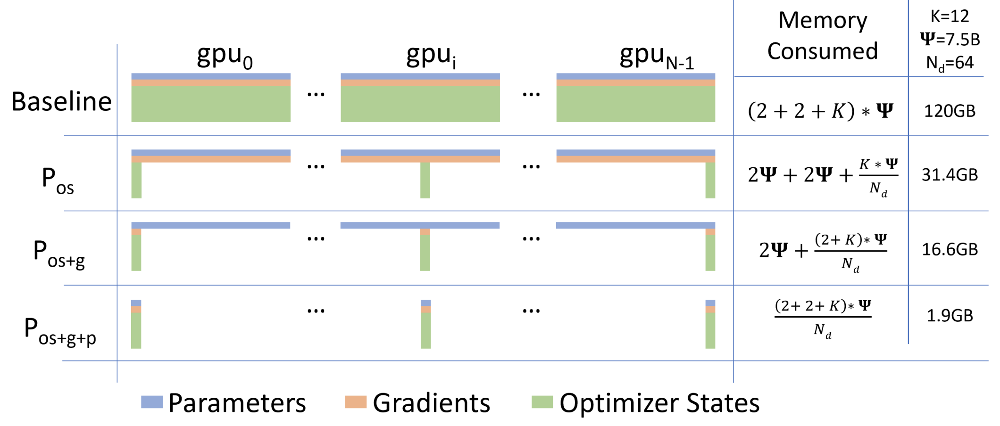

# ZeRO 论文阅读

:::tip

ZeRO: Memory Optimizations Toward Training Trillion Parameter Models[^1]

:::

## 1. 介绍

ZeRO 是微软提出的用于将数据并行运用到超大规模的神经网络中，实现了一个超线性的加速的方法。

在模型训练的时候，显存占用主要又俩部分组成，第一部分是 Model State[^2]，第二部分是 Activations[^3]。ZeRO 主要是针对 Model State 进行优化，通过将 Model State 分成多个部分，每个部分在不同的 GPU 上计算，然后将结果合并，从而减少显存的占用，用通讯换内存。

## 2. Model State 的组成

首先我们先介绍一下 Model State 的组成，Model State 主要由三部分组成：

1. Optimize State：优化器的状态，比如 Adam 的动量和 RMSProp 的移动平均值等。
2. Gradients：梯度，用于更新模型参数。
3. Parameters：模型参数。

在传统数据并行下, 每个进程都使用同样参数来进行训练。每个进程也会持有对 Optimizer States 的完整拷贝, 同样占用了大量显存。在混合精度场景下, 以参数量为 $\Psi$ 的模型和 Adam optimzier 为例, Adam 需要保存: 

- Float16 的 参数和 梯度 的备份。这两项分别消耗了 $2 \Psi$ 和 $2 \Psi$ Bytes 内存; (1 Float16 =2 Bytes) 
- Float32 的 参数, Momentum, Variance 备份, 对应到 3 份 $4 \Psi$ 的内存占用。(1 Float 32=4 Bytes)。 最终需要 $2 \Psi+2 \Psi+K \Psi=16 \Psi$ bytes 的显存。一个 7.5B 参数量的模型, 就需要至少 120GB 的显存空间才能装下这些 Model States 。当数据并行时, 这些重复的 Model States 会在 N 个 GPU 上复制 N 份[^4]。

ZeRO 在数据并行的基础上，对冗余的 Model State 进行了优化，接下来我们将详细介绍 ZeRO。

## 3. ZeRO 的三个级别

ZeRO 有三个级别，分别对应对 Model States 不同程度的分割： 

- ZeRO-1：分割 Optimizer States； 
- ZeRO-2：分割 Optimizer States 与 Gradients； 
- ZeRO-3：分割 Optimizer States、Gradients 与 Parameters[^4]。

  

上图显示了模型状态在三种 ZeRO-DP 优化阶段下的每设备内存消耗比较。 $\Psi$ 表示模型大小（参数数量），K 表示优化器状态的内存乘数，$N_d$ 表示数据并行度。在这个例子中，我们假设模型大小为 $\Psi$  = 7.5B，数据并行度 Nd = 64，K = 12，基于混合精度训练使用 Adam 优化器。

- **Baseline**（基线）：每个 GPU 设备的内存消耗为 (2 + 2 + K) *  $\Psi$ ，总计 120GB。
- **Pos**（仅优化器状态）：每个 GPU 设备的内存消耗为 2 $\Psi$  + 2 $\Psi$  + (K *  $\Psi$ ) / Nd，总计 31.4GB。
- **Pos+g**（优化器状态和梯度）：每个 GPU 设 备的内存消耗为 2 $\Psi$  + (2 + K) *  $\Psi$  / Nd，总计 16.6GB。
- **Pos+g+p**（优化器状态、梯度和参数）：每个 GPU 设备的内存消耗为 (2 + 2 + K) *  $\Psi$  / Nd，总计  1.9GB。

### 3.1 ZeRO-1

ZeRO-1 只会优化 qi 器状态进行分片，假设我们有 $N_d$ 个进程，那么每个进程只会持有 $\frac{1}{N_d}$ 的优化器状态。 模型在训练的时候 Forward 和 Backward 部分都正常的进行，只是在更新的时候，首先需要一个 All-Reduce 操作，将所有进程的梯度进行合并，然后再各自更新自己的参数，更新过后的 Partitioned FP32 Master Parameters 会通过 All-gather 传回到各个进程中。 - 完成一次完整的参数更新。

通过 ZeRO-1，7.5B 参数量的模型内存占用将由原始数据并行下的 120GB 缩减到 31.4GB。

### 3.2 ZeRO-2

ZeRO-1 是对优化器状态进行分片，ZeRO-2 是对优化器状态和梯度进行分片。在对 Optimize State 切片后，更新的这部分 Optimize State 是不需要完成的 Gradient 的。所以也就可以对 Gradient 进行分片。

ZeRO-2 更新的流程和 ZeRO-1 类似，只是在更新的时候，需要先将各个进程的梯度进行 All-Reduce 操作，然后再各自更新自己的参数。不同的是，ZeRO-2 可以立马释放掉不需要的 Gradient 来进一步减少显存的占用。

在 ZeRO-2 的情况下，7.5B 参数量的模型内存占用将由原始数据并行下的 120GB 缩减到 16.6GB。

### 3.3 ZeRO-3

ZeRO-3 在 ZeRO-2 的基础上，再对参数进行分片。想要对参数进行分片，实现的时候比较复杂，因为参数是需要在 Forward 和 Backward 阶段都需要的。所以在 ZeRO-3 中，需要对参数进行分片，然后在 Forward 和 Backward 阶段都需要将参数进行 All-gather 操作，然后再进行计算。下面我们来看一下 ZeRO-3 的更新流程。

在训练之前，ZeRO-3 会将每个 Submodule[^5] 的参数按照 GPU 数量进行分片，然后将每个 Submodule 的参数分发到不同的 GPU 上。原始的参数会被释放掉，只保留分片后的参数。

在训练的时候，ZeRO-3 会根据 Submodule 的计算需求，通过 All-gather 拿到分摊储存在不同进程中的子参数，重建原始的 param。重建之后的参数就可以参与计算。计算完成后不需要的参数会被释放掉。

在 ZeRO-3 的情况下，7.5B 参数量的模型内存占用将由原始数据并行下的 120GB 缩减到 1.9GB。

## 4. 总结

ZeRO 是一种用于训练超大规模神经网络的方法，通过将 Model State 分片，然后在不同的 GPU 上计算，最后再将结果合并，从而减少显存的占用。ZeRO 有三个级别，分别对应对 Model States 不同程度的分割，分别是 ZeRO-1、ZeRO-2 和 ZeRO-3。

ZeRO 为训练超大规模神经网络提供了一种新的思路，但是在实际使用的时候，需要根据自己的需求选择合适的级别。

[^1]: https://arxiv.org/pdf/1910.02054
[^2]: Model state 包括优化器状态、梯度和参数
[^3]: 激活（activations）是指网络每一层在给定输入批次下产生的输出。这些激活对于前向传播和反向传播都是必不可少的，它们会消耗大量的内存。
[^4]: https://zhuanlan.zhihu.com/p/394064174
[^5]: 每个模型由多个 Submodule 组成