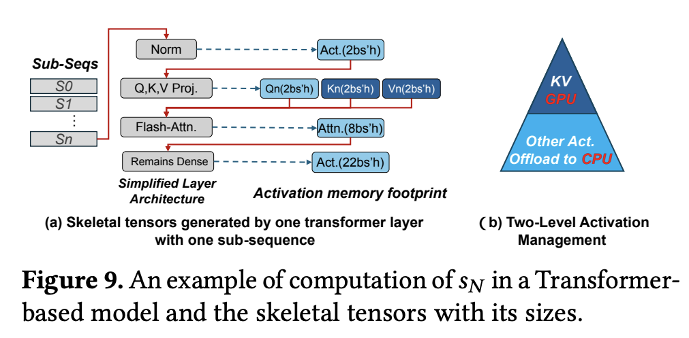
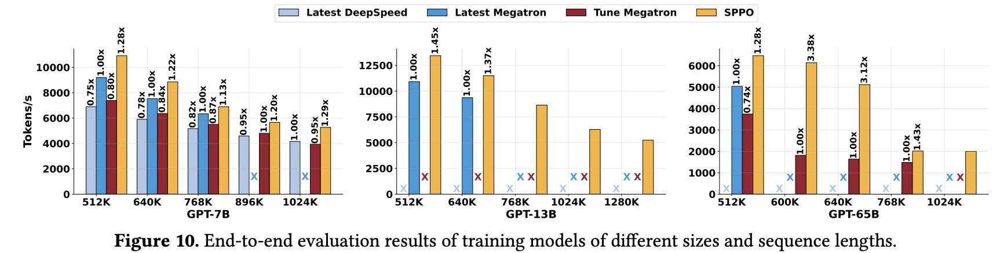

# SPPO：高效长序列大模型训练框架

## 1. 引言：当大模型遇上“无限”上下文

众所周知，Transformer 架构中的激活值（Activations）会随着序列长度的增加而急剧膨胀。这部分中间状态需要在反向传播时用于梯度计算，其对 GPU 显存的占用成为了制约序列长度扩展最为直接和关键的瓶颈。

面对这些难题，现有的优化方案**在“超长序列”这一极端场景下，往往显得力不从心**。例如，激活重计算（Activation Recomputation）虽然能节约显存，但其“以时间换空间”的策略会显著增加训练时长；传统的 CPU Offloading 机制，在序列长度剧增时，其数据传输的延迟难以被有效隐藏，反而可能成为新的瓶颈；而各类分布式并行策略（如序列并行），尽管能在一定程度上分摊压力，但面对数百万级别 Token 长度所产生的海量激活值，依然需要庞大的 GPU 集群，其资源消耗和扩展性面临严峻考验。

正是在这样的背景下，一种旨在攻克超长序列 LLM 训练难题的新型框架——SPPO (Adaptive Sequence Pipeline Parallel Offloading) 应运而生。SPPO 是一个创新的 LLM 训练框架，其核心目标在于通过自适应的序列感知卸载 (Sequence-aware Offloading)、两级激活管理 (Two-level Activation Management) 以及自适应的流水线并行调度 (Adaptive Pipeline Scheduling) 与多路复用序列分区 (Multiplexed Sequence Partitioning)，来极致优化长序列训练过程中的显存使用效率和计算资源利用率，从而在有限的硬件资源下，实现更长序列、更大规模模型的有效训练。

下面我们将从超长序列训练的核心瓶颈出发，详细剖析 SPPO 如何巧妙地应对这些挑战，重点解读其两大核心创新——自适应 Offloading 与自适应流水线调度的具体机制与原理，并通过翔实的实验结果验证其卓越性能。

## 2. SPPO 框架：破局超长序列训练的新思路

面对超长序列训练带来的严峻挑战，SPPO 框架提出了一种富有洞察力的核心思想：化整为零，逐个击破——将原本难以驾驭的超长序列切分为更小、更易于管理的子序列 (Subsequences) 进行处理。 这一看似简单的策略，实则是撬动整个优化杠杆的关键支点。为何说子序列处理是破局的第一步？其精髓与动机深植于对现有技术瓶颈的深刻理解和对硬件发展趋势的敏锐洞察。

### 2.1. 为何“切分”是关键

将一个完整的长序列在序列维度上进行切分，形成多个子序列，并在此基础上进行 Offloading 和流水线调度，能够带来两大核心优势：

**优势一：子序列级别的 Offloading 优化——更精细、更高效的数据腾挪**

传统的 Offloading 策略往往以整个激活层或整个批次为单位，当序列长度达到百万级别时，单次卸载的数据量变得异常庞大，导致以下问题：

1. 高昂的传输开销难被隐藏： 巨大的数据块在 GPU 与 CPU 之间的传输时间过长，GPU 计算单元不得不长时间等待，导致训练效率低下。
2. 显存峰值依旧难以控制： 即便进行了 Offloading，在数据准备和传输过程中，显存依然可能面临瞬时的高峰压力。

通过将长序列切分为子序列，Offloading 的粒度得到了极大的细化。

SPPO 的设计使得无论是 CPU Offloading 的开销，还是 GPU 内部的计算开销，都更多地取决于相对短小的子序列长度，而非整个长序列的长度这意味着单次传输的数据量减小，传输时间缩短，从而更有可能被并行的 GPU 计算或其他操作有效隐藏。

正如论文 图 2b 所揭示的，现代计算架构中 CPU-GPU 之间的 PCIe 带宽增速显著。这一硬件趋势为细粒度的、高频的子序列级别 Offloading 提供了坚实的基础。更快的传输通道使得小块数据的快速腾挪成为可能，进一步降低了 Offloading 操作对整体训练效率的负面影响。

  

**优势二：子序列级别的流水线调度优化——有效压缩“流水线气泡”**

传统的流水线并行（Pipeline Parallelism, PP）是加速深度学习模型训练的常用手段，例如经典的 1F1B（One Forward pass followed by One Backward pass）调度策略。其核心思想是将模型的不同层（Stages）分配到不同的 GPU 上，并通过微批次（Micro-batches）的流水化执行来提高并行度。

然而，在处理超长序列时，一个关键的问题浮现：为了最大化序列长度，我们往往只能将全局批次大小（Global Batch Size）设置为 1，这意味着传统意义上的微批次数量也坍缩为 1。

如 图 3(a) 所示的 1F1B 调度，在有多个微批次时能有效工作。但当微批次为 1 时（如 图 3(b) 所示，处理一个 4K 的单序列），1F1B 调度会退化为朴素的流水线执行方式，导致流水线的启动和排空阶段产生巨大的“气泡”（Bubble Time），即 GPU 空闲时间，严重拉低了硬件利用率和训练效率。

  

SPPO 通过引入子序列的概念，巧妙地解决了这一问题，如 图 3(c) 所示，即使全局批次大小为 1，SPPO 也可以将这个长序列切分成多个子序列（例如 S1, S2, S3, S4）。这样，在一个 GPU（例如 GPU0 Layer0）处理当前子序列（如 S1）的同时，另一个流水线阶段的 GPU（例如 GPU1 Layer1）可以处理前一个子序列（如果存在依赖和调度许可的话），或者当前 GPU 的后续层可以开始处理当前子序列的下一部分计算。更重要的是，同一流水线阶段内，不同子序列的计算（例如，S1 的前向传播完成后，可以开始 S2 的前向传播）可以形成新的、更细粒度的流水，或者说，一个子序列在某个流水线阶段的计算可以与另一个子序列在该阶段或后续阶段的计算形成重叠。

这种在子序列级别上的流水化处理，使得 GPU 能够更持续地进行有效计算，显著减少了因等待数据或依赖而产生的空闲时间，从而大幅压缩了流水线气泡，提升了整体的训练吞吐量和资源利用率。

### 2.2. 直面挑战：现有固定策略的“低效”根源 

虽然将长序列切分为子序列为优化带来了曙光，但这仅仅是万里长征的第一步。如果后续的 Offloading 和流水线调度仍然沿用传统的“固定”策略，不仅无法充分发挥子序列的优势，反而可能引入新的效率瓶颈。SPPO 论文深刻指出了这些固定策略的固有缺陷：

**挑战一：低效的固定 Offloading 策略 (Inefficient Fixed Offloading)**

在对子序列进行 CPU Offloading 时，如果采用固定的、一刀切的策略，往往会导致“按下葫芦浮起瓢”的尴尬局面。常见的固定 Offloading 策略及其问题如下：

1、等长切分 (Length-based Policy) 的缺陷：

这种策略完全忽视了 Transformer 模型（尤其是其核心的自注意力机制）中不同 Token 位置计算负载不均衡的特性。具体来说，在自注意力计算中，靠后的 Token 需要与前面所有的 Token 进行交互，其计算量远大于靠前的 Token，正如 Distflashattn [1] 等分布式注意力机制研究所观察到的那样。等长的子序列划分，必然导致不同子序列在 GPU 上的实际计算时间出现显著差异，这为后续的计算与通信重叠带来了困难。

2、等计算量切分 (FLOPs-based Policy) 的缺陷：

为了平衡计算负载，一些工作如 TeraPipe[2] 和 Seq1F1B[3] 采用了均衡每个子序列计算量（FLOPs）的思路，这意味着靠前的子序列会比较长，而靠后的子序列会比较短。

虽然这种策略在理论上平衡了各个子序列的 GPU 计算时间，但却引入了新的问题——**激活内存大小和 Offloading 时间的不均衡**。由于子序列长度不一，其对应的激活值大小也必然不同。Offloading 的时间开销与数据量（即激活值大小）线性相关。因此，**对于那些长度较长、激活值较大的靠前子序列，其 Offloading 时间可能远超 GPU 计算时间；而对于激活值较小的靠后子序列，其 Offloading 时间可能又过短**。这种 Offloading 时间的剧烈波动使得 **GPU 计算与 CPU Offloading 难以有效、持续地重叠**，最终导致 GPU 空闲和训练效率下降。SPPO 论文中的 图 4 和 图 5 非常直观地展示了这种不均衡性：在 FLOPs 平衡的策略下，不同子序列的激活内存占用差异巨大，导致其传输时间也差异巨大，早期的子序列传输时间远超计算时间，造成显著的 Offloading 开销。

  

该图展示了基于 FLOPs 的分区策略下，虽然总计算负载（条状图上部）被均匀切分到 S0, S1, S2, S3 等子序列，但由于注意力机制的特性，这些子序列的实际长度（条状图下部代表 HEL(L)O DAGI）是不同的（H, E, L 较长，I 较短）。这导致了在不同流水线阶段（stage-0, stage-1），虽然计算时间（深色块）相似，但激活内存（浅色背景区域）需求不一。

  

该图进一步量化了这个问题，展示了在 LLAMA-65B 模型、128K 序列长度下，将序列划分为 8 个或 16 个子序列（基于 FLOPs 平衡）时，各个子序列的激活内存大小。无论是 8 子序列还是 16 子序列，第一个子序列的激活内存远大于最后一个，导致其传输时间远超可被计算隐藏的阈值（图中虚线所示的 Overlapped Comp Thresholds）。

**3、不必要的 Offloading 开销与张量依赖问题**

传统的 Offloading 决策往往在层级别或批次级别做出，因为这些粒度下的中间激活张量与后续层或批次的张量相对独立。然而，当我们将计算和调度细化到子序列粒度时，子序列之间的张量依赖关系变得更加复杂。如果依然采用固定的、不考虑张量实际访问模式的 Offloading 策略，很可能会导致不必要的“颠簸”（Thrashing）——频繁地将很快又会被访问的张量卸载到 CPU，然后再匆忙加载回 GPU，徒增了通信开销。SPPO 论文通过其 图 6 分析了 Transformer 模型中不同类型张量的访问时间线（Type-0, Type-1, Type-2），指出某些张量被持续访问，而另一些张量则在特定阶段访问后有较长的空闲期。针对这些不同的访问模式，**固定的 Offloading 策略显然无法做到最优，例如，卸载 Type-1 张量可能比卸载 Type-0 或 Type-2 张量更高效**。

  

该图展示了一个 Transformer 模型中三种类型张量（Tensor type-0, type-1, type-2）在一次迭代（包含前向和后向传播）中被访问的时间点。Type-0 张量（如来自 S0）在前向和后向传播中被连续、密集地访问。Type-1 张量在前向传播中出现一次，在后向传播中再次出现一次，中间有较长的间隔。Type-2 张量的访问模式则可能不同。这表明针对不同生命周期和访问模式的张量应采取差异化的卸载策略。

**挑战二：低效的固定流水线调度策略 (Inefficient Fixed Pipeline Schedule)**

即便解决了 Offloading 的部分问题，如果流水线调度策略本身是固定的——许多现有工作如 DAPPLE [4]、GPipe [5]、PipeDream [1] 和 Zero Bubble [6] 都依赖于某种预定或固定的调度模式——那么在子序列处理的场景下，同样会面临效率瓶颈：

**1、子序列长度选择的“两难困境”**

将一个长序列切分成多少个子序列（即每个子序列的长度如何确定）是一个非常关键的参数。这个参数的选择直接影响到 GPU 利用率和流水线效率之间的平衡。

- 过长的子序列： 有利于提高单个 GPU 核心的计算效率（因为计算密集型操作如 GEMM 和 Attention 在数据量较大时能更好地发挥性能），但可能会因为每个流水线阶段处理的数据块过大，导致流水线“排空”和“充满”的阶段过长，从而增加流水线气泡，降低整体训练效率。
- 过短的子序列： 虽然理论上可以减少流水线气泡，使得流水更加“平滑”，但每个子序列的计算量过小，可能导致 GPU 核心无法被充分利用（频繁的 Kernel 启动开销、计算未达到饱和等），反而降低了吞吐量。

**2、难以避免的流水线气泡开销**

即便我们通过精细的调整找到了一个“最优”的子序列数量 N，在传统的固定流水线调度下，由于流水线本身固有的启动（Warm-up）和排空（Cool-down）阶段，流水线气泡仍然是不可避免的。该论文还给出了计算流水线气泡时间和气泡比例的公式，用以量化这一开销，表明即使 N 取得最优，只要流水线阶段数 p 大于 1，气泡就必然存在。例如，当 p=4,N=16 时，气泡比例仍有 3/16。

正是由于上述这些固定策略在细粒度的子序列处理场景下暴露出的种种弊端，SPPO 框架才强调了“自适应”（Adaptive）的重要性。它不再依赖于预设的、一成不变的规则，而是力求根据运行时的状态和子序列的特性，动态地、智能地进行 Offloading 决策和流水线调度。这正是 SPPO 的核心创新所在，也是我们接下来要深入探讨的内容。

## 3. 深入 SPPO 的“心脏”：两大核心创新技术详解

在清晰地认识到固定策略的种种弊端之后，SPPO 框架针对性地提出了两大核心创新：自适应 Offloading 和自适应流水线调度。这两大技术相辅相成，共同构成了 SPPO 高效处理超长序列的基石。

### 3.1. 自适应 Offloading

正如前文所述，传统的固定 Offloading 策略，无论是基于等长切分还是等计算量切分，都难以完美解决计算与通信不平衡、以及由此引发的显存峰值过高和 GPU 空闲等问题。SPPO 认为，**一个理想的 Offloading 机制应当具备“自适应”能力**，即能够根据不同子序列的特性（如激活大小、后续计算需求）以及当前的系统状态（如 GPU 显存、CPU-GPU 带宽），动态调整 Offloading 的行为，而不是简单地遵循一成不变的规则。

SPPO 的自适应 Offloading 旨在让每个子序列都能找到其“最佳”的卸载策略，从而最大化卸载操作与 GPU 计算的重叠，同时将峰值显存控制在合理范围内。为此，SPPO 精心设计了两个关键组件：两级激活管理和序列感知 Offloading。

**核心组件 1：两级激活管理 (Two-Level Activation Management)**

核心思想：并非所有激活“生而平等”，根据激活张量的生命周期和访问频率进行差异化管理。
SPPO 敏锐地观察到，在一个 Transformer 层的计算过程中，不同的激活张量其重要性和被再次访问的“紧迫性”是不同的。粗暴地将所有激活一视同仁地进行卸载或保留，显然不是最优选择。

**1、识别“骨骼”激活 (Skeletal Activations)**

SPPO 将那些在后续计算中会被频繁访问或持续存在的激活视为“骨骼”激活。在基于 Transformer 的生成式大模型中，一个典型的例子就是 **K-V Cache (Key-Value Cache)**。在自注意力机制的计算中（尤其是对于 Causal LM），当前子序列 $s_N$ 计算完成后，其产生的 Query ($Q_N$) 不再用于后续的前向传播；然而，其 Key ($K_N$) 和 Value ($V_N$) 则需要被缓存下来，以参与后续所有子序列 $s_{i>N}$ 的注意力计算。SPPO 论文在其图 6 中将这类持续存在的 K-V 对（例如 $K_0, V_0$）归类为 Type-0 张量，它们具有持续被访问的特性。

**2、差异化处理 K-V Cache**

考虑到 K-V Cache 的这种持续访问特性，以及它们累积起来的总大小（对于一个包含 N 个子序列，总序列长度为 S，隐层维度为 H，批次大小为 B 的输入，所有 K-V Cache 的总大小约为 $2BSH$ 字节）相对于其他激活（例如，SPPO 论文中估算一个 Transformer 层产生的其余激活总量约为 $36BSH$ 字节）来说是可控的，SPPO 决定**将所有子序列的 K-V Cache 保留在 GPU 显存中，而不是将其卸载到 CPU**

**3、优化显存与带宽利用**

**SPPO 避免了 K-V Cache 的频繁换入换出**，这不仅节省了大量的 CPU-GPU 带宽，也避免了因等待 K-V Cache 从 CPU 加载回 GPU 而造成的计算延迟。**为其他“一次性”或“低频访问”激活的卸载腾出了宝贵的带宽和 CPU 处理资源。** SPPO 论文的 **图 9** 直观地展示了这种两级激活管理的思想：图 9(a) 描绘了一个简化的 Transformer 层架构以及其中产生的各类激活（如 Norm 后的激活、QKV Projection 后的激活、Flash Attention 后的激活等）；而图 9(b) 则形象地展示了其管理策略——将 K-V Cache（金字塔尖端）保留在 GPU，而将其他大部分激活（Other Act，金字塔下部）作为可以卸载到 CPU 的候选对象。

  

**图 9(a) 示意：** 展示了一个子序列 $s_N$ 在一个 Transformer 层中的计算流程，以及各步骤产生的激活张量及其大致大小（例如，Normalization 后产生 $2bsh$ 大小的激活，Q,K,V Projection 后各自产生 $bsh$ 大小的激活，Flash Attention 后产生 $bsh$ 大小的激活，后续 Dense Layer 后产生 $22bsh$ 大小的激活，其中 b 是批次大小，s 是子序列长度，h 是隐层维度）

**图 9(b) 示意：** 一个金字塔模型，顶部的“KV”部分代表 K-V Cache，被标记为保留在 GPU (Retain in GPU)。金字塔下部较大的“Other Act”部分代表其他类型的激活，被标记为可以卸载到 CPU (Offload to CPU)。这清晰地表达了差异化管理的思想。

**核心组件 2：序列感知 Offloading (Sequence-aware Offloading)**

在通过两级激活管理筛选出主要的 Offloading 对象（即非 K-V Cache 的那部分激活）之后，接下来的关键问题是：**如何智能地决定每个子序列应该卸载多少比例 (Offloading Ratio, $\alpha$) 的激活？** 这就是序列感知 Offloading 要解决的核心问题。

动态调整每个子序列的 Offloading 比例 $\alpha \in [0,1]$，其目标是**最大化第 $(i-1)$ 个子序列的 Offloading 操作与第 $i$ 个子序列的 GPU 计算操作之间的重叠**，同时避免因 Offloading 不及时导致的双重显存占用（即 GPU 同时存储当前计算所需的 $A_i$ 和前一个子序列待卸载的 $A_{i-1}$）。

SPPO 论文在其 **图 8 (顶部)** 中展示了一个朴素的完全卸载场景：由于第一个子序列 $S_0$ 的卸载时间过长（一直持续到 $S_2$ 的计算阶段），导致 GPU 显存峰值达到了 7 个激活单元。这是因为 GPU 需要为 $S_0$ 保留卸载缓冲区，同时又要为 $S_1, S_2$ 的计算准备激活内存。右侧的显存分配图显示，由于 S0 的卸载（Offload-Reload）时间很长，一直持续到 S2 计算阶段，导致 GPU0 在某个时间点（例如时间步 3-4）需要同时容纳 S0 的卸载缓冲、S1 的计算激活、S2 的计算激活，使得峰值显存达到 7 个单位。

  

具体的技术细节包括：

**1、定义与分配 Offloading 比例 $\alpha$**

SPPO 论文提出，对于一个经过 FLOPs 优化（通常导致 $s_0 \le s_1 \le ... \le s_N$，即序列开头的子序列较短，末尾的子序列较长，以平衡计算时间）的子序列分区 $s = \{s_0, s_1, ..., s_N\}$，会为其分配一个相应的、递减的 Offloading 比例序列 $\alpha = \{\alpha_0, \alpha_1, ..., \alpha_N\}$，其中 $\alpha_0 \ge \alpha_1 \ge ... \ge \alpha_N$ 。这意味着，对于激活值较小、计算时间也较短的早期子序列，可以采用较高的卸载比例（甚至完全卸载 $\alpha=1$）；而对于激活值较大、计算时间较长的后期子序列，则可以采用较低的卸载比例，甚至完全不卸载（$\alpha=0$），因为它们有更充足的计算时间来隐藏自身的（少量）卸载操作。

**2、显存动态与峰值控制**

SPPO 论文给出了流水线阶段 i 的显存动态公式：$M_i = M_{i-1} + A_i - (\alpha_{i-1} \cdot A_{i-1} \cdot \text{is\_offloaded}_{i-1})$ （此处稍作调整以更清晰表达，原论文公式为 $M_i = M_{i-1} + A_i - (\alpha_{i-1} \cdot A_{i-1})$，并假定 $A_{i-1}$ 是卸载的部分）。其中 $M_i$ 是当前 GPU 显存消耗，$A_i$ 是当前子序列 i 产生的激活量，$\alpha_{i-1} \cdot A_{i-1}$ 是前一个子序列 $i-1$ 中被实际卸载到 CPU 的激活量。SPPO 的目标是通过优化 $\alpha$ 值，来使得卸载时间（例如，$\frac{\alpha_i \cdot A_i}{BW_{D2H}}$，其中 $BW_{D2H}$ 是 GPU 到 CPU 的传输带宽）能够与平衡后的计算时间 $T_{balanced\_comp}$ 相匹配或被其隐藏。通过这种方式，可以有效地控制峰值显存。SPPO 论文指出，峰值显存 $M_{max}$ 通常发生在最后一个需要进行部分卸载的子序列 k（即 $\alpha_k < 1$ 但其前一个 $\alpha_{k-1}=1$）或者当最后一个子序列 $\alpha_N=1$ 时，其前一个子序列 $A_{N-1}$ 还未完全卸载完毕的时刻。

SPPO 论文的 **图 8 (中间部分)** 非常好地展示了自适应 Offloading 的效果。在同样的设置下，引入了自适应卸载策略。可以看到，子序列（例如 S0）的卸载操作（菱形标记）与后续子序列（S1）的计算（蓝色块）更好地重叠。右侧的显存分配图显示，峰值显存降低到了 5 个单位，并且时间线上显存占用更加平稳。这节省的时间（Time saved）也清晰标出。

### 3.2. 自适应流水线调度

通过前述的自适应 Offloading 技术，SPPO 已经在很大程度上优化了数据在 GPU 和 CPU 之间的流转效率，并降低了显存峰值。然而，正如 SPPO 论文在其 图 8 (中间部分) 所揭示的，即便采用了自适应 Offloading，传统的流水线并行机制依然可能存在难以避免的“气泡” (Bubbles)。这些气泡代表了 GPU 的空闲时间，是训练效率的直接损失。因此，SPPO 的下一个目标是：在解决了 Offloading 的核心问题之后，如何设计更智能的流水线调度策略，以进一步消除或显著减少这些固有的流水线气泡，从而最大化 GPU 的利用率？ 这便是自适应流水线调度的核心使命。

SPPO 的自适应流水线调度主要包含两大组件：**启发式求解器和多路复用序列分区 (MSP)**。

**核心组件 1：启发式求解器 (Heuristic Solver)**

在给定的模型、序列长度和可用硬件资源（如 GPU 数量）下，自动搜索一组最优或接近最优的混合并行参数组合，特别是序列并行度 (Sequence Parallelism size, SP)、流水线并行度 (Pipeline Parallelism size, PP) 以及子序列数量 (Number of subsequences, N)，其最终目标是最小化单次迭代的训练时间 T。

手动调优这些超参数组合是一个极其复杂且耗时的过程，尤其是在面临不同模型规模、序列长度和硬件配置时。一个高效的自动化搜索机制至关重要。

启发式的搜索都避免不了一个问题，如何缩小搜索空间？

为了避免暴力搜索带来的巨大开销，SPPO 的启发式求解器采用了一系列基于经验和硬件特性的规则来大幅削减搜索空间：

1. **避免跨节点序列并行 (Avoid cross-node sequence parallelism)**： SPPO 论文指出，序列并行通常涉及大量的 All-Reduce 或 All-Gather 通信。**如果序列并行的范围跨越了网络带宽远低于节点内部 NVLink 带宽的物理节点边界，那么通信开销将急剧增加，严重拖累训练效率**。因此，启发式求解器倾向于将序列并行限制在单个节点内部。
2. **避免跨节点流水线并行 (Avoid cross-node pipeline parallelism)**： 类似的，流水线并行虽然通信量可能小于张量并行或序列并行，但其 P2P 通信的延迟对于流水线的“流动”至关重要。跨节点进行流水线并行通常会受到节点间 PCIe 或 InfiniBand 带宽和延迟的限制，可能导致性能下降。因此，求解器也会优先考虑节点内的流水线并行划分。
3. **保持近似负载均衡 (Maintain near-balanced workloads)**： SPPO 论文通过经验性分析发现，对于 Transformer 的每一层，每个设备（GPU）处理的 Token 数量（即子序列长度）在一个特定范围内（例如 2K 到 16K Tokens）时，能够取得较好的计算效率和吞吐量。求解器会利用这一经验数据，将子序列数量 N 的搜索范围限制在能使每个 GPU 上的子序列长度落入这个“甜点区”的区间内。

通过这些启发式规则，求解器能够快速定位到一组合理的 (SP, PP, N) 参数，为后续的进一步优化（如 MSP）打下良好基础。

**核心组件 2：多路复用序列分区 (Multiplexing Sequence Partitioning - MSP)**

针对启发式求解器优化后，由于 N 值（子序列数量）可能相对较小而导致的、仍然显著存在的流水线气泡，MSP 提出了一种创新的“填充”策略。它通过对“气泡邻近”的子序列（即那些位于流水线启动和结束阶段，容易产生空闲的子序列）进行更细粒度的二次切分，并巧妙地利用传统的序列并行机制（例如 Megatron-LM 中应用的序列并行技术）将这些“子子序列” (sub-subsequences) 分布到不同的 GPU 上进行并行计算。其核心优势在于，这种操作可以在不引入额外显存开销（因为序列并行本身是显存高效的）的前提下，有效利用原本空闲的 GPU 计算资源，从而进一步压缩流水线气泡，提升训练效率。

SPPO 论文将应用了 MSP 的流水线阶段（无论是前向传播还是后向传播）划分为三个计算阶段：

1. **Left-SP 阶段**： 流水线处理的初始阶段，主要针对靠近流水线“头部”容易产生气泡的子序列。此阶段会利用序列并行来并行化这些子序列的计算。
2. **Steady 阶段**： 流水线的中间稳定执行阶段。在此阶段，主要采用前述的自适应 Offloading 和标准的子序列流水线处理方式。
3. **Right-SP 阶段**： 流水线处理的末尾阶段，主要针对靠近流水线“尾部”容易产生气泡的子序列。与 Left-SP 类似，此阶段也会利用序列并行

图 8 (底部) 展示了 MSP 的工作机制， 在自适应卸载的基础上（图 8 中间），进一步应用 MSP。可以看到，在流水线的开始（例如 GPU0 处理 S0）和结束（例如 GPU1 处理 S0，或者 GPU0 处理 S3，GPU1 处理 S3）阶段，原本可能存在的较大气泡被显著减小了。这是因为像 S0 和 S3 这样的“边缘”子序列被进一步切分（图中用更小的红色块表示 S0 和 S3 被切分的部分），并在多个 GPU 之间进行了序列并行计算。例如，GPU0 的 S0 被切分为两部分并行执行，使得其后向传播可以更早开始，从而减少了 GPU1 在等待 S0 后向结果时的空闲。右侧的显存分配图也显示了峰值显存依然得到良好控制，并且整体运行时间进一步缩短 (Time saved)。

## 4. 实验结果

理论的精妙最终需要实践的检验。SPPO 论文通过一系列详尽的实验，将其与当前最先进的长序列 LLM 训练系统进行了对比，用数据证明了其设计的优越性。

### 4.1. 实验设置概览

SPPO 基于 Python 和 CUDA 实现，代码库约 4000 行，是在成熟的 Megatron-LM 框架基础上进行开发的。其中，自适应 Offloading 的优化占约 2845 行代码，而多路复用序列分区 (MSP) 占约 1155 行代码。为了最大化 GPU 与主机间的传输带宽，实验中为每个进程绑定了 NUMA (Non-Uniform Memory Access) 节点，并使用页锁定内存 (Page-locked Memory) 作为 CPU 缓冲区。

实验在一个包含 16 个 GPU 服务器的物理集群上进行，每个服务器配备 8 颗 NVIDIA A100 (80GB 显存) GPU 和 128 核 CPU，总计 128 颗 A100 GPU。GPU 间通过 NVLink 和 NVSwitch 连接，节点间通信则依赖四块 NVIDIA Mellanox 200 Gbps HDR InfiniBand 网卡。每个节点拥有 2TB CPU 内存，GPU-CPU 通信带宽为 32 GB/s。

SPPO 主要与两个当前业界领先的长序列 LLM 训练系统进行比较：DeepSpeed Ulysses 和 Megatron-LM。

### 4.2. 核心实验结果解读

1、端到端吞吐量与可扩展性

SPPO 论文的 图 10 展示了在不同 LLM 模型（GPT-7B, GPT-13B, GPT-65B）和不同序列长度下，SPPO 与基线系统的训练吞吐量对比。

该图包含三个子图，分别对应 GPT-7B、GPT-13B 和 GPT-65B 模型。每个子图的横轴是序列长度 (K tokens)，纵轴是训练吞吐量 (Tokens/s)。图中用不同颜色的柱状图代表不同系统（Latest DeepSpeed, Latest Megatron, Tune Megatron, SPPO）的性能，并标注了 SPPO 相对于基线的加速比。

从图中可以清晰地看到：PPO 在各种模型大小和序列长度下，均一致地超越了 DeepSpeed-Ulysses 和 Megatron-LM，实现了 1.13x 到 3.38x 的端到端训练速度提升。SPPO 的一个关键优势在于其能够稳定处理其他系统可能出现显存不足 (Out-of-Memory, OOM) 的超长序列。

2、 显存效率分析

SPPO 论文强调，其卓越的性能和对超长序列的支持，很大程度上归功于其高效的显存管理机制。通过近乎零开销的自适应 Offloading 和优化的流水线并行（特别是 MSP），SPPO 有效地缓解了 GPU 显存压力。

与 Megatron-LM 在相同并行策略下依赖昂贵的激活重计算不同，SPPO 尽可能避免了这种以时间换空间的妥协，从而在保证显存可控的同时，实现了更高的计算效率。

3、性能提升分解 (Speedup Breakdown) 

为了更深入地理解 SPPO 各个优化组件的贡献，SPPO 论文进行了性能分解实验，其结果如 图 11 所示。该图展示了在 GPT-13B (序列长度 512K) 和 GPT-65B (序列长度 640K) 模型上，SPPO 不同组件相对于仅使用序列并行（SPPO w/o offload，可视为一种基础的 Megatron-LM 配置）的归一化加速比。

  

从图中我们可以发现下面几个重要的结论：

朴素完全 Offloading (Full CPU Offloading) 的影响并非总是正面，虽然 CPU Offloading 理论上能优化 GPU 显存，但其带来的数据传输开销在某些情况下（如计算负载不够重，或通信与计算重叠不佳时）是不可忽视的。如图 11(a) 所示，在 GPT-13B 模型、512K 序列长度下，完全卸载（+ Fully off）相比不卸载（SPPO w/o offload）甚至带来了轻微的性能下降（加速比 0.91x）。然而，在另一些场景下，例如图 11(b) 的 GPT-65B 模型、640K 序列长度，当并行策略本身通信效率高但显存效率差时，完全卸载则能带来显著收益（加速比 2.1x）。这说明了 Offloading 策略需要“因地制宜”。

自适应 Offloading (Adaptive Offloading) 的普适性与巨大贡献，无论是 GPT-13B 还是 GPT-65B，在引入了自适应 Offloading 后，性能都得到了大幅且稳定的提升。例如，在 GPT-13B 上带来了 1.23x 的相对加速，在 GPT-65B 上更是带来了高达 3.38x 的相对加速（相比于 SPPO w/o offload）。

多路复用序列分区 (Multiplexing Sequence Partitioning - MSP) 的锦上添花，MSP 技术进一步提升了训练效率，其效果在流水线气泡比例较高（通常由子序列数量 N 和流水线阶段数 P 共同决定）的场景下尤为显著。

4、 序列长度可扩展性分析

为了评估 SPPO 在固定 GPU 资源下对序列长度的扩展能力，SPPO 论文逐步增加每 GPU 处理的序列长度，直至出现 OOM。实验结果如 图 12 所示，对比了 SPPO、DeepSpeed (启用了 FPDT) 和 Megatron-Tuned (优化调整后的 Megatron-LM，启用了激活检查点) 在不同 GPU 数量（32, 64, 128）下能够支持的最大序列长度（M tokens）。

横轴是 GPU 数量，纵轴是支持的最大序列长度 (百万 Tokens)。图中比较了 DeepSpeed FPDT, Megatron-Tune, 和 SPPO 三种系统的表现。相比基线系统，SPPO 在序列长度扩展方面表现出更接近线性的增长趋势。例如，在 32、64 和 128 GPUs 上，SPPO 分别支持了约 1.3M, 2.0M, 和 4.0M 的序列长度，而 Megatron-Tuned 的扩展则较为缓慢（约 1.0M, 1.375M, 2.13M）。

SPPO 不受注意力头数量限制：SPPO 论文分析指出，DeepSpeed-Ulysses 的分区策略与注意力头数量有关，这在注意力头数量有限的模型（如 GPT-7B）上会成为其扩展瓶颈，导致其在 64 GPUs 时支持的序列长度急剧下降。而 SPPO 的设计不依赖于注意力头的划分，因此具有更好的灵活性和可扩展性。在 128 GPUs 时，SPPO 支持的最大序列长度几乎是 Megatron-Tuned 的两倍 (4.0M vs 2.13M)。

  

### 4.3. SPPO 的局限性

例如，在处理相对较短的序列长度时，或者当模型的计算负载不足以完全利用 Offloading 操作与计算操作之间的重叠窗口时，SPPO 相对于精心调优的基线系统（如启用了激活重计算的 Megatron-LM）可能仅提供边际的性能改进，甚至在少数情况下略逊一筹。这是因为在这些场景下，Offloading 本身的开销可能无法被有效摊销，而激活重计算的额外计算时间占比也相对较小。

## 5. 总结与展望

通过前文详尽的技术剖析和实验验证，我们不难看出，SPPO 框架凭借其创新的自适应 Offloading 和自适应流水线调度机制，为解决超长序列大语言模型训练所面临的显存与效率瓶颈，提供了一套行之有效的解决方案。

SPPO 通过显著降低超长序列训练的硬件门槛和时间成本，使得研究者和开发者能够更经济、更高效地训练上下文窗口更宽广、参数规模更庞大、理解能力更极致的 LLM。这无疑将加速在需要深度理解长篇文档、复杂对话历史或海量代码库等场景下表现卓越的新一代模型的诞生。

从法律文书的智能审查、科研文献的深度挖掘、生物信息学中的基因序列分析，到多媒体时代对长视频内容的理解与生成，SPPO 及其类似技术的发展，将极大地推动这些依赖超长上下文理解能力的 AI 应用从实验走向成熟，并在各行各业释放出巨大的应用潜能。

SPPO 框架不仅是一个具体的工程实现，更代表了一种在系统层面应对大模型训练挑战的先进思路——即通过对计算、通信、存储的精细化感知和自适应协同，来突破硬件限制，追求极致效率。作为长序列训练领域的一项重要进展，SPPO 对推动大语言模型向更深、更广的上下文理解能力迈进，具有显著的学术价值和广阔的工业应用前景。它为我们揭示了，在通往更强大人工智能的道路上，算法创新与系统优化的紧密结合将持续扮演关键的驱动角色。

## 参考文献

[1] Dacheng Li, Rulin Shao, Anze Xie, Eric P Xing, Xuezhe Ma, Ion Stoica, Joseph E Gonzalez, and Hao Zhang. 2023. Distflashattn: Distributed memory-efficient attention for long-context llms training. arXiv preprint arXiv:2310.03294.

[2] Zhuohan Li, Siyuan Zhuang, Shiyuan Guo, Danyang Zhuo, Hao Zhang, Dawn Song, and Ion Stoica. 2021. TeraPipe: Token-Level Pipeline Parallelism for Training Large-Scale Language Models. CoRR abs/2102.07988.

[3] Ao Sun, Weilin Zhao, Xu Han, Cheng Yang, Xinrong Zhang, Zhiyuan Liu, Chuan Shi, and Maosong Sun. 2024. Seq1f1b: Efficient sequence-level pipeline parallelism for large language model training. arXiv preprint arXiv:2406.03488. 

[4] Shiqing Fan, Yi Rong, Chen Meng, Zongyan Cao, Siyu Wang, Zhen Zheng, Chuan Wu, Guoping Long, Jun Yang, Lixue Xia, et al. 2021. DAPPLE: A pipelined data parallel approach for training large models. In Proceedings of the 26th ACM SIGPLAN Symposium on Principles and Practice of Parallel Programming (PPoPP '21).

[5] Yanping Huang, Youlong Cheng, Ankur Bapna, Orhan Firat, Mia Xu Chen, Dehao Chen, HyoukJoong Lee, Jiquan Ngiam, Quoc V. Le, Yonghui Wu, and Zhifeng Chen. 2019. GPipe: efficient training of giant neural networks using pipeline parallelism. In Proceedings of the 33rd International Conference on Neural Information Processing Systems (NeurIPS '19).

[6] Penghui Qi, Xinyi Wan, Guangxing Huang, and Min Lin. 2023. Zero bubble pipeline parallelism. arXiv preprint arXiv:2401.10241.

