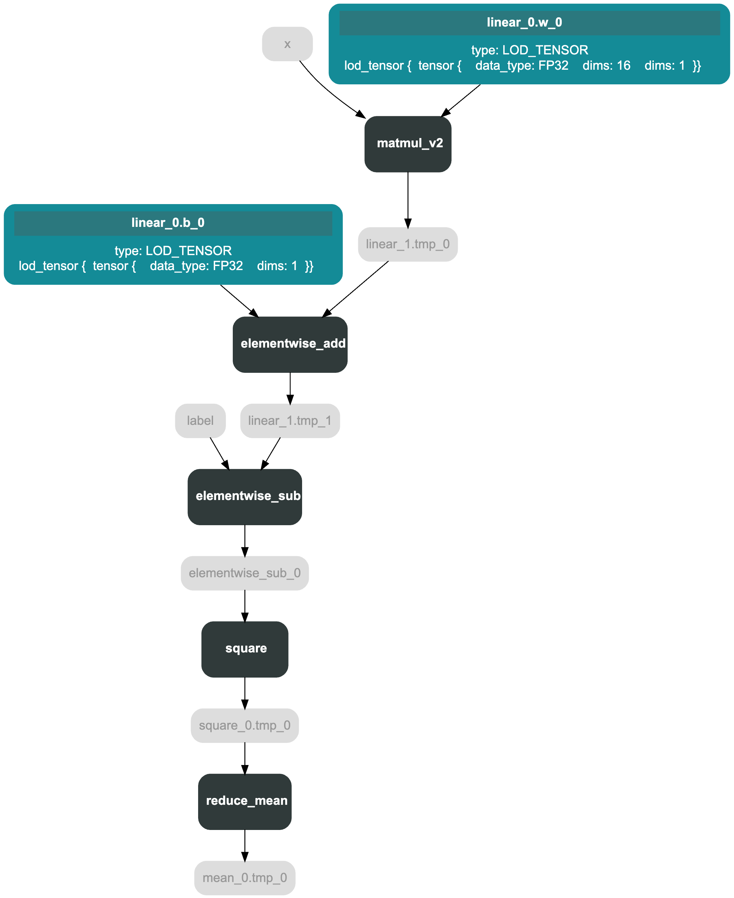
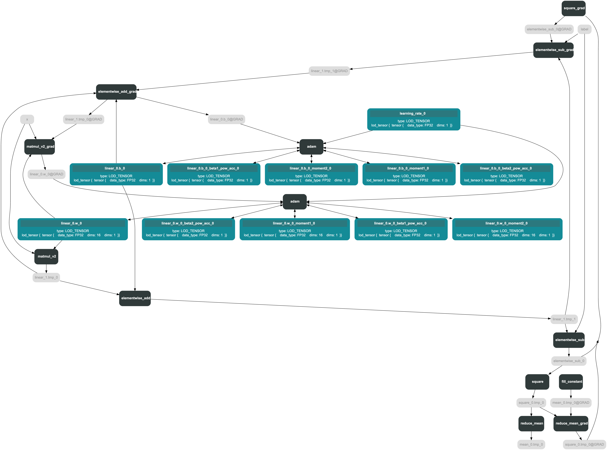

# 静态图组网过程

:::tip

本文在阅读 [文章](https://github.com/PaddlePaddle/community/blob/master/pfcc/paddle-code-reading/static_graph_execution/20221230_static_graph_execution.md) 时所做的笔记，主要是对静态图组网过程的理解。

全文结合 PaddlePaddle 的源码进行说明

:::


飞桨支持静态图与动态图两种训练方式。对于静态图而言，执行网络的前向过程只会将相应的 Operator 加入到计算图中，需要通过执行器来实际调用计算逻辑。 以下面的代码为例，可以看到静态图的训练代码可以大致分为两部分：组网和执行。

```python
import numpy as np

# 导入PaddlePaddle相关模块
import paddle
from paddle.static import Program, program_guard, Executor
from paddle.optimizer import Adam

# 开启静态图模式
paddle.enable_static()

# 组网过程
main_program = Program()
startup_program = Program()
with program_guard(main_program, startup_program):
    # 定义输入数据的形状和名称
    x = paddle.static.data(shape = [16, 16], name = 'x')
    label = paddle.static.data(shape=[16, 1], name = 'label')
    # 定义网络结构
    out = paddle.nn.Linear(in_features=16, out_features=1)(x) 
    # 定义损失函数
    loss = paddle.nn.MSELoss()(out, label)
    # 定义优化器
    optimizer = Adam()
    optimizer.minimize(loss)

# 执行过程
# 定义运行环境
place = paddle.CUDAPlace(0) if paddle.is_compiled_with_cuda() else paddle.CPUPlace()
# 定义执行器
exe = Executor(place)
# 执行初始化操作
exe.run(startup_program)
# 执行训练过程
ret = exe.run(main_program,
            feed={'x': np.ones((16, 16), np.float32),'label': np.ones((16, 1), np.float32)},
            fetch_list=[loss])
```

本文主要是说明静态图的组网过程，也就是上述代码的如下部分：

```python 
# 组网过程
main_program = Program()
startup_program = Program()
with program_guard(main_program, startup_program):
    # 定义输入数据的形状和名称
    x = paddle.static.data(shape = [16, 16], name = 'x')
    label = paddle.static.data(shape=[16, 1], name = 'label')
    # 定义网络结构
    out = paddle.nn.Linear(in_features=16, out_features=1)(x) 
    # 定义损失函数
    loss = paddle.nn.MSELoss()(out, label)
    # 定义优化器
    optimizer = Adam()
    optimizer.minimize(loss)
```

## 什么是 Program

`Program` 是网络模型在静态图下的表示方式，一个 `Program` 对应一个神经网络模型。

`main_program` 中包含了神经网络模型的结构，包括网络中的各个算子，以及算子之间的依赖关系。`startup_program` 中包含了神经网络模型的参数初始化操作。

:::tip

静态图的特点是在执行前就已经获得了网络的全部信息，而 program 就是保存网络信息的对象。

:::

`Program` 是对 `ProgramDesc` 的封装，`ProgramDesc` 是一个 C++ 对象，通过 `pybind` 导出到 Python 端，用于保存网络结构信息。 `Program` 的 Python 端定义如下：

```python
class Program(object):
	def __init__(self):
		self.desc = core.ProgramDesc()
		self.blocks = [Block(self, 0)]
```

`ProgramDesc` 的主要成员变量如下：

```cpp
class ProgramDesc {
  proto::ProgramDesc desc_;
  std::string cached_hash_str_;
  
  std::vector<std::unique_ptr<BlockDesc>> blocks_;
}
```

`proto::ProgramDesc` 是 `Program` 的 `protobuf` 对象，可以理解为一种 `Program` 的二进制存储，他会被用于

1. 在 `Python` 侧和 `C++` 侧同步 `op` 的定义
2. 保存和加载模型

`cached_hash_str_` 是 `Program` 的签名，同样的 `Program` 应该具有同样的签名，这个签名会用作 `Program` 缓存时的 Key。

:::note

1、为什么需要缓存？

`PaddlePaddle` 的 `Program` 是一个计算图，它描述了一个深度学习模型的结构和计算过程。`Program` 的二进制缓存是指将 `Program` 对象序列化后存储在磁盘上的二进制文件。缓存的目的是为了加速模型的训练和预测，因为反复解析 `Program` 对象会消耗大量的时间。当下次需要使用 `Program` 对象时，可以直接从缓存中读取，而不需要重新解析。

2、什么是 `protobuf` 对象？

`protobuf` 是一种轻便高效的结构化数据存储格式，可以用于结构化数据序列化，或者网络传输等场景。`protobuf` 对象是指使用 `protobuf` 格式编码的数据。

:::


`blocks_` 是 `Program` 的 `Block` 列表，`Block` 是 `Program` 的基本组成单元，一个 `Program` 可以包含多个 `Block`。每个 `Program` 中至少会有一个 `Block`，这个 `Block` 会被称为 `global_block`，也就是在 `Python` 侧 `Program` 初始化的时候加入的 `Block0`。 当 `Program` 中包含控制流 Op 的时候，才会含有多个 `Block`。

:::note

什么是控制流 Op？

`控制流Op` 是 `PaddlePaddle` 的一种 Op，用于控制流程的执行，例如 `if`、`while` 等。

:::

`BlockDesc` 的主要成员变量包括：

```cpp
class BlockDesc {
  
ProgramDesc *prog_;       // not_own
  proto::BlockDesc *desc_;  // not_own
  
  std::deque<std::unique_ptr<OpDesc>> ops_; // 注意这是一个队列
  std::map<std::string, std::unique_ptr<VarDesc>> vars_;
}
```

`BlockDesc` 在 `Python` 也有对应的接口类：

```python
class Block(object):
    def __init__(self, program, idx):
        self.desc = program.desc.block(idx)
        self.vars = collections.OrderedDict()  # var_name --> var
        self.ops = list()  # operator list
        self.program = program
```

`Program` 和 `Block` 都是容器类型，最基础的表示单元是这里的 `VarDesc` 和 `OpDesc`。

其中 `VarDesc` 是用于描述网络中的变量，描述一个变量的属性，包括变量的名称、形状、数据类型、是否持久化等信息。

```cpp
class VarDesc {
  proto::VarDesc desc_;
  AttributeMap attrs_;
}
```

他的主要成员是这里的 `proto::VarDesc` ，很多属性没有出现在 `VarDesc` 的定义中，而是出现在了 `protobuf` 对象的定义中：

```cpp
message VarDesc {
  required string name = 1;
  required VarType type = 2;
  optional bool persistable = 3 [ default = false ];
  // True if the variable is an input data and
  // have to check the feed data shape and dtype
  optional bool need_check_feed = 4 [ default = false ];
  optional bool is_parameter = 5 [ default = false ];
  optional bool stop_gradient = 6 [ default = false ];
  repeated Attr attrs = 7;
}
```

Python 侧也有接口类 Variable：

```python 
# python/paddle/fluid/framework.py
class Variable(metaclass=VariableMetaClass):
	"""
	一些初始化工作，设置 proto::VarDesc 中的各项参数
	Variable 类是 PaddlePaddle 中的一个重要类，它用于存储不同类型的数据或训练标签。
	Variable 类属于一个 Block。每个 Variable 都有自己的名称，不同Block中的两个Variable可能具有相同的名称。
	Variable 类有许多种类，每种类型都有自己的属性和用途。
	在静态图模式下，可以使用 Block.create_var 创建一个静态变量，该变量在被馈送之前没有数据。
	在动态图模式下，可以使用 fluid.dygraph.to_variable 创建具有实际数据的dygraph变量。
	Variable 类的大多数成员变量可以设置为 None，这意味着它不可用或稍后将被指定。
	"""
	def __init__(...):
		...
		self.block = block
		self.desc = self.block.desc.find_var(name.encode())
		self.block.vars[name] = self
		...

```

`OpDesc` 用于描述网络中的运算，其成员包括输入输出以及 op 的属性：

```cpp
// paddle/fluid/framework/op_desc.h

class OpDesc {
 public:
  OpDesc() {}

  OpDesc(const std::string &type, // op的类型
         const VariableNameMap &inputs, // op的输入
         const VariableNameMap &outputs, // op的输出
         const AttributeMap &attrs); // op的属性
...
```

在 `OpDesc` 的 `proto` 中定义了他的 type、输入输出和属性。

```cpp
message OpDesc {

  message Attr {
    required string name = 1;
    required AttrType type = 2;
    optional int32 i = 3;
    optional float f = 4;
```

:::note

Paddle 中的 Proto 是用来干什么的？

Paddle 中的 Proto 是 Protocol Buffer 的简称，是一种轻便高效的结构化数据存储格式，可以用于结构化数据序列化，或者说数据的存储和传递。在 Paddle 中，Proto 主要用于存储模型的结构和参数信息，以及网络通信中的数据传输。

:::

总结：总的来说，`Program` 的基本表示为 `OpDesc` 和 `VarDesc`，分别代表**运算逻辑和参与运算的数据**，`BlockDesc` 是基础的组织结构，通过 `Block Desc` 的组织来实现控制流(if、while、recurrent 等)，`ProgramDesc` 是整体表示，也是用户使用静态图的接口。他们都是 C++对象，被封装到 Python 侧的类中方便调用。

## Program 怎么组成

前面介绍了 `Program` 的代码结构，那么 `Program` 到底是如何被构建出来的呢 ？

### 前向网络的构建过程

前向网络大致是由 `Variable` 、 `Layer` 和 `Op` 三个部分组成的， `Variable` 用于存储数据， `Layer` 用于描述网络的结构， `Op` 用于描述网络的计算逻辑。

#### 单个 Variable 的添加过程

以 `paddle.static.data` 为例，它添加到 `main_program` 的过程如下：

> `main_program` 中包含了神经网络模型的结构，包括网络中的各个算子，以及算子之间的依赖关系。

```python
paddle.static.data 
->
LayerHelper.create_global_variable() # 创建一个全局变量
-> 
self.main_program.global_block().create_var() # main_program 是定义在 framework.py 中的全局变量
->
Varaiable.__init__ # 初始化 Variable 对象
# 在 BlockDesc 中查找变量的 VarDesc，如果没有则创建一个新的 VarDesc
self.desc = self.block.desc.find_var(cpt.to_bytes(name))
if self.desc is None:
    self.desc = self.block.desc.var(cpt.to_bytes(name)) # VarDesc 要添加到 BlockDesc 中
self.block.vars[name] = self # Variable 要添加到 Block 中
```

#### 单层神经网络 Layer 的添加过程

以 `paddle.nn.Linear` 为例，它会将**权重矩阵和偏置矩阵这两个可训练参数初始化**。剩余部分会被转发到 `F.linear`。 `F.linear` 的定义如下：

```python
# paddle/nn/functional/common.py
# 动态图模型
if in_dygraph_mode():
	...
else: # 静态图模式
	# 初始化 name 和 layer_type 属性
	helper = LayerHelper('linear', **locals())
	dtype = x.dtype
	# 检查输入的类型和数据类型
	check_variable_and_dtype(x, 'x', ['float16', 'float32', 'float64'],
								'linear')
	check_dtype(dtype, 'dtype', ['float16', 'float32', 'float64'], 'linear')

	inputs = {'X': [x], 'Y': [weight]}
	attrs = {'trans_x': False, 'trans_y': False}
	# tmp 保存矩阵乘法的结果
	# 注意这里调用的不是 create_global_variable
	tmp = helper.create_variable_for_type_inference(dtype)
	# 创建矩阵乘法算子
	helper.append_op(
		type='matmul_v2', inputs=inputs, outputs={'Out': tmp}, attrs=attrs)
	if bias is not None:
		res = helper.create_variable_for_type_inference(dtype)
		# 创建矩阵加法算子
		helper.append_op(
			type='elementwise_add',
			inputs={'X': [tmp],
					'Y': [bias]},
			outputs={'Out': [res]},
			attrs={'axis': len(x.shape) - 1})
	else:
		res = tmp
return res
```

这里首先创建了两个变量，用于保存矩阵相乘和加法的结果，接着添加了矩阵乘法和加法算子。和 `paddle.static.data` 的流程相似，不同点在于一是向当前 block 而非 global_block 添加，二需要求梯度。

#### 单个 Op 的添加过程

这里全连接层是由两个 Op 组合而成的，单个算子添加的过程如 `matmul_v2` 的添加过程如下：

```python
LayerHelper.append_op()
-> self.main_program.current_block().append_op(*args, **kwargs)
->
# 创建空的 OpDesc，该 OpDesc 已经是位于 BlockDesc 中了
op_desc = self.desc.append_op()
inputs = kwargs.get("inputs", None)
outputs = kwargs.get("outputs", None)

with param_guard(inputs), param_guard(outputs):
	op = Operator(
		block=self,
		desc=op_desc,
		type=op_type,
		inputs=inputs,
		outputs=outputs,
		attrs=kwargs.get("attrs", None),
	)

self.ops.append(op)
```


主要的初始化过程位于 `Operator.__init__` 中，该函数的主要内容是按照传入参数填充 `OpDesc` 的各个字段。即 `Inputs`、`Outputs`、`Attrs`，具体包含的内容根据 `proto = OpProtoHolder.instance().get_op_proto(type)` 获取。而相应的 `proto` 对应 `Op` 的 `Make` 方法中添加的逻辑。

最后 `Operator.__init__` 中会根据该 `Op` 是否为 `kernel op` 调用 `infer_var_type` 和 `infer_shape` 推导变量 meta 信息。


### 反向过程是如何进行的

如图为 `optimizer.minimize(loss)` 前后的 `Program`。

表格

| minimize 前 | minimize 后 |
| - | - |
|   |  |

`optimizer.minimize(loss)` 会在 `loss` 的前面添加反向算子，增加的 op 主要分为三类：

1. fill_constant
2. 前向 op 对应的反向 op
3. 优化器 op

优化器 `op minimize` 函数的实现如下：

```python
@imperative_base.no_grad
def minimize(
    self, loss, startup_program=None, parameter_list=None, no_grad_set=None
):
    assert isinstance(loss, Variable), "The loss should be an Variable."
    parameter_list = (
        parameter_list if parameter_list else self._parameter_list
    )
    # 添加反向的 op
    params_grads = self.backward(
        loss,
        startup_program=startup_program,
        parameter_list=parameter_list,
        no_grad_set=no_grad_set,
    )
    # 添加优化器 op
    optimize_ops = self.apply_optimize(
        loss, startup_program=startup_program, params_grads=params_grads
    )

    return optimize_ops, params_grads
```

主要分为两步，第一步添加前向 op 对应的反向 op，第二步添加优化器 op。

#### 添加反向 op

`backward` 函数主要添加反向 op，实现逻辑如下：

1、为每个 `block` 根据其所含 `var` 的 `stop_gradient` 属性设置 `no_grad_dict`

2、初始化对应反向 `block target_grad_block`，对于控制流的子 block，这是个新的 block，否则是主 block 自己

3、从当前 `loss op` 所在 block 开始，确定到主 block 的路径，进而确定反向过程包含的所有 block

4、在 `target_grad_block` 中添加 `fill_constantop`，初始值设为 1，作为起始梯度

- 遍历所有相关 block
	- 找到所有当前 block 中需要计算的前向 op _find_op_path
	- 找到当前 block 中梯度的起始变量
- 反向遍历 op，从起始变量开始将所有相关 op 加入
	- _find_no_grad_vars 获取与梯度计算无关的变量
	- _append_backward_ops_为每个前向 op 添加对应反向 op 并进行梯度聚合
	- _append_backward_vars_添加反向 var 并调用反向 op 的 infer_var_type 和_infer_shape
	- 确定前向 parameter 对应的梯度，得到 param_and_grads

:::note

在 Paddle 中，反向 Op 是由前向 Op 自动生成的，用于计算梯度。反向 Op 的输入是前向 Op 的输出和梯度，输出是前向 Op 的输入和梯度。 反向 Op 的作用是计算梯度，用于更新网络参数。

:::

#### 优化器 Op

```python
# 参数params_grads是一个列表，其中每个元素是一个元组，包括参数对象和对应的梯度； 
def apply_gradients(self, params_grads):
    # 对params_grads按照参数名称从小到大排序
    params_grads = sorted(params_grads, key=lambda x: x[0].name)

    # 判断是否设置了梯度裁剪，如果设置了，则使用设置的梯度裁剪方法进行裁剪
    if self._grad_clip is not None:
        params_grads = self._grad_clip(params_grads)
    # 如果没有设置梯度裁剪，则采取默认的方法进行操作
    else:
        params_grads = append_gradient_clip_ops(params_grads)

    # 采取正则化的方式对梯度进行加权
    params_grads = self.append_regularization_ops(params_grads, self.regularization)

    # 调用内部函数_create_optimization_pass创建优化操作，使用梯度更新模型参数，并返回这些操作
    optimize_ops = self._create_optimization_pass(params_grads)

    # 返回优化后的结果
    return optimize_ops
```

主要分为三步：

1. append_gradient_clip_ops 设置梯度截断，添加相应 op
2. append_regularization_ops 设置梯度正则化，添加相应 op
3. _create_optimization_pass 添加优化器 op，具体的实现根据优化器的不同会有所区别

总的来说，Python 侧的静态图组网过程是这样的：

1. 用户调用组建网络相关接口，如 `paddle.nn.Linear`
2. 框架将 `Linear` 相关的 `Op` 和变量添加到 `main_program` 和 `startup_program` 中
3. `main_program` 和 `startup_program` 在不特殊设置的情况下是两个全局变量，一般通过 `program_guard` 包裹使用用户指定的 `Program`
4. 执行器执行 `Program`

## 总结

这篇文章主要讲解飞桨使用静态图训练网络中执行器的执行细节，同时也会简单说明静态图的组网过程。在飞桨设计上，把一个神经网络定义成一段类似程序的描述，就是在用户写程序的过程中，就定义了模型表达及计算。 举例来说，假设用户写了一行代码：`y=x+1`。在静态图模式下，运行此代码只会往计算图中插入一个 `Tensor` 加 1 的`Operator`，此时 `Operator` 并未真正执行，无法获得 y 的计算结果。但在动态图模式下，所有 `Operator` 均是即时执行的，运行完代码后 `Operator` 已经执行完毕，用户可直接获得 y 的计算结果。

飞桨支持静态图与动态图两种训练方式。对于静态图而言，执行网络的前向过程只会将相应的 `Operator` 加入到计算图中，需要通过执行器来实际调用计算逻辑。以下面的代码为例，可以看到静态图的训练代码可以大致分为两部分：组网和执行。

在 C++侧，飞桨使用了一个名为 Executor 的类来实现静态图的执行器。Executor 是一个封装了多个计算核心的类，它可以在 CPU 或 GPU 上运行计算任务。在执行过程中，Executor 会将组网后的模型进行编译优化，并将优化后的计算图传递给计算核心进行计算。 Paddle 里一个计算任务就是一个 Program。

`Program` 是飞桨中用于描述神经网络模型的对象。一个 `Program` 对应一个神经网络模型。在静态图模式下，用户需预先定义完整的网络结构，再对网络结构进行编译优化后，才能执行获得计算结果。在飞桨设计上，把一个神经网络定义成一段类似程序的描述，就是在用户写程序的过程中，就定义了模型表达及计算。 用户可以通过组网和执行两个过程来完成静态图模式下的训练。


