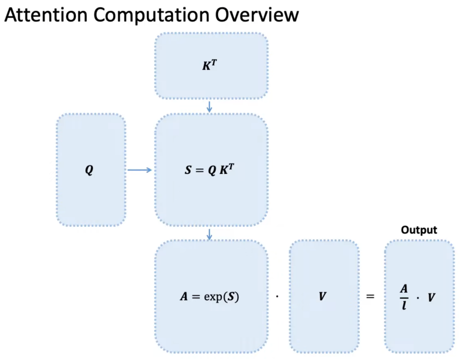

# Rope 算子 - RoFormer 论文阅读

:::note

论文：ROFORMER: ENHANCED TRANSFORMER WITH ROTARY POSITION EMBEDDING

:::

## 引言

在自然语言处理（NLP）领域，Transformer 架构因其在多种任务中的卓越表现而广受关注。然而，Transformer 对序列中元素之间的依赖关系的建模依赖于位置编码，目前的编码方法存在一些局限性。为解决这一问题，本文提出了一种新颖的旋转位置嵌入（Rotary Position Embedding，简称RoPE）方法，并在此基础上构建了增强型 Transformer 模型 RoFormer。

现有的 Transformer 模型主要使用绝对位置编码或相对位置编码方法。绝对位置编码通常通过预定义函数生成位置向量，而相对位置编码则将相对位置信息编码到注意力机制中。然而，这些方法在处理线性自注意力时存在一定的局限性，无法充分利用位置信息。

## 基本概念

在介绍 RoPE 之前，先给出一些符号定义，以及基本背景。

首先定义一个长度为 $N$ 的输入序列为： $S_N = { w_i }_{i=1}^N$

其中 $w_i$ 表示输入序列中的第 $i$ 个 token，而输入序列 $S_N$ 对应的 embedding 表示为：

$$
E_N = { x_i }_{i=1}^N
$$

其中 $x_i$ 表示第 $i$ 个 token $w_i$ 对应的 $d$ 维词嵌入向量。

接着在做 self-attention 之前，会用词嵌入向量计算 query ($q$)、key ($k$) 和 value ($v$) 向量，同时加入位置信息，函数公式表达如下：

$$
q_m = f_q(x_m, m)
$$

$$
k_n = f_k(x_n, n)
$$

$$
v_n = f_v(x_n, n)
$$

其中 $q_m$ 表示第 $m$ 个 token 对应的词向量 $x_m$ 集成位置信息 $m$ 之后的 query 向量。而 $k_n$ 和 $v_n$ 则表示第 $n$ 个 token 对应的词向量 $x_n$ 集成位置信息 $n$ 之后的 key 和 value 向量。 基于 transformer 的位置编码方法都是着重于构造一个合适的 $f(q, k, v)$ 函数形式。

计算第 $m$ 个词嵌入向量 $x_m$ 对应的 self-attention 输出结果，就是 $q_m$ 和其他 $k_n$ 都计算一个 attention score，然后再将 attention score 乘以对应的 $v_n$，再求和得到输出向量 $o_m$：

$$
a_{m,n} = \frac{\exp \left( \frac{q_m^T k_n}{\sqrt{d}} \right)}{\sum_{j=1}^N \exp \left( \frac{q_m^T k_j}{\sqrt{d}} \right)}
$$

$$
o_m = \sum_{n=1}^N a_{m,n} v_n
$$

  

## 绝对位置编码

对于位置编码，常规的做法是在计算 query、key 和 value 向量之前，会计算一个位置编码向量 $p_i$ 加到词嵌入 $x_i$ 上，位置编码向量 $p_i$ 同样是 $d$ 维向量，然后再乘以对应的变换矩阵 $W$：

:::note

“加”操作指的是向量的逐元素相加（element-wise addition）

:::

$$
f_{t:t \in {q, k, v}} (x_i, i) := W_{t:t \in {q, k, v}} (x_i + p_i)
$$

经典的位置编码向量 $p_i$ 的计算方式是使用 Sinusoidal 函数：

$$
p_{i, 2t} = \sin \left( \frac{k}{10000^{2t/d}} \right)
$$

$$
p_{i, 2t+1} = \cos \left( \frac{k}{10000^{2t/d}} \right)
$$

## RoPe 方法

RoPE方法的核心思想是通过**旋转矩阵**对**绝对位置**进行编码，并在**自注意力机制**中加入显式的相对位置依赖。具体而言，RoPE将位置编码视为旋转矩阵作用下的线性变换，实现了灵活的序列长度处理和随相对距离增加而衰减的依赖性。

论文中提出为了能利用 token 之间的相对位置信息，假定 query 向量 $q_m$ 和 key 向量 $k_n$ 之间的内积操作可以被一个函数 $g$ 表示，该函数 $g$ 的输入是词嵌入向量 $x_m$、$x_n$ 和它们之间的相对位置 $m - n$：

$$
\langle f_q(x_m, m), f_k(x_n, n) \rangle = g(x_m, x_n, m - n)
$$

接下来的目标就是找到一个合适的位置编码方式，从而使得上述关系成立

假定词嵌入向量的维度是两维 $d = 2$，这样可以利用二维平面上向量的几何性质，然后论文中提出了一个满足上述关系的 $f_q$ 和 $f_k$ 的形式如下：

$$
f_q(x_m, m) = (W_q x_m) e^{im\theta}
$$

$$
f_k(x_n, n) = (W_k x_n) e^{in\theta}
$$

$$
g(x_m, x_n, m - n) = \text{Re}[(W_q x_m)(W_k x_n)^* e^{i(m-n)\theta}]
$$

进一步，$f_q$ 可以表示成下面的式子：

$$
f_q(x_m, m) = \begin{pmatrix}
\cos m\theta & -\sin m\theta \
\sin m\theta & \cos m\theta
\end{pmatrix}
\begin{pmatrix}
W_q^{(1,1)} & W_q^{(1,2)} \
W_q^{(2,1)} & W_q^{(2,2)}
\end{pmatrix}
\begin{pmatrix}
x_m^{(1)} \
x_m^{(2)}
\end{pmatrix}
$$

同理，$f_k$ 可以表示成：

$$
f_k(x_m, m) = \begin{pmatrix}
\cos m\theta & -\sin m\theta \
\sin m\theta & \cos m\theta
\end{pmatrix}
\begin{pmatrix}
W_k^{(1,1)} & W_k^{(1,2)} \
W_k^{(2,1)} & W_k^{(2,2)}
\end{pmatrix}
\begin{pmatrix}
x_n^{(1)} \
x_n^{(2)}
\end{pmatrix}
$$

最终，$g(x_m, x_n, m - n)$ 可以表示为：

$$
g(x_m, x_n, m - n) = \begin{pmatrix}
q_m^{(1)} & q_m^{(2)}
\end{pmatrix}
\begin{pmatrix}
\cos((m - n)\theta) & -\sin((m - n)\theta) \
\sin((m - n)\theta) & \cos((m - n)\theta)
\end{pmatrix}
\begin{pmatrix}
k_n^{(1)} \
k_n^{(2)}
\end{pmatrix}
$$

通过这些公式，可以看出 query 向量和 key 向量分别乘以一个旋转矩阵，这就是为什么称为旋转位置编码的原因。

## 扩展到多纬

将2维推广到任意维度，可以表示如下：

将二维推广到任意维度，可以表示如下：

$$
f_{ { q, k } } (x_m, m) = R_{\Theta, m}^d W_{{ q, k }} x_m
$$

内积满足线性量加性，因此任意偶数维的 RoPE 都可以表示为二维情形的拼接，即：

$$
R_{\Theta, m}^d = 
\begin{pmatrix}
\cos m\theta_0 & -\sin m\theta_0 & 0 & 0 & \cdots & 0 & 0 \
\sin m\theta_0 & \cos m\theta_0 & 0 & 0 & \cdots & 0 & 0 \
0 & 0 & \cos m\theta_1 & -\sin m\theta_1 & \cdots & 0 & 0 \
0 & 0 & \sin m\theta_1 & \cos m\theta_1 & \cdots & 0 & 0 \
\vdots & \vdots & \vdots & \vdots & \ddots & \vdots & \vdots \
0 & 0 & 0 & 0 & \cdots & \cos m\theta_{d/2-1} & -\sin m\theta_{d/2-1} \
0 & 0 & 0 & 0 & \cdots & \sin m\theta_{d/2-1} & \cos m\theta_{d/2-1}
\end{pmatrix}
$$

$$
\Theta = \left{ \theta_i = 10000^{-2(i-1)/d}, i \in [1, 2, \ldots, d/2] \right}
$$

将 RoPE 应用到前面公式 (4) 的 Self-Attention 计算，可以得到包含相对位置信息的 Self-Attention：

$$
q_m^T k_n = \left( R_{\Theta, m}^d W_q x_m \right)^T \left( R_{\Theta, n}^d W_k x_n \right) = x_m^T W_q^T R_{\Theta, m}^d^T R_{\Theta, n}^d W_k x_n
$$

其中：

$$
R_{\Theta, n-m}^d = \left( R_{\Theta, m}^d \right)^T R_{\Theta, n}^d
$$

值得指出的是，由于 $R_{\Theta}^d$ 是一个正交矩阵，它不会改变向量的模长，因此通常来说它不会改变原模型的稳定性。

## 参考文献

1. https://www.zhihu.com/tardis/zm/art/647109286?source_id=1003

