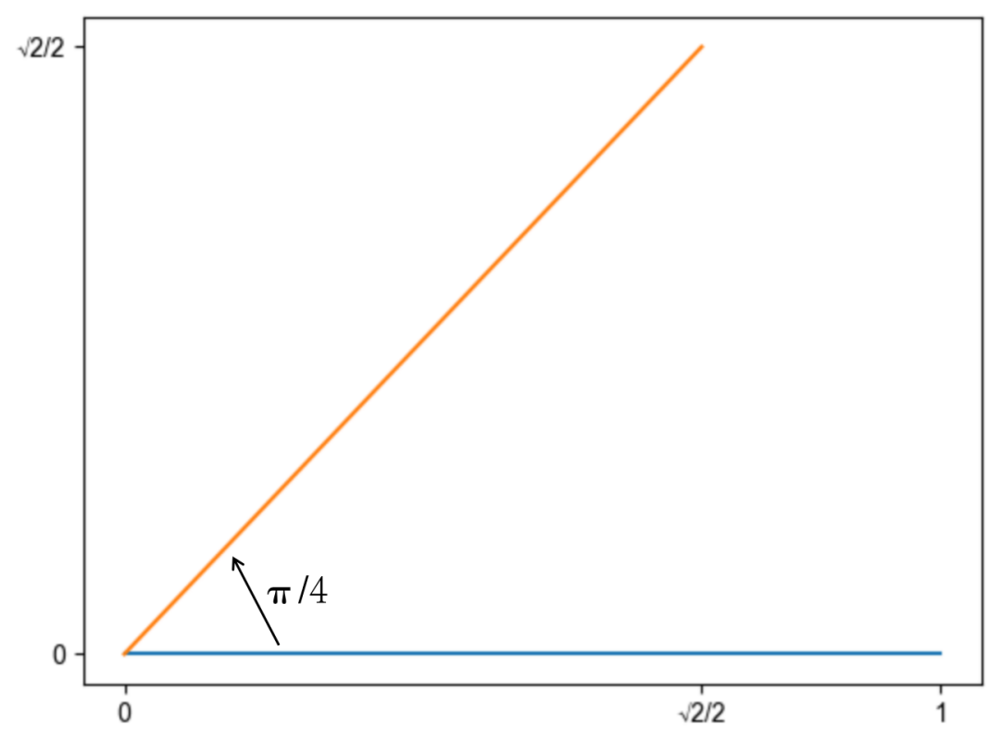
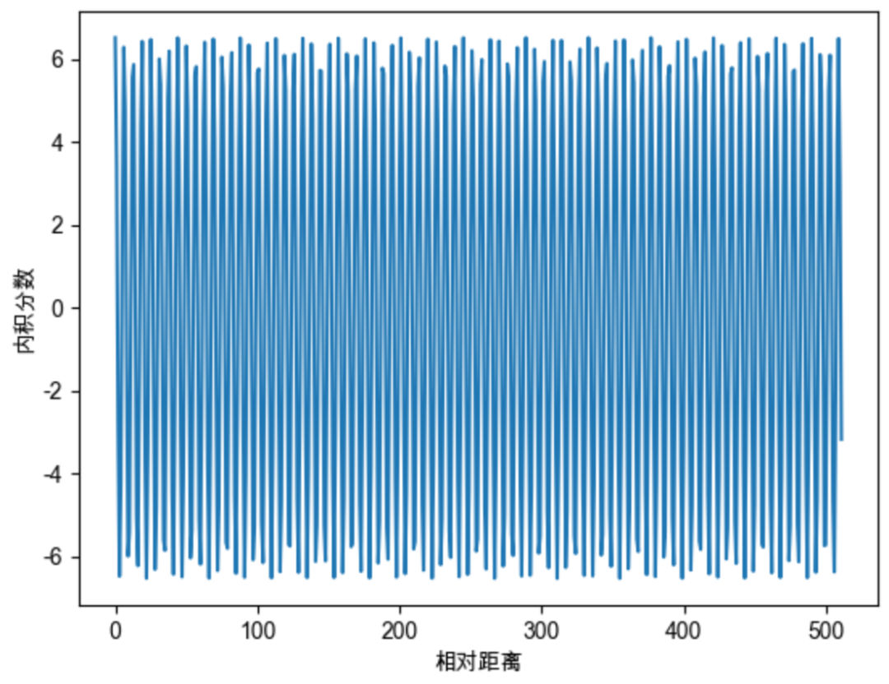
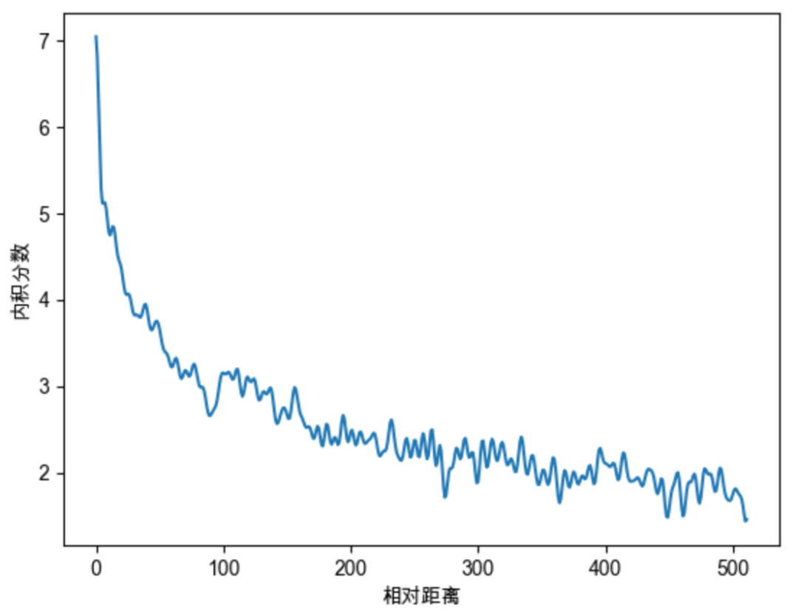

# Rope 算子 - RoFormer 论文阅读

:::note

论文：ROFORMER: ENHANCED TRANSFORMER WITH ROTARY POSITION EMBEDDING

:::


## 引言

在自然语言处理（NLP）领域，Transformer 架构因其在多种任务中的卓越表现而广受关注。然而，Transformer 对序列中元素之间的依赖关系的建模依赖于位置编码，目前的编码方法存在一些局限性。为解决这一问题，论文提出了一种新颖的旋转位置嵌入（Rotary Position Embedding，简称RoPE）方法，并在此基础上构建了增强型 Transformer 模型 RoFormer。

现有的 Transformer 模型主要使用绝对位置编码或相对位置编码方法。绝对位置编码通常通过预定义函数生成位置向量，而相对位置编码则将相对位置信息编码到注意力机制中。然而，这些方法在**处理线性自注意力时存在一定的局限性，无法充分利用位置信息**。

RoPE 能够将相对位置信息依赖集成到 self-attention 中并提升 transformer 架构性能的位置编码方式。目前很火的 **LLama、ChatGLM 模型**也是采用该位置编码方式。 

:::note

什么是大模型外推性？

外推性是指大模型在**训练时和预测时的输入长度不一致**，导致模型的泛化能力下降的问题。例如，如果一个模型在训练时只使用了512个 token 的文本，那么在预测时如果输入超过512个 token，模型可能无法正确处理。这就限制了大模型在处理长文本或多轮对话等任务时的效果。

:::


## 1. 背景知识

### 1.1 基本概念

在介绍旋转编码之前，我们先来看一下 Transformer 的自注意力机制。令 $\mathbb{S}_N=\left\{w_i\right\}_{i=1}^N$ 为一个包含 $N$ 个输入标记的序列, 其中 $w_i$ 是第 $i$ 个元素。 $\mathbb{S}_N$ 对应的词嵌入表示为 $\mathbb{E}_N=$ $\left\{\boldsymbol{x}_i\right\}_{i=1}^N$, 其中 $\boldsymbol{x}_i \in \mathbb{R}^d$ 是 token $w_i$ 的无位置信息的 $d$ 维词嵌入向量。自注意力首先将**位置信息融入词嵌入中**,将其转换为查询（query）、键（key）和值（value）的表征。

$$
\begin{equation}
\begin{aligned}
\boldsymbol{q}_m & =f_q\left(\boldsymbol{x}_m, m\right) \\
\boldsymbol{k}_n & =f_k\left(\boldsymbol{x}_n, n\right) \\
\boldsymbol{v}_n & =f_v\left(\boldsymbol{x}_n, n\right)
\end{aligned}
\end{equation}
$$

其中，$q_m$、$k_n$ 和 $v_n$ 通过 $f_q$、$f_k$ 和 $f_v$ 分别包含了第 $m$ 个和第 $n$ 个位置。然后使用查询和键值来计算注意力权重，输出是值表征的加权和。

Transoformer 的位置编码主要是在选择合适的方法来构建 $f_q$、$f_k$ 和 $f_v$ 函数。绝对位置编码和相对位置编码是两种常见的方法。绝对位置编码通过预定义函数生成位置向量，而相对位置编码则将相对位置信息编码到注意力机制中。然而，这些方法在**处理线性自注意力时存在一定的局限性**，无法充分利用位置信息。

### 1.2 绝对位置编码

绝对位置编码（Absolute Position Encoding）是处理序列数据的一种方法，特别是在自然语言处理（NLP）中的自注意力模型（如Transformer）中使用。这种模型没有内置的顺序信息，而位置编码正是用来帮助模型了解输入序列中各元素的位置。

在具体实现中，绝对位置编码通过正弦和余弦函数生成位置编码。公式如下：

\[ PE_{(pos, 2i)} = \sin\left(\frac{pos}{10000^{2i/d}}\right) \]

\[ PE_{(pos, 2i+1)} = \cos\left(\frac{pos}{10000^{2i/d}}\right) \]

其中，pos 表示位置，i 表示维度索引，d 表示编码向量的维度。通过这种方式，每个位置都会生成一个唯一的向量。比如，位置0的编码是 \(\sin(0)\) 和 \(\cos(0)\)，而位置1的编码是 \(\sin(1)\) 和 \(\cos(1/10000^{1/2})\)。

这些位置编码被加到对应位置的输入嵌入向量上，让模型能够感知到序列中的位置信息。这种方法的优点是不需要学习参数，并且通过正弦和余弦函数生成的位置编码在不同位置之间是连续变化的，有助于模型捕捉序列中的位置信息。

### 1.3 相对位置编码

相对位置编码（Relative Position Encoding）, 不同于绝对位置编码，它关注的是序列中元素之间的相对位置，而不是元素在序列中的具体位置。这种方法能够更好地捕捉元素之间的相对关系，特别适合处理那些相对位置更重要的任务。

在相对位置编码中，每对输入元素之间的相对位置信息被编码进来。例如，元素i和元素j之间的相对位置可以表示为  j - i 。这种相对位置信息可以帮助模型更好地理解元素之间的关系。

以下是相对位置编码的基本思路：

1.	**相对位置向量生成**：对于序列中的每个位置，生成其与其他位置的相对位置向量。这些向量表示两个位置之间的距离。
2.	**结合到注意力机制中**：在自注意力机制中，将相对位置向量加到注意力权重上，使得模型在计算注意力分数时能够考虑到元素之间的相对位置。

具体实现上，常见的方法有以下几种：

1.	基于距离的编码：直接使用相对位置（如  j - i ）作为编码。在计算注意力权重时，将这种相对位置向量加入到注意力打分函数中。
2.	相对位置嵌入：为不同的相对位置预先定义嵌入向量，并在计算注意力时使用这些嵌入向量。相对位置嵌入可以看作是为每个可能的相对位置预定义一个向量，然后在计算注意力时查找并使用这些向量。

假设我们有一个长度为 4 的序列，对于位置 i 和位置 j，它们的相对位置为  j - i 。比如对于位置 0 和位置 2，相对位置为 2；位置 1 和位置 3，相对位置为 2。模型在计算自注意力时，会将这些相对位置信息纳入考虑。

## 2. RoPE 旋转位置编码

在绝对位置编码中，模型只能感知到每个词向量所处的绝对位置，并无法感知两两词向量之间的相对位置。对于RoPE而言，作者的出发点为：通过绝对位置编码的方式实现相对位置编码。**RoPE位置编码通过将一个向量旋转某个角度，为其赋予位置信息。** 

RoPE希望 $q_m$ 与 $k_n$ 之间的点积, 即 $f(q, m) \cdot f(k, n)$ 中能够带有相对位置信息 $(m-n)$ 。那么 $f(q, m) \cdot f(k, n)$ 如何才算带有相对位置信息呢? 只需要能够将 $f(q, m) \cdot f(k, n)$ 表示成一个关于 $q$、 $k 、 m-n$ 的函数 $g(q, k, m-n)$ 即可, 其中 $m-n$ 便表示着两个向量之间的相对位置信息。

因此我们建模的目标就变成了: 找到一个函数 $f(q, m)$, 使得如下关系成立:

$$
<f(q, m), f(k, n)> = g(q, k, m-n)
$$

### 2.1 2-d 旋转位置编码

为了简化问题，我们首先考虑一个二维空间中的情况。f(q,m) 的求解涉及到复杂的公式推导，这里我们先直接给出结论。在二维空间中，我们可以通过旋转矩阵来实现位置编码。具体来说，我们可以通过以下公式来计算位置编码：

$$
\begin{equation}
f(q, m)=R_m q=\left(\begin{array}{cc}
\cos m \theta & -\sin m \theta \\
\sin m \theta & \cos m \theta
\end{array}\right)\binom{q_0}{q_1}
\end{equation}
$$

这个公式的含义就是将向量 q 逆时针旋转 m 个单位。以二维向量 (1, 0) 为例，将其逆时针旋转 45 度，得到的结果是 ($\frac{1}{\sqrt{2}}$, $\frac{1}{\sqrt{2}}$)。

  

我们进一步验证 RoPE 是否能通过绝对位置编码的方式实现相对位置编码。当我们求两个向量之间的点积会发现，它们的点积是一个关于 $q 、 k 、 m-n$ 的函数 $g(q, k, m-n)$, 所以函数 $f(q, m)$ 实现了以绝对位置编码的方式实现相对位置编码。


$$
\begin{aligned}
& q_m \cdot k_n=f(q, m) \cdot f(k, n)=\left(R_m q\right)^T *\left(R_n k\right)=q^T R_m^T * R_n k \\
& =q^T\left[\begin{array}{cc}
\cos m \theta & -\sin m \theta \\
\sin m \theta & \cos m \theta
\end{array}\right]^T *\left[\begin{array}{cc}
\cos n \theta & -\sin n \theta \\
\sin n \theta & \cos n \theta
\end{array}\right] k \\
& =q^T\left[\begin{array}{cc}
\cos m \theta & \sin m \theta \\
-\sin m \theta & \cos m \theta
\end{array}\right] *\left[\begin{array}{cc}
\cos n \theta & -\sin n \theta \\
\sin n \theta & \cos n \theta
\end{array}\right] k \\
& =q^T\left[\begin{array}{cc}
\cos n \theta \cos m \theta+\sin n \theta \sin m \theta & \sin m \theta \cos n \theta-\sin n \theta \cos m \theta \\
\sin n \theta \cos m \theta-\sin m \theta \cos n \theta & \cos n \theta \cos m \theta+\sin n \theta \sin m \theta
\end{array}\right] k \\
& =q^T\left[\begin{array}{cc}
\cos (n-m) \theta & -\sin (n-m) \theta \\
\sin (n-m) \theta & \cos (n-m) \theta
\end{array}\right] k \\
& =q^T R_{n-m} k
\end{aligned}
$$


推导过程用到了旋转矩阵的一些性质：

1. 旋转矩阵的转置等于逆矩阵，即 $R^T = R^{-1}$。
2. 两个旋转矩阵相乘等于将两个旋转矩阵的角度相加，即 $R_m * R_n = R_{m+n}$。


### 2.2 拓展到多纬

词向量的维度一般是几百甚至上千，如何将我们上述旋转的结论推广到多维呢？分而治之即可，我们把高维向量，两两一组，分别旋转。最终高维向量的旋转可表示成如下公式，可以认为左侧便是高维向量的旋转矩阵： 

$$
\begin{equation}
\left(\begin{array}{ccccccc}
\cos m \theta & -\sin m \theta & 0 & 0 & \cdots & 0 & 0 \\
\sin m \theta & \cos m \theta & 0 & 0 & \cdots & 0 & 0 \\
0 & 0 & \cos m \theta & -\sin m \theta & \cdots & 0 & 0 \\
0 & 0 & \sin m \theta & \cos m \theta & \cdots & 0 & 0 \\
\vdots & \vdots & \vdots & \vdots & \ddots & \vdots & \vdots \\
0 & 0 & 0 & 0 & \cdots & \cos m \theta & -\sin m \theta \\
0 & 0 & 0 & 0 & \cdots & \sin m \theta & \cos m \theta
\end{array}\right)\left(\begin{array}{c}
q_0 \\
q_1 \\
q_2 \\
q_3 \\
\vdots \\
q_{d-2} \\
q_{d-1}
\end{array}\right)
\end{equation}
$$

### 2.3 远程衰减问题

远程衰减问题主要是给出了 $\theta$ 的选择问题。随便选择会造成远程位置的信息被丢失。当 $\theta$ 选择为 1 的时候，随机初始化两个向量q和k，将q固定在位置0上，k的位置从0开始逐步变大，依次计算q和k之间的内积。我们发现随着q和k的相对距离的增加，它们之间的内积分数呈现出一定的震荡特性，缺乏了重要的远程衰减性。

  

为了解决这个问题，作者借鉴了 Sinusoidal 位置编码， 借鉴Sinusoidal位置编码, 将每个分组的 $\theta$ 设为不同的常量, 从而引入远程衰减的性质。这里作者直接沿用了Sinusoidal位置编码的设置, $\theta_i=10000^{-2 i / d}$ 。则可以将高维向量的旋转矩阵更新为如下

$$
\left(\begin{array}{ccccccc}
\cos m \theta_0 & -\sin m \theta_0 & 0 & 0 & \cdots & 0 & 0 \\
\sin m \theta_0 & \cos m \theta_0 & 0 & 0 & \cdots & 0 & 0 \\
0 & 0 & \cos m \theta_1 & -\sin m \theta_1 & \cdots & 0 & 0 \\
0 & 0 & \sin m \theta_1 & \cos m \theta_1 & \cdots & 0 & 0 \\
\vdots & \vdots & \vdots & \vdots & \ddots & \vdots & \vdots \\
0 & 0 & 0 & 0 & \cdots & \cos m \theta_{d / 2-1} & -\sin m \theta_{d / 2-1} \\
0 & 0 & 0 & 0 & \cdots & \sin m \theta_{d / 2-1} & \cos m \theta_{d / 2-1}
\end{array}\right)\left(\begin{array}{c}
q_0 \\
q_1 \\
q_2 \\
q_3 \\
\vdots \\
q_{d-2} \\
q_{d-1}
\end{array}\right)
$$

上式中的旋转矩阵十分稀疏, 为了节省算力, 可以以下面的方式等效实现:
$$
\left(\begin{array}{c}
q_0 \\
q_1 \\
q_2 \\
q_3 \\
\vdots \\
q_{d-2} \\
q_{d-1}
\end{array}\right) \otimes\left(\begin{array}{c}
\cos m \theta_0 \\
\cos m \theta_0 \\
\cos m \theta_1 \\
\cos m \theta_1 \\
\vdots \\
\cos m \theta_{d / 2-1} \\
\cos m \theta_{d / 2-1}
\end{array}\right)+\left(\begin{array}{c}
-q_1 \\
q_0 \\
-q_3 \\
q_2 \\
\vdots \\
-q_{d-1} \\
q_{d-2}
\end{array}\right) \otimes\left(\begin{array}{c}
\sin m \theta_0 \\
\sin m \theta_0 \\
\sin m \theta_1 \\
\sin m \theta_1 \\
\vdots \\
\sin m \theta_{d / 2-1} \\
\sin m \theta_{d / 2-1}
\end{array}\right)
$$

继续随机初始化两个向量q和k，将q固定在位置0上，k的位置从0开始逐步变大，依次计算q和k之间的内积。我们发现随着q和k的相对距离的增加，它们之间的内积分数呈现出远程衰减的性质。

  


## Rope 代码实现

### Llama 中的实现

```
# 生成旋转矩阵
def precompute_freqs_cis(dim: int, seq_len: int, theta: float = 10000.0):
    # 计算词向量元素两两分组之后，每组元素对应的旋转角度\theta_i
    freqs = 1.0 / (theta ** (torch.arange(0, dim, 2)[: (dim // 2)].float() / dim))
    # 生成 token 序列索引 t = [0, 1,..., seq_len-1]
    t = torch.arange(seq_len, device=freqs.device)
    # freqs.shape = [seq_len, dim // 2] 
    freqs = torch.outer(t, freqs).float()  # 计算m * \theta

    # 计算结果是个复数向量
    # 假设 freqs = [x, y]
    # 则 freqs_cis = [cos(x) + sin(x)i, cos(y) + sin(y)i]
    freqs_cis = torch.polar(torch.ones_like(freqs), freqs) 
    return freqs_cis

# 旋转位置编码计算
def apply_rotary_emb(
    xq: torch.Tensor,
    xk: torch.Tensor,
    freqs_cis: torch.Tensor,
) -> Tuple[torch.Tensor, torch.Tensor]:
    # xq.shape = [batch_size, seq_len, dim]
    # xq_.shape = [batch_size, seq_len, dim // 2, 2]
    xq_ = xq.float().reshape(*xq.shape[:-1], -1, 2)
    xk_ = xk.float().reshape(*xk.shape[:-1], -1, 2)
    
    # 转为复数域
    xq_ = torch.view_as_complex(xq_)
    xk_ = torch.view_as_complex(xk_)
    
    # 应用旋转操作，然后将结果转回实数域
    # xq_out.shape = [batch_size, seq_len, dim]
    xq_out = torch.view_as_real(xq_ * freqs_cis).flatten(2)
    xk_out = torch.view_as_real(xk_ * freqs_cis).flatten(2)
    return xq_out.type_as(xq), xk_out.type_as(xk)

class Attention(nn.Module):
    def __init__(self, args: ModelArgs):
        super().__init__()

        self.wq = Linear(...)
        self.wk = Linear(...)
        self.wv = Linear(...)
        
        self.freqs_cis = precompute_freqs_cis(dim, max_seq_len * 2)

    def forward(self, x: torch.Tensor):
        bsz, seqlen, _ = x.shape
        xq, xk, xv = self.wq(x), self.wk(x), self.wv(x)

        xq = xq.view(batch_size, seq_len, dim)
        xk = xk.view(batch_size, seq_len, dim)
        xv = xv.view(batch_size, seq_len, dim)

        # attention 操作之前，应用旋转位置编码
        xq, xk = apply_rotary_emb(xq, xk, freqs_cis=freqs_cis)
        
        # scores.shape = (bs, seqlen, seqlen)
        scores = torch.matmul(xq, xk.transpose(1, 2)) / math.sqrt(dim)
        scores = F.softmax(scores.float(), dim=-1)
        output = torch.matmul(scores, xv)  # (batch_size, seq_len, dim)
  # ......
```

Llama 中的实现通过 `precompute_freqs_cis` 函数计算旋转矩阵，然后通过 `apply_rotary_emb` 函数将旋转矩阵应用到词向量上。最后在 Attention 模块中，将旋转位置编码应用到注意力机制中。在实现的时候，需要注意将词向量转为复数域，然后应用旋转操作，最后将结果转回实数域。

需要注意的是在代码中是直接用 `freqs_cis[0] * xq_[0]` 的结果表示第一个 token 对应的旋转编码。


**为什么要在复数域上进行旋转操作？**

在复数域上进行旋转操作可以更方便地表示旋转矩阵，避免了繁琐的矩阵运算。通过将词向量转为复数域，我们可以直接将旋转矩阵应用到词向量上，然后再将结果转回实数域。

$$
(a+i b) \cdot(c+i d)=a c+i b c+i a d+i^2 b d=(a c-b d)+i(b c+a d)
$$

因此要计算:

$$
\begin{aligned}
f_q\left(\boldsymbol{x}_m, m\right) & =\left(\begin{array}{cc}
\cos m \theta & -\sin m \theta \\
\sin m \theta & \cos m \theta
\end{array}\right)\binom{q_m^{(1)}}{q_m^{(2)}} \\
& =\left(\cos m \theta * q_m^{(1)}-\sin m \theta * q_m^{(2)}, \sin m \theta * q_m^{(1)}-\cos m \theta * q_m^{(2)}\right)
\end{aligned}
$$

可以转化为计算:

$$
(\cos m \theta+i \sin m \theta) \cdot\left(q_m^{(1)}+i q_m^{(2)}\right)
$$


### ChatGLM 中的实现

与 LLama 中的实现基本一致。

```
class RotaryEmbedding(torch.nn.Module):
    def __init__(self, dim, base=10000, precision=torch.half, learnable=False):
        super().__init__()
         # 计算 \theta_i
        inv_freq = 1. / (base ** (torch.arange(0, dim, 2).float() / dim))
        inv_freq = inv_freq.half()
        
        self.learnable = learnable
        if learnable:
            self.inv_freq = torch.nn.Parameter(inv_freq)
            self.max_seq_len_cached = None
        else:
            self.register_buffer('inv_freq', inv_freq)
            self.max_seq_len_cached = None
            self.cos_cached = None
            self.sin_cached = None
        self.precision = precision

    def forward(self, x, seq_dim=1, seq_len=None):
        if seq_len is None:
            seq_len = x.shape[seq_dim]
        if self.max_seq_len_cached is None or (seq_len > self.max_seq_len_cached):
            self.max_seq_len_cached = None if self.learnable else seq_len
            # 生成 token 序列索引 t = [0, 1,..., seq_len-1]
            t = torch.arange(seq_len, device=x.device, dtype=self.inv_freq.dtype)
            # 对应m * \theta
            freqs = torch.einsum('i,j->ij', t, self.inv_freq)
            # 将 m * \theta 拼接两次，对应复数的实部和虚部
            emb = torch.cat((freqs, freqs), dim=-1).to(x.device)
            if self.precision == torch.bfloat16:
                emb = emb.float()

            # [sx, 1 (b * np), hn]
            cos_cached = emb.cos()[:, None, :]  # 计算得到cos(m*\theta)
            sin_cached = emb.sin()[:, None, :]  # 计算得到cos(m*\theta)
            if self.precision == torch.bfloat16:
                cos_cached = cos_cached.bfloat16()
                sin_cached = sin_cached.bfloat16()
            if self.learnable:
                return cos_cached, sin_cached
            self.cos_cached, self.sin_cached = cos_cached, sin_cached
        return self.cos_cached[:seq_len, ...], self.sin_cached[:seq_len, ...]

    def _apply(self, fn):
        if self.cos_cached is not None:
            self.cos_cached = fn(self.cos_cached)
        if self.sin_cached is not None:
            self.sin_cached = fn(self.sin_cached)
        return super()._apply(fn)

def rotate_half(x):
    x1, x2 = x[..., :x.shape[-1] // 2], x[..., x.shape[-1] // 2:]
    return torch.cat((-x2, x1), dim=x1.ndim - 1)  
```

## 总结

RoPE位置编码，以向量旋转这种简单巧妙的方式，实现了绝对位置编码，并且具备相对位置编码的能力。RoPE目前广泛应用于各种大模型，包括但不限于Llama、Baichuan、ChatGLM、Qwen等。基于RoPE的长度外推工作不断涌现，并且获得了非常优秀的效果。

## 参考文献

1. https://arxiv.org/pdf/2104.09864
1. https://www.zhihu.com/tardis/zm/art/647109286?source_id=1003
3. https://aibard123.com/digest/2023/1123/%E5%9B%BE%E8%A7%A3RoPE%E6%97%8B%E8%BD%AC%E4%BD%8D%E7%BD%AE%E7%BC%96%E7%A0%81%E5%8F%8A%E5%85%B6%E7%89%B9%E6%80%A7/


