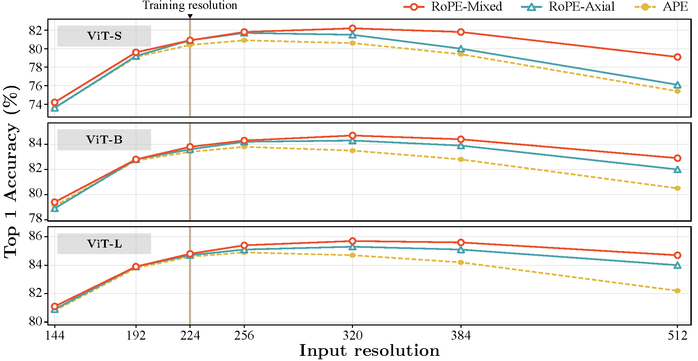
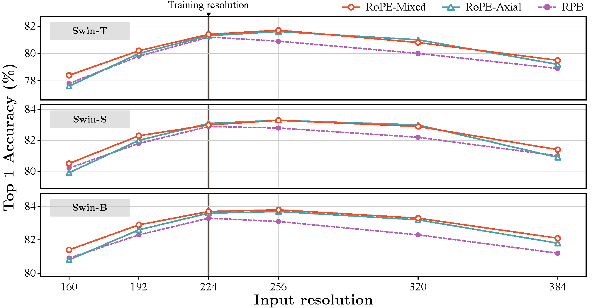

# Rope For Vit 论文阅读

## 1. 试图解决的问题

这篇论文旨在解决旋转位置嵌入（RoPE）在视觉变压器（Vision Transformer，ViT）中的应用问题。 RoPE 在语言模型中表现出色，尤其是在变压器的长度外推方面，但其在计算机视觉领域的影响尚未充分探索。本文通过对 RoPE 在 2D 视觉数据中的实际应用进行全面分析，揭示了 RoPE 在增加推理时图像分辨率的同时保持精度的出色外推性能。最终，这种方法在 ImageNet-1k、COCO 检测和 ADE-20k 分割任务中带来了性能提升。研究提供了将 RoPE 应用于 ViT 的详细指南，在最小的额外计算开销下提高骨干网络性能。

## 2. 相关研究

1.	**位置嵌入**：研究了绝对位置嵌入（APE）和相对位置偏差（RPB）在视觉变压器中的应用。APE通常用于传统的ViT架构，而RPB更适合层次化的ViT，如Swin Transformer 。
2.	**RoPE在视觉建模中的应用**：最早的研究将RoPE应用于ViT相关架构，例如Hybrid X-former，它将一维RoPE应用于Vision X-formers。此外，EVA-02引入了二维轴向RoPE，用于新的语言对齐视觉模型 。
3.	**多分辨率推理**：研究了多分辨率推理方法，以改进ViT在下游任务中的性能。CAPE通过连续增强位置嵌入来改善ViT的多分辨率性能。ResFormer通过基于深度卷积的相对位置嵌入实现了多分辨率推理，并提出了一种改进的ViT架构 。
4.	**条件位置编码**：CPE发现卷积网络可以有效地将相对位置信息注入到令牌中，使用3×3深度卷积作为条件位置嵌入 。
5.	**其他相关工作**：包括使用连续增强位置嵌入（CAPE）、通过多分辨率自蒸馏学习改进的ResFormer，以及具有灵活补丁大小的FlexiViT，这些方法在不同的上下文中展示了多分辨率推理的效果 。

## 3. 如何解决问题

### 3.1 扩展RoPE到2D输入

研究首先将RoPE从一维扩展到二维，以适应图像数据的特点。采用轴向频率的方法，将嵌入维度分为两部分，分别应用于x轴和y轴。然而，为了更好地处理对角方向的问题，提出了一种**混合可学习频率**的方法，使得网络能够**学习频率参数**，进而更适应ViT的注意力机制。

混合可学习频率的计算实现如下：

```python
# 混合可学习频率计算
def compute_mixed_cis(freqs: torch.Tensor, t_x: torch.Tensor, t_y: torch.Tensor, num_heads: int):
    N = t_x.shape[0]
    # No float 16 for this range
    with torch.cuda.amp.autocast(enabled=False):
        freqs_x = (t_x.unsqueeze(-1) @ freqs[0].unsqueeze(-2)).view(N, num_heads, -1).permute(1, 0, 2)
        freqs_y = (t_y.unsqueeze(-1) @ freqs[1].unsqueeze(-2)).view(N, num_heads, -1).permute(1, 0, 2)
        freqs_cis = torch.polar(torch.ones_like(freqs_x), freqs_x + freqs_y)
    return freqs_cis
```

`compute_mixed_cis` 函数的主要功能是计算二维频率分量，并将其转换为极坐标形式的复数。在这里，`freqs` 是一个包含两个频率分量的张量，`t_x` 和 `t_y` 是两个张量，分别表示 x 和 y 方向的位置编码。`num_heads` 表示注意力头的数量。`freqs_x` 和 `freqs_y` 分别表示 x 和 y 方向的频率分量，计算公式如下：

$$
\begin{equation}
\mathbf{R}(n, t)=e^{i\left(\theta_t^x p_n^x+\theta_t^y p_n^y\right)}
\end{equation}
$$

其中，$p_n^x$ 和 $p_n^y$ 分别表示 x 和 y 方向的位置编码，$\theta_t^x$ 和 $\theta_t^y$ 分别表示 x 和 y 方向的频率分量。

在计算混合可学习频率时，首先将 `t_x` 和 `t_y` 与 `freqs` 的两个频率分量进行点积运算，然后将结果转换为复数形式。最后，将 x 和 y 方向的频率分量相加，得到最终的频率分量。这样的计算方式可以更好地处理对角方向的问题，提高模型的性能。

为什么这样的计算方式可以更好地处理对角方向的问题呢？这是因为在二维输入中，对角方向的位置编码是由 x 和 y 方向的位置编码共同决定的。因此，通过将 x 和 y 方向的频率分量相加，可以更好地捕捉到对角方向的位置信息，从而提高模型的性能。

RoPE 原论文中给出的二维 RoPE 的计算方法如下：

```
# 原 RoPE 计算方法
def compute_axial_cis(dim: int, end_x: int, end_y: int, theta: float = 100.0):
    freqs_x = 1.0 / (theta ** (torch.arange(0, dim, 4)[: (dim // 4)].float() / dim))
    freqs_y = 1.0 / (theta ** (torch.arange(0, dim, 4)[: (dim // 4)].float() / dim))

    t_x, t_y = init_t_xy(end_x, end_y)
    freqs_x = torch.outer(t_x, freqs_x)
    freqs_y = torch.outer(t_y, freqs_y)
    freqs_cis_x = torch.polar(torch.ones_like(freqs_x), freqs_x)
    freqs_cis_y = torch.polar(torch.ones_like(freqs_y), freqs_y)
    return torch.cat([freqs_cis_x, freqs_cis_y], dim=-1)
```

针对原 Rope 的计算方法，可以补充说一点： **从一维RoPE推广到二维RoPE，和单纯地把每个方向当作一维RoPE再concat(和传统三角式位置编码的扩展方法一样)是等价的**

二维RoPE的解如下：

$$
\begin{equation}
\boldsymbol{R}_{x, y}=\left(\begin{array}{cc:cc}
\cos x \theta & -\sin x \theta & 0 & 0 \\
\sin x \theta & \cos x \theta & 0 & 0 \\
\hdashline 0 & 0 & \cos y \theta & -\sin y \theta \\
0 & 0 & \sin y \theta & \cos y \theta
\end{array}\right)
\end{equation}
$$

但是我们看下代码实现，其实是分别计算了 x 和 y 方向的 RoPE，然后 concat 在一起。

### 3.3 实验验证

实验部分，研究在ViT和Swin Transformer架构上进行了一系列的测试，验证了2D RoPE的有效性。在ImageNet-1k数据集上进行的多分辨率分类测试显示，2D RoPE在高分辨率图像上的外推性能显著提高。特别是在目标检测和语义分割任务中，使用2D RoPE的ViT和Swin Transformer在MS-COCO和ADE20k数据集上表现出色，显著提升了性能。

DeiT-III

  

Swin Transformer

  


## 4. 总结

这篇论文研究了如何将旋转位置嵌入（RoPE）应用到 Vit 中，从而提升其在图像识别任务中的性能。RoPE在语言模型中已经表现出色，尤其在处理长度外推时。然而，在计算机视觉领域，RoPE的潜力尚未得到充分发掘。

研究首先将RoPE从一维扩展到二维，以适应图像数据的特性。采用了轴向频率和混合可学习频率的方法，使得位置嵌入能够更好地处理不同方向的相对位置。轴向频率将嵌入维度分为两部分，分别应用于x轴和y轴，而混合可学习频率则让网络可以学习和调整频率参数，增强了模型对图像数据的适应性。

在实验中，研究团队对ViT和Swin Transformer进行了详细的测试。结果表明，使用2D RoPE后，这些模型在ImageNet-1k数据集上的多分辨率分类任务中表现显著提升，特别是在高分辨率图像的外推能力上。此外，2D RoPE在目标检测和语义分割任务中也表现优异，在MS-COCO和ADE20k数据集上的性能明显提升。