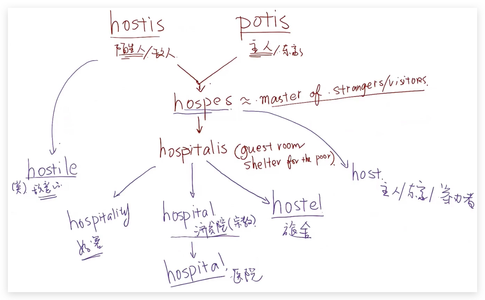

# 韦小绿Unit01

## BENE

:::tip

`BENE` is Latin for "well"

A benefit is a good result or effect. Something beneficial produces good results or effects.

The Latin root can be heard in other languages as well: "Good" or "Fine!" in Spanish is "Bueno"; in Franch, it's "Bon!";

:::

### Benediction

> A prayer that asks for God's blessing, especially a prayer that concludes a worship service.

synonym: Favor, blessing, invocation

- Favor: 好意
- Blessing: 特殊的 Favor，e.g. The blessing for freedom 
- Invocation: 祈求神的 blessing 
- Benediction: 可以「invocation的仪式」，也可以「善意的行为」和「祝愿」

etymology: 

From Late Latin benedictionem "a blessing," from bene "well" + dicere "to say, speak" 

### Benefactor

> Someone who helps other people or group, especially by giving money 

synonym: Donor, patron, sponsor

- Donor: 给钱的支持者
- patron: 长期给钱的支持者
- sponsor: 支持者
- Benefactor: 恩人

etymology: 

From Late Latin benefactor, 

from Latin phrase bene facere, from bene "well" + facere "to do"

### Beneficial

> A person or organization that benefits or is expected to benefit from something, expecially one that receives money or property when someone dies.

synonym: Heir, recipient, successor 

- Beneficial: 拿钱的
- Heir: 一般有血缘关系的继承人
- Recipient: 接收者
- Successor: 拿账户的

etymology:

Derived from bene("well, good") + -ficus (suffix denoting making).

### Benevolence

> kindness, generosity

synonym: Goodwill, Compassion, Altruism

- Goodwill: 善意
- Compassion: 同情, 怜悯 com(together) + passion(passus 苦难经历)
- Altruism: 无私
- Sympathy:  同情心
- empathy: 共情心
- Benevolence: 善意, 但是实际用的时候会让人感觉居高临下

etymology:

bene（好, good） + volo/velle (will 意愿) => Goodwill

from Old French benivolence (Modern French bienveillance) and directly from Latin benevolentia "good feeling, good will, kindness,"

## AM 

:::tip

`AM` comes from the Latin amare, “to love.”

The Roman god of love was known by two different names, Cupid and Amor. 

Amiable means “friendly or good-natured,” and amigo is Spanish for “friend.”

:::

### amicable

> Friendly, peaceful.

synonym: Friendly, Peaceful, Cordial, Amiable

- Amicalble -> Amicus 有善心 （拉丁系）
- Amiable -> 脾气好，柔情的，可爱的，有善心
- Friendly：友善（古日耳曼系）-> Friend / frei（自由）
- Peaceful：平和，好相处
- Cordial：诚恳而由衷（词义差别较大） 
- affable：易于交流的，面善的

### enamored 

> Charmed or fascinated; inflamed with love.

en(使)amor(爱)ed -> 被 使 ... 爱

synonym: Hooked, Fascinated, Charmed, Enchanted

- Hooked 被勾住的
- Fascinated 着迷的, 对一个东西超级着迷
- Charmed 着魔的, [拉] carmen 歌,咒语 
- Enchanted 着魔的, 被迷住的
- Enamored 迷恋的

它们的共同点是，它们形容的对象是受到了对方的属性的影响，

如：I am enamored of/by/with you. — 我因为你的美好特性而爱上了你。

I love you. — 我爱你，这是我单方面的行为。

### amorous 

> Having or showing strong feelings of attraction or love. More physical than emotional 

In love，Have a crush on someone，（be）Fond of someone or something

- In love 恋爱中
- Have a crush on 暗恋
- Fond of 爱好，喜欢
- Amorous 一方面是「恋爱的、热情的」，一方面是「情欲的乃至滥情的」，慎用。

### paramour

> A lover, often secret, not allowed by law or custom.

synonym: Lover （向他人介绍自己的恋人时，切勿用lover！！！）

## Bell

:::tip

BELL comes from the Latin word meaning “war.” Bellona was the little-known Roman goddess of war; her husband, Mars, was the god of war.

:::

### autebellum

> Existing before a war, especially before the American Civil War (1861–65).

aute => before 

anti => against 

When World War I was over, the French nobility found it impossible to return to their extravagant antebellum way of life.

Even countries that win a war often end up worse off than they had been before, and the losers almost always do. So antebellum often summons up images of ease, elegance, and entertainment that disappeared in the postwar years. In the American South, the antebellum way of life depended on a social structure, based on slavery, that collapsed after the Civil War; Margaret Mitchell's Gone with the Wind shows the nostalgia and bitterness felt by wealthy Southerners after the war more than the relief and anticipation experienced by those released from slavery. In Europe, World War I shattered the grand life of the upper classes, even in victorious France and Britain, and changed society hugely in the space of just four years. 

- Pre-Civil War：特指美国内战（1820–1860）之前
- Prewar：泛指战争之前，或特指二战之前
- Prior to the war：特指某个战争之前
- Antebellum：可泛指战争之前，也可特指美国内战之前

### Bellicose, Belligerent

> Bellicose 是好斗的，Belligerent 是好战的

- antagonistc: 敌对的，对视的, anta -> anti => against 
- aggressive: 侵略的, ag -> ad => 向前  gred => to walk 
- hostile: 有敌意的

  

### Rebellion

> Open defiance and opposition, sometimes armed, to a person or thing in authority.

A student rebellion that afternoon in Room 13 resulted in the new substitute teacher racing out of the building in tears.

Plenty of teenagers rebel against their parents in all kinds of ways. But a rebellion usually involves a group. Armed rebellions are usually put down by a country's armed forces, or at least kept from expanding beyond a small area. The American War of Independence was first viewed by the British as a minor rebellion that would soon run its course, but this particular rebellion led to a full-fledged revolution—that is, the overthrow of a government. Rebellion, armed or otherwise, has often alerted those in power that those they control are very unhappy.

synonym: uprising，disobedience ，defiance

- uprising：起义 （强调正义性）
- disobedience： 拒绝服从, 不遵从, 不作为 （disobey）
- defiance：公开拒绝服从
- Rebellion：从反抗到造反、从青春期叛逆到反政府武装 (re => 反)

## PAC

> PAC is related to the Latin words for “agree” and “peace.” 

涉及到3个词根

- PAX: 和平 harmony , happiness  
- PACERE: 和解/达成一致 come to an agreement 
- PACTUM: agreement 

### Pacify

(1) To soothe anger or agitation. (2) To subdue by armed action.

>  It took the police hours to pacify the angry demonstrators.

Someone stirred up by a strong emotion can usually be pacified by some kind words and the removal of its causes. Unhappy babies are often given a rubber pacifier for sucking to make them stop crying. During the Vietnam War, pacification of an area meant using armed force to drive out the enemy, which might be followed by bringing the local people over to our side by building schools and providing social services. But an army can often bring “peace” by pure force, without soothing anyone's emotions.

synonym: soothe，relieve，soften

- soothe：哄好, 慰藉
- relieve：减轻痛苦 （Re + Leve[left]） 释怀
- soften： 软化
- Pacify：不做就可能动武

### Pacifist

A person opposed to war or violence, especially someone who refuses to bear arms or to fight, on moral or religious grounds.

> Her grandfather had fought in the Marines in World War II, but in his later years he had become almost a pacifist, opposing every war for one reason or another.

synonym: peacemonger，dove，peacemaker，pacificist

- peacemonger：贬义，不现实、不顾名誉
- dove：鸽派，息事宁人
- peacemaker：中性
- appeasement: 绥[妥协]靖[安定]

