# 打比赛必备的前后端知识

基础网络通信知识

## 浏览器是如何获取数据的

当我们打开一个网站的时候，网站上显示文字、图片等信息。有没有想过这些信息是如何被加载出来的呢？说的简单一些就是这些信息是从网络上“下载”下来的；


## 网站基础知识

一个网站是由一个前端和一个后端组成的，前端就是我们平时使用的浏览器所展现的网页。后端是负责提供应用服务的程序。一般负责和数据库的交互以及业务的逻辑处理。

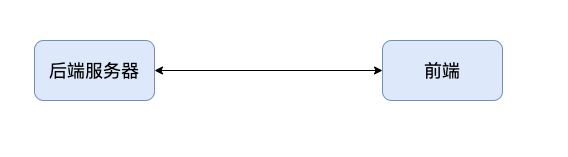

前端是数据就是问后端要的，后端将数据返回给前端。前端再将数据呈现到你的面前；

### 网址结构解析

网页地址也叫做：url；

以 bilibili 的 url 举例子：

其中 https 表示使用的协议类型，https 也就是 http+ssl。http 为超文本传输协议，ssl 为一种加密协议。这些协议有兴趣可以去多了解了解，了解的不是那么深入问题也很大。你可以简单的理解为前缀了一个 http/https 就相当于说明了我想要的是超文本传输协议的服务。那如果是前缀 ftp 我想要的就是 ftp 文件传输的服务。他的作用就是用来表明你现在想要的服务是什么样的。就比如再看后面的黄色的部分 www.bilibili.com 这是 bilibili 网站的域名。域名就是给网站主机的 IP 地址起一个名字，这个域名就对应着一个 IP 地址。当然了我们还能看到另一种网址是由协议和 IP 地址组成的。


这种就是协议加 ip 地址的方式。刚才一直说 IP 地址，可能有的同学还是不是那么的了解 IP 地址。下面我们就介绍一下什么是 IP 地址。

### 什么是 IP 地址

推荐学习网址：[https://blog.csdn.net/python_LC_nohtyp/article/details/108919428?spm=1001.2014.3001.5501](https://blog.csdn.net/python_LC_nohtyp/article/details/108919428?spm=1001.2014.3001.5501)

简单的来说 IP 地址是主机在网络之间用于表明自己身份的东西。他们就像是快递的收件地址一样，数据包根据 IP 地址来送“快递”。当然了数据包送达的过程肯定没有那么简单，这里只是为了帮助你更好的了解 IP 地址。

#### IP 地址的基本结构

IP 地址一般是由 4 个 0-255 的数组成的，比如 127.0.0.1 这就是一个 IP 地址。你可以在命令行上查看自己电脑的 IP 地址：

```shell
Windows: ipconfig
Linux: ifconfig
MacOS: ifconfig | grep "inet" 
```

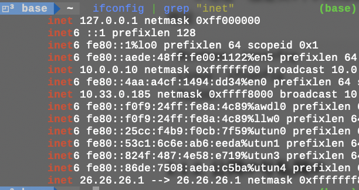

可以知道`10.33.0.185`就是我这台电脑的 IP 地址；

#### 公网 IP 与私网 IP

**私网 IP**是不会出现在互联网上的，无法直接使用它们来访问互联网，而只能在本地连接也就是局域网中使用。 **公网 IP**能直接连接上网络，所以对于那些住宅小区，公司，学校，政府机构等场所，就可以集中使用私有的**IP**进行管理，而大家可以共用一个**IP**去连接上**公网**。为什么要区分公网和私网呢？ 因为 ipv4 的 ip 是非常有限的，如果给每一个电脑都分配一个 ip 地址那么势必是不够用的。所以想要的一个方法就是比如一个公司里面有非常多的机器，对于公司内的主机他们使用私网 IP 即可。当他们需要访问公网中的机器时，对外表现的 IP 地址则为这个公司的公网 IP。每一个内网是相互独立的，这意味着不同内网中可以有相同的 IP 地址。这样就可以避免给每个主机都分配一个公网 IP 而导致的资源浪费和消耗过快的问题。


#### IP 和域名是什么关系

我们可以看到我们平时访问的网址都是 `https://www.bilibili.com`,	这样的网址；其中 `www.bilibili.com` 叫做域名，那么域名和 IP 到底有什么关系呢？

你可以理解域名就是 IP 的小名，为了方便记忆一个网站的网址的。你总不想记一大堆的全是数字的网址吧。

### Web 开发中的路由

在 web 开发中，“route”是指根据 url 分配到对应的处理程序。他的表现方式类似于这样：

https://zhidao.baidu.com/question/18364215.html

可以看到https://zhidao.baidu.com 主 url，后面跟着的`/question/18364215.html`就是路由了。你可以用函数封装的概念去理解路由。比如 B 站，我想访问动漫的那我就访问可以返回动漫数据的 url:https://www.bilibili.com/v/douga，如果我想访问游戏的那我就访问可以返回游戏数据的 url：https://www.bilibili.com/v/game。

###  什么是数据包

前面已经说到了，前后端之间是要进行相互通信的，IP 地址决定了数据包去往哪个地方，现在我们应该知道数据包到底是如何进行传输的。打开 Chrome，按 F12 打开控制台进入到 Network 当中，按 Ctrl+R 刷新一下网页就可以看到网页加载时候所传输的所有数据包了。

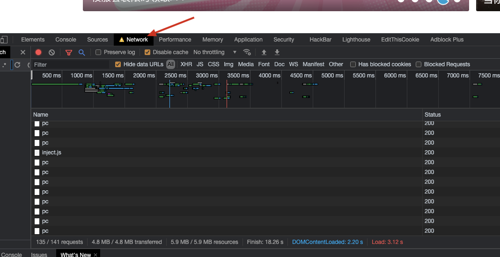

我们把发送数据包的这个过程叫做**请求**，一般请求有两种方式分别的`GET`和`POST`.

两种请求也很好理解：

- GET 就是获取的意思。前端向后端要数据的时候一遍使用 GET 请求。比如我需要获取一张图片，我就可以通过 get 的方式去获取这张图片。
- POST 是发送的意思，前端想要往后端发送的时候一般使用 POST 请求。比如我在登录的时候输入了账号密码，我需要把账号和密码发送到后端去做验证。

网站前后端的通信就是使用数据包进行通信的。

### 端口

有网站开发经验的同学肯定对端口有一定的了解。我们经常说把一个网站跑在 8000 端口或者跑在某某端口上。如果我们在 8000 端口上跑了一个网页也就是说我们在 8000 端口上提供了一个网页的服务。每个端口都可以提供一个服务。

就好比你去商场，不同的店会给你不同的服务。端口就好比一家家的店，有的是卖衣服的，有的是卖电脑的等等。不同的店面给你不一样的服务。当然一个端口也只能提供一个服务，已经被占用的端口就不能给其他的服务使用了。

下图为我试图在 22 端口开启一个网页服务，代码会报错提示端口已被占用；

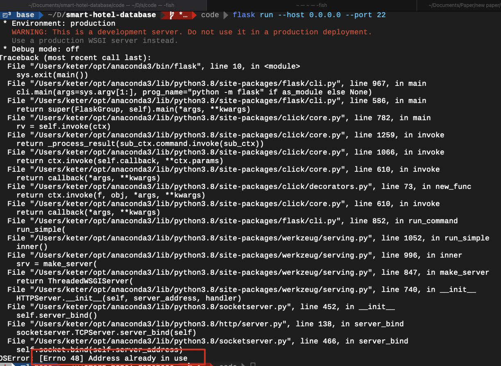

端口也有给数据包指路的作用，比如现在我像一个服务器上发送了一个 HTTP 数据包，但是呢这个服务器上跑了多个网页服务。我这个 HTTP 数据包到底应该送给谁呢？这时候端口的作用就来了，数据包中会包含目标的端口信息，根据端口信息就可以知道我这个数据包到底是发给哪一个后端服务的了。

#### **熟知端口**

熟知端口就是系统中默认会用到的一些端口。你们应该也是有所了解了比如 SSH 服务的默认端口是 22，FTP 文件传输协议的端口是 21，HTTP 的默认端口就是 80 端口，HTTPS 的默认端口就是 443。下表是一些常见的端口。

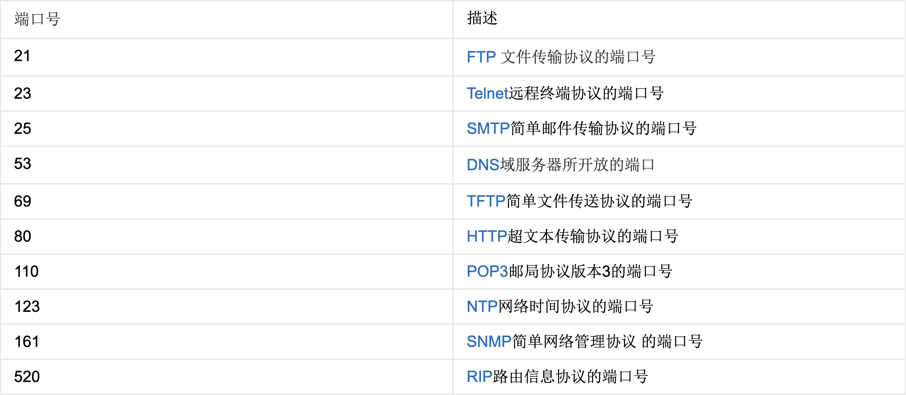

前面已经说到了，一个端口只能提供一个服务，所以我们在创建自己的服务的时候一般都选择 3000 以后的端口，否则可能会和系统内的某些服务冲突。

## 一些小问号

说到这里，你们应该知道一部分网站中的计算机网络知识了。如果想做一个简单的小网站的话这些知识应该够用了（大概）。想要更加详细了解的肯定要自己去多了解了解，毕竟我这里甚至连“三次握手，四次挥手”都没有讲。这些知识只是带你们大致的了解通信的过程。

下面通过一些问题的方式回顾一下上面的知识：

1. 网站的基本组成部分是什么？每个部分负责什么功能？

    简单的来说，网站由前端和后端组成。前端负责将后端的数据呈现给用户和将用户的操作行为提交给后端。后端负责处理前端返回的数据。

2. 为什么要区分公网 IP 和私网 IP

    因为 IPv4 的数量是非常有限的，如果给每一台机器分配的 IP 都是未知那么世界上的 IP 地址早都不够用了，于是人们想到一个办法就是把 IP 中的一部分 IP 腾出来作为私有 IP 而不作为公网 IP。在一个子网中使用私有 IP，这样不同的子网之中 IP 就可以是重复的了，大大增加了 IP 的利用率。 一片区域中对外使用统一的一个公网 IP 就可以了。

3. IP 和域名有什么区别？

    IP 是由数字组成的，域名可以映射到 IP。域名相当于 IP 的小名，方便记忆用的。

4. Web 开发中的路由有什么作用？

    根据 url 分配到对应的处理程序，你可以用函数封装的思想去理解他。你想要什么样的数据就像对应的路由请求数据。

5. 数据包是干什么的？

    数据包中包含了所需的数据，GET 和 POST 请求都在发送数据包？请求的数据和响应的数据都在数据包当中。

6. 常见的请求方式有哪几种？分别用于什么场合？

    常见的请求方式有 GET 和 POST 两种，GET 一般用于前端像后端请求数据时使用。POST 一般用于前端像后端传递数据使用。

## 留给你们的一些坑

有兴趣的自己了解了解；

1. 什么是 MAC 地址？
2. 有了 MAC 地址，为什么还需要 IP 地址呢？ 
3. 如果一片区域的设备对外的 IP 都是同一个公有 IP，那么当一个数据包过来的时候如何知道应该把这个数据包发送给区域中的哪一个设备呢？

# 前端三剑客基础知识

前端主要由三部分组成：即 HTML+CSS+JS；

HTML 主要负责前端的基本框架，CSS 主要负责调整网页的外观，JS 负责处理页面的逻辑。

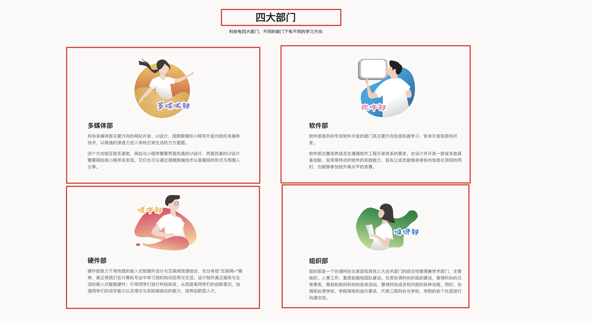

比如上面这个页面，“四大部分”，这四个字他的存在是由 HTML 决定的。但是你可以看到四大部门是居中的。这个居中的属性就是由 CSS 负责调整的。当然了也可以通过`<center></center>`标签去实现这个效果

## HTML 基础知识

推荐学习网站：[https://www.runoob.com/html/html-tutorial.html](https://www.runoob.com/html/html-tutorial.html)

### 什么是 HTML

HTML 是用来描述网页的一种语言。

- HTML 指的是超文本标记语言: **H**yper**T**ext **M**arkup **L**anguage
- HTML 不是一种编程语言，而是一种**标记**语言（MarkDown 也是一种标记语言,可以进行类比学习）
- 标记语言是一套**标记标签** (markup tag)
- HTML 使用标记标签来**描述**网页
- HTML 文档包含了 HTML **标签**及**文本**内容
- HTML 文档也叫做 **web 页面**

### HTML 网页结构

下面是一个可视化的 HTML 页面结构：

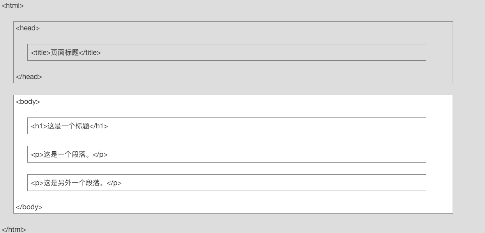

:::tip

 只有\<body\> 区域 (白色部分) 才会在浏览器中显示。

:::

### 创建一个简单的 HTML 文件

```html
<!DOCTYPE html>
<html>
<head>
<meta charset="utf-8">
<title>科协NB</title>
</head>
<body>
 
<h1>xjl 永远的神</h1>
 
<p>宫老师，什么时候教教我？</p>
 
</body>
</html>
```

### HTML 元素语法

- HTML 元素以**开始标签**起始
- HTML 元素以**结束标签**终止
- **元素的内容**是开始标签与结束标签之间的内容
- 某些 HTML 元素具有**空内容（empty content）**
- 空元素**在开始标签中进行关闭**（以开始标签的结束而结束）
- 大多数 HTML 元素可拥有**属性**

#### 嵌套的 HTML 元素

大多数 HTML 元素可以嵌套（HTML 元素可以包含其他 HTML 元素）。

HTML 文档由相互嵌套的 HTML 元素构成。

HTML 嵌套的特性让我们在使用 CSS 的时候可以对一块的元素进行调整。

#### HTML 属性

- HTML 元素可以设置**属性**
- 属性可以在元素中添加**附加信息**
- 属性一般描述于**开始标签**
- 属性总是以名称/值对的形式出现，**比如：name="value"**。

#### 一些常用的 HTML 元素

这些元素都不需要背，看到能够认出来就行，忘记了就去 Baidu 一下。

```html
<!-- 一级标题 -->
<h1>这是一个标题。</h1> 
<!-- 二级标题 -->
<h2>这是一个标题。</h2> 
<!-- 三级标题 -->
<h3>这是一个标题。</h3> 
<!-- 段落 -->
<p>这是一个段落 </p>
<p>这是另一个段落</p>
<!-- 加粗字体 -->
<b>这是一个加粗文本</b>
<!-- 超链接 -->
<a href="https://www.baidu.com/">访问Baidu</a>
<!-- 图像 -->

<!-- 输入框 -->
<input type="text">
<input type="password">
```

其他的元素可以参考：[HTML 速查列表](https://www.runoob.com/html/html-quicklist.html)

### 小练习

图片大小固定 width: 300px height: 300px

使用 html 搭建一个这样的结构：


## CSS 基础语法

推荐学习网站：[https://www.runoob.com/css/css-tutorial.html](https://www.runoob.com/css/css-tutorial.html)

### 什么是 CSS

- CSS 指层叠样式表 (**C**ascading **S**tyle **S**heets)
- 样式定义**如何显示** HTML 元素
- 样式通常存储在**样式表**中
- **外部样式表**可以极大提高工作效率
- 外部样式表通常存储在 **CSS 文件**中

### CSS 创建

#### 插入样式表的三种方法

`内联样式`

由于要将表现和内容混杂在一起，内联样式会损失掉样式表的许多优势。请慎用这种方法，例如当样式仅需要在一个元素上应用一次时。

要使用内联样式，你需要在相关的标签内使用样式（style）属性。Style 属性可以包含任何 CSS 属性。本例展示如何改变段落的颜色和左外边距。

```html
<h1 style="color: brown;">xjl 永远的神</h1>
```

`内部样式表`

当单个文档需要特殊的样式时，就应该使用内部样式表。你可以使用 \<style\> 标签在文档头部定义内部样式表，就像这样:

```html
<head>
	<title>Document</title>
	<style>
		a {color:yellow;}
	</style>
</head>
```

`外部样式表`

当样式需要应用于很多页面时，外部样式表将是理想的选择。在使用外部样式表的情况下，你可以通过改变一个文件来改变整个站点的外观。每个页面使用\<link\> 标签链接到样式表。 \<link\> 标签在（文档的）头部：

```html
<head>
<link rel="stylesheet" type="text/css" href="mystyle.css">
</head>
```

### CSS 语法

CSS 规则由两个主要的部分构成：选择器，以及一条或多条声明:


选择器通常是需要改变样式的 HTML 元素。

每条声明由一个属性和一个值组成。

属性（property）是希望设置的样式属性（style attribute）。每个属性有一个值。属性和值被冒号分开。

### CSS 的 Id 和 Class 选择器

#### Id 选择器

id 选择器可以为标有特定 id 的 HTML 元素指定特定的样式。

HTML 元素以 id 属性来设置 id 选择器,CSS 中 id 选择器以 "#" 来定义。

例子：

```html
<!DOCTYPE html>
<html lang="en">
<head>
	<meta charset="UTF-8">
	<meta http-equiv="X-UA-Compatible" content="IE=edge">
	<meta name="viewport" content="width=device-width, initial-scale=1.0">
	<title>Document</title>
	<style>
		#first {text-align: center;}
		#second {color: red;}
	</style>
</head>
<body>
	<p id="first"> 第一个 </p>
	<p id="second"> 第二个 </p>
	<p id="third"> 第三个 </p>
</body>
</html>
```

#### Class 选择器

class 选择器用于描述一组元素的样式，class 选择器有别于 id 选择器，class 可以在多个元素中使用。

class 选择器在 HTML 中以 class 属性表示, 在 CSS 中，类选择器以一个点"."号显示：

在以下的例子中，所有拥有 center 类的 HTML 元素均为居中。

例子：

```html
<!DOCTYPE html>
<html lang="en">
<head>
	<meta charset="UTF-8">
	<meta http-equiv="X-UA-Compatible" content="IE=edge">
	<meta name="viewport" content="width=device-width, initial-scale=1.0">
	<title>Document</title>
	<style>
		#first {text-align: center;}
		#second {color: red;}
		.center {text-align: center;}
		h3.center {color: red;}
	</style>
</head>	
<body>
	<p id="first"> 第一个 </p>
	<p id="second"> 第二个 </p>
	<p id="third"> 第三个 </p>
	<p class="center"> 第三个 </p>
	<p class="center"> 第三个 </p>
	<p class="center"> 第三个 </p>
	<h3 class="center"> 第三个</h3>
	<h3 class="center"> 第三个</h3>
	<h3 class="center"> 第三个</h3>
	<h3 class="center"> 第三个</h3>
</body>
</html>
```

### CSS 具体语法

至于：

如何调整字体大小？

如何调整字体颜色？

如何设置元素浮动？

如何设置图片的不透明度？

请参照：[菜鸟教程](https://www.runoob.com/css/css-tutorial.html)

本次培训的目的不是把你们培训成网页开发者，只是让你们熟悉一下网页的结构将来可以和算法对接。

### 小例子


## JS 基础知识

推荐学习网址：[https://www.runoob.com/js/js-tutorial.html](https://www.runoob.com/js/js-tutorial.html)

### 什么是 JS

JS 全称 JavaScript：

JavaScript 是一种轻量级的编程语言。

JavaScript 是可插入 HTML 页面的编程代码。

JavaScript 插入 HTML 页面后，可由所有的现代浏览器执行。

### JS 的用法

HTML 中的脚本必须位于 \<script\> 与 \</script\> 标签之间。

脚本可被放置在 HTML 页面的 \<body\> 和\<head\> 部分中。

#### \<script\> 标签

如需在 HTML 页面中插入 JavaScript，请使用 \<script\> 标签。

`<script> 和 </script>` 会告诉 JavaScript 在何处开始和结束。

比如：

```js
<script>
alert("我的第一个 JavaScript");
</script>
```

你们暂时无需理解上面的代码。只需明白，浏览器会解释并执行位于 `<script> 和 </script>`之间的 JavaScript 代码 。

#### 写 JS 代码的三个位置

1. 写在 head 当中
2. 写在 body 当中
3. 写在外置文件当中

```html
<!DOCTYPE html>
<html lang="en">
<head>
	<meta charset="UTF-8">
	<meta http-equiv="X-UA-Compatible" content="IE=edge">
	<meta name="viewport" content="width=device-width, initial-scale=1.0">
  <!-- 写在外置文件当中 -->
  <script src="myScript.js"></script>
	<title>Document</title>
  <!-- 写在head中 -->
  <script>
		document.write("<h1>223333</h1>");
	</script>
</head>
<body>
  <!-- 写在body中 -->1
	<script>
		document.write("<h1>1111</h1>");
		alert("666，我的宝贝");
	</script>
</body>
</html>
```

写在 body 和写在 head 中的代码其实没有什么特殊的区别，需要注意的就是 head 中的 JS 代码是先被执行的，body 中的代码是后被执行的。有时候 JS 代码是需要和 HTML 元素绑定的，JS 代码一定要写在绑定元素的下面（x）。

#### JS 语法

`JS变量：`

在 JS 中如果你要声明一个变量可以使用：`var x = 1`;

`JS中的数据类型：`

```js
var length = 16;                                  // Number 通过数字字面量赋值    
var points = x * 10;                              // Number 通过表达式字面量赋值  
var lastName = "Johnson";                         // String 通过字符串字面量赋值  
var cars = ["Saab", "Volvo", "BMW"];              // Array  通过数组字面量赋值   
var person = {firstName:"John", lastName:"Doe"};  // Object 通过对象字面量赋值   
```

`JS函数：`

JavaScript 语句可以写在函数内，函数可以重复引用：

```js
function myFunction(a, b) {
    return a * b;                                // 返回 a 乘以 b 的结果
}
```

还有 JS 中的 for 循环啊，while 循环啊之类的就不多说了和 C 语言的用法基本一致。

#### 如何使用 HTML 元素触发函数

我们知道函数在没有调用的时候说不会执行的，我们编写 JS 函数的目的是希望在用户操作页面的时候可以有对应的响应。下面我们就介绍一下 HTML 元素绑定函数的几种方法：

`onclick()`

比如下面这个代码：

```html
<body>
    <button onclick="myFunction()">点我啊</button>
	<script>
		function myFunction(){
			alert("aaaa");
		};
	</script>
</body>
```

这个代码就是将 button 绑定了 myFunction()这个函数。

`使用普通的JS代码绑定`

```js
<body>
	<button id="b1">点我啊</button>
	<script>
		function myFunction(){
			alert("aaaa");
		};
		var bt = document.getElementById('b1');
		bt.onclick = function(){
			myFunction();
		}
	</script>
</body>
```

首先我们需要获取到按钮这个对象，使用 document.getElementById 可以获取。接着定义这个对象的 onclick 对应的事件。

`使用JQuery库绑定`

JQuery 是 JS 的一个库提供了一些比较好用的接口，具体的介绍这里就不说了直接说他要怎么用。还是那句话这篇教程不是为了培养一个高端的前端工程师的，我直接也不是专业的说的地方也有可能是错的。只是想让大家看过之后可以对前后端有个了解，能够看懂别人的代码或者在别人代码的基础上做一定的修改。

引入 JQuery 库：

一般引入的代码写在 head 的位置

`<script src="https://cdn.staticfile.org/jquery/1.8.3/jquery.min.js"></script>`

绑定的方式如下：

```html
<body>
	<button id="b1">点我啊</button>
	<script>
		$("#b1").on("click",myFunction);
		function myFunction(){
			alert("aaaa");
		};
	</script>
</body>
```

除了点击，jq 也可以便捷的实现鼠标移动到上面就触发的效果。把上述的代码改成 mouseover 即可；

### JQ 的一些基本操作

#### 基本语法格式

`$(selector).action()`

- 选择符（selector）查询 HTML 元素：this、标签名称、.类名、#id
- jQuery 的 action() 执行对元素的操作

#### JQ 的选择器

它完全继承了 CSS 的风格,可以对元素的标签名、属性名、状态等进行快速准确的选择,并且不必担心浏览器的兼容性,写法更加简洁。

`基本选择器`

| 选择题            | 描述                                     | 示例                            |
| ----------------- | ---------------------------------------- | ------------------------------- |
| #id               | 根据指定的 ID 匹配元素                     | $('#box')选择 id 为 box 的标签      |
| .class            | 根据给定的类名匹配元素                   | $('.left')选择 class 为 left 的标签 |
| Element           | 根据给定的元素名匹配元素                 | $('p')选择所有段落标签          |
| *                 | 匹配所有元素                             | $('*')选择所有不分类型标签      |
| Seletor1,Seletor2 | 将每一个选择器匹配到的元素合并到一起返回 | $('p,h1')同时选择段落和标题一   |

`层级选择器`

| 选择题     | 描述                             |
| ---------- | -------------------------------- |
| $('ul li') | 选择 ul 当中所有 li（所有后代元素） |
| $('ul>li') | 选择 ul 当中子元素 li 所有的子元素   |
| $('p+div') | 选择段落后的第一个 div            |

等等…… 主要要用到的就是基本选择器了。

#### JQ 操作 html 元素

`获得内容`

- text() - 设置或返回所选元素的文本内容
- html() - 设置或返回所选元素的内容（包括 HTML 标记）
- val() - 设置或返回表单字段的值

`设置内容`

- text(参数) - 设置或返回所选元素的文本内容

- html(参数) - 设置或返回所选元素的内容（包括 HTML 标记）

- val(参数) - 设置或返回表单字段的值

- 回调函数：
    回调函数由两个参数：被选元素列表中当前元素的下标，以及原始（旧的）值。然后以函数新值返回；
    示例：

    ```js
     text(function(i,origText){
    	 return "Old text: " + origText + " New text: Hello world!
     }
    ```

### ajax

建议学习网址：[https://www.runoob.com/jquery/ajax-ajax.html](https://www.runoob.com/jquery/ajax-ajax.html)

#### 什么是 AJAX

AJAX = Asynchronous JavaScript and XML（异步的 JavaScript 和 XML）。

AJAX 不是新的编程语言，而是一种使用现有标准的新方法。

AJAX 最大的优点是在不重新加载整个页面的情况下，可以与服务器交换数据并更新部分网页内容。

AJAX 不需要任何浏览器插件，但需要用户允许 JavaScript 在浏览器上执行。

#### JQ 与 Ajax

jQuery 提供多个与 AJAX 有关的方法。

通过 jQuery AJAX 方法，能够使用 HTTP Get 和 HTTP Post 从远程服务器上请求文本、HTML、XML 或 JSON - 同时能够把这些外部数据直接载入网页的被选元素中。

### GET 方法

`使用JQ实现GET方法：`

例子：

请求 "/hello"，但是忽略返回结果：

```js
$.get("/hello");
```

请求 "test.php" 并连同请求发送一些额外的数据（忽略返回结果）：

```js
$.get("/hello", { name:"Donald", town:"Ducktown" });
```

请求 "test.php" 并传递数据数组到服务器（忽略返回结果）：

```js
$.get("/hello", { 'colors[]' : ["Red","Green","Blue"] });
```

请求 "test.php" 并提醒请求的结果：

```js
$.get("/hello", function(data){
alert("Data: " + data);
});
```

`语法`

```js
$.get(URL,data,function(data,status,xhr),dataType)
```

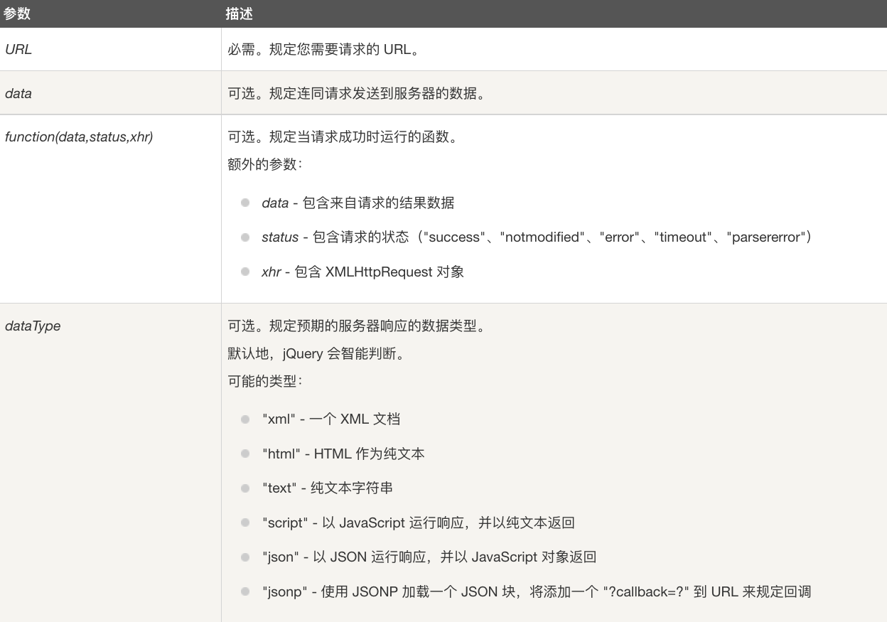

 `json数据类型：` Json 数据是一种特殊格式的字符串。可以被编程语言解析。其格式就是 Python 的字典，如果使用 Python 作为后端那么如果从前端接收到了 Json 类型的字符串就可以使用相关库将数据直接解析为字典类型。

```python
import json

a = {"a": 1}
print(json.dumps(a)) # {"a": 1} 
print(type(json.dumps(a))) # <class 'str'>
```

### POST 方法

`Ajax通过.ajax方法来发送json数据`

$.ajax() 方法通过 HTTP POST 请求向服务器提交数据。

语法：

```plain
$.ajax({name:value, name:value, ... })
```

参数列表：

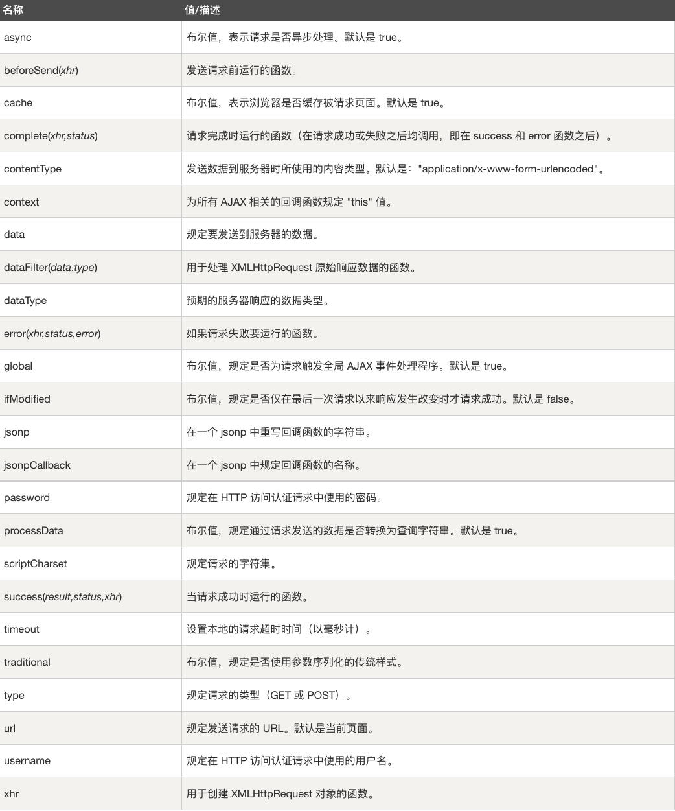

使用 POST 发送 json 数据的例子：

```js
$("#b1").click(function () {
        var data = {"a": 1,"b": 2}
        $.ajax({
            type: "POST",
            url: "/post_test",
            contentType: "application/json; charset=utf-8",
            data: JSON.stringify(data),
            dataType: "json",
            success: function (data) {
                console.log("发送成功")
            },
        });
    })
```

# 后端 Flask 基础知识

推荐学习网站：[https://read.helloflask.com](https://read.helloflask.com/c1-ready)

Flask 是一个使用 Python 编写的轻量级 Web 应用框架。	

安装：`pip3 install flask`

## 最基础的 Flask 程序

下面是 Flask 的一个最基础的程序，允许这个这个程序 Flask 会在你电脑的 5000 端口启动一个后端服务。你可以通过`http://127.0.0.1:5000`去访问这个服务。

```python
import flask

from flask import Flask
from flask import render_template
app = Flask(__name__)

# 定义总路由
@app.route('/')
def index():
    return "Hello Flask"

if __name__ == '__main__':
    app.run(host='0.0.0.0', port=5000)
```

## 加载静态网页

一般的在根路由下我们会返回一下静态的网页，只需要稍微进行修改几个。首先我们需要一个静态网页命名为 index.html。

代码结构如下：

```plain
├── demo.py
├── templates
│   └── index.html
```

你需要把静态的 html 文件放在 templates 文件夹中，当然这个文件夹的路径也可以自定义，默认就是 templates。

Index.html 的代码如下：

```html
<!DOCTYPE html>
<html lang="en">
<head>
    <meta charset="UTF-8">
    <title>Title</title>
    <script src="https://cdn.staticfile.org/jquery/1.8.3/jquery.min.js"></script>
</head>
<body>
    <h1>Hello Flask!</h1>
</body>
</html>
```

接下来我们在 Flask 中设置访问根路由时返回该静态模版（只需要一句`render_template('index.html')`）

```python
import flask

from flask import Flask
from flask import render_template
app = Flask(__name__)

# 定义总路由
@app.route('/')
def index():
    return render_template('index.html')

if __name__ == '__main__':
    app.run(host='0.0.0.0', port=5000)
```

接下来重新运行一遍后端代码，之后打开:`http://127.0.0.1:5000`，你就可以看到：

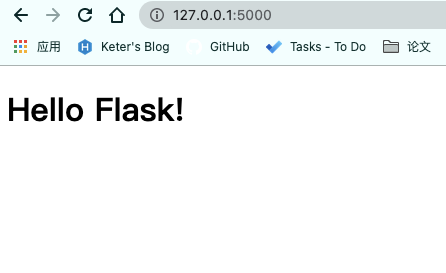

## 前后端相互通信

### 接收 GET 类型的数据

GET 传参的方式：`http://127.0.0.1:5000/hello?a=1&b=2`

在发送 get 请求的时候在路由的后面进行传参数

`Flask接收GET参数：`

```python
from flask import request

@app.route('/get_test', methods=['GET'])
def get_test():
    a = request.args.get("a")
    b = request.args.get('b')
    c = request.args.get('c')
    print(a,end='')
    print(b,end='')
    print(c,end='')
    return "请求成功"
```

比如我们现在请求`http://127.0.0.1:5000/get_test?a=1&b=2&c=3`在后端控制台中就会输出：`123`

如果没有这个参数就会返回一个 None；

### 接受 POST 类型的数据

首先我们编写一个简单的 html 页面：

```html
<!DOCTYPE html>
<html lang="en">
<head>
    <meta charset="UTF-8">
    <title>Title</title>
    <script src="https://cdn.staticfile.org/jquery/1.8.3/jquery.min.js"></script>
</head>
<body>
<button id="b1">点我啊</button>
</body>
</html>
```

接着在后端定义一个新的子页面

```python
@app.route('/post')
def post():
    return render_template('post_test.html')
```

接下来定义一下 post_test 路由的行为逻辑：

```python
@app.route('/post_test', methods=['POST'])
def post_test():
    # 获取json数据
    data = request.get_json()
    # 解析json数据
    data = json.loads(data)
    print(data['a'])
    print(data['b'])
    return json.dumps(data)
```

最后编写前端的 JS 逻辑：

```js
<script>
    // 使用ajax发送post请求
    $("#b1").click(function () {
        var data = {
            a: 1,
            b: 2,
        }
        $.ajax({
            type: "POST",
            url: "/post_test",
            contentType: "application/json; charset=utf-8",
            data: JSON.stringify(data),
            dataType: "json",
            success: function (data) {
                var d = data;
                console.log(d);
            },
        });
    })
</script>
```

## 例子

现在我们来做一个例子，我们首先在后端写好一个手写数字识别的程序。通过前端上传一张图片，后端进行识别然后将识别结果显示在屏幕上。

### 训练一个可以识别数字的模型

训练代码见附录，代码很简单，下面我们写一个识别的接口：

```python
import torch
from PIL import Image
from detector import Net
from torchvision.transforms import functional
import numpy as np


@torch.no_grad()
def detect(img_path, model_path='./model.pth'):
    # 读取图片
    img = Image.open(img_path)
    img = img.convert('L')
    img = img.resize((28, 28))
    img = functional.pil_to_tensor(img) / 255.
    img = img.unsqueeze(0)
    # 加载模型
    model = Net()
    model.load_state_dict(torch.load(model_path))
    model.eval()
    result = model(img)[0]
    result = np.argmax(result.tolist())
    return result


if __name__ == '__main__':
    detect(img_path='/Users/keter/Downloads/5.jpg')

```

这个接口可以帮助我们识别上传的图片

### 前端使用 ajax 上传代码

前端使用 ajax 上传图片的代码非常的简单，首先我们需要一个可以选择图像的按钮和一个上传的按钮。上传的按钮绑定一下上传的相关逻辑。

```python
<!DOCTYPE html>
<html>
<head>
    <title>首页</title>
    <style>
        #img {
            width: 300px;
            height: 300px
        }

        #box {
            text-align: center;
        }

    </style>

</head>
<body>
<div id="box">
    <h2>Mnist手写数字识别</h2>
    <!--初始化一个img标签-->
    
    <form id="uploadForm" enctype="multipart/form-data">
        <input type="file" name="file">
        <input type="button" value="上传" id="upFileBtn">
    </form>
    <!-- 显示识别结果 -->
    <p id="p1">识别结果：<nobr id="d1"> <nobr/> </p>
</div>


</body>
<script src="https://cdn.staticfile.org/jquery/1.8.3/jquery.min.js"></script>
<script type="text/javascript">
    // 绑定上传按钮
    $('#upFileBtn').click(function () {
        var formFile = new FormData($('#uploadForm')[0])
        $.ajax({
            url: "/upload", // 选择给定路由
            type: "POST",   // 选择上传方式
            data: formFile, // 使用form表单的形式上传
            processData: false,
            contentType: false,
            success: function (data) {
                var d = JSON.parse(data) // 解析JSON数据
                $('#img').attr('src', d.file_url); // 更新显示的图片
                $('#d1').html(d.detect_result) // 更新识别的结果
            }
        })
    })
</script>
</html>
```

### 后端接受图片的代码

后端我们需要使用 flask_uploads，`pip3 install flask_uploads`

首先我们需要导入相关的包，然后设置一下相关的配置：

```python
from flask_uploads import UploadSet, IMAGES, configure_uploads, patch_request_class

app = Flask(__name__)

app.config["UPLOADED_PHOTOS_DEST"] = 'uploads'
photo = UploadSet('photos', IMAGES)
configure_uploads(app, photo)
patch_request_class(app)
```

接下来写一下接受的相关逻辑

```python
@app.route('/detector', methods=['POST'])
def detector():
    filename = photo.save(request.files['file']) #保存图片
    file_url = photo.url(filename) # 获取url
    path = photo.path(filename) # 获取存储路径
    result = detect(path)
    data = {'file_url': file_url, "detect_result": str(result)} # 构造返回数据
    data = json.dumps(data) # 转换为字符串
    return data
```

### 实现效果

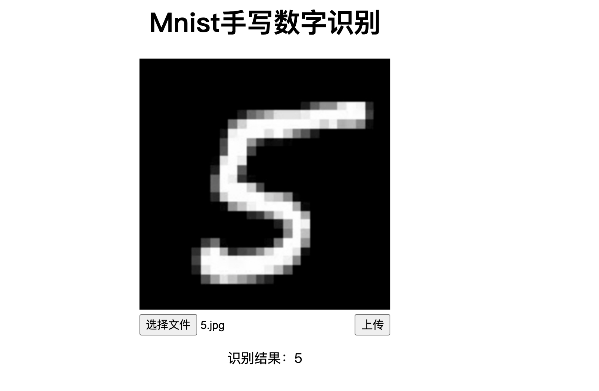

### 可能会遇到的 BUG

1."ImportError: cannot import name'secure_filename' from'werkzeug'" when importing the flask_uploads package

解决网址： [https://www.programmersought.com/article/88615197452/](https://www.programmersought.com/article/88615197452/)

# 多多实践

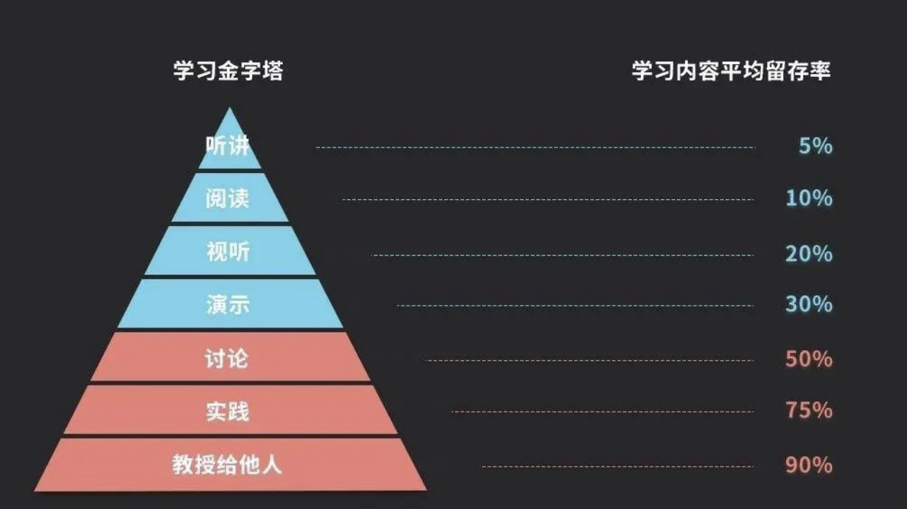

# 附录代码

## Pytorch 训练 Mnist

（ 我随便从网上拷贝的

```python
import torch
import torch.nn as nn
from torch.utils.data import dataloader
import torchvision
import torch.nn.functional as F
import torch.optim as optim

n_epochs = 3
batch_size_train = 64
batch_size_test = 1000
learning_rate = 0.01
momentum = 0.5
log_interval = 10
random_seed = 1
torch.manual_seed(random_seed)

train_loader = torch.utils.data.DataLoader(
    torchvision.datasets.MNIST('./data/', train=True, download=True,
                               transform=torchvision.transforms.Compose([
                                   torchvision.transforms.ToTensor(),
                                   torchvision.transforms.Normalize(
                                       (0.1307,), (0.3081,))
                               ])),
    batch_size=batch_size_train, shuffle=True)
test_loader = torch.utils.data.DataLoader(
    torchvision.datasets.MNIST('./data/', train=False, download=True,
                               transform=torchvision.transforms.Compose([
                                   torchvision.transforms.ToTensor(),
                                   torchvision.transforms.Normalize(
                                       (0.1307,), (0.3081,))
                               ])),
    batch_size=batch_size_test, shuffle=True)


class Net(nn.Module):
    def __init__(self):
        super(Net, self).__init__()
        self.conv1 = nn.Conv2d(1, 10, kernel_size=5)
        self.conv2 = nn.Conv2d(10, 20, kernel_size=5)
        self.conv2_drop = nn.Dropout2d()
        self.fc1 = nn.Linear(320, 50)
        self.fc2 = nn.Linear(50, 10)

    def forward(self, x):
        x = F.relu(F.max_pool2d(self.conv1(x), 2))
        x = F.relu(F.max_pool2d(self.conv2_drop(self.conv2(x)), 2))
        x = x.view(-1, 320)
        x = F.relu(self.fc1(x))
        x = F.dropout(x, training=self.training)
        x = self.fc2(x)
        return F.log_softmax(x)


network = Net()
optimizer = optim.SGD(network.parameters(), lr=learning_rate,
                      momentum=momentum)

train_losses = []
train_counter = []
test_losses = []
test_counter = [i * len(train_loader.dataset) for i in range(n_epochs + 1)]


def train(epoch):
    network.train()
    for batch_idx, (data, target) in enumerate(train_loader):
        optimizer.zero_grad()
        output = network(data)
        loss = F.nll_loss(output, target)
        loss.backward()
        optimizer.step()
        if batch_idx % log_interval == 0:
            print('Train Epoch: {} [{}/{} ({:.0f}%)]\tLoss: {:.6f}'.format(
                epoch, batch_idx * len(data), len(train_loader.dataset),
                       100. * batch_idx / len(train_loader), loss.item()))
            train_losses.append(loss.item())
            train_counter.append(
                (batch_idx * 64) + ((epoch - 1) * len(train_loader.dataset)))
            torch.save(network.state_dict(), './model.pth')
            torch.save(optimizer.state_dict(), './optimizer.pth')


def _test():
    network.eval()
    test_loss = 0
    correct = 0
    with torch.no_grad():
        for data, target in test_loader:
            output = network(data)
            test_loss += F.nll_loss(output, target, size_average=False).item()
            pred = output.data.max(1, keepdim=True)[1]
            correct += pred.eq(target.data.view_as(pred)).sum()
    test_loss /= len(test_loader.dataset)
    test_losses.append(test_loss)
    print('\nTest set: Avg. loss: {:.4f}, Accuracy: {}/{} ({:.0f}%)\n'.format(
        test_loss, correct, len(test_loader.dataset),
        100. * correct / len(test_loader.dataset)))


for epoch in range(1, n_epochs + 1):
    train(epoch)
    _test()

```


