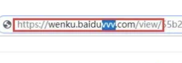

# 杂七杂八的工具箱

## conda源

`添加源`

```shell
vim ~/.condarc

# 中科大
channels:
  - https://mirrors.ustc.edu.cn/anaconda/pkgs/main/
  - https://mirrors.ustc.edu.cn/anaconda/pkgs/free/
  - https://mirrors.ustc.edu.cn/anaconda/cloud/conda-forge/
ssl_verify: true
  
# 清华
channels:
  - https://mirrors.tuna.tsinghua.edu.cn/anaconda/pkgs/main/
  - https://mirrors.tuna.tsinghua.edu.cn/anaconda/pkgs/free/
  - https://mirrors.tuna.tsinghua.edu.cn/anaconda/cloud/conda-forge/
  - https://mirrors.tuna.tsinghua.edu.cn/anaconda/cloud/pytorch/
ssl_verify: true
  
# 豆瓣源
channels:
 - https://pypi.douban.com/anaconda/cloud/conda-forge/
 - https://pypi.douban.com/anaconda/cloud/msys2/
 - https://pypi.douban.com/anaconda/cloud/bioconda/
 - https://pypi.douban.com/anaconda/cloud/menpo/
 - https://pypi.douban.com/anaconda/cloud/pytorch/
ssl_verify: true


----- 究极配置方案

# .condarc
auto_activate_base: false
channels:
  - https://mirrors.sjtug.sjtu.edu.cn/anaconda/pkgs/msys2
  - https://mirrors.sjtug.sjtu.edu.cn/anaconda/pkgs/mro
  - https://mirrors.sjtug.sjtu.edu.cn/anaconda/pkgs/main
  - https://mirrors.sjtug.sjtu.edu.cn/anaconda/pkgs/free
  - defaults
show_channel_urls: true
channel_alias: https://mirrors.tuna.tsinghua.edu.cn/anaconda
#default_channels:
#  - https://mirrors.tuna.tsinghua.edu.cn/anaconda/pkgs/main
#  - https://mirrors.tuna.tsinghua.edu.cn/anaconda/pkgs/free
#  - https://mirrors.tuna.tsinghua.edu.cn/anaconda/pkgs/r
#  - https://mirrors.tuna.tsinghua.edu.cn/anaconda/pkgs/pro
#  - https://mirrors.tuna.tsinghua.edu.cn/anaconda/pkgs/msys2
custom_channels:
  conda-forge: https://mirrors.tuna.tsinghua.edu.cn/anaconda/cloud
  msys2: https://mirrors.tuna.tsinghua.edu.cn/anaconda/cloud
  bioconda: https://mirrors.tuna.tsinghua.edu.cn/anaconda/cloud
  menpo: https://mirrors.tuna.tsinghua.edu.cn/anaconda/cloud
  pytorch: https://mirrors.tuna.tsinghua.edu.cn/anaconda/cloud
  simpleitk: https://mirrors.tuna.tsinghua.edu.cn/anaconda/cloud
```

`删除源`

```shell
conda config --remove-key channels
```

## 安装Detectron2

```shell
conda create -n "corona2" python=3.7
conda install cudatoolkit=11.0
pip3 install torch==1.7.0 torchvision==0.8.0 torchaudio==0.7.0
python -m pip install detectron2 -f https://dl.fbaipublicfiles.com/detectron2/wheels/cu110/torch1.7/index.html
pip3 install opencv-python
pip install torch==1.7.0+cu110 torchvision==0.8.1+cu110 torchaudio===0.7.0 -f https://download.pytorch.org/whl/torch_stable.html
```

## pip源

```shell
mkdir ~/.pip						
sudo vim ~/.pip/pip.conf  
# 修改内容如下，二选一		   
# 豆瓣源								   
[global]
index-url = https://pypi.douban.com/simple
[install]
trusted-host = https://pypi.douban.com

# 阿里源
[global]
index-url = https://mirrors.aliyun.com/pypi/simple/
[install]
trusted-host = https://mirrors.aliyun.com/pypi/simple/
```

## 保持ssh不断连

编辑/etc/ssh/sshd_config文件设置心跳，保持连接。

1. 编辑/etc/ssh/sshd_config，添加配置项：

   ```
   ClientAliveInterval 600      
   ClientAliveCountMax 1000
   ```

```
sudo systemctl restart ssh service
```

## Jupyter Lab

如何配置远程连接：

[https://cloud.tencent.com/developer/article/1740337](https://cloud.tencent.com/developer/article/1740337)

配置环境名称显示：

```
python -m ipykernel install --user --name mistvenv --display-name "corona" 
```

## tensorboard相关操作

指定端口打开：--port

指定ip打开：--host

`tensorboard --logdir=logs --host=0.0.0.0 --port=8888`

## CUDA版本对应

[https://pytorch.org/get-started/previous-versions/](https://pytorch.org/get-started/previous-versions/)

## 四六级成绩查询

http://cjcx.neea.edu.cn/html1/folder/21033/653-1.htm

## Linux指令

### unzip

```
unzip test.zip 
```

它会默认将文件解压到当前目录，如果要解压到指定目录，可以加上 -d 选项 

```
unzip test.zip -d /root/
```

## FFmpeg

`mp4 转 mp3`

```
ffmpeg -i video.mp4 -b:a 192K -vn music.mp3
```

## 好用的小工具

在线图片压缩： https://www.bejson.com/ui/compress_img/

bilibili downloader： https://www.videotosave.com/bilibili-video-downloader/

百度文库下载：在文档页面的网址**baidu**后面加上**“vvv”**三个字母，然后回车就可以跳转到这个VVV文档在线导出工具网站的下载页面。




