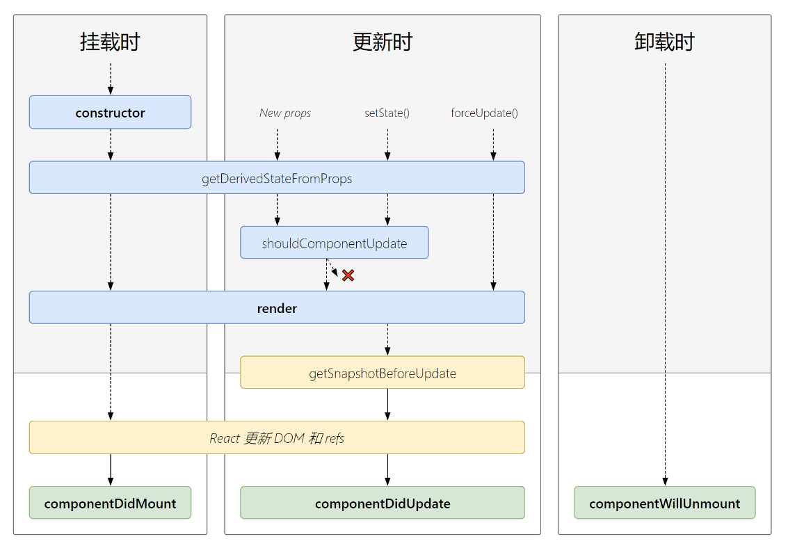

# 🍍 生命周期

## React旧的生命周期

* `constructor`：构造器
* `componentWillMount`：组件即将挂载 **（不安全）**
* `render`：组件挂载
* `componentDidMount`：组件挂载完成
* `componentWillUnmount`：组件将要卸载
* `shouldComponentUpdate`：组件即将要更新，这个函数返回`true`时，组件才会更新。在调用`this.setState()`函数后React会从这开始向下触发生命周期函数
* `componentWillUpdate(preProps, preState)`：组件将要开始更新，在调用`this.forceUpdate()`函数后React会从这开始向下触发生命周期函数 **（不安全）**
* `componentWillReceiveProps(newProps)`：在父组件`render`的时候触发。这个函数应该叫`componentWillReceiveNewProps`才比较没有歧义。**（不安全）**


## React新的生命周期

新的生命周期去除了三个函数，这写生命周期方法经常被误解和滥用，在新的React中，已经加入了前缀`UNSAFE_`

* `componentWillMount`
* `componentWillReceiveProps`
* `componentWillUpdate`

并添加了两个生命周期方法，其他的方法并没有任何的变化，而且这两个方法在实际的开发中也很少用到。

------

* `getDerivedStateFromProps`

它会在调用`render`方法之前调用，并且在初始挂载和后续更新时都会被调用。它应该返回一个对象当作`state`，如果返回`null`则不更新任何内容。

此方法适用于罕见的用例，即`state`的值在任何时候都取决于`props`

```jsx
static getDerivedStateFromProps(props, state){
    // props 父组件传来的
    // state 组件render之前的state
    return props; // 返回的对象用作this的state
}
```

* `getSnapshotBeforeUpdate`

在最近一次渲染（提交到DOM节点）之前调用。它使得组件能在发生更改之前从DOM中获取一些信息（例如，滚动位置）。而且，此声明周期方法的任何返回值将作为参数传递给`componetDidUpdate(returnValue)`

```jsx
getSnapshotBeforeUpdate(){
    // 获取DOM的一些信息
    // 返回值作为componetDidUpdate的参数
    return returnValue;
}
```

