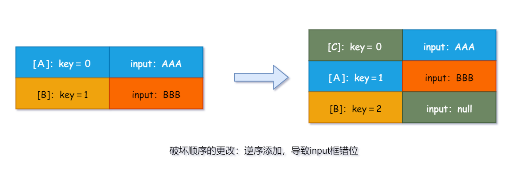

# 🥭 diff与key

## 虚拟DOM中key的作用

简单的说，`key`是虚拟DOM对象的标识，在更新显示时`key`起着极其关键的作用。

详细的说，当状态中的护具发生变化时，React会根据**新数据**生成**新的虚拟DOM**，随后React进行**新的虚拟DOM**与**旧的虚拟DOM**的diff比较。比较规则如下：

1. **旧虚拟DOM**中找到了与**新虚拟DOM**相同的`key`：
* 若虚拟DOM中内容没变，直接使用之前的真实DOM
* 若虚拟DOM中内容变了，则生成新的真实DOM，随后替换页面中之前的真实DOM

2. **旧虚拟DOM中**未找到与**新虚拟DOM**相同的`key`：
* 根据数据创建新的真实DOM，随后渲染到页面

## 用 `index` 作为 `key` 可能会发生的问题

1. 若对数据进行逆序添加、逆序删除等**破坏顺序的操作**，会产生没有必要的真实DOM更新。虽然界面效果没有问题，但效率低。
2. 如果结构中还包含输入类的DOM，会产生错误DOM更新。界面效果会受影响。

